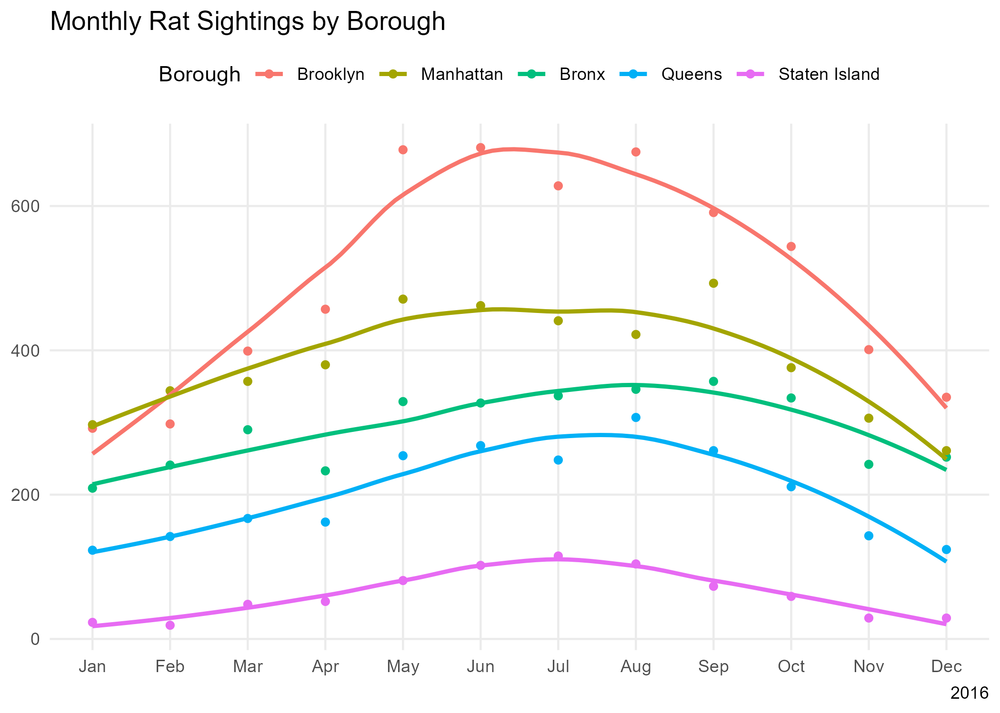
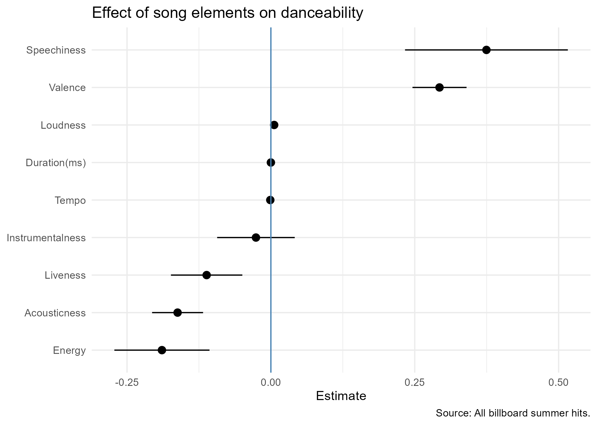
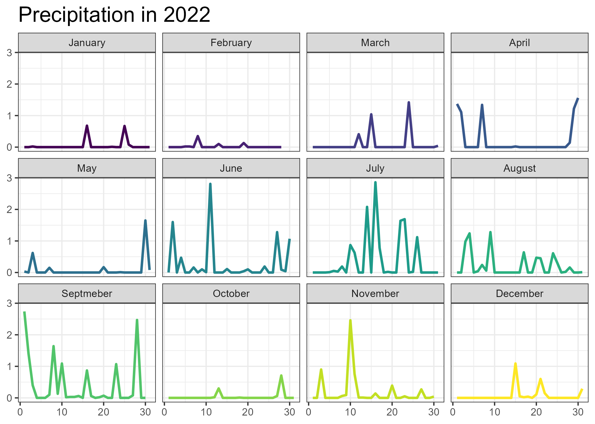
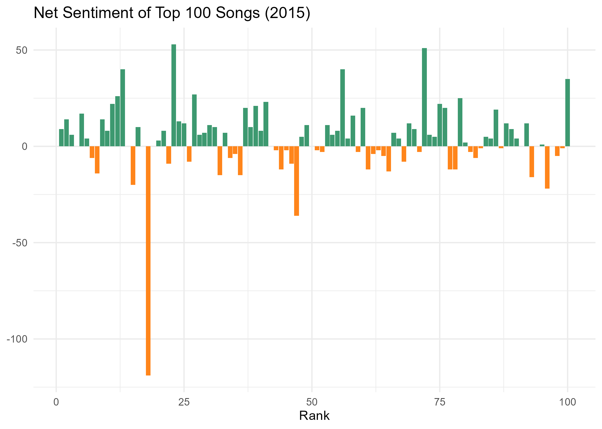

# Data Visualization and Reproducible Research

> Rose Stucki. 

The following is a sample of products created during the _"Data Visualization and Reproducible Research"_ course.

## Project 01

In the `project_01/` folder you can find the code and report of the revised mini project 1. The main changes made 
were first to the titles of the first two figures which were edited to include the main takeaway of the graph to 
make the purpose clearer. The next change was made to the final graph. The category names were edited to have 
better capitalization and they were reordered from most to least rat sightings to better match the graph. This 
visualization is shown below.

All figures are saved in the figures folder.

## Project 02

In this project, I explored interactive plots, maps, and coefficient plots. The main change made to this project 
was fixing the report to include all needed information. Aside from that, I removed a factor from the coefficient 
plot that had little to do with the song composition. Find the code and report in the `project_02/` folder.

All figures are saved in the figures folder.

## Project 03

In this project, I explored recreating the four visualizations provided to the best of my ability. I also created 
a precipitation visualization shown below. Finally, I explored a dataset that included the top 100 song lyrics 
from 2015. I performed a sentiment analysis and included the resulting data visualization below.

All figures are saved in the figures folder.

### Moving Forward

I hope to improve my skills in creating my own data visualizations. This class has provided me with many tools 
that will be useful when I need to present data and create figures in the future. In my own work I plan to pay 
attention to data storytelling throughout the process or presenting my findings. In the past I've presented data 
in a way that expects the data to speak for itself, I have now learned that data should be presented along with 
it's takeaway to better achieve the creator's goal. This will make my data communication much more effective in 
the future.
