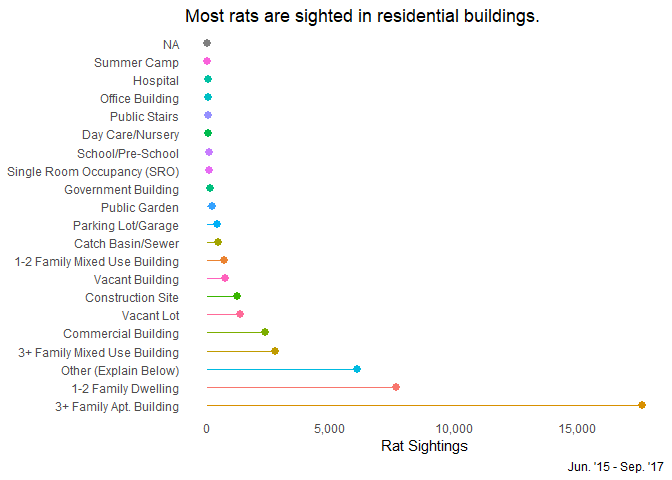
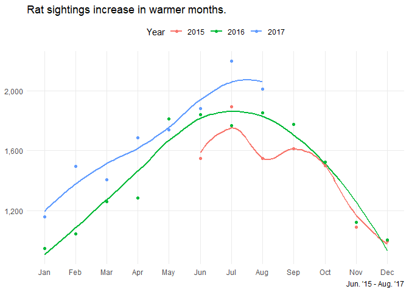
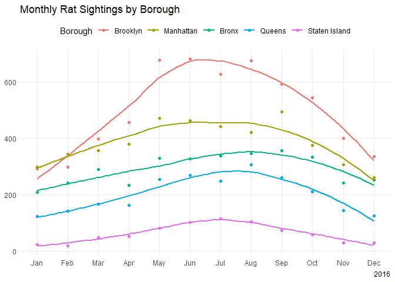

# Data Visualization Project 01

This report includes three graphs created from the rats_nyc data provided by Dr. Alhamadani. The logic behind the selection of data, creation of the data visualizations, and the intended takeaways.


``` r
library(tidyverse)
library(ggplot2)
library(dbplyr)
library(ggrepel)
```


## Exploring data

I began by looking at the data that was included in the project template files. I looked through the excel file and chose a few variables I was interested in exploring in relation to the number of rat sightings. These variables include the location type, year and month the sighting occurred, and the borough in which it occurred.

I had originally tried to create a graph that showed the number of rat sightings each day but the scatter plot was crowded due to the amount of data and I wasn't sure if dates that did not have rat sightings were included. Additionally, when looking at the initial scatter plot there was only one day of interest that had over 150 rat sightings while the rest of the data was relatively low with many days only having one rat sighting reported. I tried to create a histogram of the data to better display the quantity of rats each day but it just further confirmed that the majority of days a report occurred only had one report with a relatively small bell curve for higher rat sighting counts. Because I did not find this data particularly interesting or appealing, I pivoted my focus and created a lollipop graph showing the number of rat sightings by location.

The second graph has the same caption as the first to indicate the span of the data. However, it is particularly good to call out in this graph because the number of rat sightings is divided by the month and year in which they were reported. I had originally hoped that I could show the full amount of reports for each of the three calendar years to see any trends that occur in relation to the season. I wasn't able to show the full three year trend but I was able to show two years of data. Despite the limited data, it is still easily seen that there are more rat sightings in the summer months than there are in the winter months.


``` r
rats %>% count(location_type) # most rats in large apt buildings

rats %>% count(sighting_year) # only 3, maybe order by year and month

rats %>% count(sighting_month) # organize by time of year

rats %>% count(borough) # see how data differs between
```


## Graph 1

The first graph uses data that separates the number of rat sightings according the the location the rat was seen. The intention of this visualization was to show which type of location had the most rat sightings which is reflected by the title of the graph. The location type is shown on the y-axis while the number of rat sightings is shown on the x-axis. A lollipop chart was chosen because I find it the most appealing visualization to show amount across many categories, which fits this data well. The categories are organized from least to greatest though all grid lines were removed. For the purposes of this graph the main takeaway is that residential buildings tend to have the most rat sightings. This takeaway does not need specific values to be known though the x-axis is still shown for scale.

I flipped the coordinates to prevent vertical or angled text. The title also includes all axis information and negates the need for axis labels beyond the scales shown. The caption specifies that the time in which the data was obtained because the data spans over multiple years. I also chose a lollipop graph rather than a bar chart because the extra color of the bar chart wasn't necessary to show the difference in rat sightings between location. Like with a lollipop chart, I intended to bring the attention to the ends of the line, which is achieved with the dot on each which helps highlight the difference in count.


``` r
# Rat sighting by location type
rats_a <- rats %>%
  count(location_type)

ggplot(rats_a,aes(x=reorder(location_type,desc(n)),y=n,ymin=0,ymax=n,color=location_type)) +
  geom_pointrange() + # lollipop chart
  labs(y="Rat Sightings",x=NULL,title="Most rats are sighted in residential buildings.",caption="Jun. '15 - Sep. '17") +
  guides(color=FALSE) + # remove legend
  coord_flip() + # fix crowded x axis
  theme_minimal() +
  scale_y_continuous(labels=scales::comma) +
  theme(panel.grid.major.y=element_blank(),panel.grid.major.x=element_blank(),panel.grid.minor.x=element_blank()) # remove extra lines
```

<!-- -->

``` r
# save png
ggsave("../figures/rat_location.png")
```


## Graph 2

The second graph has a similar caption to the first graph to indicate the span of the data. However, it is particularly good to call out in this graph because the number of rat sightings is divided by the month and year in which they were reported. I had originally hoped that I could show the full amount of reports for each of the three calendar years to see any trends that occur in relation to the season. I wasn't able to show the full three year trend but I was able to show two years of data. Despite the limited data, it is still easily seen that there are more rat sightings in the summer months than there are in the winter months. This takeaway is emphasized by the graph title.

This graph also shows a comparison of the amount of rat sightings between years. There were less rat sightings overall in earlier years while later years had more sightings. There is a sharp drop in the last month of the data but this is likely because data was not recorded for the whole month of September so it does not indicate an actual drop in rat sightings. If this data were to be viewed without the help of text or a presentation to explain this drop, so I removed this month from the graph so that the viewer would not conclude there was a sharp decrease in rat sightings when that is not necessarily the case.

An additional change I made to the default graph was removing the minor grid lines as I found them necessary. However, the major grid lines were included because they were useful to identify which month the data points belong to as well as to compare the amount of rat sightings between the earlier and later parts of the year on the y-axis. I also moved the legend to the top of the graph so that the graph itself could be wider, as taught in the course material. Attention if first directed to the center of an image and then the top. So as the viewer looks at the graph they will then see the title giving the graph context and past the legend back to the data. The graph title also negates the need for axis titles. The x-axis is self explanatory with the month abbreviations being listed while the y-axis has numbers which indicate the number of rat sightings as indicated by the title. This avoids the need for vertical text.


``` r
# Rat sighting count each month
rats_b <- rats %>%
  count(sighting_year,sighting_month) %>%
  group_by(sighting_year) %>%
  filter(!(sighting_year == 2017 & sighting_month == 9)) # exclude september 2017 data

ggplot(rats_b,aes(x=sighting_month,y=n,color=factor(sighting_year))) +
  geom_smooth(se = FALSE) +
  geom_point() +
  scale_color_discrete() +
  labs(y=NULL,x=NULL,color="Year",title="Rat sightings increase in warmer months.",caption="Jun. '15 - Aug. '17") +
  theme_minimal() +
  scale_x_continuous(breaks=seq(1,12,1),labels = month.abb) +
  scale_y_continuous(labels=scales::comma) +
  theme(legend.position = "top",panel.grid.minor.y=element_blank(),panel.grid.minor.x=element_blank()) # remove extra lines
```

<!-- -->

``` r
# save png
ggsave("../figures/rat_mnth_yr.png")
```


## Graph 3

This graph is different from the previous two and only includes data from 2016 since that was the only full year data was recorded. This graph shows the number of rat sightings reported each month over the course of that year divided by the borough in which the rat was seen. The minor grid lines were also hidden for this visualization as they add nothing to the graph and just cluttered the data being shown.

The intended takeaway from this graph is to compare the magnitude or trends of rat sightings across the five boroughs. From this graph we can conclude that Brooklyn had the most rat sightings while Staten Island had the least. I was able to edit the legend to show the boroughs in order of most to least rats after a lot of troubleshooting. I also changed the legend category names so that the actual names were less emphasized

Like other graphs, I included the legend at the top of the graph to space the data visualization better. I also chose my title carefully so I could remove the axis titles and further ensure that my data remained the focus of the visualization.


``` r
# Rat sighting count per borough
rats_c <- filter(rats,sighting_year==2016) %>% # limit data to 2016, one full year
  count(borough,sighting_month)

ggplot(rats_c,aes(x=sighting_month,y=n,color=reorder(borough,-n))) + # reorder colors in order most to least
  geom_point() +
  geom_smooth(se = FALSE) +
  scale_color_discrete() +
  labs(y=NULL,x=NULL,color="Borough",title="Monthly Rat Sightings by Borough",caption="2016") +
  scale_color_discrete(labels = c("BRONX"="Bronx", "BROOKLYN"="Brooklyn", "MANHATTAN"="Manhattan", "QUEENS"="Queens", "STATEN ISLAND"="Staten Island")) +
  theme_minimal() +
  scale_x_continuous(breaks=seq(1,12,1),labels = month.abb) +
  theme(legend.position = "top",panel.grid.minor.y=element_blank(),panel.grid.minor.x=element_blank()) # remove extra lines
```

<!-- -->

``` r
# save png
ggsave("../figures/rat_borough.png")
```
