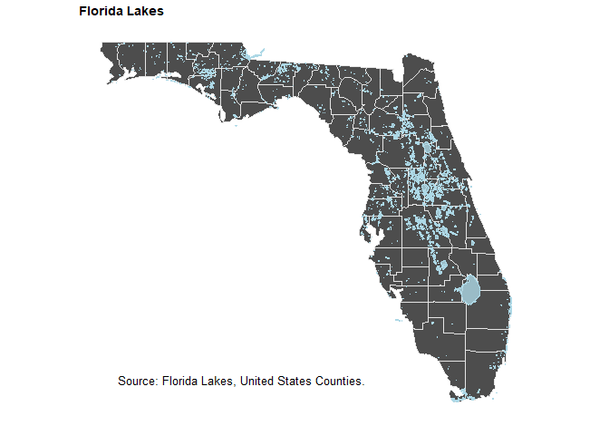
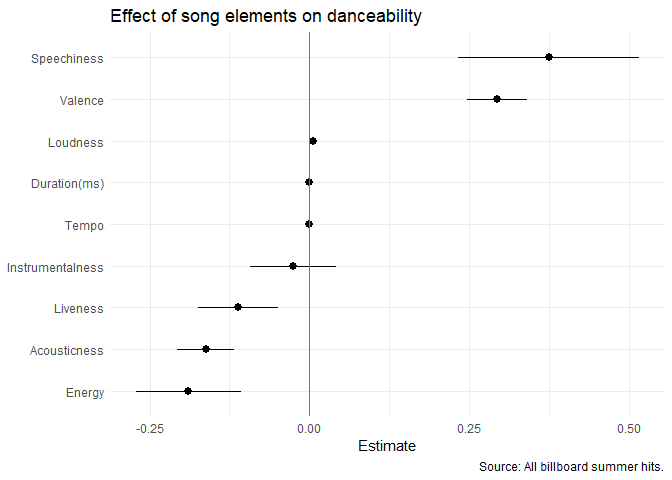

# Data Visualization Project 02


``` r
library(ggplot2)
library(tidyverse)
library(plotly)
library(maps)
library(mapproj)
library(sf)
library(ggthemes)
library(broom)
```

## Interactive Plot

The first plot I created was the interactive plot. After taking a brief look at a few of the data sets, I decided to use the West Roxbury houses dataset as this one was easy for me to understand. I started by plotting variables against each other and found that when plotting the year, there was one point at year 0 which squished the useful data to the right side. To fix this issue, I edited the data to only include years after 1600. Another issue I ran into when trying to graph was the column titles. Because the titles had spaces in them, R was not able to recognize them as variables, so I changes the title names to a format that could be used in code.

The final plot shows the living area of homes against the year the home was built. The data points are also color coded based on the number of floors in the home where half a floor refers to a loft or a smaller story. The points are somewhat transparent to allow the different colors and the density of data points to be seen. However, it can still be difficult to see the spread of data especially for each category. For this reason this data is best shown as an interactive graph because the user can hide and show the different categories to allow more visibility of the data. From the data we can see that most homes had two floors and while there was significant overlap, the price tended to increase as the number of floors increased.


``` r
# data
wrox <- read_csv("https://github.com/aalhamadani/datasets/raw/refs/heads/main/WestRoxbury.csv")

# fix data column names
colnames(wrox) <- c("total_value","tax","lot_sqft","yr_built","gross_area","living_area","floors","rooms","bedrooms","full_bath","half_bath","kitchen","fireplace","remodel")

# remove outlier: 0 year data point
wrox <- filter(wrox, yr_built > 1600)

# plot
plot <- ggplot(wrox, aes(x = yr_built, y = living_area, color = factor(floors))) +
  geom_point(alpha = 0.3) +
  labs(y = NULL, x = "Year", color = "Number\nof Floors", title = "Home Living Area over Time", subtitle = "Area is in square feet") +
  annotate("text",x=1840,y=600,label = "Source: West Roxbury housing data.", size = 3) +
  theme_minimal() 

wrox_plot <- ggplotly(plot)
wrox_plot
```

```{=html}
<div class="plotly html-widget html-fill-item" id="htmlwidget-c7cc391fe88b32d7fa28" style="width:672px;height:480px;"></div>
<script type="application/json" data-for="htmlwidget-c7cc391fe88b32d7fa28">{"x":{"data":[{"x":[1957,1950,1950,1958,1940,1950,1960,1963,1915,1945,1940,1950,1967,1964,1940,1940,1968,1934,1925,1983,1956,1959,1960,1967,1940,1969,1945,1960,1955,1965,1950,1950,1965,1974,1945,1950,1965,1974,1955,1971,1965,1965,1950,1925,1950,1971,1950,1965,1956,1964,1960,1955,1986,1956,1960,1950,1960,1925,1960,1962,1956,1920,1960,1950,1929,1925,1960,1963,1960,1951,1950,1960,1960,1960,1950,1950,1950,1900,1957,1950,1950,1950,1950,1960,1959,1969,1960,1967,1959,1960,1950,1950,1945,1942,1955,1960,1960,1960,1950,1959,1965,1920,1960,1960,1960,1910,1960,1960,1959,1964,1910,1965,1960,1960,1955,1960,1959,1960,1961,1960,1992,1961,1960,1967,1950,1960,1988,1960,1967,1960,1960,1959,1988,1964,1960,1960,1963,1960,1961,1950,1963,1967,1960,1960,1963,1943,1960,1950,1964,1959,1958,1967,1960,1945,1950,1963,1960,1960,1963,1960,1958,1967,1960,1942,1943,1940,1965,1956,1960,1960,1955,1963,1960,1960,1960,1950,1957,1960,1960,1960,1938,1960,1960,1920,1935,1960,1963,1960,1955,1960,1940,1965,1960,1963,1960,1955,1954,1953,1940,1965,1964,1960,1960,1960,1965,1960,1963,1960,1960,1963,1960,1964,1965,1960,1965,1962,1965,1956,1949,1960,1960,1960,1960,1965,1959,1965,1964,1960,1965,1994,1965,1967,1964,1964,1960,1965,1960,1960,1960,1965,1960,1965,1994,1960,1935,1960,1980,1960,1960,1965,1960,1960,1967,1960,1960,1994,1968,1960,1969,1960,1967,1960,1912,1972,1956,1960,1965,1960,1960,1950,1960,1965,1965,1965,1967,1965,1957,1960,1960,1960,1967,1964,1968,1968,1965,1965,1968,1964,1993,1969,1965,1959,1966,1960,1960,1965,1965,1960,1964,1950,1940,1960,1966,1920,1924,1960,1960,1965,1966,1950,1960,1960,1912,1983,1940,1955,1921,1958,1960,1925,1960,1957,1972,1957,1914,1956,1986,1953,1960,1920,1943,1958,1925,1975,1960,1956,1920,1960,1961,1959,1976,1940,1988,1920,1950,1940,1961,1918,1960,1984,1929,1980,1970,1960,1964,1960,1953,1950,1954,1911,1965,1966,1915,1959,1920,1960,1950,1955,1956,1926,1950,1960,1960,1952,1960,1945,1960,1952,1950,1950,1960,1955,1958,1945,1920,1920,1960,1950,1960,1950,1940,1950,1945,1952,1955,1940,1963,1940,1950,1925,1959,1950,1916,1950,1960,1956,1950,1954,1930,1950,1950,1929,1960,1930,1950,1930,1934,1945,1934,1928,1950,1940,1950,1920,1927,1950,1950,1960,1950,1935,1950,1960,1950,1961,1950,1940,1920,1961,1930,1963,1930,1925,1928,1960,1940,1925,1950,1950,1929,1956,1950,1928,1920,1950,1960,1930,1950,1920,1955,1960,1950,1930,1955,1945,1950,1930,1950,1935,1950,1945,1925,1929,1950,1924,1960,1950,1950,1950,1950,1940,1920,1915,1925,1953,1950,1950,1950,1955,1928,1950,1960,1950,1969,1950,1958,1945,1925,1928,1960,1955,1970,1955,1925,1925,1950,1929,1958,1958,1950,1925,1950,1950,1925,1950,1950,1950,1950,1950,1950,1925,1960,1950,1950,1984,1950,1950,1950,1950,1960,1950,1945,1920,1950,1978,1920,1950,1953,1960,1950,1991,1925,1925,1950,1950,1925,1950,1950,1955,1925,1984,1950,1915,1940,1950,1925,1960,1993,1940,1960,1950,1973,1950,1955,1940,1972,1960,1954,1925,1950,1950,1963,1960,1920,1945,1960,1960,1930,1965,1960,1960,1925,1920,1940,1950,1960,1955,1973,1960,1910,1960,1950,1950,1915,1960,1950,1961,1960,1920,1955,1960,1960,1955,1950,1935,1950,1950,1950,1951,1961,1960,1929,1954,1955,1958,1950,1951,1950,1961,1960,1950,1963,1922,1960,1960,1955,1950,1960,1950,1960,1950,1960,1936,1960,1945,1950,1960,1936,1960,1960,1950,1960,1960,1929,1960,1960,1957,1960,1940,1970,1960,1913,1965,1950,1956,1950,1950,1950,1960,1957,1920,1961,1970,1932,1925,1950,1957,1951,1961,1920,1952,1956,1948,1957,1935,1961,1950,1967,1935,1950,1957,1945,1950,1960,1957,1940,1920,1930,1950,1940,1967,1960,1945,1962,1930,1962,1967,1950,1950,1915,1950,1950,1945,1931,1955,1930,1920,1925,1930,1950,1930,1955,1960,1950,1925,1955,1952,1950,1950,1956,1960,1970,1955,1956,1950,1925,1930,1950,1956,1960,1950,1950,1940,1950,1945,1935,1925,1910,1940,1920,1952,1920,1935,1935,1954,1925,1954,1925,1954,1950,1926,1935,1914,1925,1955,1950,1935,1953,1953,1955,1960,1935,1935,1926,1950,1925,1935,1953,1970,1940,1935,1925,1950,1920,1950,1959,1925,1925,1960,1950,1925,1966,1950,1950,1926,1930,1927,1950,1954,1953,1952,1959,1950,1959,1950,1950,1950,1950,1959,1950,1835,1956,1960,1928,1935,1960,1920,1955,1925,1958,1920,1960,1930,1950,1950,1950,1935,1950,1930,1940,1955,1920,1920,1920,1950,1920,1927,1935,1920,1948,1958,1950,1920,1940,1954,1957,1925,1954,1950,1955,1955,1954,1954,1957,1925,1945,1925,1920,1928,1952,1950,1920,1960,1947,1950,1942,1963,1950,1924,1930,1954,1954,1950,1954,1959,1950,1955,1950,1950,1955,1930,1950,1930,1932,1929,1958,1965,1920,1909,1929,1952,1925,1930,1930,1960,1930,1960,1915,1960,1955,1924,1910,1930,1930,1931,1960,1960,1897,1925,1935,1930,1930,1925,1956,1925,1925,1950,1928,1929,1940,1925,1920,1923,1958,1930,1925,1920,1950,1958,1920,1929,1955,1920,1920,1956,1953,1927,1930,1950,1930,1950,1937,1925,1959,1953,1931,1950,1930,1950,1920,1950,1955,1955,1920,1940,1955,1930,1925,1950,1953,1920,1930,1915,1964,1927,1920,1945,1940,1960,1950,1941,1953,1960,1950,1950,1950,1924,1924,1928,1960,1926,1930,1960,1958,1945,1963,1930,1950,1950,1923,1894,1922,1950,1925,1930,1925,1928,1955,1920,1932,1934,1930,1920,1928,1915,1958,1920,1955,1940,1930,1950,1960,1955,1915,1925,1953,1953,1924,1915,1955,1920,1920,1955,1930,1920,1955,1930,1962,1925,1920,1930,1925,1930,1953,1920,1960,1920,1920,1950,1955,1930,1925,1933,1939,1920,1930,1930,1946,1938,1932,1920,1926,1962,1920,1926,1945,1954,1920,1915,1958,1920,1946,1915,1928,1915,1925,1934,1953,1940,1960,1960,1920,1915,1915,1927,1960,1930,1934,1915,1920,1929,1930,1929,1928,1909,1970,1956,1955,1928,1940,1960,1954,1930,1940,1930,1920,1930,1930,1922,1914,1930,1931,1929,1949,1920,1957,1915,1930,1965,1957,1955,1931,1900,1970,1947,1924,1940,1956,1925,1938,1954,1931,1920,1957,1950,1929,1951,1930,1931,1950,1950,1936,1920,1950,1940,1960,1950,1950,1965,1963,1940,1956,1940,1930,1948,1920,1940,1960,1920,1950,1920,1930,1920,1955,1925,1950,1951,1924,1930,1930,1960,1907,1952,1950,1950,1905,1929,1952,1929,1928,1954,1955,1945,1905,1930,1962,1914,1960,1930,1950,1955,1940,1925,1940,1952,1930,1940,1966,1930,1920,1925,1921,1926,1951,1956,1930,1940,1925,1970,1952,1920,1955,1940,1930,1940,1951,1940,1935,1925,1923,1940,1925,1930,1925,1927,1964,1934,1930,1940,1925,1923,1965,1957,1965,1925,1965,1925,1910,1960,1965,1925,1930,1965,1925,1967,1910,1925,1924,1930,1965,1925,1965,1925,1925,1958,1963,1949,1931,1956,1965,1930,1940,1958,1925,1956,1960,1951,1952,1950,1958,1950,1956,1950,1953,1925,1968,1920,1965,1958,1952,1908,1965,1955,1931,1925,1965,1940,1952,1925,1954,1968,1950,1950,1968,1925,1950,1937,1968,1910,1950,1959,1950,1958,1948,1950,1946,1945,1950,1960,1950,1932,1950,1950,1920,1957,1950,1955,1928,1950,1959,1950,1938,1920,1928,1950,1960,1955,1958,1958,1930,1957,1957,1950,1950,1950,1924,1953,1955,1956,1940,1957,1955,1954,1940,1930,1959,1950,1965,1950,1950,1954,1950,1954,1959,1920,1950,1962,1958,1964,1957,1950,1950,1950,1950,1950,1958,1950,1950,1950,1950,1950,1954,1909,1959,1960,1959,1955,1955,1962,1965,1955,1955,1950,1950,1925,1954,1950,1950,1950,1945,1933,1940,1956,1939,1925,1930,1910,1950,1934,1935,1954,1957,1940,1925,1925,1952,1920,1927,1925,1945,1925,1920,1950,1945,1930,1960,1952,1935,1950,1955,1950,1950,1888,1950,1966,1960,1960,1925,1950,1950,1938,1955,1925,1943,1955,1960,1950,1925,1945,1950,1920,1925,1955,1948,1950,1956,1955,1946,1960,1945,1950,1945,1953,1956,1950,1910,1935,1928,1946,1940,1960,1960,1940,1953,1945,1955,1950,1945,1950,1944,1940,1963,1954,1964,1940,1968,1953,1960,1940,1953,1938,1954,1938,1955,1955,1950,1958,1954,1950,1950,1954,1949,1953,1938,1989,1989,1950,1953,1954,1950,1955,1950,1953,1950,1953,1953,1953,1950,1953,1920,1952,1953,1952,1953,1952,1920,1953,1953,1953,1953,1935,1950,1952,1958,1950,1946],"y":[2608,1060,1200,1092,864,1445,1452,960,1803,1364,1018,1075,2051,1740,1470,768,1922,1304,1523,2056,876,1989,1625,2888,1150,2074,1014,1340,1120,1826,1080,1636,1696,1633,1120,988,1781,2612,1347,2028,1781,1633,900,1131,800,1997,900,2009,1000,1155,1082,864,1954,1216,1082,1204,1082,1408,1082,2293,960,960,1082,900,900,1083,1487,1966,1726,900,1000,2156,1487,1246,1008,1200,984,690,1008,1140,1056,1075,1008,1726,912,1016,1713,968,1577,1966,1008,1000,1075,1075,1075,2134,1966,968,1075,1589,1487,990,1538,1966,1726,600,1692,970,918,1726,504,2014,1404,1692,1492,1558,952,1583,1404,1726,2188,1360,1966,1726,1404,1726,1930,1701,1151,1726,1404,1404,1930,1641,1726,1247,1808,1404,1404,1311,1726,1726,1726,1726,2059,1075,1487,1075,1726,1404,1404,1863,1109,1155,1128,1125,1870,1726,1008,1726,1487,1726,1966,1075,1075,1075,1512,984,1966,1870,978,1008,941,1966,1726,1075,1308,1961,1726,1726,1075,1487,1993,1382,1456,1020,1008,1726,1120,1176,960,1726,1682,1008,1726,1134,1244,1056,1075,1726,1868,1726,1487,1161,1008,1352,1260,912,1726,1008,1247,1859,1280,1726,1726,1404,1487,1042,936,1726,2343,1870,1726,2390,982,2168,1726,1190,1008,2135,1008,1908,1188,1528,1487,1487,1726,1966,1692,1726,1123,1836,1670,1726,1081,1521,1104,1487,1123,1726,2048,1128,1350,1170,1110,1726,1726,1247,1692,1109,1726,1726,754,1080,1302,1715,1008,1726,1726,1063,1343,1726,1877,1487,1726,2007,1040,1875,1726,1726,1726,1280,1726,1343,1679,1993,3062,1881,1704,2076,984,1726,1142,2129,1726,1726,2086,2166,1726,1068,1494,1088,3494,966,952,1347,1692,1794,1487,1346,1056,1123,853,2685,1081,1315,1216,1064,1584,1430,1372,1383,3089,1344,798,1060,3063,1505,1433,1087,1042,1344,962,3263,839,1123,1162,1131,1162,3011,2944,1205,1421,890,788,1642,2193,736,1142,3013,1327,1991,2284,2585,2655,1000,1352,1056,1201,893,1778,1950,2044,1026,1100,1104,980,2311,1092,988,1398,1351,1848,1351,1044,1254,1266,4658,754,1270,1288,1671,1165,1255,1330,1056,1310,1347,1671,1625,996,1711,1180,1056,1183,744,1739,672,1419,1137,852,1190,966,1968,1832,1260,1056,1249,983,1225,1104,1347,1120,1575,925,864,1333,1165,1436,1177,925,1210,825,2521,1230,1332,925,1211,900,576,1134,1080,1584,1026,1078,1406,720,900,1040,925,910,1453,1330,925,970,1539,1145,1025,944,1628,925,1658,1400,1075,1142,936,925,1196,1172,1109,925,900,1075,709,1304,1116,1198,893,825,792,1540,720,888,1092,1485,1294,992,1120,1476,1015,950,703,955,1075,1100,1078,1120,1232,950,2021,1841,1410,984,1201,936,733,912,950,1196,1232,780,832,936,912,1044,1383,1025,1904,1193,1206,1165,1261,1002,768,1201,1190,1088,1008,1559,1008,1025,1464,999,840,986,1168,1395,1120,1128,1134,1109,752,864,1500,988,1436,1565,1056,1160,1629,864,1000,864,1396,1052,828,828,828,1400,1470,1201,1725,1084,888,800,2598,1072,1366,1118,1238,1144,1238,1075,952,1032,1104,918,1190,852,1268,1104,1593,1296,1047,1075,1832,980,1104,720,1080,810,1000,912,1075,1075,1889,1075,1080,880,878,1120,1576,1310,1090,1075,1056,1080,864,1075,1204,869,1075,1075,912,1285,1347,1171,966,1056,864,2404,1246,827,1422,1075,1360,1415,1155,1148,768,864,1456,1120,864,1220,1538,1075,960,850,1152,1210,950,1357,1251,948,988,950,1350,1190,1075,1092,1056,1295,1042,912,1056,960,1047,2820,960,1517,2167,864,960,864,1050,864,1075,1056,1420,1155,1270,864,1396,998,1100,1383,864,1456,2038,1399,1008,1056,1176,1120,1109,2034,840,1075,1125,1028,1109,902,1125,928,1014,1058,1159,890,1611,816,968,1132,1345,988,1074,1470,1138,1236,1134,1138,1347,1446,1180,1492,1460,1025,1207,1020,1329,1075,1294,1134,940,814,900,1176,992,1316,2015,1104,1075,1264,1176,920,1456,904,1120,1491,1142,816,1682,840,800,1241,1383,1294,1344,1295,851,1578,1344,894,816,1217,1210,912,1011,1042,1095,1267,1040,1000,1142,1008,905,1042,1540,1000,992,905,905,912,1075,1910,910,1836,1458,980,900,1050,1142,1330,1806,1142,975,975,1008,1142,975,1628,2407,575,1330,988,1295,1075,5289,1309,960,1232,1156,1174,1104,1251,1169,1392,1232,1064,1118,1718,2082,925,1312,1226,1492,1075,1248,1150,1269,1661,1646,1201,768,1146,1116,1101,1819,840,1540,1020,936,936,1127,962,1118,1512,1298,1988,1529,876,1040,1540,1008,1075,1201,1008,858,1176,861,1098,820,1090,1692,1046,1344,1456,960,1247,1075,1456,2004,1712,1040,1393,1058,1290,1456,900,1160,1272,1260,1090,1064,2246,1189,1120,1148,988,2039,1237,936,1383,925,936,1056,1383,912,988,1416,1297,1492,1000,1395,950,1056,1607,1014,792,950,1383,1050,1428,1146,988,1404,1533,950,1399,912,974,912,1082,1529,912,828,1330,1420,1420,888,912,912,960,941,1032,912,1291,960,1104,1056,1192,1056,864,1025,1260,1578,886,1090,1002,1075,1102,1330,1017,985,1568,1201,1068,1075,960,1239,1144,1142,1512,934,1210,1383,1295,1123,850,1295,1512,2300,1200,1310,1420,1310,1040,972,924,1295,1042,1850,2507,1042,1085,1260,1066,1295,2391,1663,1560,1060,1008,1988,1808,1295,1120,1042,1166,1344,1295,1200,1042,1436,1632,1295,1075,1383,1632,925,1462,1210,925,1310,635,1190,1422,1295,1462,816,1075,1108,1383,1295,1016,1075,1363,1295,1142,1194,900,1134,995,1367,1220,1295,660,1295,1400,925,1260,1371,1014,1394,925,921,950,1431,1474,925,1277,1310,900,900,1383,900,1420,1050,909,1152,1080,1258,1378,1125,1042,988,1090,1330,2095,912,880,1352,1260,1513,1167,1436,1123,1075,1165,1321,1383,945,988,1016,988,1228,1383,1383,960,1050,1180,1383,1401,1383,1982,988,1284,1026,864,1235,1040,960,1150,1126,1310,1044,912,954,1330,1330,1588,1462,1162,912,1137,950,1490,1032,1142,1075,1870,950,2042,960,1408,1075,1137,1224,950,1225,1188,1095,1285,1042,1277,1075,936,1591,1042,1111,900,1188,1075,988,1691,988,1344,1236,2809,912,1075,912,1330,1251,732,1313,1014,1210,1413,1279,1701,960,1056,1378,1411,1217,950,1310,1890,840,1310,2170,1056,1042,1417,975,1245,936,1014,1730,1680,1316,1074,1067,950,1032,1279,1015,988,1870,1258,900,768,1056,1656,1490,1415,1218,1512,1411,1456,900,1144,988,1000,988,1000,1128,1080,1765,1600,1259,1330,936,1120,1123,988,968,2227,1218,1275,1737,972,1177,2065,1355,1454,1192,1472,1382,1991,1164,1915,1541,2148,1218,1554,1440,1991,1142,1400,1988,1264,1884,1096,902,1064,1310,1855,1400,1148,936,1051,1075,1920,792,912,1075,2171,1383,960,1026,1613,1075,2671,792,952,1252,1553,1056,1834,1000,1145,950,1132,1777,1260,1053,1242,1948,2187,998,1277,1624,2296,1042,1114,1238,1944,1198,1075,888,1961,862,925,1247,2329,1365,1456,1123,1125,1123,1033,672,1011,1602,910,1064,1142,1218,912,1142,1992,1955,1064,1200,1625,1064,1340,1075,1247,984,1181,744,846,1539,944,2904,1415,1266,1361,1169,3325,1325,1602,1232,1320,1550,1056,1820,1080,1668,1188,1813,1055,1123,1605,1425,1634,1008,1123,768,992,1468,960,1470,1284,2389,1066,954,1523,1080,902,1190,1112,1221,2536,1014,1104,1271,1227,1625,1566,1064,1476,987,2720,1204,1310,2947,987,1250,1447,936,1841,1450,1210,1134,1176,1330,1602,1493,1671,1200,1436,710,864,1490,1356,1092,1552,1075,1475,1330,1314,1389,936,1399,999,1330,1573,1001,1583,1333,1090,1378,1256,1470,1042,1123,1500,1711,1406,1918,2078,1500,1544,1260,1470,744,912,864,1015,1540,1108,1975,1310,1248,1306,1556,734,960,1856,1240,1765,1398,1142,1100,1109,1075,1120,1440,1030,1529,1060,1218,1350,1120,1120,1137,1944,1427,1470,1219,1478,1090,1120,1315,1284,1162,1104,1091,2034,1584,2192,1540,1678,1379,1550,1372,1103,1449,1607,1120,936,1479,1377,1445,912,1261,2484,1293,1327,1296,1912,1583,1440,1094,1071,1529,1015,1470,1321,1500,2865,1414,1565,1240,1931,1052,1500,1056,1005,1631,1354,1792,1700,1096,1780,1465,1202,1077,1380,1538,1000],"text":["yr_built: 1957<br />living_area: 2608<br />factor(floors): 1","yr_built: 1950<br />living_area: 1060<br />factor(floors): 1","yr_built: 1950<br />living_area: 1200<br />factor(floors): 1","yr_built: 1958<br />living_area: 1092<br />factor(floors): 1","yr_built: 1940<br />living_area:  864<br />factor(floors): 1","yr_built: 1950<br />living_area: 1445<br />factor(floors): 1","yr_built: 1960<br />living_area: 1452<br />factor(floors): 1","yr_built: 1963<br />living_area:  960<br />factor(floors): 1","yr_built: 1915<br />living_area: 1803<br />factor(floors): 1","yr_built: 1945<br />living_area: 1364<br />factor(floors): 1","yr_built: 1940<br />living_area: 1018<br />factor(floors): 1","yr_built: 1950<br />living_area: 1075<br />factor(floors): 1","yr_built: 1967<br />living_area: 2051<br />factor(floors): 1","yr_built: 1964<br />living_area: 1740<br />factor(floors): 1","yr_built: 1940<br />living_area: 1470<br />factor(floors): 1","yr_built: 1940<br />living_area:  768<br />factor(floors): 1","yr_built: 1968<br />living_area: 1922<br />factor(floors): 1","yr_built: 1934<br />living_area: 1304<br />factor(floors): 1","yr_built: 1925<br />living_area: 1523<br />factor(floors): 1","yr_built: 1983<br />living_area: 2056<br />factor(floors): 1","yr_built: 1956<br />living_area:  876<br />factor(floors): 1","yr_built: 1959<br />living_area: 1989<br />factor(floors): 1","yr_built: 1960<br />living_area: 1625<br />factor(floors): 1","yr_built: 1967<br />living_area: 2888<br />factor(floors): 1","yr_built: 1940<br />living_area: 1150<br />factor(floors): 1","yr_built: 1969<br />living_area: 2074<br />factor(floors): 1","yr_built: 1945<br />living_area: 1014<br />factor(floors): 1","yr_built: 1960<br />living_area: 1340<br />factor(floors): 1","yr_built: 1955<br />living_area: 1120<br />factor(floors): 1","yr_built: 1965<br />living_area: 1826<br />factor(floors): 1","yr_built: 1950<br />living_area: 1080<br />factor(floors): 1","yr_built: 1950<br />living_area: 1636<br />factor(floors): 1","yr_built: 1965<br />living_area: 1696<br />factor(floors): 1","yr_built: 1974<br />living_area: 1633<br />factor(floors): 1","yr_built: 1945<br />living_area: 1120<br />factor(floors): 1","yr_built: 1950<br />living_area:  988<br />factor(floors): 1","yr_built: 1965<br />living_area: 1781<br />factor(floors): 1","yr_built: 1974<br />living_area: 2612<br />factor(floors): 1","yr_built: 1955<br />living_area: 1347<br />factor(floors): 1","yr_built: 1971<br />living_area: 2028<br />factor(floors): 1","yr_built: 1965<br />living_area: 1781<br />factor(floors): 1","yr_built: 1965<br />living_area: 1633<br />factor(floors): 1","yr_built: 1950<br />living_area:  900<br />factor(floors): 1","yr_built: 1925<br />living_area: 1131<br />factor(floors): 1","yr_built: 1950<br />living_area:  800<br />factor(floors): 1","yr_built: 1971<br />living_area: 1997<br />factor(floors): 1","yr_built: 1950<br />living_area:  900<br />factor(floors): 1","yr_built: 1965<br />living_area: 2009<br />factor(floors): 1","yr_built: 1956<br />living_area: 1000<br />factor(floors): 1","yr_built: 1964<br />living_area: 1155<br />factor(floors): 1","yr_built: 1960<br />living_area: 1082<br />factor(floors): 1","yr_built: 1955<br />living_area:  864<br />factor(floors): 1","yr_built: 1986<br />living_area: 1954<br />factor(floors): 1","yr_built: 1956<br />living_area: 1216<br />factor(floors): 1","yr_built: 1960<br />living_area: 1082<br />factor(floors): 1","yr_built: 1950<br />living_area: 1204<br />factor(floors): 1","yr_built: 1960<br />living_area: 1082<br />factor(floors): 1","yr_built: 1925<br />living_area: 1408<br />factor(floors): 1","yr_built: 1960<br />living_area: 1082<br />factor(floors): 1","yr_built: 1962<br />living_area: 2293<br />factor(floors): 1","yr_built: 1956<br />living_area:  960<br />factor(floors): 1","yr_built: 1920<br />living_area:  960<br />factor(floors): 1","yr_built: 1960<br />living_area: 1082<br />factor(floors): 1","yr_built: 1950<br />living_area:  900<br />factor(floors): 1","yr_built: 1929<br />living_area:  900<br />factor(floors): 1","yr_built: 1925<br />living_area: 1083<br />factor(floors): 1","yr_built: 1960<br />living_area: 1487<br />factor(floors): 1","yr_built: 1963<br />living_area: 1966<br />factor(floors): 1","yr_built: 1960<br />living_area: 1726<br />factor(floors): 1","yr_built: 1951<br />living_area:  900<br />factor(floors): 1","yr_built: 1950<br />living_area: 1000<br />factor(floors): 1","yr_built: 1960<br />living_area: 2156<br />factor(floors): 1","yr_built: 1960<br />living_area: 1487<br />factor(floors): 1","yr_built: 1960<br />living_area: 1246<br />factor(floors): 1","yr_built: 1950<br />living_area: 1008<br />factor(floors): 1","yr_built: 1950<br />living_area: 1200<br />factor(floors): 1","yr_built: 1950<br />living_area:  984<br />factor(floors): 1","yr_built: 1900<br />living_area:  690<br />factor(floors): 1","yr_built: 1957<br />living_area: 1008<br />factor(floors): 1","yr_built: 1950<br />living_area: 1140<br />factor(floors): 1","yr_built: 1950<br />living_area: 1056<br />factor(floors): 1","yr_built: 1950<br />living_area: 1075<br />factor(floors): 1","yr_built: 1950<br />living_area: 1008<br />factor(floors): 1","yr_built: 1960<br />living_area: 1726<br />factor(floors): 1","yr_built: 1959<br />living_area:  912<br />factor(floors): 1","yr_built: 1969<br />living_area: 1016<br />factor(floors): 1","yr_built: 1960<br />living_area: 1713<br />factor(floors): 1","yr_built: 1967<br />living_area:  968<br />factor(floors): 1","yr_built: 1959<br />living_area: 1577<br />factor(floors): 1","yr_built: 1960<br />living_area: 1966<br />factor(floors): 1","yr_built: 1950<br />living_area: 1008<br />factor(floors): 1","yr_built: 1950<br />living_area: 1000<br />factor(floors): 1","yr_built: 1945<br />living_area: 1075<br />factor(floors): 1","yr_built: 1942<br />living_area: 1075<br />factor(floors): 1","yr_built: 1955<br />living_area: 1075<br />factor(floors): 1","yr_built: 1960<br />living_area: 2134<br />factor(floors): 1","yr_built: 1960<br />living_area: 1966<br />factor(floors): 1","yr_built: 1960<br />living_area:  968<br />factor(floors): 1","yr_built: 1950<br />living_area: 1075<br />factor(floors): 1","yr_built: 1959<br />living_area: 1589<br />factor(floors): 1","yr_built: 1965<br />living_area: 1487<br />factor(floors): 1","yr_built: 1920<br />living_area:  990<br />factor(floors): 1","yr_built: 1960<br />living_area: 1538<br />factor(floors): 1","yr_built: 1960<br />living_area: 1966<br />factor(floors): 1","yr_built: 1960<br />living_area: 1726<br />factor(floors): 1","yr_built: 1910<br />living_area:  600<br />factor(floors): 1","yr_built: 1960<br />living_area: 1692<br />factor(floors): 1","yr_built: 1960<br />living_area:  970<br />factor(floors): 1","yr_built: 1959<br />living_area:  918<br />factor(floors): 1","yr_built: 1964<br />living_area: 1726<br />factor(floors): 1","yr_built: 1910<br />living_area:  504<br />factor(floors): 1","yr_built: 1965<br />living_area: 2014<br />factor(floors): 1","yr_built: 1960<br />living_area: 1404<br />factor(floors): 1","yr_built: 1960<br />living_area: 1692<br />factor(floors): 1","yr_built: 1955<br />living_area: 1492<br />factor(floors): 1","yr_built: 1960<br />living_area: 1558<br />factor(floors): 1","yr_built: 1959<br />living_area:  952<br />factor(floors): 1","yr_built: 1960<br />living_area: 1583<br />factor(floors): 1","yr_built: 1961<br />living_area: 1404<br />factor(floors): 1","yr_built: 1960<br />living_area: 1726<br />factor(floors): 1","yr_built: 1992<br />living_area: 2188<br />factor(floors): 1","yr_built: 1961<br />living_area: 1360<br />factor(floors): 1","yr_built: 1960<br />living_area: 1966<br />factor(floors): 1","yr_built: 1967<br />living_area: 1726<br />factor(floors): 1","yr_built: 1950<br />living_area: 1404<br />factor(floors): 1","yr_built: 1960<br />living_area: 1726<br />factor(floors): 1","yr_built: 1988<br />living_area: 1930<br />factor(floors): 1","yr_built: 1960<br />living_area: 1701<br />factor(floors): 1","yr_built: 1967<br />living_area: 1151<br />factor(floors): 1","yr_built: 1960<br />living_area: 1726<br />factor(floors): 1","yr_built: 1960<br />living_area: 1404<br />factor(floors): 1","yr_built: 1959<br />living_area: 1404<br />factor(floors): 1","yr_built: 1988<br />living_area: 1930<br />factor(floors): 1","yr_built: 1964<br />living_area: 1641<br />factor(floors): 1","yr_built: 1960<br />living_area: 1726<br />factor(floors): 1","yr_built: 1960<br />living_area: 1247<br />factor(floors): 1","yr_built: 1963<br />living_area: 1808<br />factor(floors): 1","yr_built: 1960<br />living_area: 1404<br />factor(floors): 1","yr_built: 1961<br />living_area: 1404<br />factor(floors): 1","yr_built: 1950<br />living_area: 1311<br />factor(floors): 1","yr_built: 1963<br />living_area: 1726<br />factor(floors): 1","yr_built: 1967<br />living_area: 1726<br />factor(floors): 1","yr_built: 1960<br />living_area: 1726<br />factor(floors): 1","yr_built: 1960<br />living_area: 1726<br />factor(floors): 1","yr_built: 1963<br />living_area: 2059<br />factor(floors): 1","yr_built: 1943<br />living_area: 1075<br />factor(floors): 1","yr_built: 1960<br />living_area: 1487<br />factor(floors): 1","yr_built: 1950<br />living_area: 1075<br />factor(floors): 1","yr_built: 1964<br />living_area: 1726<br />factor(floors): 1","yr_built: 1959<br />living_area: 1404<br />factor(floors): 1","yr_built: 1958<br />living_area: 1404<br />factor(floors): 1","yr_built: 1967<br />living_area: 1863<br />factor(floors): 1","yr_built: 1960<br />living_area: 1109<br />factor(floors): 1","yr_built: 1945<br />living_area: 1155<br />factor(floors): 1","yr_built: 1950<br />living_area: 1128<br />factor(floors): 1","yr_built: 1963<br />living_area: 1125<br />factor(floors): 1","yr_built: 1960<br />living_area: 1870<br />factor(floors): 1","yr_built: 1960<br />living_area: 1726<br />factor(floors): 1","yr_built: 1963<br />living_area: 1008<br />factor(floors): 1","yr_built: 1960<br />living_area: 1726<br />factor(floors): 1","yr_built: 1958<br />living_area: 1487<br />factor(floors): 1","yr_built: 1967<br />living_area: 1726<br />factor(floors): 1","yr_built: 1960<br />living_area: 1966<br />factor(floors): 1","yr_built: 1942<br />living_area: 1075<br />factor(floors): 1","yr_built: 1943<br />living_area: 1075<br />factor(floors): 1","yr_built: 1940<br />living_area: 1075<br />factor(floors): 1","yr_built: 1965<br />living_area: 1512<br />factor(floors): 1","yr_built: 1956<br />living_area:  984<br />factor(floors): 1","yr_built: 1960<br />living_area: 1966<br />factor(floors): 1","yr_built: 1960<br />living_area: 1870<br />factor(floors): 1","yr_built: 1955<br />living_area:  978<br />factor(floors): 1","yr_built: 1963<br />living_area: 1008<br />factor(floors): 1","yr_built: 1960<br />living_area:  941<br />factor(floors): 1","yr_built: 1960<br />living_area: 1966<br />factor(floors): 1","yr_built: 1960<br />living_area: 1726<br />factor(floors): 1","yr_built: 1950<br />living_area: 1075<br />factor(floors): 1","yr_built: 1957<br />living_area: 1308<br />factor(floors): 1","yr_built: 1960<br />living_area: 1961<br />factor(floors): 1","yr_built: 1960<br />living_area: 1726<br />factor(floors): 1","yr_built: 1960<br />living_area: 1726<br />factor(floors): 1","yr_built: 1938<br />living_area: 1075<br />factor(floors): 1","yr_built: 1960<br />living_area: 1487<br />factor(floors): 1","yr_built: 1960<br />living_area: 1993<br />factor(floors): 1","yr_built: 1920<br />living_area: 1382<br />factor(floors): 1","yr_built: 1935<br />living_area: 1456<br />factor(floors): 1","yr_built: 1960<br />living_area: 1020<br />factor(floors): 1","yr_built: 1963<br />living_area: 1008<br />factor(floors): 1","yr_built: 1960<br />living_area: 1726<br />factor(floors): 1","yr_built: 1955<br />living_area: 1120<br />factor(floors): 1","yr_built: 1960<br />living_area: 1176<br />factor(floors): 1","yr_built: 1940<br />living_area:  960<br />factor(floors): 1","yr_built: 1965<br />living_area: 1726<br />factor(floors): 1","yr_built: 1960<br />living_area: 1682<br />factor(floors): 1","yr_built: 1963<br />living_area: 1008<br />factor(floors): 1","yr_built: 1960<br />living_area: 1726<br />factor(floors): 1","yr_built: 1955<br />living_area: 1134<br />factor(floors): 1","yr_built: 1954<br />living_area: 1244<br />factor(floors): 1","yr_built: 1953<br />living_area: 1056<br />factor(floors): 1","yr_built: 1940<br />living_area: 1075<br />factor(floors): 1","yr_built: 1965<br />living_area: 1726<br />factor(floors): 1","yr_built: 1964<br />living_area: 1868<br />factor(floors): 1","yr_built: 1960<br />living_area: 1726<br />factor(floors): 1","yr_built: 1960<br />living_area: 1487<br />factor(floors): 1","yr_built: 1960<br />living_area: 1161<br />factor(floors): 1","yr_built: 1965<br />living_area: 1008<br />factor(floors): 1","yr_built: 1960<br />living_area: 1352<br />factor(floors): 1","yr_built: 1963<br />living_area: 1260<br />factor(floors): 1","yr_built: 1960<br />living_area:  912<br />factor(floors): 1","yr_built: 1960<br />living_area: 1726<br />factor(floors): 1","yr_built: 1963<br />living_area: 1008<br />factor(floors): 1","yr_built: 1960<br />living_area: 1247<br />factor(floors): 1","yr_built: 1964<br />living_area: 1859<br />factor(floors): 1","yr_built: 1965<br />living_area: 1280<br />factor(floors): 1","yr_built: 1960<br />living_area: 1726<br />factor(floors): 1","yr_built: 1965<br />living_area: 1726<br />factor(floors): 1","yr_built: 1962<br />living_area: 1404<br />factor(floors): 1","yr_built: 1965<br />living_area: 1487<br />factor(floors): 1","yr_built: 1956<br />living_area: 1042<br />factor(floors): 1","yr_built: 1949<br />living_area:  936<br />factor(floors): 1","yr_built: 1960<br />living_area: 1726<br />factor(floors): 1","yr_built: 1960<br />living_area: 2343<br />factor(floors): 1","yr_built: 1960<br />living_area: 1870<br />factor(floors): 1","yr_built: 1960<br />living_area: 1726<br />factor(floors): 1","yr_built: 1965<br />living_area: 2390<br />factor(floors): 1","yr_built: 1959<br />living_area:  982<br />factor(floors): 1","yr_built: 1965<br />living_area: 2168<br />factor(floors): 1","yr_built: 1964<br />living_area: 1726<br />factor(floors): 1","yr_built: 1960<br />living_area: 1190<br />factor(floors): 1","yr_built: 1965<br />living_area: 1008<br />factor(floors): 1","yr_built: 1994<br />living_area: 2135<br />factor(floors): 1","yr_built: 1965<br />living_area: 1008<br />factor(floors): 1","yr_built: 1967<br />living_area: 1908<br />factor(floors): 1","yr_built: 1964<br />living_area: 1188<br />factor(floors): 1","yr_built: 1964<br />living_area: 1528<br />factor(floors): 1","yr_built: 1960<br />living_area: 1487<br />factor(floors): 1","yr_built: 1965<br />living_area: 1487<br />factor(floors): 1","yr_built: 1960<br />living_area: 1726<br />factor(floors): 1","yr_built: 1960<br />living_area: 1966<br />factor(floors): 1","yr_built: 1960<br />living_area: 1692<br />factor(floors): 1","yr_built: 1965<br />living_area: 1726<br />factor(floors): 1","yr_built: 1960<br />living_area: 1123<br />factor(floors): 1","yr_built: 1965<br />living_area: 1836<br />factor(floors): 1","yr_built: 1994<br />living_area: 1670<br />factor(floors): 1","yr_built: 1960<br />living_area: 1726<br />factor(floors): 1","yr_built: 1935<br />living_area: 1081<br />factor(floors): 1","yr_built: 1960<br />living_area: 1521<br />factor(floors): 1","yr_built: 1980<br />living_area: 1104<br />factor(floors): 1","yr_built: 1960<br />living_area: 1487<br />factor(floors): 1","yr_built: 1960<br />living_area: 1123<br />factor(floors): 1","yr_built: 1965<br />living_area: 1726<br />factor(floors): 1","yr_built: 1960<br />living_area: 2048<br />factor(floors): 1","yr_built: 1960<br />living_area: 1128<br />factor(floors): 1","yr_built: 1967<br />living_area: 1350<br />factor(floors): 1","yr_built: 1960<br />living_area: 1170<br />factor(floors): 1","yr_built: 1960<br />living_area: 1110<br />factor(floors): 1","yr_built: 1994<br />living_area: 1726<br />factor(floors): 1","yr_built: 1968<br />living_area: 1726<br />factor(floors): 1","yr_built: 1960<br />living_area: 1247<br />factor(floors): 1","yr_built: 1969<br />living_area: 1692<br />factor(floors): 1","yr_built: 1960<br />living_area: 1109<br />factor(floors): 1","yr_built: 1967<br />living_area: 1726<br />factor(floors): 1","yr_built: 1960<br />living_area: 1726<br />factor(floors): 1","yr_built: 1912<br />living_area:  754<br />factor(floors): 1","yr_built: 1972<br />living_area: 1080<br />factor(floors): 1","yr_built: 1956<br />living_area: 1302<br />factor(floors): 1","yr_built: 1960<br />living_area: 1715<br />factor(floors): 1","yr_built: 1965<br />living_area: 1008<br />factor(floors): 1","yr_built: 1960<br />living_area: 1726<br />factor(floors): 1","yr_built: 1960<br />living_area: 1726<br />factor(floors): 1","yr_built: 1950<br />living_area: 1063<br />factor(floors): 1","yr_built: 1960<br />living_area: 1343<br />factor(floors): 1","yr_built: 1965<br />living_area: 1726<br />factor(floors): 1","yr_built: 1965<br />living_area: 1877<br />factor(floors): 1","yr_built: 1965<br />living_area: 1487<br />factor(floors): 1","yr_built: 1967<br />living_area: 1726<br />factor(floors): 1","yr_built: 1965<br />living_area: 2007<br />factor(floors): 1","yr_built: 1957<br />living_area: 1040<br />factor(floors): 1","yr_built: 1960<br />living_area: 1875<br />factor(floors): 1","yr_built: 1960<br />living_area: 1726<br />factor(floors): 1","yr_built: 1960<br />living_area: 1726<br />factor(floors): 1","yr_built: 1967<br />living_area: 1726<br />factor(floors): 1","yr_built: 1964<br />living_area: 1280<br />factor(floors): 1","yr_built: 1968<br />living_area: 1726<br />factor(floors): 1","yr_built: 1968<br />living_area: 1343<br />factor(floors): 1","yr_built: 1965<br />living_area: 1679<br />factor(floors): 1","yr_built: 1965<br />living_area: 1993<br />factor(floors): 1","yr_built: 1968<br />living_area: 3062<br />factor(floors): 1","yr_built: 1964<br />living_area: 1881<br />factor(floors): 1","yr_built: 1993<br />living_area: 1704<br />factor(floors): 1","yr_built: 1969<br />living_area: 2076<br />factor(floors): 1","yr_built: 1965<br />living_area:  984<br />factor(floors): 1","yr_built: 1959<br />living_area: 1726<br />factor(floors): 1","yr_built: 1966<br />living_area: 1142<br />factor(floors): 1","yr_built: 1960<br />living_area: 2129<br />factor(floors): 1","yr_built: 1960<br />living_area: 1726<br />factor(floors): 1","yr_built: 1965<br />living_area: 1726<br />factor(floors): 1","yr_built: 1965<br />living_area: 2086<br />factor(floors): 1","yr_built: 1960<br />living_area: 2166<br />factor(floors): 1","yr_built: 1964<br />living_area: 1726<br />factor(floors): 1","yr_built: 1950<br />living_area: 1068<br />factor(floors): 1","yr_built: 1940<br />living_area: 1494<br />factor(floors): 1","yr_built: 1960<br />living_area: 1088<br />factor(floors): 1","yr_built: 1966<br />living_area: 3494<br />factor(floors): 1","yr_built: 1920<br />living_area:  966<br />factor(floors): 1","yr_built: 1924<br />living_area:  952<br />factor(floors): 1","yr_built: 1960<br />living_area: 1347<br />factor(floors): 1","yr_built: 1960<br />living_area: 1692<br />factor(floors): 1","yr_built: 1965<br />living_area: 1794<br />factor(floors): 1","yr_built: 1966<br />living_area: 1487<br />factor(floors): 1","yr_built: 1950<br />living_area: 1346<br />factor(floors): 1","yr_built: 1960<br />living_area: 1056<br />factor(floors): 1","yr_built: 1960<br />living_area: 1123<br />factor(floors): 1","yr_built: 1912<br />living_area:  853<br />factor(floors): 1","yr_built: 1983<br />living_area: 2685<br />factor(floors): 1","yr_built: 1940<br />living_area: 1081<br />factor(floors): 1","yr_built: 1955<br />living_area: 1315<br />factor(floors): 1","yr_built: 1921<br />living_area: 1216<br />factor(floors): 1","yr_built: 1958<br />living_area: 1064<br />factor(floors): 1","yr_built: 1960<br />living_area: 1584<br />factor(floors): 1","yr_built: 1925<br />living_area: 1430<br />factor(floors): 1","yr_built: 1960<br />living_area: 1372<br />factor(floors): 1","yr_built: 1957<br />living_area: 1383<br />factor(floors): 1","yr_built: 1972<br />living_area: 3089<br />factor(floors): 1","yr_built: 1957<br />living_area: 1344<br />factor(floors): 1","yr_built: 1914<br />living_area:  798<br />factor(floors): 1","yr_built: 1956<br />living_area: 1060<br />factor(floors): 1","yr_built: 1986<br />living_area: 3063<br />factor(floors): 1","yr_built: 1953<br />living_area: 1505<br />factor(floors): 1","yr_built: 1960<br />living_area: 1433<br />factor(floors): 1","yr_built: 1920<br />living_area: 1087<br />factor(floors): 1","yr_built: 1943<br />living_area: 1042<br />factor(floors): 1","yr_built: 1958<br />living_area: 1344<br />factor(floors): 1","yr_built: 1925<br />living_area:  962<br />factor(floors): 1","yr_built: 1975<br />living_area: 3263<br />factor(floors): 1","yr_built: 1960<br />living_area:  839<br />factor(floors): 1","yr_built: 1956<br />living_area: 1123<br />factor(floors): 1","yr_built: 1920<br />living_area: 1162<br />factor(floors): 1","yr_built: 1960<br />living_area: 1131<br />factor(floors): 1","yr_built: 1961<br />living_area: 1162<br />factor(floors): 1","yr_built: 1959<br />living_area: 3011<br />factor(floors): 1","yr_built: 1976<br />living_area: 2944<br />factor(floors): 1","yr_built: 1940<br />living_area: 1205<br />factor(floors): 1","yr_built: 1988<br />living_area: 1421<br />factor(floors): 1","yr_built: 1920<br />living_area:  890<br />factor(floors): 1","yr_built: 1950<br />living_area:  788<br />factor(floors): 1","yr_built: 1940<br />living_area: 1642<br />factor(floors): 1","yr_built: 1961<br />living_area: 2193<br />factor(floors): 1","yr_built: 1918<br />living_area:  736<br />factor(floors): 1","yr_built: 1960<br />living_area: 1142<br />factor(floors): 1","yr_built: 1984<br />living_area: 3013<br />factor(floors): 1","yr_built: 1929<br />living_area: 1327<br />factor(floors): 1","yr_built: 1980<br />living_area: 1991<br />factor(floors): 1","yr_built: 1970<br />living_area: 2284<br />factor(floors): 1","yr_built: 1960<br />living_area: 2585<br />factor(floors): 1","yr_built: 1964<br />living_area: 2655<br />factor(floors): 1","yr_built: 1960<br />living_area: 1000<br />factor(floors): 1","yr_built: 1953<br />living_area: 1352<br />factor(floors): 1","yr_built: 1950<br />living_area: 1056<br />factor(floors): 1","yr_built: 1954<br />living_area: 1201<br />factor(floors): 1","yr_built: 1911<br />living_area:  893<br />factor(floors): 1","yr_built: 1965<br />living_area: 1778<br />factor(floors): 1","yr_built: 1966<br />living_area: 1950<br />factor(floors): 1","yr_built: 1915<br />living_area: 2044<br />factor(floors): 1","yr_built: 1959<br />living_area: 1026<br />factor(floors): 1","yr_built: 1920<br />living_area: 1100<br />factor(floors): 1","yr_built: 1960<br />living_area: 1104<br />factor(floors): 1","yr_built: 1950<br />living_area:  980<br />factor(floors): 1","yr_built: 1955<br />living_area: 2311<br />factor(floors): 1","yr_built: 1956<br />living_area: 1092<br />factor(floors): 1","yr_built: 1926<br />living_area:  988<br />factor(floors): 1","yr_built: 1950<br />living_area: 1398<br />factor(floors): 1","yr_built: 1960<br />living_area: 1351<br />factor(floors): 1","yr_built: 1960<br />living_area: 1848<br />factor(floors): 1","yr_built: 1952<br />living_area: 1351<br />factor(floors): 1","yr_built: 1960<br />living_area: 1044<br />factor(floors): 1","yr_built: 1945<br />living_area: 1254<br />factor(floors): 1","yr_built: 1960<br />living_area: 1266<br />factor(floors): 1","yr_built: 1952<br />living_area: 4658<br />factor(floors): 1","yr_built: 1950<br />living_area:  754<br />factor(floors): 1","yr_built: 1950<br />living_area: 1270<br />factor(floors): 1","yr_built: 1960<br />living_area: 1288<br />factor(floors): 1","yr_built: 1955<br />living_area: 1671<br />factor(floors): 1","yr_built: 1958<br />living_area: 1165<br />factor(floors): 1","yr_built: 1945<br />living_area: 1255<br />factor(floors): 1","yr_built: 1920<br />living_area: 1330<br />factor(floors): 1","yr_built: 1920<br />living_area: 1056<br />factor(floors): 1","yr_built: 1960<br />living_area: 1310<br />factor(floors): 1","yr_built: 1950<br />living_area: 1347<br />factor(floors): 1","yr_built: 1960<br />living_area: 1671<br />factor(floors): 1","yr_built: 1950<br />living_area: 1625<br />factor(floors): 1","yr_built: 1940<br />living_area:  996<br />factor(floors): 1","yr_built: 1950<br />living_area: 1711<br />factor(floors): 1","yr_built: 1945<br />living_area: 1180<br />factor(floors): 1","yr_built: 1952<br />living_area: 1056<br />factor(floors): 1","yr_built: 1955<br />living_area: 1183<br />factor(floors): 1","yr_built: 1940<br />living_area:  744<br />factor(floors): 1","yr_built: 1963<br />living_area: 1739<br />factor(floors): 1","yr_built: 1940<br />living_area:  672<br />factor(floors): 1","yr_built: 1950<br />living_area: 1419<br />factor(floors): 1","yr_built: 1925<br />living_area: 1137<br />factor(floors): 1","yr_built: 1959<br />living_area:  852<br />factor(floors): 1","yr_built: 1950<br />living_area: 1190<br />factor(floors): 1","yr_built: 1916<br />living_area:  966<br />factor(floors): 1","yr_built: 1950<br />living_area: 1968<br />factor(floors): 1","yr_built: 1960<br />living_area: 1832<br />factor(floors): 1","yr_built: 1956<br />living_area: 1260<br />factor(floors): 1","yr_built: 1950<br />living_area: 1056<br />factor(floors): 1","yr_built: 1954<br />living_area: 1249<br />factor(floors): 1","yr_built: 1930<br />living_area:  983<br />factor(floors): 1","yr_built: 1950<br />living_area: 1225<br />factor(floors): 1","yr_built: 1950<br />living_area: 1104<br />factor(floors): 1","yr_built: 1929<br />living_area: 1347<br />factor(floors): 1","yr_built: 1960<br />living_area: 1120<br />factor(floors): 1","yr_built: 1930<br />living_area: 1575<br />factor(floors): 1","yr_built: 1950<br />living_area:  925<br />factor(floors): 1","yr_built: 1930<br />living_area:  864<br />factor(floors): 1","yr_built: 1934<br />living_area: 1333<br />factor(floors): 1","yr_built: 1945<br />living_area: 1165<br />factor(floors): 1","yr_built: 1934<br />living_area: 1436<br />factor(floors): 1","yr_built: 1928<br />living_area: 1177<br />factor(floors): 1","yr_built: 1950<br />living_area:  925<br />factor(floors): 1","yr_built: 1940<br />living_area: 1210<br />factor(floors): 1","yr_built: 1950<br />living_area:  825<br />factor(floors): 1","yr_built: 1920<br />living_area: 2521<br />factor(floors): 1","yr_built: 1927<br />living_area: 1230<br />factor(floors): 1","yr_built: 1950<br />living_area: 1332<br />factor(floors): 1","yr_built: 1950<br />living_area:  925<br />factor(floors): 1","yr_built: 1960<br />living_area: 1211<br />factor(floors): 1","yr_built: 1950<br />living_area:  900<br />factor(floors): 1","yr_built: 1935<br />living_area:  576<br />factor(floors): 1","yr_built: 1950<br />living_area: 1134<br />factor(floors): 1","yr_built: 1960<br />living_area: 1080<br />factor(floors): 1","yr_built: 1950<br />living_area: 1584<br />factor(floors): 1","yr_built: 1961<br />living_area: 1026<br />factor(floors): 1","yr_built: 1950<br />living_area: 1078<br />factor(floors): 1","yr_built: 1940<br />living_area: 1406<br />factor(floors): 1","yr_built: 1920<br />living_area:  720<br />factor(floors): 1","yr_built: 1961<br />living_area:  900<br />factor(floors): 1","yr_built: 1930<br />living_area: 1040<br />factor(floors): 1","yr_built: 1963<br />living_area:  925<br />factor(floors): 1","yr_built: 1930<br />living_area:  910<br />factor(floors): 1","yr_built: 1925<br />living_area: 1453<br />factor(floors): 1","yr_built: 1928<br />living_area: 1330<br />factor(floors): 1","yr_built: 1960<br />living_area:  925<br />factor(floors): 1","yr_built: 1940<br />living_area:  970<br />factor(floors): 1","yr_built: 1925<br />living_area: 1539<br />factor(floors): 1","yr_built: 1950<br />living_area: 1145<br />factor(floors): 1","yr_built: 1950<br />living_area: 1025<br />factor(floors): 1","yr_built: 1929<br />living_area:  944<br />factor(floors): 1","yr_built: 1956<br />living_area: 1628<br />factor(floors): 1","yr_built: 1950<br />living_area:  925<br />factor(floors): 1","yr_built: 1928<br />living_area: 1658<br />factor(floors): 1","yr_built: 1920<br />living_area: 1400<br />factor(floors): 1","yr_built: 1950<br />living_area: 1075<br />factor(floors): 1","yr_built: 1960<br />living_area: 1142<br />factor(floors): 1","yr_built: 1930<br />living_area:  936<br />factor(floors): 1","yr_built: 1950<br />living_area:  925<br />factor(floors): 1","yr_built: 1920<br />living_area: 1196<br />factor(floors): 1","yr_built: 1955<br />living_area: 1172<br />factor(floors): 1","yr_built: 1960<br />living_area: 1109<br />factor(floors): 1","yr_built: 1950<br />living_area:  925<br />factor(floors): 1","yr_built: 1930<br />living_area:  900<br />factor(floors): 1","yr_built: 1955<br />living_area: 1075<br />factor(floors): 1","yr_built: 1945<br />living_area:  709<br />factor(floors): 1","yr_built: 1950<br />living_area: 1304<br />factor(floors): 1","yr_built: 1930<br />living_area: 1116<br />factor(floors): 1","yr_built: 1950<br />living_area: 1198<br />factor(floors): 1","yr_built: 1935<br />living_area:  893<br />factor(floors): 1","yr_built: 1950<br />living_area:  825<br />factor(floors): 1","yr_built: 1945<br />living_area:  792<br />factor(floors): 1","yr_built: 1925<br />living_area: 1540<br />factor(floors): 1","yr_built: 1929<br />living_area:  720<br />factor(floors): 1","yr_built: 1950<br />living_area:  888<br />factor(floors): 1","yr_built: 1924<br />living_area: 1092<br />factor(floors): 1","yr_built: 1960<br />living_area: 1485<br />factor(floors): 1","yr_built: 1950<br />living_area: 1294<br />factor(floors): 1","yr_built: 1950<br />living_area:  992<br />factor(floors): 1","yr_built: 1950<br />living_area: 1120<br />factor(floors): 1","yr_built: 1950<br />living_area: 1476<br />factor(floors): 1","yr_built: 1940<br />living_area: 1015<br />factor(floors): 1","yr_built: 1920<br />living_area:  950<br />factor(floors): 1","yr_built: 1915<br />living_area:  703<br />factor(floors): 1","yr_built: 1925<br />living_area:  955<br />factor(floors): 1","yr_built: 1953<br />living_area: 1075<br />factor(floors): 1","yr_built: 1950<br />living_area: 1100<br />factor(floors): 1","yr_built: 1950<br />living_area: 1078<br />factor(floors): 1","yr_built: 1950<br />living_area: 1120<br />factor(floors): 1","yr_built: 1955<br />living_area: 1232<br />factor(floors): 1","yr_built: 1928<br />living_area:  950<br />factor(floors): 1","yr_built: 1950<br />living_area: 2021<br />factor(floors): 1","yr_built: 1960<br />living_area: 1841<br />factor(floors): 1","yr_built: 1950<br />living_area: 1410<br />factor(floors): 1","yr_built: 1969<br />living_area:  984<br />factor(floors): 1","yr_built: 1950<br />living_area: 1201<br />factor(floors): 1","yr_built: 1958<br />living_area:  936<br />factor(floors): 1","yr_built: 1945<br />living_area:  733<br />factor(floors): 1","yr_built: 1925<br />living_area:  912<br />factor(floors): 1","yr_built: 1928<br />living_area:  950<br />factor(floors): 1","yr_built: 1960<br />living_area: 1196<br />factor(floors): 1","yr_built: 1955<br />living_area: 1232<br />factor(floors): 1","yr_built: 1970<br />living_area:  780<br />factor(floors): 1","yr_built: 1955<br />living_area:  832<br />factor(floors): 1","yr_built: 1925<br />living_area:  936<br />factor(floors): 1","yr_built: 1925<br />living_area:  912<br />factor(floors): 1","yr_built: 1950<br />living_area: 1044<br />factor(floors): 1","yr_built: 1929<br />living_area: 1383<br />factor(floors): 1","yr_built: 1958<br />living_area: 1025<br />factor(floors): 1","yr_built: 1958<br />living_area: 1904<br />factor(floors): 1","yr_built: 1950<br />living_area: 1193<br />factor(floors): 1","yr_built: 1925<br />living_area: 1206<br />factor(floors): 1","yr_built: 1950<br />living_area: 1165<br />factor(floors): 1","yr_built: 1950<br />living_area: 1261<br />factor(floors): 1","yr_built: 1925<br />living_area: 1002<br />factor(floors): 1","yr_built: 1950<br />living_area:  768<br />factor(floors): 1","yr_built: 1950<br />living_area: 1201<br />factor(floors): 1","yr_built: 1950<br />living_area: 1190<br />factor(floors): 1","yr_built: 1950<br />living_area: 1088<br />factor(floors): 1","yr_built: 1950<br />living_area: 1008<br />factor(floors): 1","yr_built: 1950<br />living_area: 1559<br />factor(floors): 1","yr_built: 1925<br />living_area: 1008<br />factor(floors): 1","yr_built: 1960<br />living_area: 1025<br />factor(floors): 1","yr_built: 1950<br />living_area: 1464<br />factor(floors): 1","yr_built: 1950<br />living_area:  999<br />factor(floors): 1","yr_built: 1984<br />living_area:  840<br />factor(floors): 1","yr_built: 1950<br />living_area:  986<br />factor(floors): 1","yr_built: 1950<br />living_area: 1168<br />factor(floors): 1","yr_built: 1950<br />living_area: 1395<br />factor(floors): 1","yr_built: 1950<br />living_area: 1120<br />factor(floors): 1","yr_built: 1960<br />living_area: 1128<br />factor(floors): 1","yr_built: 1950<br />living_area: 1134<br />factor(floors): 1","yr_built: 1945<br />living_area: 1109<br />factor(floors): 1","yr_built: 1920<br />living_area:  752<br />factor(floors): 1","yr_built: 1950<br />living_area:  864<br />factor(floors): 1","yr_built: 1978<br />living_area: 1500<br />factor(floors): 1","yr_built: 1920<br />living_area:  988<br />factor(floors): 1","yr_built: 1950<br />living_area: 1436<br />factor(floors): 1","yr_built: 1953<br />living_area: 1565<br />factor(floors): 1","yr_built: 1960<br />living_area: 1056<br />factor(floors): 1","yr_built: 1950<br />living_area: 1160<br />factor(floors): 1","yr_built: 1991<br />living_area: 1629<br />factor(floors): 1","yr_built: 1925<br />living_area:  864<br />factor(floors): 1","yr_built: 1925<br />living_area: 1000<br />factor(floors): 1","yr_built: 1950<br />living_area:  864<br />factor(floors): 1","yr_built: 1950<br />living_area: 1396<br />factor(floors): 1","yr_built: 1925<br />living_area: 1052<br />factor(floors): 1","yr_built: 1950<br />living_area:  828<br />factor(floors): 1","yr_built: 1950<br />living_area:  828<br />factor(floors): 1","yr_built: 1955<br />living_area:  828<br />factor(floors): 1","yr_built: 1925<br />living_area: 1400<br />factor(floors): 1","yr_built: 1984<br />living_area: 1470<br />factor(floors): 1","yr_built: 1950<br />living_area: 1201<br />factor(floors): 1","yr_built: 1915<br />living_area: 1725<br />factor(floors): 1","yr_built: 1940<br />living_area: 1084<br />factor(floors): 1","yr_built: 1950<br />living_area:  888<br />factor(floors): 1","yr_built: 1925<br />living_area:  800<br />factor(floors): 1","yr_built: 1960<br />living_area: 2598<br />factor(floors): 1","yr_built: 1993<br />living_area: 1072<br />factor(floors): 1","yr_built: 1940<br />living_area: 1366<br />factor(floors): 1","yr_built: 1960<br />living_area: 1118<br />factor(floors): 1","yr_built: 1950<br />living_area: 1238<br />factor(floors): 1","yr_built: 1973<br />living_area: 1144<br />factor(floors): 1","yr_built: 1950<br />living_area: 1238<br />factor(floors): 1","yr_built: 1955<br />living_area: 1075<br />factor(floors): 1","yr_built: 1940<br />living_area:  952<br />factor(floors): 1","yr_built: 1972<br />living_area: 1032<br />factor(floors): 1","yr_built: 1960<br />living_area: 1104<br />factor(floors): 1","yr_built: 1954<br />living_area:  918<br />factor(floors): 1","yr_built: 1925<br />living_area: 1190<br />factor(floors): 1","yr_built: 1950<br />living_area:  852<br />factor(floors): 1","yr_built: 1950<br />living_area: 1268<br />factor(floors): 1","yr_built: 1963<br />living_area: 1104<br />factor(floors): 1","yr_built: 1960<br />living_area: 1593<br />factor(floors): 1","yr_built: 1920<br />living_area: 1296<br />factor(floors): 1","yr_built: 1945<br />living_area: 1047<br />factor(floors): 1","yr_built: 1960<br />living_area: 1075<br />factor(floors): 1","yr_built: 1960<br />living_area: 1832<br />factor(floors): 1","yr_built: 1930<br />living_area:  980<br />factor(floors): 1","yr_built: 1965<br />living_area: 1104<br />factor(floors): 1","yr_built: 1960<br />living_area:  720<br />factor(floors): 1","yr_built: 1960<br />living_area: 1080<br />factor(floors): 1","yr_built: 1925<br />living_area:  810<br />factor(floors): 1","yr_built: 1920<br />living_area: 1000<br />factor(floors): 1","yr_built: 1940<br />living_area:  912<br />factor(floors): 1","yr_built: 1950<br />living_area: 1075<br />factor(floors): 1","yr_built: 1960<br />living_area: 1075<br />factor(floors): 1","yr_built: 1955<br />living_area: 1889<br />factor(floors): 1","yr_built: 1973<br />living_area: 1075<br />factor(floors): 1","yr_built: 1960<br />living_area: 1080<br />factor(floors): 1","yr_built: 1910<br />living_area:  880<br />factor(floors): 1","yr_built: 1960<br />living_area:  878<br />factor(floors): 1","yr_built: 1950<br />living_area: 1120<br />factor(floors): 1","yr_built: 1950<br />living_area: 1576<br />factor(floors): 1","yr_built: 1915<br />living_area: 1310<br />factor(floors): 1","yr_built: 1960<br />living_area: 1090<br />factor(floors): 1","yr_built: 1950<br />living_area: 1075<br />factor(floors): 1","yr_built: 1961<br />living_area: 1056<br />factor(floors): 1","yr_built: 1960<br />living_area: 1080<br />factor(floors): 1","yr_built: 1920<br />living_area:  864<br />factor(floors): 1","yr_built: 1955<br />living_area: 1075<br />factor(floors): 1","yr_built: 1960<br />living_area: 1204<br />factor(floors): 1","yr_built: 1960<br />living_area:  869<br />factor(floors): 1","yr_built: 1955<br />living_area: 1075<br />factor(floors): 1","yr_built: 1950<br />living_area: 1075<br />factor(floors): 1","yr_built: 1935<br />living_area:  912<br />factor(floors): 1","yr_built: 1950<br />living_area: 1285<br />factor(floors): 1","yr_built: 1950<br />living_area: 1347<br />factor(floors): 1","yr_built: 1950<br />living_area: 1171<br />factor(floors): 1","yr_built: 1951<br />living_area:  966<br />factor(floors): 1","yr_built: 1961<br />living_area: 1056<br />factor(floors): 1","yr_built: 1960<br />living_area:  864<br />factor(floors): 1","yr_built: 1929<br />living_area: 2404<br />factor(floors): 1","yr_built: 1954<br />living_area: 1246<br />factor(floors): 1","yr_built: 1955<br />living_area:  827<br />factor(floors): 1","yr_built: 1958<br />living_area: 1422<br />factor(floors): 1","yr_built: 1950<br />living_area: 1075<br />factor(floors): 1","yr_built: 1951<br />living_area: 1360<br />factor(floors): 1","yr_built: 1950<br />living_area: 1415<br />factor(floors): 1","yr_built: 1961<br />living_area: 1155<br />factor(floors): 1","yr_built: 1960<br />living_area: 1148<br />factor(floors): 1","yr_built: 1950<br />living_area:  768<br />factor(floors): 1","yr_built: 1963<br />living_area:  864<br />factor(floors): 1","yr_built: 1922<br />living_area: 1456<br />factor(floors): 1","yr_built: 1960<br />living_area: 1120<br />factor(floors): 1","yr_built: 1960<br />living_area:  864<br />factor(floors): 1","yr_built: 1955<br />living_area: 1220<br />factor(floors): 1","yr_built: 1950<br />living_area: 1538<br />factor(floors): 1","yr_built: 1960<br />living_area: 1075<br />factor(floors): 1","yr_built: 1950<br />living_area:  960<br />factor(floors): 1","yr_built: 1960<br />living_area:  850<br />factor(floors): 1","yr_built: 1950<br />living_area: 1152<br />factor(floors): 1","yr_built: 1960<br />living_area: 1210<br />factor(floors): 1","yr_built: 1936<br />living_area:  950<br />factor(floors): 1","yr_built: 1960<br />living_area: 1357<br />factor(floors): 1","yr_built: 1945<br />living_area: 1251<br />factor(floors): 1","yr_built: 1950<br />living_area:  948<br />factor(floors): 1","yr_built: 1960<br />living_area:  988<br />factor(floors): 1","yr_built: 1936<br />living_area:  950<br />factor(floors): 1","yr_built: 1960<br />living_area: 1350<br />factor(floors): 1","yr_built: 1960<br />living_area: 1190<br />factor(floors): 1","yr_built: 1950<br />living_area: 1075<br />factor(floors): 1","yr_built: 1960<br />living_area: 1092<br />factor(floors): 1","yr_built: 1960<br />living_area: 1056<br />factor(floors): 1","yr_built: 1929<br />living_area: 1295<br />factor(floors): 1","yr_built: 1960<br />living_area: 1042<br />factor(floors): 1","yr_built: 1960<br />living_area:  912<br />factor(floors): 1","yr_built: 1957<br />living_area: 1056<br />factor(floors): 1","yr_built: 1960<br />living_area:  960<br />factor(floors): 1","yr_built: 1940<br />living_area: 1047<br />factor(floors): 1","yr_built: 1970<br />living_area: 2820<br />factor(floors): 1","yr_built: 1960<br />living_area:  960<br />factor(floors): 1","yr_built: 1913<br />living_area: 1517<br />factor(floors): 1","yr_built: 1965<br />living_area: 2167<br />factor(floors): 1","yr_built: 1950<br />living_area:  864<br />factor(floors): 1","yr_built: 1956<br />living_area:  960<br />factor(floors): 1","yr_built: 1950<br />living_area:  864<br />factor(floors): 1","yr_built: 1950<br />living_area: 1050<br />factor(floors): 1","yr_built: 1950<br />living_area:  864<br />factor(floors): 1","yr_built: 1960<br />living_area: 1075<br />factor(floors): 1","yr_built: 1957<br />living_area: 1056<br />factor(floors): 1","yr_built: 1920<br />living_area: 1420<br />factor(floors): 1","yr_built: 1961<br />living_area: 1155<br />factor(floors): 1","yr_built: 1970<br />living_area: 1270<br />factor(floors): 1","yr_built: 1932<br />living_area:  864<br />factor(floors): 1","yr_built: 1925<br />living_area: 1396<br />factor(floors): 1","yr_built: 1950<br />living_area:  998<br />factor(floors): 1","yr_built: 1957<br />living_area: 1100<br />factor(floors): 1","yr_built: 1951<br />living_area: 1383<br />factor(floors): 1","yr_built: 1961<br />living_area:  864<br />factor(floors): 1","yr_built: 1920<br />living_area: 1456<br />factor(floors): 1","yr_built: 1952<br />living_area: 2038<br />factor(floors): 1","yr_built: 1956<br />living_area: 1399<br />factor(floors): 1","yr_built: 1948<br />living_area: 1008<br />factor(floors): 1","yr_built: 1957<br />living_area: 1056<br />factor(floors): 1","yr_built: 1935<br />living_area: 1176<br />factor(floors): 1","yr_built: 1961<br />living_area: 1120<br />factor(floors): 1","yr_built: 1950<br />living_area: 1109<br />factor(floors): 1","yr_built: 1967<br />living_area: 2034<br />factor(floors): 1","yr_built: 1935<br />living_area:  840<br />factor(floors): 1","yr_built: 1950<br />living_area: 1075<br />factor(floors): 1","yr_built: 1957<br />living_area: 1125<br />factor(floors): 1","yr_built: 1945<br />living_area: 1028<br />factor(floors): 1","yr_built: 1950<br />living_area: 1109<br />factor(floors): 1","yr_built: 1960<br />living_area:  902<br />factor(floors): 1","yr_built: 1957<br />living_area: 1125<br />factor(floors): 1","yr_built: 1940<br />living_area:  928<br />factor(floors): 1","yr_built: 1920<br />living_area: 1014<br />factor(floors): 1","yr_built: 1930<br />living_area: 1058<br />factor(floors): 1","yr_built: 1950<br />living_area: 1159<br />factor(floors): 1","yr_built: 1940<br />living_area:  890<br />factor(floors): 1","yr_built: 1967<br />living_area: 1611<br />factor(floors): 1","yr_built: 1960<br />living_area:  816<br />factor(floors): 1","yr_built: 1945<br />living_area:  968<br />factor(floors): 1","yr_built: 1962<br />living_area: 1132<br />factor(floors): 1","yr_built: 1930<br />living_area: 1345<br />factor(floors): 1","yr_built: 1962<br />living_area:  988<br />factor(floors): 1","yr_built: 1967<br />living_area: 1074<br />factor(floors): 1","yr_built: 1950<br />living_area: 1470<br />factor(floors): 1","yr_built: 1950<br />living_area: 1138<br />factor(floors): 1","yr_built: 1915<br />living_area: 1236<br />factor(floors): 1","yr_built: 1950<br />living_area: 1134<br />factor(floors): 1","yr_built: 1950<br />living_area: 1138<br />factor(floors): 1","yr_built: 1945<br />living_area: 1347<br />factor(floors): 1","yr_built: 1931<br />living_area: 1446<br />factor(floors): 1","yr_built: 1955<br />living_area: 1180<br />factor(floors): 1","yr_built: 1930<br />living_area: 1492<br />factor(floors): 1","yr_built: 1920<br />living_area: 1460<br />factor(floors): 1","yr_built: 1925<br />living_area: 1025<br />factor(floors): 1","yr_built: 1930<br />living_area: 1207<br />factor(floors): 1","yr_built: 1950<br />living_area: 1020<br />factor(floors): 1","yr_built: 1930<br />living_area: 1329<br />factor(floors): 1","yr_built: 1955<br />living_area: 1075<br />factor(floors): 1","yr_built: 1960<br />living_area: 1294<br />factor(floors): 1","yr_built: 1950<br />living_area: 1134<br />factor(floors): 1","yr_built: 1925<br />living_area:  940<br />factor(floors): 1","yr_built: 1955<br />living_area:  814<br />factor(floors): 1","yr_built: 1952<br />living_area:  900<br />factor(floors): 1","yr_built: 1950<br />living_area: 1176<br />factor(floors): 1","yr_built: 1950<br />living_area:  992<br />factor(floors): 1","yr_built: 1956<br />living_area: 1316<br />factor(floors): 1","yr_built: 1960<br />living_area: 2015<br />factor(floors): 1","yr_built: 1970<br />living_area: 1104<br />factor(floors): 1","yr_built: 1955<br />living_area: 1075<br />factor(floors): 1","yr_built: 1956<br />living_area: 1264<br />factor(floors): 1","yr_built: 1950<br />living_area: 1176<br />factor(floors): 1","yr_built: 1925<br />living_area:  920<br />factor(floors): 1","yr_built: 1930<br />living_area: 1456<br />factor(floors): 1","yr_built: 1950<br />living_area:  904<br />factor(floors): 1","yr_built: 1956<br />living_area: 1120<br />factor(floors): 1","yr_built: 1960<br />living_area: 1491<br />factor(floors): 1","yr_built: 1950<br />living_area: 1142<br />factor(floors): 1","yr_built: 1950<br />living_area:  816<br />factor(floors): 1","yr_built: 1940<br />living_area: 1682<br />factor(floors): 1","yr_built: 1950<br />living_area:  840<br />factor(floors): 1","yr_built: 1945<br />living_area:  800<br />factor(floors): 1","yr_built: 1935<br />living_area: 1241<br />factor(floors): 1","yr_built: 1925<br />living_area: 1383<br />factor(floors): 1","yr_built: 1910<br />living_area: 1294<br />factor(floors): 1","yr_built: 1940<br />living_area: 1344<br />factor(floors): 1","yr_built: 1920<br />living_area: 1295<br />factor(floors): 1","yr_built: 1952<br />living_area:  851<br />factor(floors): 1","yr_built: 1920<br />living_area: 1578<br />factor(floors): 1","yr_built: 1935<br />living_area: 1344<br />factor(floors): 1","yr_built: 1935<br />living_area:  894<br />factor(floors): 1","yr_built: 1954<br />living_area:  816<br />factor(floors): 1","yr_built: 1925<br />living_area: 1217<br />factor(floors): 1","yr_built: 1954<br />living_area: 1210<br />factor(floors): 1","yr_built: 1925<br />living_area:  912<br />factor(floors): 1","yr_built: 1954<br />living_area: 1011<br />factor(floors): 1","yr_built: 1950<br />living_area: 1042<br />factor(floors): 1","yr_built: 1926<br />living_area: 1095<br />factor(floors): 1","yr_built: 1935<br />living_area: 1267<br />factor(floors): 1","yr_built: 1914<br />living_area: 1040<br />factor(floors): 1","yr_built: 1925<br />living_area: 1000<br />factor(floors): 1","yr_built: 1955<br />living_area: 1142<br />factor(floors): 1","yr_built: 1950<br />living_area: 1008<br />factor(floors): 1","yr_built: 1935<br />living_area:  905<br />factor(floors): 1","yr_built: 1953<br />living_area: 1042<br />factor(floors): 1","yr_built: 1953<br />living_area: 1540<br />factor(floors): 1","yr_built: 1955<br />living_area: 1000<br />factor(floors): 1","yr_built: 1960<br />living_area:  992<br />factor(floors): 1","yr_built: 1935<br />living_area:  905<br />factor(floors): 1","yr_built: 1935<br />living_area:  905<br />factor(floors): 1","yr_built: 1926<br />living_area:  912<br />factor(floors): 1","yr_built: 1950<br />living_area: 1075<br />factor(floors): 1","yr_built: 1925<br />living_area: 1910<br />factor(floors): 1","yr_built: 1935<br />living_area:  910<br />factor(floors): 1","yr_built: 1953<br />living_area: 1836<br />factor(floors): 1","yr_built: 1970<br />living_area: 1458<br />factor(floors): 1","yr_built: 1940<br />living_area:  980<br />factor(floors): 1","yr_built: 1935<br />living_area:  900<br />factor(floors): 1","yr_built: 1925<br />living_area: 1050<br />factor(floors): 1","yr_built: 1950<br />living_area: 1142<br />factor(floors): 1","yr_built: 1920<br />living_area: 1330<br />factor(floors): 1","yr_built: 1950<br />living_area: 1806<br />factor(floors): 1","yr_built: 1959<br />living_area: 1142<br />factor(floors): 1","yr_built: 1925<br />living_area:  975<br />factor(floors): 1","yr_built: 1925<br />living_area:  975<br />factor(floors): 1","yr_built: 1960<br />living_area: 1008<br />factor(floors): 1","yr_built: 1950<br />living_area: 1142<br />factor(floors): 1","yr_built: 1925<br />living_area:  975<br />factor(floors): 1","yr_built: 1966<br />living_area: 1628<br />factor(floors): 1","yr_built: 1950<br />living_area: 2407<br />factor(floors): 1","yr_built: 1950<br />living_area:  575<br />factor(floors): 1","yr_built: 1926<br />living_area: 1330<br />factor(floors): 1","yr_built: 1930<br />living_area:  988<br />factor(floors): 1","yr_built: 1927<br />living_area: 1295<br />factor(floors): 1","yr_built: 1950<br />living_area: 1075<br />factor(floors): 1","yr_built: 1954<br />living_area: 5289<br />factor(floors): 1","yr_built: 1953<br />living_area: 1309<br />factor(floors): 1","yr_built: 1952<br />living_area:  960<br />factor(floors): 1","yr_built: 1959<br />living_area: 1232<br />factor(floors): 1","yr_built: 1950<br />living_area: 1156<br />factor(floors): 1","yr_built: 1959<br />living_area: 1174<br />factor(floors): 1","yr_built: 1950<br />living_area: 1104<br />factor(floors): 1","yr_built: 1950<br />living_area: 1251<br />factor(floors): 1","yr_built: 1950<br />living_area: 1169<br />factor(floors): 1","yr_built: 1950<br />living_area: 1392<br />factor(floors): 1","yr_built: 1959<br />living_area: 1232<br />factor(floors): 1","yr_built: 1950<br />living_area: 1064<br />factor(floors): 1","yr_built: 1835<br />living_area: 1118<br />factor(floors): 1","yr_built: 1956<br />living_area: 1718<br />factor(floors): 1","yr_built: 1960<br />living_area: 2082<br />factor(floors): 1","yr_built: 1928<br />living_area:  925<br />factor(floors): 1","yr_built: 1935<br />living_area: 1312<br />factor(floors): 1","yr_built: 1960<br />living_area: 1226<br />factor(floors): 1","yr_built: 1920<br />living_area: 1492<br />factor(floors): 1","yr_built: 1955<br />living_area: 1075<br />factor(floors): 1","yr_built: 1925<br />living_area: 1248<br />factor(floors): 1","yr_built: 1958<br />living_area: 1150<br />factor(floors): 1","yr_built: 1920<br />living_area: 1269<br />factor(floors): 1","yr_built: 1960<br />living_area: 1661<br />factor(floors): 1","yr_built: 1930<br />living_area: 1646<br />factor(floors): 1","yr_built: 1950<br />living_area: 1201<br />factor(floors): 1","yr_built: 1950<br />living_area:  768<br />factor(floors): 1","yr_built: 1950<br />living_area: 1146<br />factor(floors): 1","yr_built: 1935<br />living_area: 1116<br />factor(floors): 1","yr_built: 1950<br />living_area: 1101<br />factor(floors): 1","yr_built: 1930<br />living_area: 1819<br />factor(floors): 1","yr_built: 1940<br />living_area:  840<br />factor(floors): 1","yr_built: 1955<br />living_area: 1540<br />factor(floors): 1","yr_built: 1920<br />living_area: 1020<br />factor(floors): 1","yr_built: 1920<br />living_area:  936<br />factor(floors): 1","yr_built: 1920<br />living_area:  936<br />factor(floors): 1","yr_built: 1950<br />living_area: 1127<br />factor(floors): 1","yr_built: 1920<br />living_area:  962<br />factor(floors): 1","yr_built: 1927<br />living_area: 1118<br />factor(floors): 1","yr_built: 1935<br />living_area: 1512<br />factor(floors): 1","yr_built: 1920<br />living_area: 1298<br />factor(floors): 1","yr_built: 1948<br />living_area: 1988<br />factor(floors): 1","yr_built: 1958<br />living_area: 1529<br />factor(floors): 1","yr_built: 1950<br />living_area:  876<br />factor(floors): 1","yr_built: 1920<br />living_area: 1040<br />factor(floors): 1","yr_built: 1940<br />living_area: 1540<br />factor(floors): 1","yr_built: 1954<br />living_area: 1008<br />factor(floors): 1","yr_built: 1957<br />living_area: 1075<br />factor(floors): 1","yr_built: 1925<br />living_area: 1201<br />factor(floors): 1","yr_built: 1954<br />living_area: 1008<br />factor(floors): 1","yr_built: 1950<br />living_area:  858<br />factor(floors): 1","yr_built: 1955<br />living_area: 1176<br />factor(floors): 1","yr_built: 1955<br />living_area:  861<br />factor(floors): 1","yr_built: 1954<br />living_area: 1098<br />factor(floors): 1","yr_built: 1954<br />living_area:  820<br />factor(floors): 1","yr_built: 1957<br />living_area: 1090<br />factor(floors): 1","yr_built: 1925<br />living_area: 1692<br />factor(floors): 1","yr_built: 1945<br />living_area: 1046<br />factor(floors): 1","yr_built: 1925<br />living_area: 1344<br />factor(floors): 1","yr_built: 1920<br />living_area: 1456<br />factor(floors): 1","yr_built: 1928<br />living_area:  960<br />factor(floors): 1","yr_built: 1952<br />living_area: 1247<br />factor(floors): 1","yr_built: 1950<br />living_area: 1075<br />factor(floors): 1","yr_built: 1920<br />living_area: 1456<br />factor(floors): 1","yr_built: 1960<br />living_area: 2004<br />factor(floors): 1","yr_built: 1947<br />living_area: 1712<br />factor(floors): 1","yr_built: 1950<br />living_area: 1040<br />factor(floors): 1","yr_built: 1942<br />living_area: 1393<br />factor(floors): 1","yr_built: 1963<br />living_area: 1058<br />factor(floors): 1","yr_built: 1950<br />living_area: 1290<br />factor(floors): 1","yr_built: 1924<br />living_area: 1456<br />factor(floors): 1","yr_built: 1930<br />living_area:  900<br />factor(floors): 1","yr_built: 1954<br />living_area: 1160<br />factor(floors): 1","yr_built: 1954<br />living_area: 1272<br />factor(floors): 1","yr_built: 1950<br />living_area: 1260<br />factor(floors): 1","yr_built: 1954<br />living_area: 1090<br />factor(floors): 1","yr_built: 1959<br />living_area: 1064<br />factor(floors): 1","yr_built: 1950<br />living_area: 2246<br />factor(floors): 1","yr_built: 1955<br />living_area: 1189<br />factor(floors): 1","yr_built: 1950<br />living_area: 1120<br />factor(floors): 1","yr_built: 1950<br />living_area: 1148<br />factor(floors): 1","yr_built: 1955<br />living_area:  988<br />factor(floors): 1","yr_built: 1930<br />living_area: 2039<br />factor(floors): 1","yr_built: 1950<br />living_area: 1237<br />factor(floors): 1","yr_built: 1930<br />living_area:  936<br />factor(floors): 1","yr_built: 1932<br />living_area: 1383<br />factor(floors): 1","yr_built: 1929<br />living_area:  925<br />factor(floors): 1","yr_built: 1958<br />living_area:  936<br />factor(floors): 1","yr_built: 1965<br />living_area: 1056<br />factor(floors): 1","yr_built: 1920<br />living_area: 1383<br />factor(floors): 1","yr_built: 1909<br />living_area:  912<br />factor(floors): 1","yr_built: 1929<br />living_area:  988<br />factor(floors): 1","yr_built: 1952<br />living_area: 1416<br />factor(floors): 1","yr_built: 1925<br />living_area: 1297<br />factor(floors): 1","yr_built: 1930<br />living_area: 1492<br />factor(floors): 1","yr_built: 1930<br />living_area: 1000<br />factor(floors): 1","yr_built: 1960<br />living_area: 1395<br />factor(floors): 1","yr_built: 1930<br />living_area:  950<br />factor(floors): 1","yr_built: 1960<br />living_area: 1056<br />factor(floors): 1","yr_built: 1915<br />living_area: 1607<br />factor(floors): 1","yr_built: 1960<br />living_area: 1014<br />factor(floors): 1","yr_built: 1955<br />living_area:  792<br />factor(floors): 1","yr_built: 1924<br />living_area:  950<br />factor(floors): 1","yr_built: 1910<br />living_area: 1383<br />factor(floors): 1","yr_built: 1930<br />living_area: 1050<br />factor(floors): 1","yr_built: 1930<br />living_area: 1428<br />factor(floors): 1","yr_built: 1931<br />living_area: 1146<br />factor(floors): 1","yr_built: 1960<br />living_area:  988<br />factor(floors): 1","yr_built: 1960<br />living_area: 1404<br />factor(floors): 1","yr_built: 1897<br />living_area: 1533<br />factor(floors): 1","yr_built: 1925<br />living_area:  950<br />factor(floors): 1","yr_built: 1935<br />living_area: 1399<br />factor(floors): 1","yr_built: 1930<br />living_area:  912<br />factor(floors): 1","yr_built: 1930<br />living_area:  974<br />factor(floors): 1","yr_built: 1925<br />living_area:  912<br />factor(floors): 1","yr_built: 1956<br />living_area: 1082<br />factor(floors): 1","yr_built: 1925<br />living_area: 1529<br />factor(floors): 1","yr_built: 1925<br />living_area:  912<br />factor(floors): 1","yr_built: 1950<br />living_area:  828<br />factor(floors): 1","yr_built: 1928<br />living_area: 1330<br />factor(floors): 1","yr_built: 1929<br />living_area: 1420<br />factor(floors): 1","yr_built: 1940<br />living_area: 1420<br />factor(floors): 1","yr_built: 1925<br />living_area:  888<br />factor(floors): 1","yr_built: 1920<br />living_area:  912<br />factor(floors): 1","yr_built: 1923<br />living_area:  912<br />factor(floors): 1","yr_built: 1958<br />living_area:  960<br />factor(floors): 1","yr_built: 1930<br />living_area:  941<br />factor(floors): 1","yr_built: 1925<br />living_area: 1032<br />factor(floors): 1","yr_built: 1920<br />living_area:  912<br />factor(floors): 1","yr_built: 1950<br />living_area: 1291<br />factor(floors): 1","yr_built: 1958<br />living_area:  960<br />factor(floors): 1","yr_built: 1920<br />living_area: 1104<br />factor(floors): 1","yr_built: 1929<br />living_area: 1056<br />factor(floors): 1","yr_built: 1955<br />living_area: 1192<br />factor(floors): 1","yr_built: 1920<br />living_area: 1056<br />factor(floors): 1","yr_built: 1920<br />living_area:  864<br />factor(floors): 1","yr_built: 1956<br />living_area: 1025<br />factor(floors): 1","yr_built: 1953<br />living_area: 1260<br />factor(floors): 1","yr_built: 1927<br />living_area: 1578<br />factor(floors): 1","yr_built: 1930<br />living_area:  886<br />factor(floors): 1","yr_built: 1950<br />living_area: 1090<br />factor(floors): 1","yr_built: 1930<br />living_area: 1002<br />factor(floors): 1","yr_built: 1950<br />living_area: 1075<br />factor(floors): 1","yr_built: 1937<br />living_area: 1102<br />factor(floors): 1","yr_built: 1925<br />living_area: 1330<br />factor(floors): 1","yr_built: 1959<br />living_area: 1017<br />factor(floors): 1","yr_built: 1953<br />living_area:  985<br />factor(floors): 1","yr_built: 1931<br />living_area: 1568<br />factor(floors): 1","yr_built: 1950<br />living_area: 1201<br />factor(floors): 1","yr_built: 1930<br />living_area: 1068<br />factor(floors): 1","yr_built: 1950<br />living_area: 1075<br />factor(floors): 1","yr_built: 1920<br />living_area:  960<br />factor(floors): 1","yr_built: 1950<br />living_area: 1239<br />factor(floors): 1","yr_built: 1955<br />living_area: 1144<br />factor(floors): 1","yr_built: 1955<br />living_area: 1142<br />factor(floors): 1","yr_built: 1920<br />living_area: 1512<br />factor(floors): 1","yr_built: 1940<br />living_area:  934<br />factor(floors): 1","yr_built: 1955<br />living_area: 1210<br />factor(floors): 1","yr_built: 1930<br />living_area: 1383<br />factor(floors): 1","yr_built: 1925<br />living_area: 1295<br />factor(floors): 1","yr_built: 1950<br />living_area: 1123<br />factor(floors): 1","yr_built: 1953<br />living_area:  850<br />factor(floors): 1","yr_built: 1920<br />living_area: 1295<br />factor(floors): 1","yr_built: 1930<br />living_area: 1512<br />factor(floors): 1","yr_built: 1915<br />living_area: 2300<br />factor(floors): 1","yr_built: 1964<br />living_area: 1200<br />factor(floors): 1","yr_built: 1927<br />living_area: 1310<br />factor(floors): 1","yr_built: 1920<br />living_area: 1420<br />factor(floors): 1","yr_built: 1945<br />living_area: 1310<br />factor(floors): 1","yr_built: 1940<br />living_area: 1040<br />factor(floors): 1","yr_built: 1960<br />living_area:  972<br />factor(floors): 1","yr_built: 1950<br />living_area:  924<br />factor(floors): 1","yr_built: 1941<br />living_area: 1295<br />factor(floors): 1","yr_built: 1953<br />living_area: 1042<br />factor(floors): 1","yr_built: 1960<br />living_area: 1850<br />factor(floors): 1","yr_built: 1950<br />living_area: 2507<br />factor(floors): 1","yr_built: 1950<br />living_area: 1042<br />factor(floors): 1","yr_built: 1950<br />living_area: 1085<br />factor(floors): 1","yr_built: 1924<br />living_area: 1260<br />factor(floors): 1","yr_built: 1924<br />living_area: 1066<br />factor(floors): 1","yr_built: 1928<br />living_area: 1295<br />factor(floors): 1","yr_built: 1960<br />living_area: 2391<br />factor(floors): 1","yr_built: 1926<br />living_area: 1663<br />factor(floors): 1","yr_built: 1930<br />living_area: 1560<br />factor(floors): 1","yr_built: 1960<br />living_area: 1060<br />factor(floors): 1","yr_built: 1958<br />living_area: 1008<br />factor(floors): 1","yr_built: 1945<br />living_area: 1988<br />factor(floors): 1","yr_built: 1963<br />living_area: 1808<br />factor(floors): 1","yr_built: 1930<br />living_area: 1295<br />factor(floors): 1","yr_built: 1950<br />living_area: 1120<br />factor(floors): 1","yr_built: 1950<br />living_area: 1042<br />factor(floors): 1","yr_built: 1923<br />living_area: 1166<br />factor(floors): 1","yr_built: 1894<br />living_area: 1344<br />factor(floors): 1","yr_built: 1922<br />living_area: 1295<br />factor(floors): 1","yr_built: 1950<br />living_area: 1200<br />factor(floors): 1","yr_built: 1925<br />living_area: 1042<br />factor(floors): 1","yr_built: 1930<br />living_area: 1436<br />factor(floors): 1","yr_built: 1925<br />living_area: 1632<br />factor(floors): 1","yr_built: 1928<br />living_area: 1295<br />factor(floors): 1","yr_built: 1955<br />living_area: 1075<br />factor(floors): 1","yr_built: 1920<br />living_area: 1383<br />factor(floors): 1","yr_built: 1932<br />living_area: 1632<br />factor(floors): 1","yr_built: 1934<br />living_area:  925<br />factor(floors): 1","yr_built: 1930<br />living_area: 1462<br />factor(floors): 1","yr_built: 1920<br />living_area: 1210<br />factor(floors): 1","yr_built: 1928<br />living_area:  925<br />factor(floors): 1","yr_built: 1915<br />living_area: 1310<br />factor(floors): 1","yr_built: 1958<br />living_area:  635<br />factor(floors): 1","yr_built: 1920<br />living_area: 1190<br />factor(floors): 1","yr_built: 1955<br />living_area: 1422<br />factor(floors): 1","yr_built: 1940<br />living_area: 1295<br />factor(floors): 1","yr_built: 1930<br />living_area: 1462<br />factor(floors): 1","yr_built: 1950<br />living_area:  816<br />factor(floors): 1","yr_built: 1960<br />living_area: 1075<br />factor(floors): 1","yr_built: 1955<br />living_area: 1108<br />factor(floors): 1","yr_built: 1915<br />living_area: 1383<br />factor(floors): 1","yr_built: 1925<br />living_area: 1295<br />factor(floors): 1","yr_built: 1953<br />living_area: 1016<br />factor(floors): 1","yr_built: 1953<br />living_area: 1075<br />factor(floors): 1","yr_built: 1924<br />living_area: 1363<br />factor(floors): 1","yr_built: 1915<br />living_area: 1295<br />factor(floors): 1","yr_built: 1955<br />living_area: 1142<br />factor(floors): 1","yr_built: 1920<br />living_area: 1194<br />factor(floors): 1","yr_built: 1920<br />living_area:  900<br />factor(floors): 1","yr_built: 1955<br />living_area: 1134<br />factor(floors): 1","yr_built: 1930<br />living_area:  995<br />factor(floors): 1","yr_built: 1920<br />living_area: 1367<br />factor(floors): 1","yr_built: 1955<br />living_area: 1220<br />factor(floors): 1","yr_built: 1930<br />living_area: 1295<br />factor(floors): 1","yr_built: 1962<br />living_area:  660<br />factor(floors): 1","yr_built: 1925<br />living_area: 1295<br />factor(floors): 1","yr_built: 1920<br />living_area: 1400<br />factor(floors): 1","yr_built: 1930<br />living_area:  925<br />factor(floors): 1","yr_built: 1925<br />living_area: 1260<br />factor(floors): 1","yr_built: 1930<br />living_area: 1371<br />factor(floors): 1","yr_built: 1953<br />living_area: 1014<br />factor(floors): 1","yr_built: 1920<br />living_area: 1394<br />factor(floors): 1","yr_built: 1960<br />living_area:  925<br />factor(floors): 1","yr_built: 1920<br />living_area:  921<br />factor(floors): 1","yr_built: 1920<br />living_area:  950<br />factor(floors): 1","yr_built: 1950<br />living_area: 1431<br />factor(floors): 1","yr_built: 1955<br />living_area: 1474<br />factor(floors): 1","yr_built: 1930<br />living_area:  925<br />factor(floors): 1","yr_built: 1925<br />living_area: 1277<br />factor(floors): 1","yr_built: 1933<br />living_area: 1310<br />factor(floors): 1","yr_built: 1939<br />living_area:  900<br />factor(floors): 1","yr_built: 1920<br />living_area:  900<br />factor(floors): 1","yr_built: 1930<br />living_area: 1383<br />factor(floors): 1","yr_built: 1930<br />living_area:  900<br />factor(floors): 1","yr_built: 1946<br />living_area: 1420<br />factor(floors): 1","yr_built: 1938<br />living_area: 1050<br />factor(floors): 1","yr_built: 1932<br />living_area:  909<br />factor(floors): 1","yr_built: 1920<br />living_area: 1152<br />factor(floors): 1","yr_built: 1926<br />living_area: 1080<br />factor(floors): 1","yr_built: 1962<br />living_area: 1258<br />factor(floors): 1","yr_built: 1920<br />living_area: 1378<br />factor(floors): 1","yr_built: 1926<br />living_area: 1125<br />factor(floors): 1","yr_built: 1945<br />living_area: 1042<br />factor(floors): 1","yr_built: 1954<br />living_area:  988<br />factor(floors): 1","yr_built: 1920<br />living_area: 1090<br />factor(floors): 1","yr_built: 1915<br />living_area: 1330<br />factor(floors): 1","yr_built: 1958<br />living_area: 2095<br />factor(floors): 1","yr_built: 1920<br />living_area:  912<br />factor(floors): 1","yr_built: 1946<br />living_area:  880<br />factor(floors): 1","yr_built: 1915<br />living_area: 1352<br />factor(floors): 1","yr_built: 1928<br />living_area: 1260<br />factor(floors): 1","yr_built: 1915<br />living_area: 1513<br />factor(floors): 1","yr_built: 1925<br />living_area: 1167<br />factor(floors): 1","yr_built: 1934<br />living_area: 1436<br />factor(floors): 1","yr_built: 1953<br />living_area: 1123<br />factor(floors): 1","yr_built: 1940<br />living_area: 1075<br />factor(floors): 1","yr_built: 1960<br />living_area: 1165<br />factor(floors): 1","yr_built: 1960<br />living_area: 1321<br />factor(floors): 1","yr_built: 1920<br />living_area: 1383<br />factor(floors): 1","yr_built: 1915<br />living_area:  945<br />factor(floors): 1","yr_built: 1915<br />living_area:  988<br />factor(floors): 1","yr_built: 1927<br />living_area: 1016<br />factor(floors): 1","yr_built: 1960<br />living_area:  988<br />factor(floors): 1","yr_built: 1930<br />living_area: 1228<br />factor(floors): 1","yr_built: 1934<br />living_area: 1383<br />factor(floors): 1","yr_built: 1915<br />living_area: 1383<br />factor(floors): 1","yr_built: 1920<br />living_area:  960<br />factor(floors): 1","yr_built: 1929<br />living_area: 1050<br />factor(floors): 1","yr_built: 1930<br />living_area: 1180<br />factor(floors): 1","yr_built: 1929<br />living_area: 1383<br />factor(floors): 1","yr_built: 1928<br />living_area: 1401<br />factor(floors): 1","yr_built: 1909<br />living_area: 1383<br />factor(floors): 1","yr_built: 1970<br />living_area: 1982<br />factor(floors): 1","yr_built: 1956<br />living_area:  988<br />factor(floors): 1","yr_built: 1955<br />living_area: 1284<br />factor(floors): 1","yr_built: 1928<br />living_area: 1026<br />factor(floors): 1","yr_built: 1940<br />living_area:  864<br />factor(floors): 1","yr_built: 1960<br />living_area: 1235<br />factor(floors): 1","yr_built: 1954<br />living_area: 1040<br />factor(floors): 1","yr_built: 1930<br />living_area:  960<br />factor(floors): 1","yr_built: 1940<br />living_area: 1150<br />factor(floors): 1","yr_built: 1930<br />living_area: 1126<br />factor(floors): 1","yr_built: 1920<br />living_area: 1310<br />factor(floors): 1","yr_built: 1930<br />living_area: 1044<br />factor(floors): 1","yr_built: 1930<br />living_area:  912<br />factor(floors): 1","yr_built: 1922<br />living_area:  954<br />factor(floors): 1","yr_built: 1914<br />living_area: 1330<br />factor(floors): 1","yr_built: 1930<br />living_area: 1330<br />factor(floors): 1","yr_built: 1931<br />living_area: 1588<br />factor(floors): 1","yr_built: 1929<br />living_area: 1462<br />factor(floors): 1","yr_built: 1949<br />living_area: 1162<br />factor(floors): 1","yr_built: 1920<br />living_area:  912<br />factor(floors): 1","yr_built: 1957<br />living_area: 1137<br />factor(floors): 1","yr_built: 1915<br />living_area:  950<br />factor(floors): 1","yr_built: 1930<br />living_area: 1490<br />factor(floors): 1","yr_built: 1965<br />living_area: 1032<br />factor(floors): 1","yr_built: 1957<br />living_area: 1142<br />factor(floors): 1","yr_built: 1955<br />living_area: 1075<br />factor(floors): 1","yr_built: 1931<br />living_area: 1870<br />factor(floors): 1","yr_built: 1900<br />living_area:  950<br />factor(floors): 1","yr_built: 1970<br />living_area: 2042<br />factor(floors): 1","yr_built: 1947<br />living_area:  960<br />factor(floors): 1","yr_built: 1924<br />living_area: 1408<br />factor(floors): 1","yr_built: 1940<br />living_area: 1075<br />factor(floors): 1","yr_built: 1956<br />living_area: 1137<br />factor(floors): 1","yr_built: 1925<br />living_area: 1224<br />factor(floors): 1","yr_built: 1938<br />living_area:  950<br />factor(floors): 1","yr_built: 1954<br />living_area: 1225<br />factor(floors): 1","yr_built: 1931<br />living_area: 1188<br />factor(floors): 1","yr_built: 1920<br />living_area: 1095<br />factor(floors): 1","yr_built: 1957<br />living_area: 1285<br />factor(floors): 1","yr_built: 1950<br />living_area: 1042<br />factor(floors): 1","yr_built: 1929<br />living_area: 1277<br />factor(floors): 1","yr_built: 1951<br />living_area: 1075<br />factor(floors): 1","yr_built: 1930<br />living_area:  936<br />factor(floors): 1","yr_built: 1931<br />living_area: 1591<br />factor(floors): 1","yr_built: 1950<br />living_area: 1042<br />factor(floors): 1","yr_built: 1950<br />living_area: 1111<br />factor(floors): 1","yr_built: 1936<br />living_area:  900<br />factor(floors): 1","yr_built: 1920<br />living_area: 1188<br />factor(floors): 1","yr_built: 1950<br />living_area: 1075<br />factor(floors): 1","yr_built: 1940<br />living_area:  988<br />factor(floors): 1","yr_built: 1960<br />living_area: 1691<br />factor(floors): 1","yr_built: 1950<br />living_area:  988<br />factor(floors): 1","yr_built: 1950<br />living_area: 1344<br />factor(floors): 1","yr_built: 1965<br />living_area: 1236<br />factor(floors): 1","yr_built: 1963<br />living_area: 2809<br />factor(floors): 1","yr_built: 1940<br />living_area:  912<br />factor(floors): 1","yr_built: 1956<br />living_area: 1075<br />factor(floors): 1","yr_built: 1940<br />living_area:  912<br />factor(floors): 1","yr_built: 1930<br />living_area: 1330<br />factor(floors): 1","yr_built: 1948<br />living_area: 1251<br />factor(floors): 1","yr_built: 1920<br />living_area:  732<br />factor(floors): 1","yr_built: 1940<br />living_area: 1313<br />factor(floors): 1","yr_built: 1960<br />living_area: 1014<br />factor(floors): 1","yr_built: 1920<br />living_area: 1210<br />factor(floors): 1","yr_built: 1950<br />living_area: 1413<br />factor(floors): 1","yr_built: 1920<br />living_area: 1279<br />factor(floors): 1","yr_built: 1930<br />living_area: 1701<br />factor(floors): 1","yr_built: 1920<br />living_area:  960<br />factor(floors): 1","yr_built: 1955<br />living_area: 1056<br />factor(floors): 1","yr_built: 1925<br />living_area: 1378<br />factor(floors): 1","yr_built: 1950<br />living_area: 1411<br />factor(floors): 1","yr_built: 1951<br />living_area: 1217<br />factor(floors): 1","yr_built: 1924<br />living_area:  950<br />factor(floors): 1","yr_built: 1930<br />living_area: 1310<br />factor(floors): 1","yr_built: 1930<br />living_area: 1890<br />factor(floors): 1","yr_built: 1960<br />living_area:  840<br />factor(floors): 1","yr_built: 1907<br />living_area: 1310<br />factor(floors): 1","yr_built: 1952<br />living_area: 2170<br />factor(floors): 1","yr_built: 1950<br />living_area: 1056<br />factor(floors): 1","yr_built: 1950<br />living_area: 1042<br />factor(floors): 1","yr_built: 1905<br />living_area: 1417<br />factor(floors): 1","yr_built: 1929<br />living_area:  975<br />factor(floors): 1","yr_built: 1952<br />living_area: 1245<br />factor(floors): 1","yr_built: 1929<br />living_area:  936<br />factor(floors): 1","yr_built: 1928<br />living_area: 1014<br />factor(floors): 1","yr_built: 1954<br />living_area: 1730<br />factor(floors): 1","yr_built: 1955<br />living_area: 1680<br />factor(floors): 1","yr_built: 1945<br />living_area: 1316<br />factor(floors): 1","yr_built: 1905<br />living_area: 1074<br />factor(floors): 1","yr_built: 1930<br />living_area: 1067<br />factor(floors): 1","yr_built: 1962<br />living_area:  950<br />factor(floors): 1","yr_built: 1914<br />living_area: 1032<br />factor(floors): 1","yr_built: 1960<br />living_area: 1279<br />factor(floors): 1","yr_built: 1930<br />living_area: 1015<br />factor(floors): 1","yr_built: 1950<br />living_area:  988<br />factor(floors): 1","yr_built: 1955<br />living_area: 1870<br />factor(floors): 1","yr_built: 1940<br />living_area: 1258<br />factor(floors): 1","yr_built: 1925<br />living_area:  900<br />factor(floors): 1","yr_built: 1940<br />living_area:  768<br />factor(floors): 1","yr_built: 1952<br />living_area: 1056<br />factor(floors): 1","yr_built: 1930<br />living_area: 1656<br />factor(floors): 1","yr_built: 1940<br />living_area: 1490<br />factor(floors): 1","yr_built: 1966<br />living_area: 1415<br />factor(floors): 1","yr_built: 1930<br />living_area: 1218<br />factor(floors): 1","yr_built: 1920<br />living_area: 1512<br />factor(floors): 1","yr_built: 1925<br />living_area: 1411<br />factor(floors): 1","yr_built: 1921<br />living_area: 1456<br />factor(floors): 1","yr_built: 1926<br />living_area:  900<br />factor(floors): 1","yr_built: 1951<br />living_area: 1144<br />factor(floors): 1","yr_built: 1956<br />living_area:  988<br />factor(floors): 1","yr_built: 1930<br />living_area: 1000<br />factor(floors): 1","yr_built: 1940<br />living_area:  988<br />factor(floors): 1","yr_built: 1925<br />living_area: 1000<br />factor(floors): 1","yr_built: 1970<br />living_area: 1128<br />factor(floors): 1","yr_built: 1952<br />living_area: 1080<br />factor(floors): 1","yr_built: 1920<br />living_area: 1765<br />factor(floors): 1","yr_built: 1955<br />living_area: 1600<br />factor(floors): 1","yr_built: 1940<br />living_area: 1259<br />factor(floors): 1","yr_built: 1930<br />living_area: 1330<br />factor(floors): 1","yr_built: 1940<br />living_area:  936<br />factor(floors): 1","yr_built: 1951<br />living_area: 1120<br />factor(floors): 1","yr_built: 1940<br />living_area: 1123<br />factor(floors): 1","yr_built: 1935<br />living_area:  988<br />factor(floors): 1","yr_built: 1925<br />living_area:  968<br />factor(floors): 1","yr_built: 1923<br />living_area: 2227<br />factor(floors): 1","yr_built: 1940<br />living_area: 1218<br />factor(floors): 1","yr_built: 1925<br />living_area: 1275<br />factor(floors): 1","yr_built: 1930<br />living_area: 1737<br />factor(floors): 1","yr_built: 1925<br />living_area:  972<br />factor(floors): 1","yr_built: 1927<br />living_area: 1177<br />factor(floors): 1","yr_built: 1964<br />living_area: 2065<br />factor(floors): 1","yr_built: 1934<br />living_area: 1355<br />factor(floors): 1","yr_built: 1930<br />living_area: 1454<br />factor(floors): 1","yr_built: 1940<br />living_area: 1192<br />factor(floors): 1","yr_built: 1925<br />living_area: 1472<br />factor(floors): 1","yr_built: 1923<br />living_area: 1382<br />factor(floors): 1","yr_built: 1965<br />living_area: 1991<br />factor(floors): 1","yr_built: 1957<br />living_area: 1164<br />factor(floors): 1","yr_built: 1965<br />living_area: 1915<br />factor(floors): 1","yr_built: 1925<br />living_area: 1541<br />factor(floors): 1","yr_built: 1965<br />living_area: 2148<br />factor(floors): 1","yr_built: 1925<br />living_area: 1218<br />factor(floors): 1","yr_built: 1910<br />living_area: 1554<br />factor(floors): 1","yr_built: 1960<br />living_area: 1440<br />factor(floors): 1","yr_built: 1965<br />living_area: 1991<br />factor(floors): 1","yr_built: 1925<br />living_area: 1142<br />factor(floors): 1","yr_built: 1930<br />living_area: 1400<br />factor(floors): 1","yr_built: 1965<br />living_area: 1988<br />factor(floors): 1","yr_built: 1925<br />living_area: 1264<br />factor(floors): 1","yr_built: 1967<br />living_area: 1884<br />factor(floors): 1","yr_built: 1910<br />living_area: 1096<br />factor(floors): 1","yr_built: 1925<br />living_area:  902<br />factor(floors): 1","yr_built: 1924<br />living_area: 1064<br />factor(floors): 1","yr_built: 1930<br />living_area: 1310<br />factor(floors): 1","yr_built: 1965<br />living_area: 1855<br />factor(floors): 1","yr_built: 1925<br />living_area: 1400<br />factor(floors): 1","yr_built: 1965<br />living_area: 1148<br />factor(floors): 1","yr_built: 1925<br />living_area:  936<br />factor(floors): 1","yr_built: 1925<br />living_area: 1051<br />factor(floors): 1","yr_built: 1958<br />living_area: 1075<br />factor(floors): 1","yr_built: 1963<br />living_area: 1920<br />factor(floors): 1","yr_built: 1949<br />living_area:  792<br />factor(floors): 1","yr_built: 1931<br />living_area:  912<br />factor(floors): 1","yr_built: 1956<br />living_area: 1075<br />factor(floors): 1","yr_built: 1965<br />living_area: 2171<br />factor(floors): 1","yr_built: 1930<br />living_area: 1383<br />factor(floors): 1","yr_built: 1940<br />living_area:  960<br />factor(floors): 1","yr_built: 1958<br />living_area: 1026<br />factor(floors): 1","yr_built: 1925<br />living_area: 1613<br />factor(floors): 1","yr_built: 1956<br />living_area: 1075<br />factor(floors): 1","yr_built: 1960<br />living_area: 2671<br />factor(floors): 1","yr_built: 1951<br />living_area:  792<br />factor(floors): 1","yr_built: 1952<br />living_area:  952<br />factor(floors): 1","yr_built: 1950<br />living_area: 1252<br />factor(floors): 1","yr_built: 1958<br />living_area: 1553<br />factor(floors): 1","yr_built: 1950<br />living_area: 1056<br />factor(floors): 1","yr_built: 1956<br />living_area: 1834<br />factor(floors): 1","yr_built: 1950<br />living_area: 1000<br />factor(floors): 1","yr_built: 1953<br />living_area: 1145<br />factor(floors): 1","yr_built: 1925<br />living_area:  950<br />factor(floors): 1","yr_built: 1968<br />living_area: 1132<br />factor(floors): 1","yr_built: 1920<br />living_area: 1777<br />factor(floors): 1","yr_built: 1965<br />living_area: 1260<br />factor(floors): 1","yr_built: 1958<br />living_area: 1053<br />factor(floors): 1","yr_built: 1952<br />living_area: 1242<br />factor(floors): 1","yr_built: 1908<br />living_area: 1948<br />factor(floors): 1","yr_built: 1965<br />living_area: 2187<br />factor(floors): 1","yr_built: 1955<br />living_area:  998<br />factor(floors): 1","yr_built: 1931<br />living_area: 1277<br />factor(floors): 1","yr_built: 1925<br />living_area: 1624<br />factor(floors): 1","yr_built: 1965<br />living_area: 2296<br />factor(floors): 1","yr_built: 1940<br />living_area: 1042<br />factor(floors): 1","yr_built: 1952<br />living_area: 1114<br />factor(floors): 1","yr_built: 1925<br />living_area: 1238<br />factor(floors): 1","yr_built: 1954<br />living_area: 1944<br />factor(floors): 1","yr_built: 1968<br />living_area: 1198<br />factor(floors): 1","yr_built: 1950<br />living_area: 1075<br />factor(floors): 1","yr_built: 1950<br />living_area:  888<br />factor(floors): 1","yr_built: 1968<br />living_area: 1961<br />factor(floors): 1","yr_built: 1925<br />living_area:  862<br />factor(floors): 1","yr_built: 1950<br />living_area:  925<br />factor(floors): 1","yr_built: 1937<br />living_area: 1247<br />factor(floors): 1","yr_built: 1968<br />living_area: 2329<br />factor(floors): 1","yr_built: 1910<br />living_area: 1365<br />factor(floors): 1","yr_built: 1950<br />living_area: 1456<br />factor(floors): 1","yr_built: 1959<br />living_area: 1123<br />factor(floors): 1","yr_built: 1950<br />living_area: 1125<br />factor(floors): 1","yr_built: 1958<br />living_area: 1123<br />factor(floors): 1","yr_built: 1948<br />living_area: 1033<br />factor(floors): 1","yr_built: 1950<br />living_area:  672<br />factor(floors): 1","yr_built: 1946<br />living_area: 1011<br />factor(floors): 1","yr_built: 1945<br />living_area: 1602<br />factor(floors): 1","yr_built: 1950<br />living_area:  910<br />factor(floors): 1","yr_built: 1960<br />living_area: 1064<br />factor(floors): 1","yr_built: 1950<br />living_area: 1142<br />factor(floors): 1","yr_built: 1932<br />living_area: 1218<br />factor(floors): 1","yr_built: 1950<br />living_area:  912<br />factor(floors): 1","yr_built: 1950<br />living_area: 1142<br />factor(floors): 1","yr_built: 1920<br />living_area: 1992<br />factor(floors): 1","yr_built: 1957<br />living_area: 1955<br />factor(floors): 1","yr_built: 1950<br />living_area: 1064<br />factor(floors): 1","yr_built: 1955<br />living_area: 1200<br />factor(floors): 1","yr_built: 1928<br />living_area: 1625<br />factor(floors): 1","yr_built: 1950<br />living_area: 1064<br />factor(floors): 1","yr_built: 1959<br />living_area: 1340<br />factor(floors): 1","yr_built: 1950<br />living_area: 1075<br />factor(floors): 1","yr_built: 1938<br />living_area: 1247<br />factor(floors): 1","yr_built: 1920<br />living_area:  984<br />factor(floors): 1","yr_built: 1928<br />living_area: 1181<br />factor(floors): 1","yr_built: 1950<br />living_area:  744<br />factor(floors): 1","yr_built: 1960<br />living_area:  846<br />factor(floors): 1","yr_built: 1955<br />living_area: 1539<br />factor(floors): 1","yr_built: 1958<br />living_area:  944<br />factor(floors): 1","yr_built: 1958<br />living_area: 2904<br />factor(floors): 1","yr_built: 1930<br />living_area: 1415<br />factor(floors): 1","yr_built: 1957<br />living_area: 1266<br />factor(floors): 1","yr_built: 1957<br />living_area: 1361<br />factor(floors): 1","yr_built: 1950<br />living_area: 1169<br />factor(floors): 1","yr_built: 1950<br />living_area: 3325<br />factor(floors): 1","yr_built: 1950<br />living_area: 1325<br />factor(floors): 1","yr_built: 1924<br />living_area: 1602<br />factor(floors): 1","yr_built: 1953<br />living_area: 1232<br />factor(floors): 1","yr_built: 1955<br />living_area: 1320<br />factor(floors): 1","yr_built: 1956<br />living_area: 1550<br />factor(floors): 1","yr_built: 1940<br />living_area: 1056<br />factor(floors): 1","yr_built: 1957<br />living_area: 1820<br />factor(floors): 1","yr_built: 1955<br />living_area: 1080<br />factor(floors): 1","yr_built: 1954<br />living_area: 1668<br />factor(floors): 1","yr_built: 1940<br />living_area: 1188<br />factor(floors): 1","yr_built: 1930<br />living_area: 1813<br />factor(floors): 1","yr_built: 1959<br />living_area: 1055<br />factor(floors): 1","yr_built: 1950<br />living_area: 1123<br />factor(floors): 1","yr_built: 1965<br />living_area: 1605<br />factor(floors): 1","yr_built: 1950<br />living_area: 1425<br />factor(floors): 1","yr_built: 1950<br />living_area: 1634<br />factor(floors): 1","yr_built: 1954<br />living_area: 1008<br />factor(floors): 1","yr_built: 1950<br />living_area: 1123<br />factor(floors): 1","yr_built: 1954<br />living_area:  768<br />factor(floors): 1","yr_built: 1959<br />living_area:  992<br />factor(floors): 1","yr_built: 1920<br />living_area: 1468<br />factor(floors): 1","yr_built: 1950<br />living_area:  960<br />factor(floors): 1","yr_built: 1962<br />living_area: 1470<br />factor(floors): 1","yr_built: 1958<br />living_area: 1284<br />factor(floors): 1","yr_built: 1964<br />living_area: 2389<br />factor(floors): 1","yr_built: 1957<br />living_area: 1066<br />factor(floors): 1","yr_built: 1950<br />living_area:  954<br />factor(floors): 1","yr_built: 1950<br />living_area: 1523<br />factor(floors): 1","yr_built: 1950<br />living_area: 1080<br />factor(floors): 1","yr_built: 1950<br />living_area:  902<br />factor(floors): 1","yr_built: 1950<br />living_area: 1190<br />factor(floors): 1","yr_built: 1958<br />living_area: 1112<br />factor(floors): 1","yr_built: 1950<br />living_area: 1221<br />factor(floors): 1","yr_built: 1950<br />living_area: 2536<br />factor(floors): 1","yr_built: 1950<br />living_area: 1014<br />factor(floors): 1","yr_built: 1950<br />living_area: 1104<br />factor(floors): 1","yr_built: 1950<br />living_area: 1271<br />factor(floors): 1","yr_built: 1954<br />living_area: 1227<br />factor(floors): 1","yr_built: 1909<br />living_area: 1625<br />factor(floors): 1","yr_built: 1959<br />living_area: 1566<br />factor(floors): 1","yr_built: 1960<br />living_area: 1064<br />factor(floors): 1","yr_built: 1959<br />living_area: 1476<br />factor(floors): 1","yr_built: 1955<br />living_area:  987<br />factor(floors): 1","yr_built: 1955<br />living_area: 2720<br />factor(floors): 1","yr_built: 1962<br />living_area: 1204<br />factor(floors): 1","yr_built: 1965<br />living_area: 1310<br />factor(floors): 1","yr_built: 1955<br />living_area: 2947<br />factor(floors): 1","yr_built: 1955<br />living_area:  987<br />factor(floors): 1","yr_built: 1950<br />living_area: 1250<br />factor(floors): 1","yr_built: 1950<br />living_area: 1447<br />factor(floors): 1","yr_built: 1925<br />living_area:  936<br />factor(floors): 1","yr_built: 1954<br />living_area: 1841<br />factor(floors): 1","yr_built: 1950<br />living_area: 1450<br />factor(floors): 1","yr_built: 1950<br />living_area: 1210<br />factor(floors): 1","yr_built: 1950<br />living_area: 1134<br />factor(floors): 1","yr_built: 1945<br />living_area: 1176<br />factor(floors): 1","yr_built: 1933<br />living_area: 1330<br />factor(floors): 1","yr_built: 1940<br />living_area: 1602<br />factor(floors): 1","yr_built: 1956<br />living_area: 1493<br />factor(floors): 1","yr_built: 1939<br />living_area: 1671<br />factor(floors): 1","yr_built: 1925<br />living_area: 1200<br />factor(floors): 1","yr_built: 1930<br />living_area: 1436<br />factor(floors): 1","yr_built: 1910<br />living_area:  710<br />factor(floors): 1","yr_built: 1950<br />living_area:  864<br />factor(floors): 1","yr_built: 1934<br />living_area: 1490<br />factor(floors): 1","yr_built: 1935<br />living_area: 1356<br />factor(floors): 1","yr_built: 1954<br />living_area: 1092<br />factor(floors): 1","yr_built: 1957<br />living_area: 1552<br />factor(floors): 1","yr_built: 1940<br />living_area: 1075<br />factor(floors): 1","yr_built: 1925<br />living_area: 1475<br />factor(floors): 1","yr_built: 1925<br />living_area: 1330<br />factor(floors): 1","yr_built: 1952<br />living_area: 1314<br />factor(floors): 1","yr_built: 1920<br />living_area: 1389<br />factor(floors): 1","yr_built: 1927<br />living_area:  936<br />factor(floors): 1","yr_built: 1925<br />living_area: 1399<br />factor(floors): 1","yr_built: 1945<br />living_area:  999<br />factor(floors): 1","yr_built: 1925<br />living_area: 1330<br />factor(floors): 1","yr_built: 1920<br />living_area: 1573<br />factor(floors): 1","yr_built: 1950<br />living_area: 1001<br />factor(floors): 1","yr_built: 1945<br />living_area: 1583<br />factor(floors): 1","yr_built: 1930<br />living_area: 1333<br />factor(floors): 1","yr_built: 1960<br />living_area: 1090<br />factor(floors): 1","yr_built: 1952<br />living_area: 1378<br />factor(floors): 1","yr_built: 1935<br />living_area: 1256<br />factor(floors): 1","yr_built: 1950<br />living_area: 1470<br />factor(floors): 1","yr_built: 1955<br />living_area: 1042<br />factor(floors): 1","yr_built: 1950<br />living_area: 1123<br />factor(floors): 1","yr_built: 1950<br />living_area: 1500<br />factor(floors): 1","yr_built: 1888<br />living_area: 1711<br />factor(floors): 1","yr_built: 1950<br />living_area: 1406<br />factor(floors): 1","yr_built: 1966<br />living_area: 1918<br />factor(floors): 1","yr_built: 1960<br />living_area: 2078<br />factor(floors): 1","yr_built: 1960<br />living_area: 1500<br />factor(floors): 1","yr_built: 1925<br />living_area: 1544<br />factor(floors): 1","yr_built: 1950<br />living_area: 1260<br />factor(floors): 1","yr_built: 1950<br />living_area: 1470<br />factor(floors): 1","yr_built: 1938<br />living_area:  744<br />factor(floors): 1","yr_built: 1955<br />living_area:  912<br />factor(floors): 1","yr_built: 1925<br />living_area:  864<br />factor(floors): 1","yr_built: 1943<br />living_area: 1015<br />factor(floors): 1","yr_built: 1955<br />living_area: 1540<br />factor(floors): 1","yr_built: 1960<br />living_area: 1108<br />factor(floors): 1","yr_built: 1950<br />living_area: 1975<br />factor(floors): 1","yr_built: 1925<br />living_area: 1310<br />factor(floors): 1","yr_built: 1945<br />living_area: 1248<br />factor(floors): 1","yr_built: 1950<br />living_area: 1306<br />factor(floors): 1","yr_built: 1920<br />living_area: 1556<br />factor(floors): 1","yr_built: 1925<br />living_area:  734<br />factor(floors): 1","yr_built: 1955<br />living_area:  960<br />factor(floors): 1","yr_built: 1948<br />living_area: 1856<br />factor(floors): 1","yr_built: 1950<br />living_area: 1240<br />factor(floors): 1","yr_built: 1956<br />living_area: 1765<br />factor(floors): 1","yr_built: 1955<br />living_area: 1398<br />factor(floors): 1","yr_built: 1946<br />living_area: 1142<br />factor(floors): 1","yr_built: 1960<br />living_area: 1100<br />factor(floors): 1","yr_built: 1945<br />living_area: 1109<br />factor(floors): 1","yr_built: 1950<br />living_area: 1075<br />factor(floors): 1","yr_built: 1945<br />living_area: 1120<br />factor(floors): 1","yr_built: 1953<br />living_area: 1440<br />factor(floors): 1","yr_built: 1956<br />living_area: 1030<br />factor(floors): 1","yr_built: 1950<br />living_area: 1529<br />factor(floors): 1","yr_built: 1910<br />living_area: 1060<br />factor(floors): 1","yr_built: 1935<br />living_area: 1218<br />factor(floors): 1","yr_built: 1928<br />living_area: 1350<br />factor(floors): 1","yr_built: 1946<br />living_area: 1120<br />factor(floors): 1","yr_built: 1940<br />living_area: 1120<br />factor(floors): 1","yr_built: 1960<br />living_area: 1137<br />factor(floors): 1","yr_built: 1960<br />living_area: 1944<br />factor(floors): 1","yr_built: 1940<br />living_area: 1427<br />factor(floors): 1","yr_built: 1953<br />living_area: 1470<br />factor(floors): 1","yr_built: 1945<br />living_area: 1219<br />factor(floors): 1","yr_built: 1955<br />living_area: 1478<br />factor(floors): 1","yr_built: 1950<br />living_area: 1090<br />factor(floors): 1","yr_built: 1945<br />living_area: 1120<br />factor(floors): 1","yr_built: 1950<br />living_area: 1315<br />factor(floors): 1","yr_built: 1944<br />living_area: 1284<br />factor(floors): 1","yr_built: 1940<br />living_area: 1162<br />factor(floors): 1","yr_built: 1963<br />living_area: 1104<br />factor(floors): 1","yr_built: 1954<br />living_area: 1091<br />factor(floors): 1","yr_built: 1964<br />living_area: 2034<br />factor(floors): 1","yr_built: 1940<br />living_area: 1584<br />factor(floors): 1","yr_built: 1968<br />living_area: 2192<br />factor(floors): 1","yr_built: 1953<br />living_area: 1540<br />factor(floors): 1","yr_built: 1960<br />living_area: 1678<br />factor(floors): 1","yr_built: 1940<br />living_area: 1379<br />factor(floors): 1","yr_built: 1953<br />living_area: 1550<br />factor(floors): 1","yr_built: 1938<br />living_area: 1372<br />factor(floors): 1","yr_built: 1954<br />living_area: 1103<br />factor(floors): 1","yr_built: 1938<br />living_area: 1449<br />factor(floors): 1","yr_built: 1955<br />living_area: 1607<br />factor(floors): 1","yr_built: 1955<br />living_area: 1120<br />factor(floors): 1","yr_built: 1950<br />living_area:  936<br />factor(floors): 1","yr_built: 1958<br />living_area: 1479<br />factor(floors): 1","yr_built: 1954<br />living_area: 1377<br />factor(floors): 1","yr_built: 1950<br />living_area: 1445<br />factor(floors): 1","yr_built: 1950<br />living_area:  912<br />factor(floors): 1","yr_built: 1954<br />living_area: 1261<br />factor(floors): 1","yr_built: 1949<br />living_area: 2484<br />factor(floors): 1","yr_built: 1953<br />living_area: 1293<br />factor(floors): 1","yr_built: 1938<br />living_area: 1327<br />factor(floors): 1","yr_built: 1989<br />living_area: 1296<br />factor(floors): 1","yr_built: 1989<br />living_area: 1912<br />factor(floors): 1","yr_built: 1950<br />living_area: 1583<br />factor(floors): 1","yr_built: 1953<br />living_area: 1440<br />factor(floors): 1","yr_built: 1954<br />living_area: 1094<br />factor(floors): 1","yr_built: 1950<br />living_area: 1071<br />factor(floors): 1","yr_built: 1955<br />living_area: 1529<br />factor(floors): 1","yr_built: 1950<br />living_area: 1015<br />factor(floors): 1","yr_built: 1953<br />living_area: 1470<br />factor(floors): 1","yr_built: 1950<br />living_area: 1321<br />factor(floors): 1","yr_built: 1953<br />living_area: 1500<br />factor(floors): 1","yr_built: 1953<br />living_area: 2865<br />factor(floors): 1","yr_built: 1953<br />living_area: 1414<br />factor(floors): 1","yr_built: 1950<br />living_area: 1565<br />factor(floors): 1","yr_built: 1953<br />living_area: 1240<br />factor(floors): 1","yr_built: 1920<br />living_area: 1931<br />factor(floors): 1","yr_built: 1952<br />living_area: 1052<br />factor(floors): 1","yr_built: 1953<br />living_area: 1500<br />factor(floors): 1","yr_built: 1952<br />living_area: 1056<br />factor(floors): 1","yr_built: 1953<br />living_area: 1005<br />factor(floors): 1","yr_built: 1952<br />living_area: 1631<br />factor(floors): 1","yr_built: 1920<br />living_area: 1354<br />factor(floors): 1","yr_built: 1953<br />living_area: 1792<br />factor(floors): 1","yr_built: 1953<br />living_area: 1700<br />factor(floors): 1","yr_built: 1953<br />living_area: 1096<br />factor(floors): 1","yr_built: 1953<br />living_area: 1780<br />factor(floors): 1","yr_built: 1935<br />living_area: 1465<br />factor(floors): 1","yr_built: 1950<br />living_area: 1202<br />factor(floors): 1","yr_built: 1952<br />living_area: 1077<br />factor(floors): 1","yr_built: 1958<br />living_area: 1380<br />factor(floors): 1","yr_built: 1950<br />living_area: 1538<br />factor(floors): 1","yr_built: 1946<br />living_area: 1000<br />factor(floors): 1"],"type":"scatter","mode":"markers","marker":{"autocolorscale":false,"color":"rgba(248,118,109,1)","opacity":0.29999999999999999,"size":5.6692913385826778,"symbol":"circle","line":{"width":1.8897637795275593,"color":"rgba(248,118,109,1)"}},"hoveron":"points","name":"1","legendgroup":"1","showlegend":true,"xaxis":"x","yaxis":"y","hoverinfo":"text","frame":null},{"x":[1960,1958,1954,1880,1889,1944,1892,1880,1910,1896,1910,1906,1945,1900,1950,1860,1910,1940,1900,1940,1940,1948,1930,1940,1940,1946,1940,1955,1940,1945,1940,1940,1940,1962,1955,1945,1955,1960,1958,1960,1984,1955,1910,1955,1955,1916,1900,1950,1963,1920,1960,1957,1960,1920,1957,1960,1924,1940,1962,1920,1960,1943,1920,1950,1961,1950,1950,1920,1950,1940,1955,1950,1950,1940,1920,1942,1957,1960,1961,1943,1955,1960,1920,1965,1962,1957,1957,1950,1940,1962,1954,1963,1950,1988,1945,1964,1963,1988,1960,1960,1960,1943,1920,1890,1950,1960,1960,1920,1960,1960,1910,1956,1930,1920,1965,1920,1943,1943,1943,1960,1960,1967,1904,1953,1920,1969,1910,1942,1943,1920,1943,1964,1950,1940,1963,1950,1960,1964,1960,1958,1960,1991,1960,1960,1963,1960,1965,1914,1956,1960,1963,1963,1920,1960,1963,1963,1960,1960,1920,1957,1954,1963,1960,1960,1928,1961,1963,1920,1963,1969,1986,1925,1955,1923,1955,1923,1956,1960,1954,1958,1960,1960,1958,1953,1958,1960,1915,1957,1960,1984,1960,1920,1950,1904,1920,1960,1984,1934,1975,1910,1912,1920,1930,1950,1956,1955,1959,1954,1935,1915,1955,1960,1956,1930,1960,1950,1956,1920,1945,1956,1956,1956,1956,1956,1954,1960,1956,1950,1955,1950,1940,1960,1955,1957,1956,1955,1910,1896,1956,1960,1956,1955,1960,1954,1950,1930,1945,1951,1951,1940,1950,1950,1950,1950,1950,1924,1953,1943,1925,1924,1927,1962,1940,1947,1950,1950,1950,1900,1941,1941,1941,1942,1920,1910,1930,1915,1935,1925,1952,1940,1950,1953,1955,1935,1959,1955,1940,1957,1925,1950,1950,1905,1950,1900,1960,1910,1925,1950,1960,1930,1961,1960,1920,1914,1960,1984,1953,1950,1925,1950,1940,1933,1940,1988,1950,1925,1950,1927,1950,1965,1960,1955,1950,1980,1959,1963,1935,1955,1910,1920,1965,1920,1959,1981,1925,1920,1955,1981,1894,1905,1960,1981,1945,1966,1983,1925,1959,1950,1875,1961,1960,1950,1900,1969,1890,1955,1956,1960,1800,1870,1900,1930,1930,1920,1920,1959,1900,1967,1950,1971,1935,1900,1950,1900,1950,1920,1967,1930,1936,1967,1955,1950,1930,1967,1950,1935,1938,1885,1920,1962,1967,1910,1924,1987,1962,1955,1962,1900,1950,1950,1922,1890,1950,1960,1955,1960,1954,1950,1940,1964,1950,1954,1925,1910,1950,1950,1920,1900,1955,1850,1900,1950,1925,1950,1928,1926,1954,1960,1920,1863,1952,1953,1953,1926,1950,1910,1950,1952,1952,1920,1910,1920,1926,1930,1950,1920,1925,1925,1934,1929,1900,1950,1950,1930,1956,1900,1933,1928,1964,1916,1951,1937,1925,1930,1930,1920,1931,1936,1932,1950,1950,1950,1925,1870,1920,1925,1930,1950,1940,1950,1950,1955,1930,1950,1954,1954,1954,1954,1955,1956,1954,1983,1950,1920,1955,1954,1955,1954,1900,1955,1900,1910,1964,1955,1955,2006,1931,1935,1920,1955,1934,1930,1914,1930,1875,1934,1900,1950,1953,1920,1900,1950,1956,1950,1930,1952,1920,1925,1893,1960,1920,1949,1955,1932,1950,1957,1942,1890,1835,1953,1920,1928,1920,1928,1950,1927,1929,1920,1954,1928,1956,1960,1920,1923,1939,1960,1930,1955,1933,1956,1960,1950,1950,1956,1930,1924,1961,1910,1953,1948,1915,1928,1955,1930,1940,1920,1900,1934,1915,1964,1924,1915,1942,1940,1930,1930,1915,1940,1957,1928,1930,1931,1940,1933,1920,1935,1931,1920,1923,1950,1964,1929,1953,1930,1929,1945,1945,1903,1954,1945,1930,1945,1929,1935,1925,1960,1950,1932,1999,1940,1920,1925,1954,1923,1932,1963,1954,1929,1940,1948,1930,1925,1930,1954,1936,1956,1930,1945,1930,1925,1930,1935,1950,1930,1920,1933,1928,1930,1934,1920,1925,1962,1943,1930,1925,1925,1962,1950,1954,1915,1960,1965,1940,1955,1925,1952,1958,1940,1958,1955,1938,1949,1951,1946,1950,1948,1950,1940,1955,1949,1947,1940,1955,1935,1951,1942,1920,1950,1950,1940,1950,1946,1900,1950,1885,1940,1923,1920,1923,1947,1960,1940,1957,1946,1920,1910,1927,1950,1920,1945,1945,1925,1920,1956,1845,1960,1926,1933,1953,1930,1924,1949,1935,1960,1938,1938,1938,1920,1938,1930,1950,1936,1953,1920,1938,1950,1955,1940,1945,1945,1949,1925,1925,1960,1940,1962,1938,1955,1910,1925,1950,1955,1914,1928,1940,1932,1952,1940,1935,1945,1938,1950,1940,1953,1937,1930,1940,1935,1934,1920,1940,1951,1935],"y":[1485,1460,1272,1438,1302,1275,2054,927,1244,1048,808,1469,1394,1391,1326,1056,1318,1386,845,1992,1265,1224,1299,1306,1546,1265,1224,1503,1224,1306,1376,1474,1306,1420,1435,1486,1421,1387,1414,1931,1306,1306,1208,1403,1306,933,972,1305,1539,938,1469,1469,2601,1105,1469,1469,1061,1510,1469,797,1469,1712,936,1529,1533,1378,1313,1265,1306,1506,1469,1490,1306,1306,1377,1529,1387,1953,1679,1306,1469,1354,1378,1402,1469,1609,1536,1275,1360,1469,1550,1637,1306,1469,1306,1464,1469,1469,1641,1939,1469,1306,1779,1755,1306,1435,1469,1428,1306,1469,1536,1354,1428,1006,1469,1237,1346,1306,1306,1313,1557,1469,1233,1320,1223,1714,882,1591,1306,1761,1306,1883,1354,1474,1849,1747,1589,1566,1306,1481,1268,2509,1354,1354,1469,1469,1479,1506,1613,1384,1469,1438,1149,1306,1664,1438,1306,1306,748,1460,1495,1438,1306,1603,1148,1469,1438,1047,1721,1503,1419,1220,1325,1270,1265,1439,1334,1528,1306,1317,1346,1306,1305,1317,1317,1872,1119,1265,1306,1469,1306,971,1414,1137,898,1403,1387,1691,1414,1659,1749,1070,898,1414,1306,1829,2094,1344,1530,1692,1888,1354,1306,1635,1354,1566,1306,1565,1576,1306,1548,1306,1306,1506,1306,1306,1306,1722,1306,1306,1407,1360,1306,1434,1306,1599,1346,1326,1306,1591,1306,2017,1434,1387,1377,1238,1913,1035,1648,1650,1408,2224,1224,1464,1354,1238,1469,1341,1680,1469,1037,1502,1487,2322,1118,1071,1676,1484,1092,1587,1220,1142,1306,1384,1685,1079,1398,1124,1326,3041,1498,1426,1773,1250,1313,1654,1392,1495,1299,1459,3022,979,1403,845,1313,805,1553,1428,1649,1242,1586,1346,1359,1533,1459,1550,1326,2102,1680,1645,1550,1479,1747,1968,1224,1142,1430,2291,1474,1795,1571,1360,1346,1666,1313,1306,1571,1637,1095,1389,1469,1422,1666,1306,857,1194,1387,1306,1427,1121,1265,1306,1254,1306,1387,1650,1445,1536,972,1561,1306,1224,1284,1503,2136,1370,1306,1503,1154,1291,1382,1748,1226,1149,1348,1958,1468,1862,1306,1562,1580,1571,1841,1018,1338,1698,1284,1414,1657,1284,1434,1809,1591,1284,1412,1597,1615,1484,1479,1197,1284,1019,1724,2225,1387,1306,1197,1437,1377,1400,979,1085,1400,1306,1306,1503,1457,1306,1275,1306,1265,1366,1306,1624,1387,1358,1305,1171,1414,1188,1496,1428,1680,2176,1534,1966,2375,1428,2226,1593,1591,1680,1265,1615,1387,1426,1224,1265,1265,1210,1251,1513,1872,1866,1306,1827,1370,1366,2054,1809,1212,1306,1476,1472,1329,826,1456,1224,1596,2736,1652,1523,1768,3014,1360,1747,1428,1214,1904,1414,1360,1306,1314,2445,1680,1160,1893,1387,1521,1683,1428,1781,1941,1346,1714,1459,1414,1459,1716,1459,1459,2532,1530,1372,1414,1414,1414,1459,1960,1414,2041,1258,1387,1414,1503,3245,1461,1680,1544,1322,1550,1904,1615,1658,1314,1795,1701,1306,1306,1523,1040,1836,1403,1306,1061,1474,1550,1836,1224,1224,1595,1555,1384,1285,1306,1613,1904,2460,1295,1275,1061,1591,1102,1680,1265,1934,2402,1724,1975,1418,1539,1918,1699,1269,2239,1538,1428,1306,1526,1306,1265,1306,1265,1224,1450,898,1759,1615,1373,1723,1540,1573,1661,1615,1497,1306,1346,1333,1615,1408,1333,1635,1868,1306,1318,1658,2066,1573,1306,1121,1680,1669,1632,1333,1061,1265,1333,1754,1528,1306,1403,1479,1870,1772,1781,1469,1265,1591,1503,1265,1520,1265,1615,1870,1964,2237,1738,1479,1768,2347,1479,1643,1530,1466,1479,1832,1261,1479,1479,1635,1479,1452,1819,1189,1403,1306,1430,1530,1479,1615,1430,2107,1173,1455,2023,2029,1268,1591,1233,1593,1676,1508,1393,1355,1591,2002,1354,1615,1500,1387,1550,1489,1454,1584,1423,1238,1442,1632,1442,1847,1688,2106,1761,1224,1488,1774,1558,1070,2145,1306,2295,1428,1822,1914,1488,1224,1420,1998,1306,1740,1414,1506,1302,1306,2214,1394,1423,1788,1423,1547,1518,1354,1306,1680,1318,1771,1615,2293,1764,1354,1354,1224,1238,1561,958,2237,1133,1323,1341,1161,1989,1726,1700,1337,1319,1183,2285,2421,1644,1220,1047,1275,2026,1836,1224,1644,1354,1282,1403,1479,1814,1714,1882,1817,1695,1306,1479,1681,904,1904,2223,2246,1185,1673,1414,1281,2776,1233,1419,1488,1357,1224,1281,1547,1607,952,1490,1691,2062,2114,2210,1654,2178],"text":["yr_built: 1960<br />living_area: 1485<br />factor(floors): 1.5","yr_built: 1958<br />living_area: 1460<br />factor(floors): 1.5","yr_built: 1954<br />living_area: 1272<br />factor(floors): 1.5","yr_built: 1880<br />living_area: 1438<br />factor(floors): 1.5","yr_built: 1889<br />living_area: 1302<br />factor(floors): 1.5","yr_built: 1944<br />living_area: 1275<br />factor(floors): 1.5","yr_built: 1892<br />living_area: 2054<br />factor(floors): 1.5","yr_built: 1880<br />living_area:  927<br />factor(floors): 1.5","yr_built: 1910<br />living_area: 1244<br />factor(floors): 1.5","yr_built: 1896<br />living_area: 1048<br />factor(floors): 1.5","yr_built: 1910<br />living_area:  808<br />factor(floors): 1.5","yr_built: 1906<br />living_area: 1469<br />factor(floors): 1.5","yr_built: 1945<br />living_area: 1394<br />factor(floors): 1.5","yr_built: 1900<br />living_area: 1391<br />factor(floors): 1.5","yr_built: 1950<br />living_area: 1326<br />factor(floors): 1.5","yr_built: 1860<br />living_area: 1056<br />factor(floors): 1.5","yr_built: 1910<br />living_area: 1318<br />factor(floors): 1.5","yr_built: 1940<br />living_area: 1386<br />factor(floors): 1.5","yr_built: 1900<br />living_area:  845<br />factor(floors): 1.5","yr_built: 1940<br />living_area: 1992<br />factor(floors): 1.5","yr_built: 1940<br />living_area: 1265<br />factor(floors): 1.5","yr_built: 1948<br />living_area: 1224<br />factor(floors): 1.5","yr_built: 1930<br />living_area: 1299<br />factor(floors): 1.5","yr_built: 1940<br />living_area: 1306<br />factor(floors): 1.5","yr_built: 1940<br />living_area: 1546<br />factor(floors): 1.5","yr_built: 1946<br />living_area: 1265<br />factor(floors): 1.5","yr_built: 1940<br />living_area: 1224<br />factor(floors): 1.5","yr_built: 1955<br />living_area: 1503<br />factor(floors): 1.5","yr_built: 1940<br />living_area: 1224<br />factor(floors): 1.5","yr_built: 1945<br />living_area: 1306<br />factor(floors): 1.5","yr_built: 1940<br />living_area: 1376<br />factor(floors): 1.5","yr_built: 1940<br />living_area: 1474<br />factor(floors): 1.5","yr_built: 1940<br />living_area: 1306<br />factor(floors): 1.5","yr_built: 1962<br />living_area: 1420<br />factor(floors): 1.5","yr_built: 1955<br />living_area: 1435<br />factor(floors): 1.5","yr_built: 1945<br />living_area: 1486<br />factor(floors): 1.5","yr_built: 1955<br />living_area: 1421<br />factor(floors): 1.5","yr_built: 1960<br />living_area: 1387<br />factor(floors): 1.5","yr_built: 1958<br />living_area: 1414<br />factor(floors): 1.5","yr_built: 1960<br />living_area: 1931<br />factor(floors): 1.5","yr_built: 1984<br />living_area: 1306<br />factor(floors): 1.5","yr_built: 1955<br />living_area: 1306<br />factor(floors): 1.5","yr_built: 1910<br />living_area: 1208<br />factor(floors): 1.5","yr_built: 1955<br />living_area: 1403<br />factor(floors): 1.5","yr_built: 1955<br />living_area: 1306<br />factor(floors): 1.5","yr_built: 1916<br />living_area:  933<br />factor(floors): 1.5","yr_built: 1900<br />living_area:  972<br />factor(floors): 1.5","yr_built: 1950<br />living_area: 1305<br />factor(floors): 1.5","yr_built: 1963<br />living_area: 1539<br />factor(floors): 1.5","yr_built: 1920<br />living_area:  938<br />factor(floors): 1.5","yr_built: 1960<br />living_area: 1469<br />factor(floors): 1.5","yr_built: 1957<br />living_area: 1469<br />factor(floors): 1.5","yr_built: 1960<br />living_area: 2601<br />factor(floors): 1.5","yr_built: 1920<br />living_area: 1105<br />factor(floors): 1.5","yr_built: 1957<br />living_area: 1469<br />factor(floors): 1.5","yr_built: 1960<br />living_area: 1469<br />factor(floors): 1.5","yr_built: 1924<br />living_area: 1061<br />factor(floors): 1.5","yr_built: 1940<br />living_area: 1510<br />factor(floors): 1.5","yr_built: 1962<br />living_area: 1469<br />factor(floors): 1.5","yr_built: 1920<br />living_area:  797<br />factor(floors): 1.5","yr_built: 1960<br />living_area: 1469<br />factor(floors): 1.5","yr_built: 1943<br />living_area: 1712<br />factor(floors): 1.5","yr_built: 1920<br />living_area:  936<br />factor(floors): 1.5","yr_built: 1950<br />living_area: 1529<br />factor(floors): 1.5","yr_built: 1961<br />living_area: 1533<br />factor(floors): 1.5","yr_built: 1950<br />living_area: 1378<br />factor(floors): 1.5","yr_built: 1950<br />living_area: 1313<br />factor(floors): 1.5","yr_built: 1920<br />living_area: 1265<br />factor(floors): 1.5","yr_built: 1950<br />living_area: 1306<br />factor(floors): 1.5","yr_built: 1940<br />living_area: 1506<br />factor(floors): 1.5","yr_built: 1955<br />living_area: 1469<br />factor(floors): 1.5","yr_built: 1950<br />living_area: 1490<br />factor(floors): 1.5","yr_built: 1950<br />living_area: 1306<br />factor(floors): 1.5","yr_built: 1940<br />living_area: 1306<br />factor(floors): 1.5","yr_built: 1920<br />living_area: 1377<br />factor(floors): 1.5","yr_built: 1942<br />living_area: 1529<br />factor(floors): 1.5","yr_built: 1957<br />living_area: 1387<br />factor(floors): 1.5","yr_built: 1960<br />living_area: 1953<br />factor(floors): 1.5","yr_built: 1961<br />living_area: 1679<br />factor(floors): 1.5","yr_built: 1943<br />living_area: 1306<br />factor(floors): 1.5","yr_built: 1955<br />living_area: 1469<br />factor(floors): 1.5","yr_built: 1960<br />living_area: 1354<br />factor(floors): 1.5","yr_built: 1920<br />living_area: 1378<br />factor(floors): 1.5","yr_built: 1965<br />living_area: 1402<br />factor(floors): 1.5","yr_built: 1962<br />living_area: 1469<br />factor(floors): 1.5","yr_built: 1957<br />living_area: 1609<br />factor(floors): 1.5","yr_built: 1957<br />living_area: 1536<br />factor(floors): 1.5","yr_built: 1950<br />living_area: 1275<br />factor(floors): 1.5","yr_built: 1940<br />living_area: 1360<br />factor(floors): 1.5","yr_built: 1962<br />living_area: 1469<br />factor(floors): 1.5","yr_built: 1954<br />living_area: 1550<br />factor(floors): 1.5","yr_built: 1963<br />living_area: 1637<br />factor(floors): 1.5","yr_built: 1950<br />living_area: 1306<br />factor(floors): 1.5","yr_built: 1988<br />living_area: 1469<br />factor(floors): 1.5","yr_built: 1945<br />living_area: 1306<br />factor(floors): 1.5","yr_built: 1964<br />living_area: 1464<br />factor(floors): 1.5","yr_built: 1963<br />living_area: 1469<br />factor(floors): 1.5","yr_built: 1988<br />living_area: 1469<br />factor(floors): 1.5","yr_built: 1960<br />living_area: 1641<br />factor(floors): 1.5","yr_built: 1960<br />living_area: 1939<br />factor(floors): 1.5","yr_built: 1960<br />living_area: 1469<br />factor(floors): 1.5","yr_built: 1943<br />living_area: 1306<br />factor(floors): 1.5","yr_built: 1920<br />living_area: 1779<br />factor(floors): 1.5","yr_built: 1890<br />living_area: 1755<br />factor(floors): 1.5","yr_built: 1950<br />living_area: 1306<br />factor(floors): 1.5","yr_built: 1960<br />living_area: 1435<br />factor(floors): 1.5","yr_built: 1960<br />living_area: 1469<br />factor(floors): 1.5","yr_built: 1920<br />living_area: 1428<br />factor(floors): 1.5","yr_built: 1960<br />living_area: 1306<br />factor(floors): 1.5","yr_built: 1960<br />living_area: 1469<br />factor(floors): 1.5","yr_built: 1910<br />living_area: 1536<br />factor(floors): 1.5","yr_built: 1956<br />living_area: 1354<br />factor(floors): 1.5","yr_built: 1930<br />living_area: 1428<br />factor(floors): 1.5","yr_built: 1920<br />living_area: 1006<br />factor(floors): 1.5","yr_built: 1965<br />living_area: 1469<br />factor(floors): 1.5","yr_built: 1920<br />living_area: 1237<br />factor(floors): 1.5","yr_built: 1943<br />living_area: 1346<br />factor(floors): 1.5","yr_built: 1943<br />living_area: 1306<br />factor(floors): 1.5","yr_built: 1943<br />living_area: 1306<br />factor(floors): 1.5","yr_built: 1960<br />living_area: 1313<br />factor(floors): 1.5","yr_built: 1960<br />living_area: 1557<br />factor(floors): 1.5","yr_built: 1967<br />living_area: 1469<br />factor(floors): 1.5","yr_built: 1904<br />living_area: 1233<br />factor(floors): 1.5","yr_built: 1953<br />living_area: 1320<br />factor(floors): 1.5","yr_built: 1920<br />living_area: 1223<br />factor(floors): 1.5","yr_built: 1969<br />living_area: 1714<br />factor(floors): 1.5","yr_built: 1910<br />living_area:  882<br />factor(floors): 1.5","yr_built: 1942<br />living_area: 1591<br />factor(floors): 1.5","yr_built: 1943<br />living_area: 1306<br />factor(floors): 1.5","yr_built: 1920<br />living_area: 1761<br />factor(floors): 1.5","yr_built: 1943<br />living_area: 1306<br />factor(floors): 1.5","yr_built: 1964<br />living_area: 1883<br />factor(floors): 1.5","yr_built: 1950<br />living_area: 1354<br />factor(floors): 1.5","yr_built: 1940<br />living_area: 1474<br />factor(floors): 1.5","yr_built: 1963<br />living_area: 1849<br />factor(floors): 1.5","yr_built: 1950<br />living_area: 1747<br />factor(floors): 1.5","yr_built: 1960<br />living_area: 1589<br />factor(floors): 1.5","yr_built: 1964<br />living_area: 1566<br />factor(floors): 1.5","yr_built: 1960<br />living_area: 1306<br />factor(floors): 1.5","yr_built: 1958<br />living_area: 1481<br />factor(floors): 1.5","yr_built: 1960<br />living_area: 1268<br />factor(floors): 1.5","yr_built: 1991<br />living_area: 2509<br />factor(floors): 1.5","yr_built: 1960<br />living_area: 1354<br />factor(floors): 1.5","yr_built: 1960<br />living_area: 1354<br />factor(floors): 1.5","yr_built: 1963<br />living_area: 1469<br />factor(floors): 1.5","yr_built: 1960<br />living_area: 1469<br />factor(floors): 1.5","yr_built: 1965<br />living_area: 1479<br />factor(floors): 1.5","yr_built: 1914<br />living_area: 1506<br />factor(floors): 1.5","yr_built: 1956<br />living_area: 1613<br />factor(floors): 1.5","yr_built: 1960<br />living_area: 1384<br />factor(floors): 1.5","yr_built: 1963<br />living_area: 1469<br />factor(floors): 1.5","yr_built: 1963<br />living_area: 1438<br />factor(floors): 1.5","yr_built: 1920<br />living_area: 1149<br />factor(floors): 1.5","yr_built: 1960<br />living_area: 1306<br />factor(floors): 1.5","yr_built: 1963<br />living_area: 1664<br />factor(floors): 1.5","yr_built: 1963<br />living_area: 1438<br />factor(floors): 1.5","yr_built: 1960<br />living_area: 1306<br />factor(floors): 1.5","yr_built: 1960<br />living_area: 1306<br />factor(floors): 1.5","yr_built: 1920<br />living_area:  748<br />factor(floors): 1.5","yr_built: 1957<br />living_area: 1460<br />factor(floors): 1.5","yr_built: 1954<br />living_area: 1495<br />factor(floors): 1.5","yr_built: 1963<br />living_area: 1438<br />factor(floors): 1.5","yr_built: 1960<br />living_area: 1306<br />factor(floors): 1.5","yr_built: 1960<br />living_area: 1603<br />factor(floors): 1.5","yr_built: 1928<br />living_area: 1148<br />factor(floors): 1.5","yr_built: 1961<br />living_area: 1469<br />factor(floors): 1.5","yr_built: 1963<br />living_area: 1438<br />factor(floors): 1.5","yr_built: 1920<br />living_area: 1047<br />factor(floors): 1.5","yr_built: 1963<br />living_area: 1721<br />factor(floors): 1.5","yr_built: 1969<br />living_area: 1503<br />factor(floors): 1.5","yr_built: 1986<br />living_area: 1419<br />factor(floors): 1.5","yr_built: 1925<br />living_area: 1220<br />factor(floors): 1.5","yr_built: 1955<br />living_area: 1325<br />factor(floors): 1.5","yr_built: 1923<br />living_area: 1270<br />factor(floors): 1.5","yr_built: 1955<br />living_area: 1265<br />factor(floors): 1.5","yr_built: 1923<br />living_area: 1439<br />factor(floors): 1.5","yr_built: 1956<br />living_area: 1334<br />factor(floors): 1.5","yr_built: 1960<br />living_area: 1528<br />factor(floors): 1.5","yr_built: 1954<br />living_area: 1306<br />factor(floors): 1.5","yr_built: 1958<br />living_area: 1317<br />factor(floors): 1.5","yr_built: 1960<br />living_area: 1346<br />factor(floors): 1.5","yr_built: 1960<br />living_area: 1306<br />factor(floors): 1.5","yr_built: 1958<br />living_area: 1305<br />factor(floors): 1.5","yr_built: 1953<br />living_area: 1317<br />factor(floors): 1.5","yr_built: 1958<br />living_area: 1317<br />factor(floors): 1.5","yr_built: 1960<br />living_area: 1872<br />factor(floors): 1.5","yr_built: 1915<br />living_area: 1119<br />factor(floors): 1.5","yr_built: 1957<br />living_area: 1265<br />factor(floors): 1.5","yr_built: 1960<br />living_area: 1306<br />factor(floors): 1.5","yr_built: 1984<br />living_area: 1469<br />factor(floors): 1.5","yr_built: 1960<br />living_area: 1306<br />factor(floors): 1.5","yr_built: 1920<br />living_area:  971<br />factor(floors): 1.5","yr_built: 1950<br />living_area: 1414<br />factor(floors): 1.5","yr_built: 1904<br />living_area: 1137<br />factor(floors): 1.5","yr_built: 1920<br />living_area:  898<br />factor(floors): 1.5","yr_built: 1960<br />living_area: 1403<br />factor(floors): 1.5","yr_built: 1984<br />living_area: 1387<br />factor(floors): 1.5","yr_built: 1934<br />living_area: 1691<br />factor(floors): 1.5","yr_built: 1975<br />living_area: 1414<br />factor(floors): 1.5","yr_built: 1910<br />living_area: 1659<br />factor(floors): 1.5","yr_built: 1912<br />living_area: 1749<br />factor(floors): 1.5","yr_built: 1920<br />living_area: 1070<br />factor(floors): 1.5","yr_built: 1930<br />living_area:  898<br />factor(floors): 1.5","yr_built: 1950<br />living_area: 1414<br />factor(floors): 1.5","yr_built: 1956<br />living_area: 1306<br />factor(floors): 1.5","yr_built: 1955<br />living_area: 1829<br />factor(floors): 1.5","yr_built: 1959<br />living_area: 2094<br />factor(floors): 1.5","yr_built: 1954<br />living_area: 1344<br />factor(floors): 1.5","yr_built: 1935<br />living_area: 1530<br />factor(floors): 1.5","yr_built: 1915<br />living_area: 1692<br />factor(floors): 1.5","yr_built: 1955<br />living_area: 1888<br />factor(floors): 1.5","yr_built: 1960<br />living_area: 1354<br />factor(floors): 1.5","yr_built: 1956<br />living_area: 1306<br />factor(floors): 1.5","yr_built: 1930<br />living_area: 1635<br />factor(floors): 1.5","yr_built: 1960<br />living_area: 1354<br />factor(floors): 1.5","yr_built: 1950<br />living_area: 1566<br />factor(floors): 1.5","yr_built: 1956<br />living_area: 1306<br />factor(floors): 1.5","yr_built: 1920<br />living_area: 1565<br />factor(floors): 1.5","yr_built: 1945<br />living_area: 1576<br />factor(floors): 1.5","yr_built: 1956<br />living_area: 1306<br />factor(floors): 1.5","yr_built: 1956<br />living_area: 1548<br />factor(floors): 1.5","yr_built: 1956<br />living_area: 1306<br />factor(floors): 1.5","yr_built: 1956<br />living_area: 1306<br />factor(floors): 1.5","yr_built: 1956<br />living_area: 1506<br />factor(floors): 1.5","yr_built: 1954<br />living_area: 1306<br />factor(floors): 1.5","yr_built: 1960<br />living_area: 1306<br />factor(floors): 1.5","yr_built: 1956<br />living_area: 1306<br />factor(floors): 1.5","yr_built: 1950<br />living_area: 1722<br />factor(floors): 1.5","yr_built: 1955<br />living_area: 1306<br />factor(floors): 1.5","yr_built: 1950<br />living_area: 1306<br />factor(floors): 1.5","yr_built: 1940<br />living_area: 1407<br />factor(floors): 1.5","yr_built: 1960<br />living_area: 1360<br />factor(floors): 1.5","yr_built: 1955<br />living_area: 1306<br />factor(floors): 1.5","yr_built: 1957<br />living_area: 1434<br />factor(floors): 1.5","yr_built: 1956<br />living_area: 1306<br />factor(floors): 1.5","yr_built: 1955<br />living_area: 1599<br />factor(floors): 1.5","yr_built: 1910<br />living_area: 1346<br />factor(floors): 1.5","yr_built: 1896<br />living_area: 1326<br />factor(floors): 1.5","yr_built: 1956<br />living_area: 1306<br />factor(floors): 1.5","yr_built: 1960<br />living_area: 1591<br />factor(floors): 1.5","yr_built: 1956<br />living_area: 1306<br />factor(floors): 1.5","yr_built: 1955<br />living_area: 2017<br />factor(floors): 1.5","yr_built: 1960<br />living_area: 1434<br />factor(floors): 1.5","yr_built: 1954<br />living_area: 1387<br />factor(floors): 1.5","yr_built: 1950<br />living_area: 1377<br />factor(floors): 1.5","yr_built: 1930<br />living_area: 1238<br />factor(floors): 1.5","yr_built: 1945<br />living_area: 1913<br />factor(floors): 1.5","yr_built: 1951<br />living_area: 1035<br />factor(floors): 1.5","yr_built: 1951<br />living_area: 1648<br />factor(floors): 1.5","yr_built: 1940<br />living_area: 1650<br />factor(floors): 1.5","yr_built: 1950<br />living_area: 1408<br />factor(floors): 1.5","yr_built: 1950<br />living_area: 2224<br />factor(floors): 1.5","yr_built: 1950<br />living_area: 1224<br />factor(floors): 1.5","yr_built: 1950<br />living_area: 1464<br />factor(floors): 1.5","yr_built: 1950<br />living_area: 1354<br />factor(floors): 1.5","yr_built: 1924<br />living_area: 1238<br />factor(floors): 1.5","yr_built: 1953<br />living_area: 1469<br />factor(floors): 1.5","yr_built: 1943<br />living_area: 1341<br />factor(floors): 1.5","yr_built: 1925<br />living_area: 1680<br />factor(floors): 1.5","yr_built: 1924<br />living_area: 1469<br />factor(floors): 1.5","yr_built: 1927<br />living_area: 1037<br />factor(floors): 1.5","yr_built: 1962<br />living_area: 1502<br />factor(floors): 1.5","yr_built: 1940<br />living_area: 1487<br />factor(floors): 1.5","yr_built: 1947<br />living_area: 2322<br />factor(floors): 1.5","yr_built: 1950<br />living_area: 1118<br />factor(floors): 1.5","yr_built: 1950<br />living_area: 1071<br />factor(floors): 1.5","yr_built: 1950<br />living_area: 1676<br />factor(floors): 1.5","yr_built: 1900<br />living_area: 1484<br />factor(floors): 1.5","yr_built: 1941<br />living_area: 1092<br />factor(floors): 1.5","yr_built: 1941<br />living_area: 1587<br />factor(floors): 1.5","yr_built: 1941<br />living_area: 1220<br />factor(floors): 1.5","yr_built: 1942<br />living_area: 1142<br />factor(floors): 1.5","yr_built: 1920<br />living_area: 1306<br />factor(floors): 1.5","yr_built: 1910<br />living_area: 1384<br />factor(floors): 1.5","yr_built: 1930<br />living_area: 1685<br />factor(floors): 1.5","yr_built: 1915<br />living_area: 1079<br />factor(floors): 1.5","yr_built: 1935<br />living_area: 1398<br />factor(floors): 1.5","yr_built: 1925<br />living_area: 1124<br />factor(floors): 1.5","yr_built: 1952<br />living_area: 1326<br />factor(floors): 1.5","yr_built: 1940<br />living_area: 3041<br />factor(floors): 1.5","yr_built: 1950<br />living_area: 1498<br />factor(floors): 1.5","yr_built: 1953<br />living_area: 1426<br />factor(floors): 1.5","yr_built: 1955<br />living_area: 1773<br />factor(floors): 1.5","yr_built: 1935<br />living_area: 1250<br />factor(floors): 1.5","yr_built: 1959<br />living_area: 1313<br />factor(floors): 1.5","yr_built: 1955<br />living_area: 1654<br />factor(floors): 1.5","yr_built: 1940<br />living_area: 1392<br />factor(floors): 1.5","yr_built: 1957<br />living_area: 1495<br />factor(floors): 1.5","yr_built: 1925<br />living_area: 1299<br />factor(floors): 1.5","yr_built: 1950<br />living_area: 1459<br />factor(floors): 1.5","yr_built: 1950<br />living_area: 3022<br />factor(floors): 1.5","yr_built: 1905<br />living_area:  979<br />factor(floors): 1.5","yr_built: 1950<br />living_area: 1403<br />factor(floors): 1.5","yr_built: 1900<br />living_area:  845<br />factor(floors): 1.5","yr_built: 1960<br />living_area: 1313<br />factor(floors): 1.5","yr_built: 1910<br />living_area:  805<br />factor(floors): 1.5","yr_built: 1925<br />living_area: 1553<br />factor(floors): 1.5","yr_built: 1950<br />living_area: 1428<br />factor(floors): 1.5","yr_built: 1960<br />living_area: 1649<br />factor(floors): 1.5","yr_built: 1930<br />living_area: 1242<br />factor(floors): 1.5","yr_built: 1961<br />living_area: 1586<br />factor(floors): 1.5","yr_built: 1960<br />living_area: 1346<br />factor(floors): 1.5","yr_built: 1920<br />living_area: 1359<br />factor(floors): 1.5","yr_built: 1914<br />living_area: 1533<br />factor(floors): 1.5","yr_built: 1960<br />living_area: 1459<br />factor(floors): 1.5","yr_built: 1984<br />living_area: 1550<br />factor(floors): 1.5","yr_built: 1953<br />living_area: 1326<br />factor(floors): 1.5","yr_built: 1950<br />living_area: 2102<br />factor(floors): 1.5","yr_built: 1925<br />living_area: 1680<br />factor(floors): 1.5","yr_built: 1950<br />living_area: 1645<br />factor(floors): 1.5","yr_built: 1940<br />living_area: 1550<br />factor(floors): 1.5","yr_built: 1933<br />living_area: 1479<br />factor(floors): 1.5","yr_built: 1940<br />living_area: 1747<br />factor(floors): 1.5","yr_built: 1988<br />living_area: 1968<br />factor(floors): 1.5","yr_built: 1950<br />living_area: 1224<br />factor(floors): 1.5","yr_built: 1925<br />living_area: 1142<br />factor(floors): 1.5","yr_built: 1950<br />living_area: 1430<br />factor(floors): 1.5","yr_built: 1927<br />living_area: 2291<br />factor(floors): 1.5","yr_built: 1950<br />living_area: 1474<br />factor(floors): 1.5","yr_built: 1965<br />living_area: 1795<br />factor(floors): 1.5","yr_built: 1960<br />living_area: 1571<br />factor(floors): 1.5","yr_built: 1955<br />living_area: 1360<br />factor(floors): 1.5","yr_built: 1950<br />living_area: 1346<br />factor(floors): 1.5","yr_built: 1980<br />living_area: 1666<br />factor(floors): 1.5","yr_built: 1959<br />living_area: 1313<br />factor(floors): 1.5","yr_built: 1963<br />living_area: 1306<br />factor(floors): 1.5","yr_built: 1935<br />living_area: 1571<br />factor(floors): 1.5","yr_built: 1955<br />living_area: 1637<br />factor(floors): 1.5","yr_built: 1910<br />living_area: 1095<br />factor(floors): 1.5","yr_built: 1920<br />living_area: 1389<br />factor(floors): 1.5","yr_built: 1965<br />living_area: 1469<br />factor(floors): 1.5","yr_built: 1920<br />living_area: 1422<br />factor(floors): 1.5","yr_built: 1959<br />living_area: 1666<br />factor(floors): 1.5","yr_built: 1981<br />living_area: 1306<br />factor(floors): 1.5","yr_built: 1925<br />living_area:  857<br />factor(floors): 1.5","yr_built: 1920<br />living_area: 1194<br />factor(floors): 1.5","yr_built: 1955<br />living_area: 1387<br />factor(floors): 1.5","yr_built: 1981<br />living_area: 1306<br />factor(floors): 1.5","yr_built: 1894<br />living_area: 1427<br />factor(floors): 1.5","yr_built: 1905<br />living_area: 1121<br />factor(floors): 1.5","yr_built: 1960<br />living_area: 1265<br />factor(floors): 1.5","yr_built: 1981<br />living_area: 1306<br />factor(floors): 1.5","yr_built: 1945<br />living_area: 1254<br />factor(floors): 1.5","yr_built: 1966<br />living_area: 1306<br />factor(floors): 1.5","yr_built: 1983<br />living_area: 1387<br />factor(floors): 1.5","yr_built: 1925<br />living_area: 1650<br />factor(floors): 1.5","yr_built: 1959<br />living_area: 1445<br />factor(floors): 1.5","yr_built: 1950<br />living_area: 1536<br />factor(floors): 1.5","yr_built: 1875<br />living_area:  972<br />factor(floors): 1.5","yr_built: 1961<br />living_area: 1561<br />factor(floors): 1.5","yr_built: 1960<br />living_area: 1306<br />factor(floors): 1.5","yr_built: 1950<br />living_area: 1224<br />factor(floors): 1.5","yr_built: 1900<br />living_area: 1284<br />factor(floors): 1.5","yr_built: 1969<br />living_area: 1503<br />factor(floors): 1.5","yr_built: 1890<br />living_area: 2136<br />factor(floors): 1.5","yr_built: 1955<br />living_area: 1370<br />factor(floors): 1.5","yr_built: 1956<br />living_area: 1306<br />factor(floors): 1.5","yr_built: 1960<br />living_area: 1503<br />factor(floors): 1.5","yr_built: 1800<br />living_area: 1154<br />factor(floors): 1.5","yr_built: 1870<br />living_area: 1291<br />factor(floors): 1.5","yr_built: 1900<br />living_area: 1382<br />factor(floors): 1.5","yr_built: 1930<br />living_area: 1748<br />factor(floors): 1.5","yr_built: 1930<br />living_area: 1226<br />factor(floors): 1.5","yr_built: 1920<br />living_area: 1149<br />factor(floors): 1.5","yr_built: 1920<br />living_area: 1348<br />factor(floors): 1.5","yr_built: 1959<br />living_area: 1958<br />factor(floors): 1.5","yr_built: 1900<br />living_area: 1468<br />factor(floors): 1.5","yr_built: 1967<br />living_area: 1862<br />factor(floors): 1.5","yr_built: 1950<br />living_area: 1306<br />factor(floors): 1.5","yr_built: 1971<br />living_area: 1562<br />factor(floors): 1.5","yr_built: 1935<br />living_area: 1580<br />factor(floors): 1.5","yr_built: 1900<br />living_area: 1571<br />factor(floors): 1.5","yr_built: 1950<br />living_area: 1841<br />factor(floors): 1.5","yr_built: 1900<br />living_area: 1018<br />factor(floors): 1.5","yr_built: 1950<br />living_area: 1338<br />factor(floors): 1.5","yr_built: 1920<br />living_area: 1698<br />factor(floors): 1.5","yr_built: 1967<br />living_area: 1284<br />factor(floors): 1.5","yr_built: 1930<br />living_area: 1414<br />factor(floors): 1.5","yr_built: 1936<br />living_area: 1657<br />factor(floors): 1.5","yr_built: 1967<br />living_area: 1284<br />factor(floors): 1.5","yr_built: 1955<br />living_area: 1434<br />factor(floors): 1.5","yr_built: 1950<br />living_area: 1809<br />factor(floors): 1.5","yr_built: 1930<br />living_area: 1591<br />factor(floors): 1.5","yr_built: 1967<br />living_area: 1284<br />factor(floors): 1.5","yr_built: 1950<br />living_area: 1412<br />factor(floors): 1.5","yr_built: 1935<br />living_area: 1597<br />factor(floors): 1.5","yr_built: 1938<br />living_area: 1615<br />factor(floors): 1.5","yr_built: 1885<br />living_area: 1484<br />factor(floors): 1.5","yr_built: 1920<br />living_area: 1479<br />factor(floors): 1.5","yr_built: 1962<br />living_area: 1197<br />factor(floors): 1.5","yr_built: 1967<br />living_area: 1284<br />factor(floors): 1.5","yr_built: 1910<br />living_area: 1019<br />factor(floors): 1.5","yr_built: 1924<br />living_area: 1724<br />factor(floors): 1.5","yr_built: 1987<br />living_area: 2225<br />factor(floors): 1.5","yr_built: 1962<br />living_area: 1387<br />factor(floors): 1.5","yr_built: 1955<br />living_area: 1306<br />factor(floors): 1.5","yr_built: 1962<br />living_area: 1197<br />factor(floors): 1.5","yr_built: 1900<br />living_area: 1437<br />factor(floors): 1.5","yr_built: 1950<br />living_area: 1377<br />factor(floors): 1.5","yr_built: 1950<br />living_area: 1400<br />factor(floors): 1.5","yr_built: 1922<br />living_area:  979<br />factor(floors): 1.5","yr_built: 1890<br />living_area: 1085<br />factor(floors): 1.5","yr_built: 1950<br />living_area: 1400<br />factor(floors): 1.5","yr_built: 1960<br />living_area: 1306<br />factor(floors): 1.5","yr_built: 1955<br />living_area: 1306<br />factor(floors): 1.5","yr_built: 1960<br />living_area: 1503<br />factor(floors): 1.5","yr_built: 1954<br />living_area: 1457<br />factor(floors): 1.5","yr_built: 1950<br />living_area: 1306<br />factor(floors): 1.5","yr_built: 1940<br />living_area: 1275<br />factor(floors): 1.5","yr_built: 1964<br />living_area: 1306<br />factor(floors): 1.5","yr_built: 1950<br />living_area: 1265<br />factor(floors): 1.5","yr_built: 1954<br />living_area: 1366<br />factor(floors): 1.5","yr_built: 1925<br />living_area: 1306<br />factor(floors): 1.5","yr_built: 1910<br />living_area: 1624<br />factor(floors): 1.5","yr_built: 1950<br />living_area: 1387<br />factor(floors): 1.5","yr_built: 1950<br />living_area: 1358<br />factor(floors): 1.5","yr_built: 1920<br />living_area: 1305<br />factor(floors): 1.5","yr_built: 1900<br />living_area: 1171<br />factor(floors): 1.5","yr_built: 1955<br />living_area: 1414<br />factor(floors): 1.5","yr_built: 1850<br />living_area: 1188<br />factor(floors): 1.5","yr_built: 1900<br />living_area: 1496<br />factor(floors): 1.5","yr_built: 1950<br />living_area: 1428<br />factor(floors): 1.5","yr_built: 1925<br />living_area: 1680<br />factor(floors): 1.5","yr_built: 1950<br />living_area: 2176<br />factor(floors): 1.5","yr_built: 1928<br />living_area: 1534<br />factor(floors): 1.5","yr_built: 1926<br />living_area: 1966<br />factor(floors): 1.5","yr_built: 1954<br />living_area: 2375<br />factor(floors): 1.5","yr_built: 1960<br />living_area: 1428<br />factor(floors): 1.5","yr_built: 1920<br />living_area: 2226<br />factor(floors): 1.5","yr_built: 1863<br />living_area: 1593<br />factor(floors): 1.5","yr_built: 1952<br />living_area: 1591<br />factor(floors): 1.5","yr_built: 1953<br />living_area: 1680<br />factor(floors): 1.5","yr_built: 1953<br />living_area: 1265<br />factor(floors): 1.5","yr_built: 1926<br />living_area: 1615<br />factor(floors): 1.5","yr_built: 1950<br />living_area: 1387<br />factor(floors): 1.5","yr_built: 1910<br />living_area: 1426<br />factor(floors): 1.5","yr_built: 1950<br />living_area: 1224<br />factor(floors): 1.5","yr_built: 1952<br />living_area: 1265<br />factor(floors): 1.5","yr_built: 1952<br />living_area: 1265<br />factor(floors): 1.5","yr_built: 1920<br />living_area: 1210<br />factor(floors): 1.5","yr_built: 1910<br />living_area: 1251<br />factor(floors): 1.5","yr_built: 1920<br />living_area: 1513<br />factor(floors): 1.5","yr_built: 1926<br />living_area: 1872<br />factor(floors): 1.5","yr_built: 1930<br />living_area: 1866<br />factor(floors): 1.5","yr_built: 1950<br />living_area: 1306<br />factor(floors): 1.5","yr_built: 1920<br />living_area: 1827<br />factor(floors): 1.5","yr_built: 1925<br />living_area: 1370<br />factor(floors): 1.5","yr_built: 1925<br />living_area: 1366<br />factor(floors): 1.5","yr_built: 1934<br />living_area: 2054<br />factor(floors): 1.5","yr_built: 1929<br />living_area: 1809<br />factor(floors): 1.5","yr_built: 1900<br />living_area: 1212<br />factor(floors): 1.5","yr_built: 1950<br />living_area: 1306<br />factor(floors): 1.5","yr_built: 1950<br />living_area: 1476<br />factor(floors): 1.5","yr_built: 1930<br />living_area: 1472<br />factor(floors): 1.5","yr_built: 1956<br />living_area: 1329<br />factor(floors): 1.5","yr_built: 1900<br />living_area:  826<br />factor(floors): 1.5","yr_built: 1933<br />living_area: 1456<br />factor(floors): 1.5","yr_built: 1928<br />living_area: 1224<br />factor(floors): 1.5","yr_built: 1964<br />living_area: 1596<br />factor(floors): 1.5","yr_built: 1916<br />living_area: 2736<br />factor(floors): 1.5","yr_built: 1951<br />living_area: 1652<br />factor(floors): 1.5","yr_built: 1937<br />living_area: 1523<br />factor(floors): 1.5","yr_built: 1925<br />living_area: 1768<br />factor(floors): 1.5","yr_built: 1930<br />living_area: 3014<br />factor(floors): 1.5","yr_built: 1930<br />living_area: 1360<br />factor(floors): 1.5","yr_built: 1920<br />living_area: 1747<br />factor(floors): 1.5","yr_built: 1931<br />living_area: 1428<br />factor(floors): 1.5","yr_built: 1936<br />living_area: 1214<br />factor(floors): 1.5","yr_built: 1932<br />living_area: 1904<br />factor(floors): 1.5","yr_built: 1950<br />living_area: 1414<br />factor(floors): 1.5","yr_built: 1950<br />living_area: 1360<br />factor(floors): 1.5","yr_built: 1950<br />living_area: 1306<br />factor(floors): 1.5","yr_built: 1925<br />living_area: 1314<br />factor(floors): 1.5","yr_built: 1870<br />living_area: 2445<br />factor(floors): 1.5","yr_built: 1920<br />living_area: 1680<br />factor(floors): 1.5","yr_built: 1925<br />living_area: 1160<br />factor(floors): 1.5","yr_built: 1930<br />living_area: 1893<br />factor(floors): 1.5","yr_built: 1950<br />living_area: 1387<br />factor(floors): 1.5","yr_built: 1940<br />living_area: 1521<br />factor(floors): 1.5","yr_built: 1950<br />living_area: 1683<br />factor(floors): 1.5","yr_built: 1950<br />living_area: 1428<br />factor(floors): 1.5","yr_built: 1955<br />living_area: 1781<br />factor(floors): 1.5","yr_built: 1930<br />living_area: 1941<br />factor(floors): 1.5","yr_built: 1950<br />living_area: 1346<br />factor(floors): 1.5","yr_built: 1954<br />living_area: 1714<br />factor(floors): 1.5","yr_built: 1954<br />living_area: 1459<br />factor(floors): 1.5","yr_built: 1954<br />living_area: 1414<br />factor(floors): 1.5","yr_built: 1954<br />living_area: 1459<br />factor(floors): 1.5","yr_built: 1955<br />living_area: 1716<br />factor(floors): 1.5","yr_built: 1956<br />living_area: 1459<br />factor(floors): 1.5","yr_built: 1954<br />living_area: 1459<br />factor(floors): 1.5","yr_built: 1983<br />living_area: 2532<br />factor(floors): 1.5","yr_built: 1950<br />living_area: 1530<br />factor(floors): 1.5","yr_built: 1920<br />living_area: 1372<br />factor(floors): 1.5","yr_built: 1955<br />living_area: 1414<br />factor(floors): 1.5","yr_built: 1954<br />living_area: 1414<br />factor(floors): 1.5","yr_built: 1955<br />living_area: 1414<br />factor(floors): 1.5","yr_built: 1954<br />living_area: 1459<br />factor(floors): 1.5","yr_built: 1900<br />living_area: 1960<br />factor(floors): 1.5","yr_built: 1955<br />living_area: 1414<br />factor(floors): 1.5","yr_built: 1900<br />living_area: 2041<br />factor(floors): 1.5","yr_built: 1910<br />living_area: 1258<br />factor(floors): 1.5","yr_built: 1964<br />living_area: 1387<br />factor(floors): 1.5","yr_built: 1955<br />living_area: 1414<br />factor(floors): 1.5","yr_built: 1955<br />living_area: 1503<br />factor(floors): 1.5","yr_built: 2006<br />living_area: 3245<br />factor(floors): 1.5","yr_built: 1931<br />living_area: 1461<br />factor(floors): 1.5","yr_built: 1935<br />living_area: 1680<br />factor(floors): 1.5","yr_built: 1920<br />living_area: 1544<br />factor(floors): 1.5","yr_built: 1955<br />living_area: 1322<br />factor(floors): 1.5","yr_built: 1934<br />living_area: 1550<br />factor(floors): 1.5","yr_built: 1930<br />living_area: 1904<br />factor(floors): 1.5","yr_built: 1914<br />living_area: 1615<br />factor(floors): 1.5","yr_built: 1930<br />living_area: 1658<br />factor(floors): 1.5","yr_built: 1875<br />living_area: 1314<br />factor(floors): 1.5","yr_built: 1934<br />living_area: 1795<br />factor(floors): 1.5","yr_built: 1900<br />living_area: 1701<br />factor(floors): 1.5","yr_built: 1950<br />living_area: 1306<br />factor(floors): 1.5","yr_built: 1953<br />living_area: 1306<br />factor(floors): 1.5","yr_built: 1920<br />living_area: 1523<br />factor(floors): 1.5","yr_built: 1900<br />living_area: 1040<br />factor(floors): 1.5","yr_built: 1950<br />living_area: 1836<br />factor(floors): 1.5","yr_built: 1956<br />living_area: 1403<br />factor(floors): 1.5","yr_built: 1950<br />living_area: 1306<br />factor(floors): 1.5","yr_built: 1930<br />living_area: 1061<br />factor(floors): 1.5","yr_built: 1952<br />living_area: 1474<br />factor(floors): 1.5","yr_built: 1920<br />living_area: 1550<br />factor(floors): 1.5","yr_built: 1925<br />living_area: 1836<br />factor(floors): 1.5","yr_built: 1893<br />living_area: 1224<br />factor(floors): 1.5","yr_built: 1960<br />living_area: 1224<br />factor(floors): 1.5","yr_built: 1920<br />living_area: 1595<br />factor(floors): 1.5","yr_built: 1949<br />living_area: 1555<br />factor(floors): 1.5","yr_built: 1955<br />living_area: 1384<br />factor(floors): 1.5","yr_built: 1932<br />living_area: 1285<br />factor(floors): 1.5","yr_built: 1950<br />living_area: 1306<br />factor(floors): 1.5","yr_built: 1957<br />living_area: 1613<br />factor(floors): 1.5","yr_built: 1942<br />living_area: 1904<br />factor(floors): 1.5","yr_built: 1890<br />living_area: 2460<br />factor(floors): 1.5","yr_built: 1835<br />living_area: 1295<br />factor(floors): 1.5","yr_built: 1953<br />living_area: 1275<br />factor(floors): 1.5","yr_built: 1920<br />living_area: 1061<br />factor(floors): 1.5","yr_built: 1928<br />living_area: 1591<br />factor(floors): 1.5","yr_built: 1920<br />living_area: 1102<br />factor(floors): 1.5","yr_built: 1928<br />living_area: 1680<br />factor(floors): 1.5","yr_built: 1950<br />living_area: 1265<br />factor(floors): 1.5","yr_built: 1927<br />living_area: 1934<br />factor(floors): 1.5","yr_built: 1929<br />living_area: 2402<br />factor(floors): 1.5","yr_built: 1920<br />living_area: 1724<br />factor(floors): 1.5","yr_built: 1954<br />living_area: 1975<br />factor(floors): 1.5","yr_built: 1928<br />living_area: 1418<br />factor(floors): 1.5","yr_built: 1956<br />living_area: 1539<br />factor(floors): 1.5","yr_built: 1960<br />living_area: 1918<br />factor(floors): 1.5","yr_built: 1920<br />living_area: 1699<br />factor(floors): 1.5","yr_built: 1923<br />living_area: 1269<br />factor(floors): 1.5","yr_built: 1939<br />living_area: 2239<br />factor(floors): 1.5","yr_built: 1960<br />living_area: 1538<br />factor(floors): 1.5","yr_built: 1930<br />living_area: 1428<br />factor(floors): 1.5","yr_built: 1955<br />living_area: 1306<br />factor(floors): 1.5","yr_built: 1933<br />living_area: 1526<br />factor(floors): 1.5","yr_built: 1956<br />living_area: 1306<br />factor(floors): 1.5","yr_built: 1960<br />living_area: 1265<br />factor(floors): 1.5","yr_built: 1950<br />living_area: 1306<br />factor(floors): 1.5","yr_built: 1950<br />living_area: 1265<br />factor(floors): 1.5","yr_built: 1956<br />living_area: 1224<br />factor(floors): 1.5","yr_built: 1930<br />living_area: 1450<br />factor(floors): 1.5","yr_built: 1924<br />living_area:  898<br />factor(floors): 1.5","yr_built: 1961<br />living_area: 1759<br />factor(floors): 1.5","yr_built: 1910<br />living_area: 1615<br />factor(floors): 1.5","yr_built: 1953<br />living_area: 1373<br />factor(floors): 1.5","yr_built: 1948<br />living_area: 1723<br />factor(floors): 1.5","yr_built: 1915<br />living_area: 1540<br />factor(floors): 1.5","yr_built: 1928<br />living_area: 1573<br />factor(floors): 1.5","yr_built: 1955<br />living_area: 1661<br />factor(floors): 1.5","yr_built: 1930<br />living_area: 1615<br />factor(floors): 1.5","yr_built: 1940<br />living_area: 1497<br />factor(floors): 1.5","yr_built: 1920<br />living_area: 1306<br />factor(floors): 1.5","yr_built: 1900<br />living_area: 1346<br />factor(floors): 1.5","yr_built: 1934<br />living_area: 1333<br />factor(floors): 1.5","yr_built: 1915<br />living_area: 1615<br />factor(floors): 1.5","yr_built: 1964<br />living_area: 1408<br />factor(floors): 1.5","yr_built: 1924<br />living_area: 1333<br />factor(floors): 1.5","yr_built: 1915<br />living_area: 1635<br />factor(floors): 1.5","yr_built: 1942<br />living_area: 1868<br />factor(floors): 1.5","yr_built: 1940<br />living_area: 1306<br />factor(floors): 1.5","yr_built: 1930<br />living_area: 1318<br />factor(floors): 1.5","yr_built: 1930<br />living_area: 1658<br />factor(floors): 1.5","yr_built: 1915<br />living_area: 2066<br />factor(floors): 1.5","yr_built: 1940<br />living_area: 1573<br />factor(floors): 1.5","yr_built: 1957<br />living_area: 1306<br />factor(floors): 1.5","yr_built: 1928<br />living_area: 1121<br />factor(floors): 1.5","yr_built: 1930<br />living_area: 1680<br />factor(floors): 1.5","yr_built: 1931<br />living_area: 1669<br />factor(floors): 1.5","yr_built: 1940<br />living_area: 1632<br />factor(floors): 1.5","yr_built: 1933<br />living_area: 1333<br />factor(floors): 1.5","yr_built: 1920<br />living_area: 1061<br />factor(floors): 1.5","yr_built: 1935<br />living_area: 1265<br />factor(floors): 1.5","yr_built: 1931<br />living_area: 1333<br />factor(floors): 1.5","yr_built: 1920<br />living_area: 1754<br />factor(floors): 1.5","yr_built: 1923<br />living_area: 1528<br />factor(floors): 1.5","yr_built: 1950<br />living_area: 1306<br />factor(floors): 1.5","yr_built: 1964<br />living_area: 1403<br />factor(floors): 1.5","yr_built: 1929<br />living_area: 1479<br />factor(floors): 1.5","yr_built: 1953<br />living_area: 1870<br />factor(floors): 1.5","yr_built: 1930<br />living_area: 1772<br />factor(floors): 1.5","yr_built: 1929<br />living_area: 1781<br />factor(floors): 1.5","yr_built: 1945<br />living_area: 1469<br />factor(floors): 1.5","yr_built: 1945<br />living_area: 1265<br />factor(floors): 1.5","yr_built: 1903<br />living_area: 1591<br />factor(floors): 1.5","yr_built: 1954<br />living_area: 1503<br />factor(floors): 1.5","yr_built: 1945<br />living_area: 1265<br />factor(floors): 1.5","yr_built: 1930<br />living_area: 1520<br />factor(floors): 1.5","yr_built: 1945<br />living_area: 1265<br />factor(floors): 1.5","yr_built: 1929<br />living_area: 1615<br />factor(floors): 1.5","yr_built: 1935<br />living_area: 1870<br />factor(floors): 1.5","yr_built: 1925<br />living_area: 1964<br />factor(floors): 1.5","yr_built: 1960<br />living_area: 2237<br />factor(floors): 1.5","yr_built: 1950<br />living_area: 1738<br />factor(floors): 1.5","yr_built: 1932<br />living_area: 1479<br />factor(floors): 1.5","yr_built: 1999<br />living_area: 1768<br />factor(floors): 1.5","yr_built: 1940<br />living_area: 2347<br />factor(floors): 1.5","yr_built: 1920<br />living_area: 1479<br />factor(floors): 1.5","yr_built: 1925<br />living_area: 1643<br />factor(floors): 1.5","yr_built: 1954<br />living_area: 1530<br />factor(floors): 1.5","yr_built: 1923<br />living_area: 1466<br />factor(floors): 1.5","yr_built: 1932<br />living_area: 1479<br />factor(floors): 1.5","yr_built: 1963<br />living_area: 1832<br />factor(floors): 1.5","yr_built: 1954<br />living_area: 1261<br />factor(floors): 1.5","yr_built: 1929<br />living_area: 1479<br />factor(floors): 1.5","yr_built: 1940<br />living_area: 1479<br />factor(floors): 1.5","yr_built: 1948<br />living_area: 1635<br />factor(floors): 1.5","yr_built: 1930<br />living_area: 1479<br />factor(floors): 1.5","yr_built: 1925<br />living_area: 1452<br />factor(floors): 1.5","yr_built: 1930<br />living_area: 1819<br />factor(floors): 1.5","yr_built: 1954<br />living_area: 1189<br />factor(floors): 1.5","yr_built: 1936<br />living_area: 1403<br />factor(floors): 1.5","yr_built: 1956<br />living_area: 1306<br />factor(floors): 1.5","yr_built: 1930<br />living_area: 1430<br />factor(floors): 1.5","yr_built: 1945<br />living_area: 1530<br />factor(floors): 1.5","yr_built: 1930<br />living_area: 1479<br />factor(floors): 1.5","yr_built: 1925<br />living_area: 1615<br />factor(floors): 1.5","yr_built: 1930<br />living_area: 1430<br />factor(floors): 1.5","yr_built: 1935<br />living_area: 2107<br />factor(floors): 1.5","yr_built: 1950<br />living_area: 1173<br />factor(floors): 1.5","yr_built: 1930<br />living_area: 1455<br />factor(floors): 1.5","yr_built: 1920<br />living_area: 2023<br />factor(floors): 1.5","yr_built: 1933<br />living_area: 2029<br />factor(floors): 1.5","yr_built: 1928<br />living_area: 1268<br />factor(floors): 1.5","yr_built: 1930<br />living_area: 1591<br />factor(floors): 1.5","yr_built: 1934<br />living_area: 1233<br />factor(floors): 1.5","yr_built: 1920<br />living_area: 1593<br />factor(floors): 1.5","yr_built: 1925<br />living_area: 1676<br />factor(floors): 1.5","yr_built: 1962<br />living_area: 1508<br />factor(floors): 1.5","yr_built: 1943<br />living_area: 1393<br />factor(floors): 1.5","yr_built: 1930<br />living_area: 1355<br />factor(floors): 1.5","yr_built: 1925<br />living_area: 1591<br />factor(floors): 1.5","yr_built: 1925<br />living_area: 2002<br />factor(floors): 1.5","yr_built: 1962<br />living_area: 1354<br />factor(floors): 1.5","yr_built: 1950<br />living_area: 1615<br />factor(floors): 1.5","yr_built: 1954<br />living_area: 1500<br />factor(floors): 1.5","yr_built: 1915<br />living_area: 1387<br />factor(floors): 1.5","yr_built: 1960<br />living_area: 1550<br />factor(floors): 1.5","yr_built: 1965<br />living_area: 1489<br />factor(floors): 1.5","yr_built: 1940<br />living_area: 1454<br />factor(floors): 1.5","yr_built: 1955<br />living_area: 1584<br />factor(floors): 1.5","yr_built: 1925<br />living_area: 1423<br />factor(floors): 1.5","yr_built: 1952<br />living_area: 1238<br />factor(floors): 1.5","yr_built: 1958<br />living_area: 1442<br />factor(floors): 1.5","yr_built: 1940<br />living_area: 1632<br />factor(floors): 1.5","yr_built: 1958<br />living_area: 1442<br />factor(floors): 1.5","yr_built: 1955<br />living_area: 1847<br />factor(floors): 1.5","yr_built: 1938<br />living_area: 1688<br />factor(floors): 1.5","yr_built: 1949<br />living_area: 2106<br />factor(floors): 1.5","yr_built: 1951<br />living_area: 1761<br />factor(floors): 1.5","yr_built: 1946<br />living_area: 1224<br />factor(floors): 1.5","yr_built: 1950<br />living_area: 1488<br />factor(floors): 1.5","yr_built: 1948<br />living_area: 1774<br />factor(floors): 1.5","yr_built: 1950<br />living_area: 1558<br />factor(floors): 1.5","yr_built: 1940<br />living_area: 1070<br />factor(floors): 1.5","yr_built: 1955<br />living_area: 2145<br />factor(floors): 1.5","yr_built: 1949<br />living_area: 1306<br />factor(floors): 1.5","yr_built: 1947<br />living_area: 2295<br />factor(floors): 1.5","yr_built: 1940<br />living_area: 1428<br />factor(floors): 1.5","yr_built: 1955<br />living_area: 1822<br />factor(floors): 1.5","yr_built: 1935<br />living_area: 1914<br />factor(floors): 1.5","yr_built: 1951<br />living_area: 1488<br />factor(floors): 1.5","yr_built: 1942<br />living_area: 1224<br />factor(floors): 1.5","yr_built: 1920<br />living_area: 1420<br />factor(floors): 1.5","yr_built: 1950<br />living_area: 1998<br />factor(floors): 1.5","yr_built: 1950<br />living_area: 1306<br />factor(floors): 1.5","yr_built: 1940<br />living_area: 1740<br />factor(floors): 1.5","yr_built: 1950<br />living_area: 1414<br />factor(floors): 1.5","yr_built: 1946<br />living_area: 1506<br />factor(floors): 1.5","yr_built: 1900<br />living_area: 1302<br />factor(floors): 1.5","yr_built: 1950<br />living_area: 1306<br />factor(floors): 1.5","yr_built: 1885<br />living_area: 2214<br />factor(floors): 1.5","yr_built: 1940<br />living_area: 1394<br />factor(floors): 1.5","yr_built: 1923<br />living_area: 1423<br />factor(floors): 1.5","yr_built: 1920<br />living_area: 1788<br />factor(floors): 1.5","yr_built: 1923<br />living_area: 1423<br />factor(floors): 1.5","yr_built: 1947<br />living_area: 1547<br />factor(floors): 1.5","yr_built: 1960<br />living_area: 1518<br />factor(floors): 1.5","yr_built: 1940<br />living_area: 1354<br />factor(floors): 1.5","yr_built: 1957<br />living_area: 1306<br />factor(floors): 1.5","yr_built: 1946<br />living_area: 1680<br />factor(floors): 1.5","yr_built: 1920<br />living_area: 1318<br />factor(floors): 1.5","yr_built: 1910<br />living_area: 1771<br />factor(floors): 1.5","yr_built: 1927<br />living_area: 1615<br />factor(floors): 1.5","yr_built: 1950<br />living_area: 2293<br />factor(floors): 1.5","yr_built: 1920<br />living_area: 1764<br />factor(floors): 1.5","yr_built: 1945<br />living_area: 1354<br />factor(floors): 1.5","yr_built: 1945<br />living_area: 1354<br />factor(floors): 1.5","yr_built: 1925<br />living_area: 1224<br />factor(floors): 1.5","yr_built: 1920<br />living_area: 1238<br />factor(floors): 1.5","yr_built: 1956<br />living_area: 1561<br />factor(floors): 1.5","yr_built: 1845<br />living_area:  958<br />factor(floors): 1.5","yr_built: 1960<br />living_area: 2237<br />factor(floors): 1.5","yr_built: 1926<br />living_area: 1133<br />factor(floors): 1.5","yr_built: 1933<br />living_area: 1323<br />factor(floors): 1.5","yr_built: 1953<br />living_area: 1341<br />factor(floors): 1.5","yr_built: 1930<br />living_area: 1161<br />factor(floors): 1.5","yr_built: 1924<br />living_area: 1989<br />factor(floors): 1.5","yr_built: 1949<br />living_area: 1726<br />factor(floors): 1.5","yr_built: 1935<br />living_area: 1700<br />factor(floors): 1.5","yr_built: 1960<br />living_area: 1337<br />factor(floors): 1.5","yr_built: 1938<br />living_area: 1319<br />factor(floors): 1.5","yr_built: 1938<br />living_area: 1183<br />factor(floors): 1.5","yr_built: 1938<br />living_area: 2285<br />factor(floors): 1.5","yr_built: 1920<br />living_area: 2421<br />factor(floors): 1.5","yr_built: 1938<br />living_area: 1644<br />factor(floors): 1.5","yr_built: 1930<br />living_area: 1220<br />factor(floors): 1.5","yr_built: 1950<br />living_area: 1047<br />factor(floors): 1.5","yr_built: 1936<br />living_area: 1275<br />factor(floors): 1.5","yr_built: 1953<br />living_area: 2026<br />factor(floors): 1.5","yr_built: 1920<br />living_area: 1836<br />factor(floors): 1.5","yr_built: 1938<br />living_area: 1224<br />factor(floors): 1.5","yr_built: 1950<br />living_area: 1644<br />factor(floors): 1.5","yr_built: 1955<br />living_area: 1354<br />factor(floors): 1.5","yr_built: 1940<br />living_area: 1282<br />factor(floors): 1.5","yr_built: 1945<br />living_area: 1403<br />factor(floors): 1.5","yr_built: 1945<br />living_area: 1479<br />factor(floors): 1.5","yr_built: 1949<br />living_area: 1814<br />factor(floors): 1.5","yr_built: 1925<br />living_area: 1714<br />factor(floors): 1.5","yr_built: 1925<br />living_area: 1882<br />factor(floors): 1.5","yr_built: 1960<br />living_area: 1817<br />factor(floors): 1.5","yr_built: 1940<br />living_area: 1695<br />factor(floors): 1.5","yr_built: 1962<br />living_area: 1306<br />factor(floors): 1.5","yr_built: 1938<br />living_area: 1479<br />factor(floors): 1.5","yr_built: 1955<br />living_area: 1681<br />factor(floors): 1.5","yr_built: 1910<br />living_area:  904<br />factor(floors): 1.5","yr_built: 1925<br />living_area: 1904<br />factor(floors): 1.5","yr_built: 1950<br />living_area: 2223<br />factor(floors): 1.5","yr_built: 1955<br />living_area: 2246<br />factor(floors): 1.5","yr_built: 1914<br />living_area: 1185<br />factor(floors): 1.5","yr_built: 1928<br />living_area: 1673<br />factor(floors): 1.5","yr_built: 1940<br />living_area: 1414<br />factor(floors): 1.5","yr_built: 1932<br />living_area: 1281<br />factor(floors): 1.5","yr_built: 1952<br />living_area: 2776<br />factor(floors): 1.5","yr_built: 1940<br />living_area: 1233<br />factor(floors): 1.5","yr_built: 1935<br />living_area: 1419<br />factor(floors): 1.5","yr_built: 1945<br />living_area: 1488<br />factor(floors): 1.5","yr_built: 1938<br />living_area: 1357<br />factor(floors): 1.5","yr_built: 1950<br />living_area: 1224<br />factor(floors): 1.5","yr_built: 1940<br />living_area: 1281<br />factor(floors): 1.5","yr_built: 1953<br />living_area: 1547<br />factor(floors): 1.5","yr_built: 1937<br />living_area: 1607<br />factor(floors): 1.5","yr_built: 1930<br />living_area:  952<br />factor(floors): 1.5","yr_built: 1940<br />living_area: 1490<br />factor(floors): 1.5","yr_built: 1935<br />living_area: 1691<br />factor(floors): 1.5","yr_built: 1934<br />living_area: 2062<br />factor(floors): 1.5","yr_built: 1920<br />living_area: 2114<br />factor(floors): 1.5","yr_built: 1940<br />living_area: 2210<br />factor(floors): 1.5","yr_built: 1951<br />living_area: 1654<br />factor(floors): 1.5","yr_built: 1935<br />living_area: 2178<br />factor(floors): 1.5"],"type":"scatter","mode":"markers","marker":{"autocolorscale":false,"color":"rgba(163,165,0,1)","opacity":0.29999999999999999,"size":5.6692913385826778,"symbol":"circle","line":{"width":1.8897637795275593,"color":"rgba(163,165,0,1)"}},"hoveron":"points","name":"1.5","legendgroup":"1.5","showlegend":true,"xaxis":"x","yaxis":"y","hoverinfo":"text","frame":null},{"x":[1880,1945,1890,1910,1954,1900,1889,2004,1910,1875,1920,1900,1910,1910,1890,1925,1920,1910,1990,1910,1940,1910,1995,1996,1910,1996,1907,1900,1996,1960,1900,1910,1991,1991,1991,1991,2007,1875,1910,1940,1942,1900,1987,1997,1940,1928,1999,1996,1950,1999,1960,1955,1999,1955,2001,1930,1910,1910,2001,1920,1930,2001,1962,1999,1989,1999,1969,2004,1910,1972,1970,1900,1978,1950,1920,2003,1978,1920,1911,1980,1989,1920,2005,1920,1989,1960,1978,1965,2002,1993,1978,1965,1914,1926,1965,1999,1940,1963,1920,1900,1965,1918,2001,1900,1960,1915,1910,1960,2001,1960,1924,1910,1909,1990,1960,2006,1960,1905,1900,1950,1950,2005,1992,1910,1965,1955,2008,1910,2005,1965,1964,1930,1900,1955,1960,1940,2005,1965,1900,1960,1963,1942,1900,2005,1960,1925,1990,1920,1943,1920,1950,1920,1920,1996,1940,1958,2003,1961,1960,1960,1910,1904,1940,1920,1966,1957,1920,1920,1925,1960,1904,1900,1943,2007,1960,1962,1920,1904,2001,1960,1798,1973,1960,1990,1963,1920,1960,1964,1930,1933,1960,1929,1988,1920,1967,1920,1960,1995,1912,1972,1956,1995,1920,1959,1989,2005,1910,1970,1960,1927,2011,1920,2000,1908,1950,1911,1960,1989,1972,1920,1984,1914,1950,1931,2011,1960,1925,1984,1984,1915,1964,1920,1928,1920,1984,1984,1984,1938,1955,1940,1927,1924,1989,1986,1908,1989,1945,1910,1987,2004,2000,2000,1925,1914,1945,1933,1959,1987,1908,1920,1927,2009,1970,1920,1960,1970,1988,1960,1902,1960,1960,1960,1950,1996,1960,1960,1967,1950,1915,1970,1920,1988,1910,1960,1960,1926,1922,1970,1942,1988,1926,1988,1925,1910,1966,1988,1914,1988,1988,1962,1940,1940,1920,1912,1924,1926,1965,1940,1965,1900,2000,1965,1934,1965,1920,1946,1935,1939,1950,1960,2009,1961,1930,1945,2007,1915,1927,1960,1929,1935,1950,1935,1935,1915,1935,1950,1896,2008,1960,1930,1935,1997,1960,1920,1935,1960,1950,1935,1940,1948,1883,1953,1940,1930,2001,2007,1950,1950,1989,1989,1950,2003,1860,2004,1935,1989,1920,2005,1920,1989,1935,2011,1989,1940,1965,1935,1910,2005,2011,1920,1989,1989,1964,2004,1922,2005,1989,1940,1989,2004,1935,1935,1920,1989,1989,1970,1989,2011,1899,1950,1950,1989,1920,1940,1960,1985,1920,1960,1989,1992,1925,1959,1985,1890,1894,1900,1990,1989,1900,1900,1935,1900,1920,1955,1985,1920,1985,1920,1925,1920,1890,2003,1925,1920,1922,1984,2010,1955,1920,1920,1989,1970,2003,1985,1845,1984,1908,1920,1920,2003,1985,2008,1989,1940,1920,1900,1993,1955,1962,1917,1993,1955,1955,1984,1994,1993,1984,2009,1920,1930,1916,1950,1984,1930,1880,1917,1994,1985,1890,1994,1994,1955,1920,1951,1930,1900,1955,1984,1987,1970,1900,1930,1850,1950,1989,1954,1910,1920,1903,1989,1920,1910,1963,1963,1910,1890,1963,1960,1950,1960,2004,1989,2010,1915,1987,1989,1940,1925,1959,1951,1992,1930,1993,1973,2002,1920,2006,1951,1960,1920,1920,1933,2001,1920,1930,1991,1920,1960,1920,2004,2001,1999,1928,2001,1920,1925,1920,1960,1920,1940,2004,1890,1950,1935,2001,1910,1928,1961,1988,2004,2001,2001,1930,1956,1956,1985,1910,2005,1950,1967,2004,1910,1910,1860,1920,1960,1998,1937,1920,1955,1924,1962,1987,1996,1920,1935,1930,1900,1950,1920,1974,1950,1965,1970,1950,1920,1820,1950,1965,1970,1900,1900,1850,1988,1942,1875,1965,1960,1970,1875,1960,2009,1965,1965,1940,1970,1970,1989,1910,1947,1940,1940,1965,2003,1910,1965,1930,1990,1920,1900,1947,1988,1920,1910,1920,1930,1875,1910,1960,1989,1925,1970,1990,1947,1935,1986,1891,1970,2009,1900,1989,1930,1935,1947,1928,1925,1998,1935,1970,2006,1875,1990,1989,1924,1810,1920,1970,1935,1990,1989,1935,1885,1961,1810,1970,1960,1920,1965,1989,1990,1950,1920,1941,1970,1960,1890,1947,1924,1935,1935,1989,1950,1920,1940,1990,1930,1960,1920,1900,1947,1959,1935,1940,1950,1989,1928,1938,1925,1947,1935,1935,1860,1920,1906,1950,1991,1920,1943,1989,1988,1920,1935,1930,1935,1920,1910,1950,1935,1963,1925,1935,1920,1920,1890,1950,1930,1920,1930,1840,1925,1933,1935,1920,1941,1930,1930,1935,1931,1915,1910,1928,1920,1920,2001,1920,1935,1970,1920,1935,1958,1925,1935,1920,1930,1965,1931,1920,2001,1935,1937,1900,1940,1928,1935,1935,1925,1951,1920,1931,1926,1965,1935,1935,1928,1939,1928,1937,1935,1927,1920,1925,1910,1935,1940,1945,1930,1940,1968,1927,1940,1925,1935,1935,1929,1918,1920,1920,1935,1920,1930,1926,1945,2008,1940,1900,1932,1928,1930,1937,1945,1932,1920,1930,1938,1900,1923,1938,1925,1925,1900,1914,1920,1925,1900,1915,1936,1986,1920,1920,1940,1915,1960,1910,1925,1920,1900,1957,1938,1925,1900,1925,1920,1920,1930,1933,1900,1900,1952,1936,1988,1925,1910,1932,1930,1940,1920,1930,1939,1931,1938,1937,1925,1933,1910,1915,1924,1950,1920,1920,1920,1920,1927,1920,1940,2007,1927,1880,1900,1932,1920,1938,1951,1931,1918,1932,2007,1889,1930,1910,1936,1900,1925,1927,1940,1880,1930,1920,1900,1915,1920,1924,2006,1920,1930,1952,1940,1930,1937,1928,1939,1951,1900,1938,1932,1920,1920,2010,1931,1930,1930,1930,1880,1900,1936,1900,1930,1930,1964,1920,1910,1930,1890,1951,1930,1936,1936,1939,1931,1910,1900,1911,1938,1910,1930,1930,1929,1950,1938,1923,1920,1930,1920,1934,1900,1932,1950,1920,1936,1920,1931,1930,1938,1934,1920,1926,1940,1932,1936,1930,1910,1920,1942,1936,1920,1880,1958,1961,1910,1936,1934,1928,1935,1923,1936,1928,1927,1925,1930,1935,1925,1935,1930,1925,1930,1920,1925,1925,1920,1940,1925,1938,1940,1961,1930,1910,1937,1920,1901,1920,1920,1910,1936,1935,1928,1910,1920,1920,1928,1930,1932,1900,1930,1940,1937,1930,1915,1936,1940,1930,1910,1940,1925,1900,1964,1929,1920,1986,1930,1940,1920,1988,1964,1940,1920,1920,1898,1929,1958,1930,1920,2003,1940,1913,1930,1938,1925,1950,1945,1930,1930,1927,1930,1905,1925,1947,1932,1936,1920,1930,1940,1920,1925,1938,1935,1930,1938,1920,1937,1933,1915,1920,1910,1925,1951,1933,1900,1951,1914,1939,1924,1904,1930,1910,1920,1935,1940,1950,1920,1937,1935,1934,1900,1938,1928,1920,1930,1915,1920,1930,1942,1935,1938,1920,1931,1920,1935,1940,1930,1930,1900,1942,1920,1930,1930,1930,1935,1941,1927,1910,1929,1930,1930,1947,1920,1895,1930,1940,1930,1934,1881,1932,1930,1930,1938,1936,1930,1932,1930,1930,1920,1907,1964,1919,1930,1939,1942,1924,1929,1930,1910,1930,1934,1996,1925,1923,1933,1917,1930,1930,1930,1935,1910,1930,1930,1930,1917,1930,1954,1930,1933,1925,1900,1930,1892,1924,1931,1941,1930,1920,1902,1954,1920,1930,1910,1900,1912,1935,1954,1954,1886,1930,1930,1940,1935,1918,1930,1935,1925,1913,1905,1930,1910,1930,1928,1992,1935,1900,1927,1959,1920,1920,1930,1935,1920,1930,1820,1925,1953,1860,1912,1900,1920,1930,1938,1935,1940,1931,1910,1915,1969,1930,1930,1920,1910,1920,1934,1900,1930,1930,1925,1930,1920,1985,1913,1930,1912,1952,1929,1920,1912,1931,1930,1919,1895,1890,1918,1920,1920,1930,1925,1920,1930,1924,1912,1920,1910,1968,1920,1935,1907,1930,1900,1925,1930,1900,1920,1930,1920,1932,1924,1900,1910,1905,1900,1908,1954,1925,1912,1950,1900,1900,1920,1898,1910,1910,1900,1895,1912,1930,1910,1907,1910,1924,1907,1925,1930,1963,1960,1907,1930,1900,1890,1932,1900,1907,1910,1927,1915,1910,1930,1910,1910,1935,1900,1937,1910,1910,1890,1890,1935,1920,1900,1920,1930,1936,1900,1930,1984,1920,1940,1915,1910,1950,1915,1875,1900,1940,1910,1900,1920,1930,1900,1930,1922,1926,1905,1920,1930,1915,1875,1922,1930,1920,1911,1950,1920,1900,1900,1910,1921,1920,1880,1930,1930,1924,1925,1904,1910,2001,1940,1920,1900,2010,1900,1885,1907,1910,2001,1930,1940,1940,1995,1900,1887,1925,1920,1992,1912,1910,1935,1900,1927,1994,1920,1890,1955,1910,1931,1920,1900,1930,1880,1930,1910,1900,1924,1994,1910,1948,1920,1920,1864,1910,1910,1900,1930,1851,1940,1956,1920,1909,1910,1920,1872,1804,1877,1920,1939,1820,1960,1966,1899,1880,1898,1900,1926,1984,1900,1910,1910,1900,1890,1920,1929,1864,1934,1923,1900,1880,1900,1939,1984,1915,1920,1900,1901,1905,1925,1912,1887,1940,1880,1888,1938,1993,1890,1930,1920,1915,1929,1899,1887,1920,1940,1900,1900,1912,1890,1864,1900,1920,1907,1920,1886,1930,1907,1887,1931,1895,1930,1900,1925,1910,1988,1932,1910,1880,1895,1950,1889,1963,1920,1880,1900,1930,1910,1905,1900,1930,1880,1925,1887,1922,1920,1892,1900,1900,1949,1920,1920,1930,1910,1910,1910,1938,1920,1930,1914,1895,1930,1906,1945,1920,1920,1900,1900,1910,1940,1930,1920,1887,1962,1910,1924,1922,1965,1910,1925,1910,1890,1890,1903,1865,1899,1929,1910,1910,1925,1920,1920,1960,1954,1910,1935,1920,1925,1930,1910,1880,1960,1930,1880,1910,1900,1910,1870,1910,1885,1880,1920,1938,1920,1910,1915,1915,1880,1920,1986,1920,1930,1900,1986,1910,1880,1914,1912,1957,1915,1910,1915,1910,1925,1920,1910,1930,1910,1920,1910,1910,1920,1909,1880,1928,1890,1903,1900,1910,1920,1917,1925,1900,1910,1880,1910,1912,1929,1885,1910,1915,1936,1918,1905,1900,1910,1914,1870,1910,1910,1915,1935,1925,1917,1910,1880,1910,1910,1885,1910,1940,1910,1928,1915,1951,1965,1895,1910,1920,1910,1915,1928,1910,1965,1925,1910,1880,2007,1915,2001,1860,1933,1900,1930,1910,1929,1910,1933,1910,1927,1906,1965,1896,1910,1930,2003,1910,1915,1960,1915,1930,1930,1890,1960,1931,1993,1932,1910,1900,1890,1929,1945,1900,1965,1968,1900,1915,1960,1930,1930,1899,1910,1993,1890,1909,1910,1890,1968,1910,1895,1930,1925,1930,1890,1924,1910,1910,1997,1955,1920,1997,1900,1885,1913,1899,1930,1955,1840,1900,1965,1900,1906,1920,1954,1915,1900,1910,1935,1955,1920,1925,1955,1939,1940,1900,1910,1924,1901,1900,1960,1910,1955,1930,1904,1925,1900,1955,1910,1956,1920,1919,1940,1938,1920,1928,1960,1897,1925,1910,1865,1885,1915,1955,1920,1890,1915,1900,1890,1897,1900,1900,1891,1920,1910,1943,1950,1885,1900,1915,1920,1955,1965,1890,1930,1915,1910,1900,1967,1910,1960,1920,1915,1900,1900,1890,1909,1930,1955,1960,1921,1915,1885,1915,1900,1910,1920,1899,1929,1927,1960,1929,1975,1900,1920,1848,1920,1920,1940,1890,1910,1915,1956,1990,1925,1910,1915,1900,1929,1988,1900,1915,1920,1934,1914,1925,1900,1930,1915,1934,1929,1915,1908,1920,1939,1920,1910,1950,1954,1910,1904,1956,1915,1880,1930,1931,1930,1940,1910,1915,1923,1907,1910,1900,1925,1890,1929,1929,1930,1910,1930,1920,1910,1927,1932,1890,1920,1920,1922,1928,1909,1890,1987,1920,1910,1949,1893,1885,1925,1953,1910,1928,1927,1989,1895,1920,1987,1904,1915,1914,1930,1915,1900,1955,1938,1900,1960,1900,1928,1890,1987,1910,1915,1874,1910,1945,1910,1890,1915,1895,1960,1920,1910,1987,1915,1962,1915,1910,1900,1940,1945,1880,1959,1965,1940,1893,1935,1920,1948,1899,1960,1910,1930,1896,1920,1924,1896,1940,1890,1909,1910,1896,1937,1920,1890,1930,1948,1910,1920,1931,1949,1900,1938,1915,1964,1944,1895,1920,1927,1930,1920,1932,1890,1900,1964,1936,1926,1965,1950,1900,1940,1932,1900,1905,1950,1930,1908,1890,1900,1924,1930,1960,1938,1928,1890,1860,1970,1941,1935,1910,1902,1940,1920,1910,1921,1987,1910,1953,1920,1900,1935,1931,1912,1925,1926,1901,1892,1889,1910,1935,1934,1920,1925,1920,1894,1890,1940,1920,1967,1870,1924,1932,1900,1910,1930,1910,1890,1933,1925,1930,1900,1939,1925,1870,1928,1918,1910,1956,1900,1940,1900,1925,1940,1910,1957,1920,1910,1952,1895,2004,1900,1910,1936,1920,2004,1910,1915,1920,1905,1937,1967,1933,1938,1930,2007,1919,1929,1913,1899,1920,1900,1925,1914,1954,1920,1920,1910,1963,1920,1940,1914,1926,1936,1920,1927,1911,1930,1920,1920,1954,1920,1920,1960,1934,1910,2006,1925,1925,1924,1920,1963,1929,1901,1940,1933,1910,1920,1940,1999,1913,1950,1919,1920,1920,1930,1884,1925,1910,1910,1920,1930,1948,1918,1928,1910,1900,1950,1935,1960,1910,1940,1900,1920,1900,1945,1930,1925,1950,1930,1925,1935,1910,1925,1916,1920,1910,1932,1880,1910,1940,1900,1920,1949,1920,1900,1950,1928,1940,1930,1920,1912,1913,1920,1910,1940,1924,1989,1944,1930,1950,1940,1912,1912,1920,1910,2002,1965,2002,1939,1910,1989,1969,1910,1940,1917,1900,1948,1930,1930,1913,2006,1960,1915,1950,1920,1930,1925,1940,1920,1957,1920,1950,1910,1955,1932,1925,1925,1940,1928,1915,1920,1934,1967,1920,1957,1920,1920,1951,1953,1890,1960,1930,1930,1925,1925,2006,1950,1952,1880,1920,1910,1937,1918,1957,1940,1950,1987,1960,1955,1925,1920,1950,1935,2010,1955,1920,1910,1920,1955,1935,1920,1920,1957,1915,1940,1950,1932,1940,1920,1925,1971,1947,1925,1914,1944,1935,1945,1925,1925,1950,1935,1930,2003,1920,1910,1956,1940,1966,1925,1930,1920,1925,1925,1957,1925,1901,1920,1925,1986,1940,1905,1939,1955,1958,1925,1920,1930,1950,1955,1915,1929,1964,1936,1925,1950,1935,1900,1957,1920,1930,1932,1930,1908,1930,1954,1959,1918,1950,1935,1934,1930,1920,1890,1900,1924,1950,1950,1940,1940,1848,1920,1945,1940,1900,1950,1940,1950,1964,1908,1925,1900,1930,1940,1920,1935,1966,1930,1925,1920,1960,1925,1929,1931,1910,1925,1950,1930,1915,1925,1941,1940,1930,1933,1919,1920,1934,1950,1956,1950,1910,1940,1960,1910,1900,1956,1925,1930,1930,1875,1930,1930,1926,1912,1925,1925,1960,1935,1930,1910,1947,1955,1910,1935,1950,1935,1940,1920,1925,1930,1940,1955,1954,1940,1920,1931,1900,1920,1940,1940,1890,1926,1940,1967,1935,1920,1936,1935,1932,1940,1920,1920,2001,1956,1939,1930,1940,1925,1940,1890,1920,1940,1920,1950,1915,1901,1900,1930,1931,1940,1930,1950,1929,1920,1950,1945,1970,1920,1970,1912,1915,1937,1920,1940,1920,1939,1938,1915,1930,1940,1920,1937,1919,1910,1935,1930,1920,1930,1967,1885,1915,1938,1940,1910,1932,1970,1912,1915,1930,1890,1940,1935,1939,1925,1895,1920,1925,1941,1920,1939,1940,1965,1940,1913,1912,1931,1920,1936,1925,1900,1953,1924,1938,1940,1915,1910,1925,1928,1967,1940,1880,1940,1941,1928,1937,1939,1935,1923,1959,1940,1930,1968,1884,1935,1930,1930,1920,1910,1925,1960,1901,1930,1933,1959,1910,1930,1938,1925,1975,1929,1930,1926,1930,1940,1940,1920,1910,1880,1957,1965,1940,1930,1920,1960,1920,1926,1930,1920,1963,1926,1930,1950,1934,1890,1927,1940,1925,1884,1965,1965,1920,1956,1910,1935,1929,1938,1920,1990,1930,1940,1925,1880,1886,1934,1930,1915,1960,1950,1929,1940,1955,2011,1938,1961,1925,1965,1890,1920,1940,1925,1930,1925,1938,1935,1950,1890,1941,1920,1927,1925,1915,1930,1935,1945,1965,1920,1950,1930,1925,1929,1930,1920,1920,1920,1930,1930,1935,1946,1938,1938,1950,1940,1920,1930,1935,1920,1961,1920,1965,1925,1930,1933,1916,1930,1940,1929,1945,1909,1928,1938,1925,1938,1915,1961,1934,1935,1935,1925,1910,1936,2001,1910,1930,1930,1935,1930,1962,1995,1930,1914,1972,1886,1900,1928,1925,1935,1940,1925,1920,1923,1915,1927,1930,1930,1935,1950,1910,1880,1910,1920,1913,1925,1924,1938,1925,1920,1920,1920,1921,1935,1946,1930,1969,1920,1920,1920,1905,1920,1880,1940,1935,1940,1940,1925,1935,1914,2001,1898,1938,1940,1940,1920,1920,1925,1925,1925,1890,1904,1920,1920,1940,1933,1880,1900,1925,1928,1930,1929,1935,1930,2004,1930,1925,1930,1920,1920,2005,1930,1930,1930,1925,1927,1910,1885,1920,1920,1935,1930,1920,1929,1930,1929,1890,1925,1920,1929,1930,1910,1938,1966,1925,1936,1892,1910,1920,1890,1925,1935,1920,1938,1911,1925,1920,1938,1930,1898,1953,1920,1920,1923,1930,1940,1913,1920,1935,1923,1940,1925,1930,1929,1930,1920,1907,1930,1919,1895,1896,1904,1930,1920,1940,1930,1920,1910,1930,1925,1920,1938,1927,1895,1910,1938,1927,1927,1920,1929,1923,1920,1925,1924,1925,1930,1928,1954,1940,1925,1920,1933,1950,1935,1938,1920,1925,1925,1930,1925,1910,1920,1925,1928,1930,1910,1914,1940,1950,1920,1920,1940,1940,1929,1920,1928,1925,1920,1920,1938,1945,1928,1925,1995,1920,1955,1928,1920,1935,1949,1950,1995,1930,1929,1935,1928,1920,1920,1940,1935,1920,1920,1920,1928,1925,1920,1920,1927,1925,1925,1920,1925,1930,1920,1940,1950,1900,1941,1938,1929,1995,1914,1927,1920,1928,1940,1954,1936,1925,1935,1910,1920,1910,1909,1916,1995,1929,1930,1915,1920,1940,1998,1928,1928,1926,1996,1930,1938,1936,1900,1910,1920,1925,1928,1930,1914,1916,1920,1930,1930,1930,1924,1920,1929,1935,1925,1936,1920,1950,1928,1930,2005,1936,1931,2004,1925,1930,1934,1930,1929,1925,1920,1950,1929,1950,2004,1944,1920,1935,2004,1920,1955,2004,1910,1936,1930,1920,1920,1925,1925,1930,1930,1934,1950,1950,1928,1955,1930,1995,1920,1968,1929,1952,1922,1910,1940,1933,1919,1909,1947,1920,1960,1925,1930,1920,1924,1930,1924,1920,1989,1950,1930,1947,1935,1936,1933,1910,1930,1935,1972,1923,1920,1939,1920,1953,1935,1934,1989,1935,1928,1930,1887,1930,1920,1926,1930,1970,1947,1930,1936,1962,1923,1935,1940,1987,1925,1939,1904,1937,1930,1930,1994,1954,1999,1930,1950,1930,1994,1939,1925,1920,1955,1960,2004,1935,1987,1930,1930,1955,1935,1940,1954,1940,1925,1920,1999,1920,1935,1930,1950,1924,1930,1930,1930,1950,1930,1929,1920,1937,1926,1925,1930,1910,1920,1930,1920,1924,1930,1927,1920,1930,1939,1930,1924,1917,1924,1955,1935,1930,1933,1955,1940,1935,1920,1926,1999,1958,1950,1935,1897,1987,1930,1938,1924,1955,1924,1910,1948,1950,1955,1920,1925,1920,1930,1928,1955,1890,1935,1949,1947,1935,2002,1953,1951,1904,1935,1888,1950,1925,1938,1935,1928,1950,1884,1948,1960,1935,1940,1945,1900,1955,1940,2002,1938,1940,1947,1955,1954,1950,1935,1945,1934,1947,1900,1927,1953,1955,1950,1948,1930,1949,1935,1925,1950,1953,1920,1953,1955,1934,1950,1935,1920,1928,1930,1920,1955,1938,1950,1950,1950,1910,1930,1920,1955,1938,1934,1950,1940,1984,1928,1941,1955,1955,1930,1920,1920,1928,1951,1953,1996,1955,1935,1955,1955,1910,1925,1950,1953,1957,1927,1920,1960,1951,1925,1914,1927,1920,1955,1930,1957,1953,1880,1928,1938,1940,1953,1942,1940,1925,1920,1973,1920,1957,1928,1950,1953,1920,1957,1925,1953,1925,1940,1938,1954,1954,1938,1920,1938,1957,1946,1957,1950,1950,1938,1952,1920,1930,1928,1953,1930,1948,1940,1941,1924,1920,1928,1953,1920,1928,1935,1930,1950,1927,1940,1954,1950,1954,1920,1925,1940,1939,1930,1935,1925,1939,1925,1928,1928,1924,1930,1929,1925,1930,1939,1920,1935,1950,1950,1929,1950,1940,1931,1940,1950,1920,1951,1950,1955,1935,1935,1930,1955,1935,1926,1950,1930,1935,1941,1928,1932,1928,1938,1950,1950,1950,1950,1950,1950,1938,1950,1987,1950],"y":[1352,1976,1371,1438,1916,2992,1290,2378,1470,1632,1232,1371,1541,1436,1625,1620,1906,1393,1792,1460,1870,1690,2640,1500,1572,1500,1694,1508,1560,1300,1562,1440,1800,1800,1800,1800,2708,1392,1763,1464,1836,2436,1350,1680,1488,1369,1872,1680,1440,1872,1710,1630,2359,1620,2494,1352,1911,1839,2774,1980,1484,3446,1680,2282,1400,2483,1440,2416,1380,2035,1659,1669,1590,1824,1430,2206,1590,1248,1020,1590,1800,1452,2597,1754,1800,1632,1590,1410,1728,1680,1590,1470,1568,1650,1326,1800,1228,1871,856,1744,1320,1310,1976,1467,1380,1552,1276,1380,1976,1896,1350,1152,1364,1684,1380,2455,1560,1188,1497,2369,1625,2724,2079,1426,1368,1200,2118,2428,2605,1368,1372,1612,1842,1200,1368,1980,2605,1369,1350,1380,1320,1706,1637,3108,1320,1786,1536,1326,1734,1370,1632,1270,1232,1680,1320,2010,1560,1750,1940,1320,1792,1518,2036,1520,1320,1472,962,1440,1133,1320,1220,1584,1536,1469,1104,1104,1063,1598,1448,1728,2953,1440,1537,1908,1488,2196,1320,1596,1367,1577,1560,1820,1350,1680,1320,1432,1368,1620,2246,1296,1428,1680,1440,2160,2511,1937,2087,1320,1320,1350,2846,1636,1680,1872,1400,1530,1352,1640,1741,1122,2446,1172,1492,1628,2552,1300,1352,1596,1596,972,1456,1516,1688,1000,1596,1596,1596,1628,1568,1940,1056,1248,1632,1578,1254,1632,2594,1454,4392,2018,2021,2021,1312,1379,1128,1353,1352,1634,1444,1958,1401,3374,1484,1326,1320,2192,1400,1176,1632,1488,1390,1311,1800,1485,1352,1368,1470,1590,1067,1200,2107,1674,1616,1296,1676,1912,1416,1272,1456,1680,1536,1674,1584,1360,1360,1918,2302,1930,1736,1372,1400,2908,1320,1256,1314,2316,1274,1449,1152,2564,1872,1152,1300,1152,1303,1708,1400,1569,2023,1352,2620,1742,1248,1466,2352,1443,1800,1400,1308,1284,2376,1314,1232,1600,1344,1488,1858,2296,1943,1400,1464,1680,1428,1376,1248,1680,2373,1400,1400,1248,1277,1700,1424,1500,2064,2543,1798,1453,1824,1740,2227,1966,1643,2796,1566,1740,1296,2543,1488,1800,1902,2641,1740,1248,1300,1248,1344,2422,2244,1352,1995,1800,1854,2543,1576,2543,1740,1764,1740,2543,1440,1409,1248,1740,1800,1372,1740,4186,1448,1772,1056,1860,1490,1120,1300,1795,1775,1274,1740,1716,1365,2106,1862,1932,1344,1605,2160,1800,1093,2113,1150,1780,1232,1274,2170,1498,1400,1489,1536,1276,1646,2158,1430,1232,2021,2248,2197,1300,1814,1411,1740,1560,1933,1862,2332,1862,1207,1396,1632,2381,2016,2486,1908,1308,1791,1510,1772,1200,1368,1756,1772,1200,1392,1862,2180,1772,1400,2639,990,1990,1596,1944,1862,1144,2425,2339,2052,1938,2658,1738,1772,1225,1582,1628,1434,1977,1176,1938,3880,1620,1532,1303,1802,1372,2016,1672,2282,1288,1488,2870,1436,1666,1470,1834,1728,1706,1470,1377,1712,2560,3929,2312,2850,1973,1380,2354,1568,1200,1536,1484,1690,1554,2240,1545,2832,1437,2167,2150,2000,984,2177,1344,2591,1758,2081,2924,1824,1872,1595,2762,2186,1680,1560,2186,1344,1350,2080,2246,1232,1924,2582,1262,1680,1632,2198,1586,1450,1782,2421,2402,2170,2788,1552,1650,1464,2112,1500,3001,1816,1984,3001,1521,1515,1808,1971,1500,3164,1826,1160,1500,1404,1272,1484,1480,1500,1200,1794,1152,1372,1188,3957,1782,1778,1536,1536,1500,1813,1808,1725,1580,1266,2098,1870,1620,1544,1492,1428,1536,1600,1619,1372,2334,1600,1600,1344,1847,1600,1800,1961,1152,1260,1176,1536,2135,1404,1600,1560,1844,1465,1290,1400,1428,960,1456,1600,2088,1708,2254,2052,2798,1976,1536,1650,1176,1334,1908,2303,1536,2564,1624,1600,1372,1250,1170,1846,1812,1710,1659,1600,2016,2192,1584,1600,2988,1990,1300,1536,1936,1844,1600,1387,1490,1692,1834,1536,1488,1554,1488,1800,1716,1275,1656,1744,1536,1600,2065,1530,1498,1152,1218,1768,1275,1805,2208,1844,1361,1750,1766,1896,1275,1976,1816,1450,1275,1840,1737,1767,1860,1320,1536,1894,2280,1712,1286,2357,1606,1520,1632,980,2712,1688,1974,2480,2204,1288,1718,1186,1764,1372,1400,1715,1624,1448,2492,2028,1568,1456,1288,1651,1734,1680,1536,1352,1870,2064,1801,1632,1572,1318,1616,1538,1552,1858,1735,1352,1680,1470,2194,1536,1421,1536,1524,1350,1545,1470,1568,1360,1735,2340,2158,1990,1820,1730,1658,1797,1998,1869,1350,1250,1512,1534,1568,1912,1956,1554,1580,1576,1504,1797,1350,1845,1478,2142,1458,1841,1895,1594,1470,1500,1404,1500,1248,1431,1456,1450,1531,2020,1732,1550,1856,2094,1457,2399,1464,1488,1852,1942,1623,1744,1457,1596,1812,1470,1580,1670,1919,1350,1646,1688,1296,2291,2066,1808,3160,1434,1785,1484,1478,1748,2210,1400,1377,2128,1560,1454,1880,2812,1680,1928,2397,1560,1366,2236,1666,1670,1836,1836,1378,1956,1870,1536,2254,1676,1676,1500,2110,2235,1836,1632,1600,1896,1747,2213,1517,1720,2564,1592,1664,1770,1360,2110,2792,1404,1915,2149,3607,1850,2042,2612,1378,2048,2237,1544,1570,2043,2394,1350,1404,2017,1443,2000,3726,1696,2104,2163,1524,1656,1960,1962,1248,2124,2400,1979,1794,1567,1683,1562,1536,1494,1683,1438,1520,4224,1584,3132,1920,2228,1688,1615,1998,1544,2420,1872,1933,1244,1728,1664,1537,1785,3184,1925,1666,1432,1975,1633,1536,1763,1694,1622,1532,1644,2652,1849,1800,1564,2352,1127,1752,1680,1933,1458,2328,1815,2936,1728,1671,1521,1864,1898,1308,1576,2657,1758,2610,1700,1590,2035,2477,1666,1998,1980,1659,2166,1508,2275,2048,1400,1506,1598,1512,2177,1866,2416,2058,1953,2074,1438,1664,1640,1871,2244,1360,1632,1690,1560,1508,1836,1590,1632,1536,1715,1403,1470,1960,1808,1590,2213,1540,2414,1725,1762,2056,2000,1793,1886,1426,1392,1826,1715,1560,1431,1680,1893,1521,1444,1152,1968,1728,1624,2071,1700,1982,1450,1568,1736,2442,1540,1680,1632,1936,1820,1850,1408,1410,1504,2352,1828,1450,1778,2288,2439,1712,1966,1680,1749,1364,2288,1853,2024,1616,1770,1377,2043,1664,1434,1568,1937,1543,1585,1924,1612,1362,2428,1808,1504,1686,1464,1694,1749,1791,1546,2160,1362,2478,1411,1668,1632,1680,1519,2818,2059,1703,1732,1396,1702,1478,1534,1788,1426,2078,1866,2650,1822,1776,1590,2144,3241,1482,1847,1506,1882,1632,1550,1440,1568,1608,1552,1634,1400,2704,1426,1860,1458,1776,1560,1839,1686,1648,1344,1944,2514,1732,1248,1812,2776,1242,1680,1664,1750,3653,1688,1732,1428,1440,1666,1232,1648,2133,1450,1488,2360,1824,2926,1685,1666,1410,1472,1500,1344,2504,1456,2101,2220,1786,1584,1696,1435,2610,1648,1859,1940,3264,1440,2135,1576,2278,1666,1530,1568,3024,1752,2931,1664,1957,2640,2866,1350,1980,1562,2132,1665,2262,1734,3238,2266,2656,1834,1443,2173,3002,2228,1858,1746,1572,1990,2176,1600,1829,2134,3382,1472,2110,1684,2678,1864,1480,2059,1768,1400,1861,2233,1450,1801,2491,1368,2972,3117,1428,3026,2294,2603,1648,1965,2224,2072,2168,3180,1470,2219,1643,1248,1448,1870,1837,1270,1768,1740,2104,1972,2459,1700,1868,1680,1665,1440,2499,2309,1596,2870,1569,1300,1394,1707,2794,2908,1815,3048,1999,1578,1508,1828,1861,1640,2427,1486,2437,1586,2176,1890,2652,1344,2321,1964,2384,1979,2242,3714,2178,1556,2255,2426,2415,1887,1501,2253,1570,1344,1584,2047,2036,1816,2098,2500,2633,3405,2150,1710,2736,2742,1556,2269,2573,2001,1810,1542,1488,1470,1427,2040,1688,2326,2136,1650,1884,2416,1808,1525,2155,2781,1591,2108,1878,2144,2179,1594,2659,1935,2054,2014,2925,1440,1512,3291,2278,2128,1719,1300,2148,2116,1627,1384,1923,2150,2018,2212,1752,2145,2025,1390,2134,1800,2064,1404,1577,2257,1381,1604,1374,1767,1900,2304,2016,1560,1676,1716,2889,2471,1789,2172,1560,1500,1265,1596,1300,2224,2509,2240,2593,1948,1550,1440,2443,3351,1905,1305,1476,1817,1948,2552,1200,1534,1575,2877,3085,1726,1568,1593,1212,2088,1200,2414,1930,1576,1350,2762,1272,2233,1352,3046,1842,1750,3301,2130,1840,1767,1456,1872,1473,1470,2808,1818,2530,2770,2007,1790,2374,3527,1344,1361,2184,1698,1439,2329,2490,2060,1444,1980,1379,1298,1323,1590,2265,2174,2193,2361,1425,1078,2213,2016,2032,2130,2412,2278,1568,2205,1372,1859,2442,1536,1904,1349,1078,2164,1920,1661,2933,1942,1365,1556,1926,1400,2319,2257,2024,1632,2780,1843,1585,1769,1404,2921,1917,1553,1464,1956,1360,1406,2408,2036,3393,1541,3250,2344,3112,1488,2324,1946,1576,1622,1472,2773,2303,1988,1700,1464,2485,2642,2588,2166,1516,2122,1776,2070,2840,1664,2821,1946,1871,1632,1271,1733,2298,1550,1760,3355,2477,2220,2534,1762,1550,1798,1794,2481,2670,1402,1364,1500,1752,1698,1550,2674,1314,1710,1585,3626,2113,2371,1514,1752,1705,1648,1581,2767,1600,1565,1908,1971,1542,2090,1639,3015,2007,1872,1937,1351,1850,2927,1859,1458,1380,2050,1274,3331,2514,1918,2567,1152,1500,2522,1810,1328,1884,3039,1568,2860,2774,2337,2625,1710,4288,1586,1758,2294,1792,2370,2349,2989,2344,1527,1350,3153,1296,2502,1900,2290,2566,1599,2374,1658,2220,1874,1352,1394,2501,1284,1944,1729,2024,1620,1489,3176,1900,1350,2457,1764,2940,2729,1352,1710,1600,1896,2193,2282,2594,1392,1842,2224,3192,1745,1336,2039,2012,2407,2459,2057,2412,2144,1654,1750,1490,1521,1588,2633,3857,3374,2978,1648,2957,1627,2722,2719,1688,1920,1225,1616,2309,2108,2833,1920,1300,2843,1225,1334,3014,1940,2946,1649,2542,3125,1443,3348,1334,1336,1152,3566,1924,2729,1680,3003,1530,2832,2924,1232,1696,3977,2319,1413,2100,1919,1392,1696,1274,1440,1798,1584,2648,2158,1488,2144,1380,2235,1518,1560,2440,1664,1470,1446,1454,2520,2906,1749,2857,1466,1536,2212,1530,3493,2756,1324,1536,1392,2153,1782,2385,2569,1885,1670,2514,1664,3220,1764,3232,2535,1538,1470,3061,2629,1274,3906,2749,1872,1470,1120,2338,2665,1296,1581,1320,1900,1673,1758,2342,2095,2403,1152,2495,2235,1569,2098,1372,2347,2187,1780,2213,1590,2036,2131,2105,1299,1612,1274,1763,1485,1323,2416,1302,2084,2816,1901,1654,2215,1930,1778,1152,2770,1404,2768,3491,2654,1918,1350,3329,2050,1986,1396,1866,1404,1815,2219,1464,1645,1308,1152,1408,2304,1666,2544,1581,2166,1392,1799,2680,1584,1580,1152,1690,1578,2040,1917,2192,1392,1714,1920,1487,2075,1600,1152,2040,1781,1720,3031,1618,3446,1860,2572,1736,2578,2445,1629,1876,1711,2100,2698,1152,1458,2128,3270,2272,1248,1328,1280,3050,1404,1560,2584,1152,1318,1600,3074,1476,1758,1968,2981,1318,2388,1504,1404,1563,1225,2317,3209,1792,1352,1582,1981,1318,1496,1881,1562,1711,2395,1248,2248,1352,1318,1104,2964,1969,2572,1329,1625,1551,2032,1352,1536,2467,1997,1356,2817,1836,1412,2951,1734,2588,2916,1940,1274,1556,1490,1800,1484,3164,2503,1960,3085,1765,1160,1335,1653,2115,1530,2333,2341,1274,1849,1850,2500,1904,1392,2468,2884,2554,2160,2369,2442,1274,3615,1274,714,1392,1904,1532,1470,2592,3201,2000,1368,2027,3628,1659,1482,1620,2188,1281,1306,1175,2368,1272,2175,1316,2320,2416,1816,2230,1300,3568,3392,2285,2078,1430,1328,3091,1372,1825,2496,1464,1855,1334,3510,1344,1739,1222,1232,3649,1932,1281,1452,2293,1344,2716,2416,2067,1360,2157,1488,1665,1590,1758,1448,2419,2987,2054,1394,1492,1841,1739,1348,1352,1919,1568,1784,3443,2418,1372,1944,1376,2459,2854,2014,2474,1684,1915,2142,2988,1764,2118,2432,1752,1664,1608,1963,1912,4106,3084,2154,1544,1334,1903,2359,1589,1824,2758,3510,1758,2243,2695,3116,1856,3058,2718,2478,1624,2649,1732,2304,1392,1344,2071,1728,1352,3159,3488,3120,2445,1274,2703,1584,2794,1527,1613,1424,1363,2484,2661,1820,2813,2341,1850,2633,1914,2442,2341,2358,1642,1706,1704,1616,1620,1597,1372,2630,3105,3917,1992,2475,1800,1847,1991,1683,1946,1499,1941,1632,2954,1326,1676,1368,1539,2292,2240,2462,1664,2352,1161,1690,2232,1989,2619,2995,1456,1476,1803,1920,1400,1624,1552,1272,1326,1628,2939,1560,1384,2196,2067,1485,1740,2784,1395,1980,1382,1736,1830,3540,2163,1635,1789,1775,832,1544,1627,1984,1404,2496,1274,1248,1634,3148,2131,2298,1540,2329,1626,1350,1508,1408,2466,1152,1740,2400,2960,3902,1738,1667,1659,2124,2112,1392,2448,2298,1426,1452,1940,1378,1200,1664,1815,2479,1912,2942,2448,2885,1485,1560,1552,1176,1370,1325,1907,2430,1582,1624,1920,2574,1470,3232,1479,2571,1616,2565,2921,1596,2061,2866,1223,1696,1814,1653,2496,1568,2176,1325,1794,1377,1776,1856,2149,1176,1957,2365,2534,1776,1536,1562,1440,1512,1303,1969,2187,1274,1398,2010,1254,2246,2854,1544,1331,1906,1705,1678,1748,1790,1595,4375,1538,2084,2164,1585,1953,1914,1920,1248,1812,1326,2358,1873,1537,1678,3240,1400,1714,4133,1603,2648,1530,3542,1368,2074,1620,1544,1908,2080,3446,2148,1896,1499,1730,1334,1275,1536,1626,1624,1464,1616,1568,1344,2822,1376,1520,1899,1664,1537,2694,1634,1734,1760,2055,1626,1588,1364,1376,1275,1248,1706,1584,1590,2256,1742,1200,1380,1530,1275,1785,1585,1456,1598,1378,2356,1552,1914,1716,1737,1327,2277,1622,1334,1804,2029,1700,1380,1715,1680,1610,1403,1944,1486,1464,1350,1524,1878,1645,2210,1650,1671,1326,1472,1350,2890,1538,1274,1494,1964,1225,1536,1327,1847,3461,1656,1164,1400,1231,1941,1300,1749,1820,1843,1624,1372,2129,2043,1425,1820,1622,2240,2583,2439,2029,1361,1736,1432,2362,2288,2692,1444,1440,1378,1516,1684,1440,1421,3470,1392,1459,1578,2001,1300,2551,1495,2085,1242,3464,1549,1371,1690,1428,1704,2536,1300,1530,1874,1700,1472,1760,1465,1470,1389,1404,1380,1248,1378,2136,1950,1464,1702,1413,1558,1666,2129,1902,1377,1274,1832,1846,1626,1908,1687,1231,1709,2022,2726,1378,1352,1446,1558,1924,1260,1528,1446,2874,1974,1460,1760,1790,2133,1504,1536,1494,1610,1508,1248,1124,1364,2961,2854,3771,1326,1945,2469,1650,1800,1350,1938,2285,1396,1652,1615,1476,1527,1194,3496,2691,1260,2040,2088,1894,1581,2686,2974,2012,1664,1885,1352,1726,1750,1537,2352,1468,1612,2663,1380,1152,2190,2130,1518,1128,2514,1523,1400,1718,1612,1706,1608,2013,2002,1804,1344,2179,1980,1776,1882,4037,2309,1947,1459,1540,1581,1405,2344,1291,1312,1952,2160,3078,1538,1584,1484,1712,2063,1519,3298,1688,1152,1884,1694,3682,1877,1380,2768,2016,1594,1485,1607,1734,1871,1807,2300,2344,1728,1544,1303,1354,1813,2110,2108,3209,1828,1325,3063,2025,2884,1880,2331,1756,1939,2829,1274,1599,2678,1395,2007,3521,1248,1470,1516,2645,1643,1530,1598,1378,2151,1698,3183,2674,2473,1740,1600,1298,1248,3040,2480,2080,1440,2627,3184,1400,1778,1664,1606,2843,1562,1844,1950,1590,2184,1440,1650,2921,1889,1792,1530,1894,1696,2457,1500,2913,2365,2345,2468,1544,2265,1588,1608,1620,1627,1350,1598,1793,1802,1352,1452,1627,1680,1592,1816,1568,1650,1600,1224,1680,1869,1736,1560,1981,1560,2160,3261,1920,1248,1186,1780,2491,1344,1476,1862,1789,1848,1632,1543,1616,1723,1176,1680,1500,1290,1968,1651,2466,2464,1428,1716,1438,1608,1232,1288,1904,1576,2232,1378,2349,2711,1718,1770,1566,1926,1620,1958,1596,1674,1685,2505,2731,1920,1568,2726,2822,2852,1752,2862,1365,2262,2020,1825,1702,2168,2270,1770,1752,1791,2451,1080,1596,1998,1768,1933,1520,2286,1608,1500,1380,1456,2117,1544,1274,2419,1978,1791,1568,1494,1726,1656,1576,1536,1380,2039,1456,1396,2091,1536,1710,1706,1886,1716,1320,2187,1308,1842,1188,2415,1724,1736,1985,1512,1500,2611,1880,1564,1636,1816,1920,1940,2246,1396,1608,1801,1665,2064,1732,1850,1720,1523,1476,1266,1778,1710,1332,1574,1500,1806,1578,2908,1921,2184,2207,1521,2072,972,1912,2563,1520,1552,1971,1692,2020,1812,1424,1828,1888,1928,1188,1479,1950,1929,1761,1152,1008,1518,1248,1831,1614,2095,1737,1712,1890,2302,1872,1550,1880,1188,1858,1842,1856,1998,1008,1348,2336,1280,2180,1304,1152,1350,1200,1610,1650,1178,1932,2248,1641,1726,1827,1702,2280,2022,1634,2090,1802,1708,1702,2006,1404,1716,1504,1628,1152,1919,1408,1663,1380,2032,2221,2625,1792,1431,2208,1392,1232,1288,1302,2338,1717,1842,1848,1494,2276,1449,1861,1948,1872,2061,2013,1344,1316,1664,1176,1860,1976,1502,1360,1308,1554,2076,1871,1442,1260,1528,1707,1664,1456,1842,1288,1554,2722,1661,1870,2242,1850,1618,1792,1531,1649,1391,1606,1580,1500,1632,1356,1420,2096,1250,1701,1584,1347,1836,1852,1176,1476,1960,1505,1384,2208,1411,1918,2291,1716,1274,3544,1464,1544,1856,1872,1344,2304,1594,1768,1928,1867,1752,1232,1242,1120,1426,1716,1752,1590,2128,1694,1779,1464,1872,1248,1248,1704,1832,1400,1344,2976,1624,1452,2794,1458,1260,1562,1699,1960,1336,1404,1470,1426,1378,3022,1352,2012,1752,2516,1518,1568,2516,1558,1591,1936,1954,1626,3420,1536,1410,1752,1624,1494,1225,1565,1971,1584,2200,1362,1500,1570,1831,1632,1680,1582,1570,1296,1738,2037,1584,1470,1456,1632,1152,1524,1498,2178,2086,2353,2317,1391,1539,2256,2088,1536,1504,1835,1390,1620,1584,1558,1460,1716,1479,1448,1452,2318,1508,1932,1720,1952,1500,1636,1442,1476,3112,1496,1534,1840,1737,1404,1344,1210,1944,1350,1368,1684,1488,1560,1429,2019,1416,2540,1250,1846,1572,2086,1525,1350,1464,1488,2056,2136,1404,1944,1404,1250,2074,1550,1584,2281,1368,1464,1540,2540,1412,1959,1545,1325,2008,1921,1820,1521,1643,1536,1350,1433,1580,1500,1702,1504,3123,1787,1942,1273,1808,1544,1536,1531,2036,1745,1804,1764,1422,1400,2071,2337,1273,1341,1530,1080,1430,1469,1580,2536,1250,2827,1430,1938,1620,1500,1618,1188,1450,1404,1828,1617,1624,1430,1568,1808,1672,2084,1330,1450,1680,1776,1408,1570,1512,2184,1440,1634,1934,1377,2649,1759,1548,1188,1797,1296,1491,2028,1143,1626,1528,1566,1650,1848,1462,1540,1590,1672,1660,2496,1562,1370,1590,1765,1683,1496,1912,1398,1399,2005,1606,1457,1326,1704,1454,1528,1949,1653,1504,1456,1542,1482,1554,1410,1448,1352,1572,1690,1683,1274,1800,1806,2088,1260,1776,1444,1440,1248,1206,1925,1738,1680,2168,2120,1562,1504,1428,1989,1850,1768,2089,1592,1851,2638,1304,1836,1974,2293,1264,1300,1404,3192,1379,1848,1544,1395,1470,1804,1454,1555,1481,2274,1651,1274,1759,1461,1400,1112,1461,1352,1320,1208,1753,1632,1617,1683,1323,1404,1674,1633,1320,1377,1225,1652,1404,1710,1621,2102,1274,1285,1956,2316,2280,1443,1638,1602,1274,1488,1686,1700,1274,1399,1993,1570,1274,1352,1584,1296,1046,1296,1440,1768,1358,1248,1498,1377,1248,1768,1590,1248,1744,1350,1498,1568,1225,1245,1230,1440,1242,1400,1460,1898,1403,1300,1382,1266,1613,1683,1448,1997,2070,1076,1552,1352,1840,2250,1760,1430,1853,1472,1628,1795,1274,1552,1376,1659,1441,1650,1274,1323,1439,1410,1549,2293,2102,1847,2421,1596,1662,1440,1326,1326,1714,1333,1674,1600],"text":["yr_built: 1880<br />living_area: 1352<br />factor(floors): 2","yr_built: 1945<br />living_area: 1976<br />factor(floors): 2","yr_built: 1890<br />living_area: 1371<br />factor(floors): 2","yr_built: 1910<br />living_area: 1438<br />factor(floors): 2","yr_built: 1954<br />living_area: 1916<br />factor(floors): 2","yr_built: 1900<br />living_area: 2992<br />factor(floors): 2","yr_built: 1889<br />living_area: 1290<br />factor(floors): 2","yr_built: 2004<br />living_area: 2378<br />factor(floors): 2","yr_built: 1910<br />living_area: 1470<br />factor(floors): 2","yr_built: 1875<br />living_area: 1632<br />factor(floors): 2","yr_built: 1920<br />living_area: 1232<br />factor(floors): 2","yr_built: 1900<br />living_area: 1371<br />factor(floors): 2","yr_built: 1910<br />living_area: 1541<br />factor(floors): 2","yr_built: 1910<br />living_area: 1436<br />factor(floors): 2","yr_built: 1890<br />living_area: 1625<br />factor(floors): 2","yr_built: 1925<br />living_area: 1620<br />factor(floors): 2","yr_built: 1920<br />living_area: 1906<br />factor(floors): 2","yr_built: 1910<br />living_area: 1393<br />factor(floors): 2","yr_built: 1990<br />living_area: 1792<br />factor(floors): 2","yr_built: 1910<br />living_area: 1460<br />factor(floors): 2","yr_built: 1940<br />living_area: 1870<br />factor(floors): 2","yr_built: 1910<br />living_area: 1690<br />factor(floors): 2","yr_built: 1995<br />living_area: 2640<br />factor(floors): 2","yr_built: 1996<br />living_area: 1500<br />factor(floors): 2","yr_built: 1910<br />living_area: 1572<br />factor(floors): 2","yr_built: 1996<br />living_area: 1500<br />factor(floors): 2","yr_built: 1907<br />living_area: 1694<br />factor(floors): 2","yr_built: 1900<br />living_area: 1508<br />factor(floors): 2","yr_built: 1996<br />living_area: 1560<br />factor(floors): 2","yr_built: 1960<br />living_area: 1300<br />factor(floors): 2","yr_built: 1900<br />living_area: 1562<br />factor(floors): 2","yr_built: 1910<br />living_area: 1440<br />factor(floors): 2","yr_built: 1991<br />living_area: 1800<br />factor(floors): 2","yr_built: 1991<br />living_area: 1800<br />factor(floors): 2","yr_built: 1991<br />living_area: 1800<br />factor(floors): 2","yr_built: 1991<br />living_area: 1800<br />factor(floors): 2","yr_built: 2007<br />living_area: 2708<br />factor(floors): 2","yr_built: 1875<br />living_area: 1392<br />factor(floors): 2","yr_built: 1910<br />living_area: 1763<br />factor(floors): 2","yr_built: 1940<br />living_area: 1464<br />factor(floors): 2","yr_built: 1942<br />living_area: 1836<br />factor(floors): 2","yr_built: 1900<br />living_area: 2436<br />factor(floors): 2","yr_built: 1987<br />living_area: 1350<br />factor(floors): 2","yr_built: 1997<br />living_area: 1680<br />factor(floors): 2","yr_built: 1940<br />living_area: 1488<br />factor(floors): 2","yr_built: 1928<br />living_area: 1369<br />factor(floors): 2","yr_built: 1999<br />living_area: 1872<br />factor(floors): 2","yr_built: 1996<br />living_area: 1680<br />factor(floors): 2","yr_built: 1950<br />living_area: 1440<br />factor(floors): 2","yr_built: 1999<br />living_area: 1872<br />factor(floors): 2","yr_built: 1960<br />living_area: 1710<br />factor(floors): 2","yr_built: 1955<br />living_area: 1630<br />factor(floors): 2","yr_built: 1999<br />living_area: 2359<br />factor(floors): 2","yr_built: 1955<br />living_area: 1620<br />factor(floors): 2","yr_built: 2001<br />living_area: 2494<br />factor(floors): 2","yr_built: 1930<br />living_area: 1352<br />factor(floors): 2","yr_built: 1910<br />living_area: 1911<br />factor(floors): 2","yr_built: 1910<br />living_area: 1839<br />factor(floors): 2","yr_built: 2001<br />living_area: 2774<br />factor(floors): 2","yr_built: 1920<br />living_area: 1980<br />factor(floors): 2","yr_built: 1930<br />living_area: 1484<br />factor(floors): 2","yr_built: 2001<br />living_area: 3446<br />factor(floors): 2","yr_built: 1962<br />living_area: 1680<br />factor(floors): 2","yr_built: 1999<br />living_area: 2282<br />factor(floors): 2","yr_built: 1989<br />living_area: 1400<br />factor(floors): 2","yr_built: 1999<br />living_area: 2483<br />factor(floors): 2","yr_built: 1969<br />living_area: 1440<br />factor(floors): 2","yr_built: 2004<br />living_area: 2416<br />factor(floors): 2","yr_built: 1910<br />living_area: 1380<br />factor(floors): 2","yr_built: 1972<br />living_area: 2035<br />factor(floors): 2","yr_built: 1970<br />living_area: 1659<br />factor(floors): 2","yr_built: 1900<br />living_area: 1669<br />factor(floors): 2","yr_built: 1978<br />living_area: 1590<br />factor(floors): 2","yr_built: 1950<br />living_area: 1824<br />factor(floors): 2","yr_built: 1920<br />living_area: 1430<br />factor(floors): 2","yr_built: 2003<br />living_area: 2206<br />factor(floors): 2","yr_built: 1978<br />living_area: 1590<br />factor(floors): 2","yr_built: 1920<br />living_area: 1248<br />factor(floors): 2","yr_built: 1911<br />living_area: 1020<br />factor(floors): 2","yr_built: 1980<br />living_area: 1590<br />factor(floors): 2","yr_built: 1989<br />living_area: 1800<br />factor(floors): 2","yr_built: 1920<br />living_area: 1452<br />factor(floors): 2","yr_built: 2005<br />living_area: 2597<br />factor(floors): 2","yr_built: 1920<br />living_area: 1754<br />factor(floors): 2","yr_built: 1989<br />living_area: 1800<br />factor(floors): 2","yr_built: 1960<br />living_area: 1632<br />factor(floors): 2","yr_built: 1978<br />living_area: 1590<br />factor(floors): 2","yr_built: 1965<br />living_area: 1410<br />factor(floors): 2","yr_built: 2002<br />living_area: 1728<br />factor(floors): 2","yr_built: 1993<br />living_area: 1680<br />factor(floors): 2","yr_built: 1978<br />living_area: 1590<br />factor(floors): 2","yr_built: 1965<br />living_area: 1470<br />factor(floors): 2","yr_built: 1914<br />living_area: 1568<br />factor(floors): 2","yr_built: 1926<br />living_area: 1650<br />factor(floors): 2","yr_built: 1965<br />living_area: 1326<br />factor(floors): 2","yr_built: 1999<br />living_area: 1800<br />factor(floors): 2","yr_built: 1940<br />living_area: 1228<br />factor(floors): 2","yr_built: 1963<br />living_area: 1871<br />factor(floors): 2","yr_built: 1920<br />living_area:  856<br />factor(floors): 2","yr_built: 1900<br />living_area: 1744<br />factor(floors): 2","yr_built: 1965<br />living_area: 1320<br />factor(floors): 2","yr_built: 1918<br />living_area: 1310<br />factor(floors): 2","yr_built: 2001<br />living_area: 1976<br />factor(floors): 2","yr_built: 1900<br />living_area: 1467<br />factor(floors): 2","yr_built: 1960<br />living_area: 1380<br />factor(floors): 2","yr_built: 1915<br />living_area: 1552<br />factor(floors): 2","yr_built: 1910<br />living_area: 1276<br />factor(floors): 2","yr_built: 1960<br />living_area: 1380<br />factor(floors): 2","yr_built: 2001<br />living_area: 1976<br />factor(floors): 2","yr_built: 1960<br />living_area: 1896<br />factor(floors): 2","yr_built: 1924<br />living_area: 1350<br />factor(floors): 2","yr_built: 1910<br />living_area: 1152<br />factor(floors): 2","yr_built: 1909<br />living_area: 1364<br />factor(floors): 2","yr_built: 1990<br />living_area: 1684<br />factor(floors): 2","yr_built: 1960<br />living_area: 1380<br />factor(floors): 2","yr_built: 2006<br />living_area: 2455<br />factor(floors): 2","yr_built: 1960<br />living_area: 1560<br />factor(floors): 2","yr_built: 1905<br />living_area: 1188<br />factor(floors): 2","yr_built: 1900<br />living_area: 1497<br />factor(floors): 2","yr_built: 1950<br />living_area: 2369<br />factor(floors): 2","yr_built: 1950<br />living_area: 1625<br />factor(floors): 2","yr_built: 2005<br />living_area: 2724<br />factor(floors): 2","yr_built: 1992<br />living_area: 2079<br />factor(floors): 2","yr_built: 1910<br />living_area: 1426<br />factor(floors): 2","yr_built: 1965<br />living_area: 1368<br />factor(floors): 2","yr_built: 1955<br />living_area: 1200<br />factor(floors): 2","yr_built: 2008<br />living_area: 2118<br />factor(floors): 2","yr_built: 1910<br />living_area: 2428<br />factor(floors): 2","yr_built: 2005<br />living_area: 2605<br />factor(floors): 2","yr_built: 1965<br />living_area: 1368<br />factor(floors): 2","yr_built: 1964<br />living_area: 1372<br />factor(floors): 2","yr_built: 1930<br />living_area: 1612<br />factor(floors): 2","yr_built: 1900<br />living_area: 1842<br />factor(floors): 2","yr_built: 1955<br />living_area: 1200<br />factor(floors): 2","yr_built: 1960<br />living_area: 1368<br />factor(floors): 2","yr_built: 1940<br />living_area: 1980<br />factor(floors): 2","yr_built: 2005<br />living_area: 2605<br />factor(floors): 2","yr_built: 1965<br />living_area: 1369<br />factor(floors): 2","yr_built: 1900<br />living_area: 1350<br />factor(floors): 2","yr_built: 1960<br />living_area: 1380<br />factor(floors): 2","yr_built: 1963<br />living_area: 1320<br />factor(floors): 2","yr_built: 1942<br />living_area: 1706<br />factor(floors): 2","yr_built: 1900<br />living_area: 1637<br />factor(floors): 2","yr_built: 2005<br />living_area: 3108<br />factor(floors): 2","yr_built: 1960<br />living_area: 1320<br />factor(floors): 2","yr_built: 1925<br />living_area: 1786<br />factor(floors): 2","yr_built: 1990<br />living_area: 1536<br />factor(floors): 2","yr_built: 1920<br />living_area: 1326<br />factor(floors): 2","yr_built: 1943<br />living_area: 1734<br />factor(floors): 2","yr_built: 1920<br />living_area: 1370<br />factor(floors): 2","yr_built: 1950<br />living_area: 1632<br />factor(floors): 2","yr_built: 1920<br />living_area: 1270<br />factor(floors): 2","yr_built: 1920<br />living_area: 1232<br />factor(floors): 2","yr_built: 1996<br />living_area: 1680<br />factor(floors): 2","yr_built: 1940<br />living_area: 1320<br />factor(floors): 2","yr_built: 1958<br />living_area: 2010<br />factor(floors): 2","yr_built: 2003<br />living_area: 1560<br />factor(floors): 2","yr_built: 1961<br />living_area: 1750<br />factor(floors): 2","yr_built: 1960<br />living_area: 1940<br />factor(floors): 2","yr_built: 1960<br />living_area: 1320<br />factor(floors): 2","yr_built: 1910<br />living_area: 1792<br />factor(floors): 2","yr_built: 1904<br />living_area: 1518<br />factor(floors): 2","yr_built: 1940<br />living_area: 2036<br />factor(floors): 2","yr_built: 1920<br />living_area: 1520<br />factor(floors): 2","yr_built: 1966<br />living_area: 1320<br />factor(floors): 2","yr_built: 1957<br />living_area: 1472<br />factor(floors): 2","yr_built: 1920<br />living_area:  962<br />factor(floors): 2","yr_built: 1920<br />living_area: 1440<br />factor(floors): 2","yr_built: 1925<br />living_area: 1133<br />factor(floors): 2","yr_built: 1960<br />living_area: 1320<br />factor(floors): 2","yr_built: 1904<br />living_area: 1220<br />factor(floors): 2","yr_built: 1900<br />living_area: 1584<br />factor(floors): 2","yr_built: 1943<br />living_area: 1536<br />factor(floors): 2","yr_built: 2007<br />living_area: 1469<br />factor(floors): 2","yr_built: 1960<br />living_area: 1104<br />factor(floors): 2","yr_built: 1962<br />living_area: 1104<br />factor(floors): 2","yr_built: 1920<br />living_area: 1063<br />factor(floors): 2","yr_built: 1904<br />living_area: 1598<br />factor(floors): 2","yr_built: 2001<br />living_area: 1448<br />factor(floors): 2","yr_built: 1960<br />living_area: 1728<br />factor(floors): 2","yr_built: 1798<br />living_area: 2953<br />factor(floors): 2","yr_built: 1973<br />living_area: 1440<br />factor(floors): 2","yr_built: 1960<br />living_area: 1537<br />factor(floors): 2","yr_built: 1990<br />living_area: 1908<br />factor(floors): 2","yr_built: 1963<br />living_area: 1488<br />factor(floors): 2","yr_built: 1920<br />living_area: 2196<br />factor(floors): 2","yr_built: 1960<br />living_area: 1320<br />factor(floors): 2","yr_built: 1964<br />living_area: 1596<br />factor(floors): 2","yr_built: 1930<br />living_area: 1367<br />factor(floors): 2","yr_built: 1933<br />living_area: 1577<br />factor(floors): 2","yr_built: 1960<br />living_area: 1560<br />factor(floors): 2","yr_built: 1929<br />living_area: 1820<br />factor(floors): 2","yr_built: 1988<br />living_area: 1350<br />factor(floors): 2","yr_built: 1920<br />living_area: 1680<br />factor(floors): 2","yr_built: 1967<br />living_area: 1320<br />factor(floors): 2","yr_built: 1920<br />living_area: 1432<br />factor(floors): 2","yr_built: 1960<br />living_area: 1368<br />factor(floors): 2","yr_built: 1995<br />living_area: 1620<br />factor(floors): 2","yr_built: 1912<br />living_area: 2246<br />factor(floors): 2","yr_built: 1972<br />living_area: 1296<br />factor(floors): 2","yr_built: 1956<br />living_area: 1428<br />factor(floors): 2","yr_built: 1995<br />living_area: 1680<br />factor(floors): 2","yr_built: 1920<br />living_area: 1440<br />factor(floors): 2","yr_built: 1959<br />living_area: 2160<br />factor(floors): 2","yr_built: 1989<br />living_area: 2511<br />factor(floors): 2","yr_built: 2005<br />living_area: 1937<br />factor(floors): 2","yr_built: 1910<br />living_area: 2087<br />factor(floors): 2","yr_built: 1970<br />living_area: 1320<br />factor(floors): 2","yr_built: 1960<br />living_area: 1320<br />factor(floors): 2","yr_built: 1927<br />living_area: 1350<br />factor(floors): 2","yr_built: 2011<br />living_area: 2846<br />factor(floors): 2","yr_built: 1920<br />living_area: 1636<br />factor(floors): 2","yr_built: 2000<br />living_area: 1680<br />factor(floors): 2","yr_built: 1908<br />living_area: 1872<br />factor(floors): 2","yr_built: 1950<br />living_area: 1400<br />factor(floors): 2","yr_built: 1911<br />living_area: 1530<br />factor(floors): 2","yr_built: 1960<br />living_area: 1352<br />factor(floors): 2","yr_built: 1989<br />living_area: 1640<br />factor(floors): 2","yr_built: 1972<br />living_area: 1741<br />factor(floors): 2","yr_built: 1920<br />living_area: 1122<br />factor(floors): 2","yr_built: 1984<br />living_area: 2446<br />factor(floors): 2","yr_built: 1914<br />living_area: 1172<br />factor(floors): 2","yr_built: 1950<br />living_area: 1492<br />factor(floors): 2","yr_built: 1931<br />living_area: 1628<br />factor(floors): 2","yr_built: 2011<br />living_area: 2552<br />factor(floors): 2","yr_built: 1960<br />living_area: 1300<br />factor(floors): 2","yr_built: 1925<br />living_area: 1352<br />factor(floors): 2","yr_built: 1984<br />living_area: 1596<br />factor(floors): 2","yr_built: 1984<br />living_area: 1596<br />factor(floors): 2","yr_built: 1915<br />living_area:  972<br />factor(floors): 2","yr_built: 1964<br />living_area: 1456<br />factor(floors): 2","yr_built: 1920<br />living_area: 1516<br />factor(floors): 2","yr_built: 1928<br />living_area: 1688<br />factor(floors): 2","yr_built: 1920<br />living_area: 1000<br />factor(floors): 2","yr_built: 1984<br />living_area: 1596<br />factor(floors): 2","yr_built: 1984<br />living_area: 1596<br />factor(floors): 2","yr_built: 1984<br />living_area: 1596<br />factor(floors): 2","yr_built: 1938<br />living_area: 1628<br />factor(floors): 2","yr_built: 1955<br />living_area: 1568<br />factor(floors): 2","yr_built: 1940<br />living_area: 1940<br />factor(floors): 2","yr_built: 1927<br />living_area: 1056<br />factor(floors): 2","yr_built: 1924<br />living_area: 1248<br />factor(floors): 2","yr_built: 1989<br />living_area: 1632<br />factor(floors): 2","yr_built: 1986<br />living_area: 1578<br />factor(floors): 2","yr_built: 1908<br />living_area: 1254<br />factor(floors): 2","yr_built: 1989<br />living_area: 1632<br />factor(floors): 2","yr_built: 1945<br />living_area: 2594<br />factor(floors): 2","yr_built: 1910<br />living_area: 1454<br />factor(floors): 2","yr_built: 1987<br />living_area: 4392<br />factor(floors): 2","yr_built: 2004<br />living_area: 2018<br />factor(floors): 2","yr_built: 2000<br />living_area: 2021<br />factor(floors): 2","yr_built: 2000<br />living_area: 2021<br />factor(floors): 2","yr_built: 1925<br />living_area: 1312<br />factor(floors): 2","yr_built: 1914<br />living_area: 1379<br />factor(floors): 2","yr_built: 1945<br />living_area: 1128<br />factor(floors): 2","yr_built: 1933<br />living_area: 1353<br />factor(floors): 2","yr_built: 1959<br />living_area: 1352<br />factor(floors): 2","yr_built: 1987<br />living_area: 1634<br />factor(floors): 2","yr_built: 1908<br />living_area: 1444<br />factor(floors): 2","yr_built: 1920<br />living_area: 1958<br />factor(floors): 2","yr_built: 1927<br />living_area: 1401<br />factor(floors): 2","yr_built: 2009<br />living_area: 3374<br />factor(floors): 2","yr_built: 1970<br />living_area: 1484<br />factor(floors): 2","yr_built: 1920<br />living_area: 1326<br />factor(floors): 2","yr_built: 1960<br />living_area: 1320<br />factor(floors): 2","yr_built: 1970<br />living_area: 2192<br />factor(floors): 2","yr_built: 1988<br />living_area: 1400<br />factor(floors): 2","yr_built: 1960<br />living_area: 1176<br />factor(floors): 2","yr_built: 1902<br />living_area: 1632<br />factor(floors): 2","yr_built: 1960<br />living_area: 1488<br />factor(floors): 2","yr_built: 1960<br />living_area: 1390<br />factor(floors): 2","yr_built: 1960<br />living_area: 1311<br />factor(floors): 2","yr_built: 1950<br />living_area: 1800<br />factor(floors): 2","yr_built: 1996<br />living_area: 1485<br />factor(floors): 2","yr_built: 1960<br />living_area: 1352<br />factor(floors): 2","yr_built: 1960<br />living_area: 1368<br />factor(floors): 2","yr_built: 1967<br />living_area: 1470<br />factor(floors): 2","yr_built: 1950<br />living_area: 1590<br />factor(floors): 2","yr_built: 1915<br />living_area: 1067<br />factor(floors): 2","yr_built: 1970<br />living_area: 1200<br />factor(floors): 2","yr_built: 1920<br />living_area: 2107<br />factor(floors): 2","yr_built: 1988<br />living_area: 1674<br />factor(floors): 2","yr_built: 1910<br />living_area: 1616<br />factor(floors): 2","yr_built: 1960<br />living_area: 1296<br />factor(floors): 2","yr_built: 1960<br />living_area: 1676<br />factor(floors): 2","yr_built: 1926<br />living_area: 1912<br />factor(floors): 2","yr_built: 1922<br />living_area: 1416<br />factor(floors): 2","yr_built: 1970<br />living_area: 1272<br />factor(floors): 2","yr_built: 1942<br />living_area: 1456<br />factor(floors): 2","yr_built: 1988<br />living_area: 1680<br />factor(floors): 2","yr_built: 1926<br />living_area: 1536<br />factor(floors): 2","yr_built: 1988<br />living_area: 1674<br />factor(floors): 2","yr_built: 1925<br />living_area: 1584<br />factor(floors): 2","yr_built: 1910<br />living_area: 1360<br />factor(floors): 2","yr_built: 1966<br />living_area: 1360<br />factor(floors): 2","yr_built: 1988<br />living_area: 1918<br />factor(floors): 2","yr_built: 1914<br />living_area: 2302<br />factor(floors): 2","yr_built: 1988<br />living_area: 1930<br />factor(floors): 2","yr_built: 1988<br />living_area: 1736<br />factor(floors): 2","yr_built: 1962<br />living_area: 1372<br />factor(floors): 2","yr_built: 1940<br />living_area: 1400<br />factor(floors): 2","yr_built: 1940<br />living_area: 2908<br />factor(floors): 2","yr_built: 1920<br />living_area: 1320<br />factor(floors): 2","yr_built: 1912<br />living_area: 1256<br />factor(floors): 2","yr_built: 1924<br />living_area: 1314<br />factor(floors): 2","yr_built: 1926<br />living_area: 2316<br />factor(floors): 2","yr_built: 1965<br />living_area: 1274<br />factor(floors): 2","yr_built: 1940<br />living_area: 1449<br />factor(floors): 2","yr_built: 1965<br />living_area: 1152<br />factor(floors): 2","yr_built: 1900<br />living_area: 2564<br />factor(floors): 2","yr_built: 2000<br />living_area: 1872<br />factor(floors): 2","yr_built: 1965<br />living_area: 1152<br />factor(floors): 2","yr_built: 1934<br />living_area: 1300<br />factor(floors): 2","yr_built: 1965<br />living_area: 1152<br />factor(floors): 2","yr_built: 1920<br />living_area: 1303<br />factor(floors): 2","yr_built: 1946<br />living_area: 1708<br />factor(floors): 2","yr_built: 1935<br />living_area: 1400<br />factor(floors): 2","yr_built: 1939<br />living_area: 1569<br />factor(floors): 2","yr_built: 1950<br />living_area: 2023<br />factor(floors): 2","yr_built: 1960<br />living_area: 1352<br />factor(floors): 2","yr_built: 2009<br />living_area: 2620<br />factor(floors): 2","yr_built: 1961<br />living_area: 1742<br />factor(floors): 2","yr_built: 1930<br />living_area: 1248<br />factor(floors): 2","yr_built: 1945<br />living_area: 1466<br />factor(floors): 2","yr_built: 2007<br />living_area: 2352<br />factor(floors): 2","yr_built: 1915<br />living_area: 1443<br />factor(floors): 2","yr_built: 1927<br />living_area: 1800<br />factor(floors): 2","yr_built: 1960<br />living_area: 1400<br />factor(floors): 2","yr_built: 1929<br />living_area: 1308<br />factor(floors): 2","yr_built: 1935<br />living_area: 1284<br />factor(floors): 2","yr_built: 1950<br />living_area: 2376<br />factor(floors): 2","yr_built: 1935<br />living_area: 1314<br />factor(floors): 2","yr_built: 1935<br />living_area: 1232<br />factor(floors): 2","yr_built: 1915<br />living_area: 1600<br />factor(floors): 2","yr_built: 1935<br />living_area: 1344<br />factor(floors): 2","yr_built: 1950<br />living_area: 1488<br />factor(floors): 2","yr_built: 1896<br />living_area: 1858<br />factor(floors): 2","yr_built: 2008<br />living_area: 2296<br />factor(floors): 2","yr_built: 1960<br />living_area: 1943<br />factor(floors): 2","yr_built: 1930<br />living_area: 1400<br />factor(floors): 2","yr_built: 1935<br />living_area: 1464<br />factor(floors): 2","yr_built: 1997<br />living_area: 1680<br />factor(floors): 2","yr_built: 1960<br />living_area: 1428<br />factor(floors): 2","yr_built: 1920<br />living_area: 1376<br />factor(floors): 2","yr_built: 1935<br />living_area: 1248<br />factor(floors): 2","yr_built: 1960<br />living_area: 1680<br />factor(floors): 2","yr_built: 1950<br />living_area: 2373<br />factor(floors): 2","yr_built: 1935<br />living_area: 1400<br />factor(floors): 2","yr_built: 1940<br />living_area: 1400<br />factor(floors): 2","yr_built: 1948<br />living_area: 1248<br />factor(floors): 2","yr_built: 1883<br />living_area: 1277<br />factor(floors): 2","yr_built: 1953<br />living_area: 1700<br />factor(floors): 2","yr_built: 1940<br />living_area: 1424<br />factor(floors): 2","yr_built: 1930<br />living_area: 1500<br />factor(floors): 2","yr_built: 2001<br />living_area: 2064<br />factor(floors): 2","yr_built: 2007<br />living_area: 2543<br />factor(floors): 2","yr_built: 1950<br />living_area: 1798<br />factor(floors): 2","yr_built: 1950<br />living_area: 1453<br />factor(floors): 2","yr_built: 1989<br />living_area: 1824<br />factor(floors): 2","yr_built: 1989<br />living_area: 1740<br />factor(floors): 2","yr_built: 1950<br />living_area: 2227<br />factor(floors): 2","yr_built: 2003<br />living_area: 1966<br />factor(floors): 2","yr_built: 1860<br />living_area: 1643<br />factor(floors): 2","yr_built: 2004<br />living_area: 2796<br />factor(floors): 2","yr_built: 1935<br />living_area: 1566<br />factor(floors): 2","yr_built: 1989<br />living_area: 1740<br />factor(floors): 2","yr_built: 1920<br />living_area: 1296<br />factor(floors): 2","yr_built: 2005<br />living_area: 2543<br />factor(floors): 2","yr_built: 1920<br />living_area: 1488<br />factor(floors): 2","yr_built: 1989<br />living_area: 1800<br />factor(floors): 2","yr_built: 1935<br />living_area: 1902<br />factor(floors): 2","yr_built: 2011<br />living_area: 2641<br />factor(floors): 2","yr_built: 1989<br />living_area: 1740<br />factor(floors): 2","yr_built: 1940<br />living_area: 1248<br />factor(floors): 2","yr_built: 1965<br />living_area: 1300<br />factor(floors): 2","yr_built: 1935<br />living_area: 1248<br />factor(floors): 2","yr_built: 1910<br />living_area: 1344<br />factor(floors): 2","yr_built: 2005<br />living_area: 2422<br />factor(floors): 2","yr_built: 2011<br />living_area: 2244<br />factor(floors): 2","yr_built: 1920<br />living_area: 1352<br />factor(floors): 2","yr_built: 1989<br />living_area: 1995<br />factor(floors): 2","yr_built: 1989<br />living_area: 1800<br />factor(floors): 2","yr_built: 1964<br />living_area: 1854<br />factor(floors): 2","yr_built: 2004<br />living_area: 2543<br />factor(floors): 2","yr_built: 1922<br />living_area: 1576<br />factor(floors): 2","yr_built: 2005<br />living_area: 2543<br />factor(floors): 2","yr_built: 1989<br />living_area: 1740<br />factor(floors): 2","yr_built: 1940<br />living_area: 1764<br />factor(floors): 2","yr_built: 1989<br />living_area: 1740<br />factor(floors): 2","yr_built: 2004<br />living_area: 2543<br />factor(floors): 2","yr_built: 1935<br />living_area: 1440<br />factor(floors): 2","yr_built: 1935<br />living_area: 1409<br />factor(floors): 2","yr_built: 1920<br />living_area: 1248<br />factor(floors): 2","yr_built: 1989<br />living_area: 1740<br />factor(floors): 2","yr_built: 1989<br />living_area: 1800<br />factor(floors): 2","yr_built: 1970<br />living_area: 1372<br />factor(floors): 2","yr_built: 1989<br />living_area: 1740<br />factor(floors): 2","yr_built: 2011<br />living_area: 4186<br />factor(floors): 2","yr_built: 1899<br />living_area: 1448<br />factor(floors): 2","yr_built: 1950<br />living_area: 1772<br />factor(floors): 2","yr_built: 1950<br />living_area: 1056<br />factor(floors): 2","yr_built: 1989<br />living_area: 1860<br />factor(floors): 2","yr_built: 1920<br />living_area: 1490<br />factor(floors): 2","yr_built: 1940<br />living_area: 1120<br />factor(floors): 2","yr_built: 1960<br />living_area: 1300<br />factor(floors): 2","yr_built: 1985<br />living_area: 1795<br />factor(floors): 2","yr_built: 1920<br />living_area: 1775<br />factor(floors): 2","yr_built: 1960<br />living_area: 1274<br />factor(floors): 2","yr_built: 1989<br />living_area: 1740<br />factor(floors): 2","yr_built: 1992<br />living_area: 1716<br />factor(floors): 2","yr_built: 1925<br />living_area: 1365<br />factor(floors): 2","yr_built: 1959<br />living_area: 2106<br />factor(floors): 2","yr_built: 1985<br />living_area: 1862<br />factor(floors): 2","yr_built: 1890<br />living_area: 1932<br />factor(floors): 2","yr_built: 1894<br />living_area: 1344<br />factor(floors): 2","yr_built: 1900<br />living_area: 1605<br />factor(floors): 2","yr_built: 1990<br />living_area: 2160<br />factor(floors): 2","yr_built: 1989<br />living_area: 1800<br />factor(floors): 2","yr_built: 1900<br />living_area: 1093<br />factor(floors): 2","yr_built: 1900<br />living_area: 2113<br />factor(floors): 2","yr_built: 1935<br />living_area: 1150<br />factor(floors): 2","yr_built: 1900<br />living_area: 1780<br />factor(floors): 2","yr_built: 1920<br />living_area: 1232<br />factor(floors): 2","yr_built: 1955<br />living_area: 1274<br />factor(floors): 2","yr_built: 1985<br />living_area: 2170<br />factor(floors): 2","yr_built: 1920<br />living_area: 1498<br />factor(floors): 2","yr_built: 1985<br />living_area: 1400<br />factor(floors): 2","yr_built: 1920<br />living_area: 1489<br />factor(floors): 2","yr_built: 1925<br />living_area: 1536<br />factor(floors): 2","yr_built: 1920<br />living_area: 1276<br />factor(floors): 2","yr_built: 1890<br />living_area: 1646<br />factor(floors): 2","yr_built: 2003<br />living_area: 2158<br />factor(floors): 2","yr_built: 1925<br />living_area: 1430<br />factor(floors): 2","yr_built: 1920<br />living_area: 1232<br />factor(floors): 2","yr_built: 1922<br />living_area: 2021<br />factor(floors): 2","yr_built: 1984<br />living_area: 2248<br />factor(floors): 2","yr_built: 2010<br />living_area: 2197<br />factor(floors): 2","yr_built: 1955<br />living_area: 1300<br />factor(floors): 2","yr_built: 1920<br />living_area: 1814<br />factor(floors): 2","yr_built: 1920<br />living_area: 1411<br />factor(floors): 2","yr_built: 1989<br />living_area: 1740<br />factor(floors): 2","yr_built: 1970<br />living_area: 1560<br />factor(floors): 2","yr_built: 2003<br />living_area: 1933<br />factor(floors): 2","yr_built: 1985<br />living_area: 1862<br />factor(floors): 2","yr_built: 1845<br />living_area: 2332<br />factor(floors): 2","yr_built: 1984<br />living_area: 1862<br />factor(floors): 2","yr_built: 1908<br />living_area: 1207<br />factor(floors): 2","yr_built: 1920<br />living_area: 1396<br />factor(floors): 2","yr_built: 1920<br />living_area: 1632<br />factor(floors): 2","yr_built: 2003<br />living_area: 2381<br />factor(floors): 2","yr_built: 1985<br />living_area: 2016<br />factor(floors): 2","yr_built: 2008<br />living_area: 2486<br />factor(floors): 2","yr_built: 1989<br />living_area: 1908<br />factor(floors): 2","yr_built: 1940<br />living_area: 1308<br />factor(floors): 2","yr_built: 1920<br />living_area: 1791<br />factor(floors): 2","yr_built: 1900<br />living_area: 1510<br />factor(floors): 2","yr_built: 1993<br />living_area: 1772<br />factor(floors): 2","yr_built: 1955<br />living_area: 1200<br />factor(floors): 2","yr_built: 1962<br />living_area: 1368<br />factor(floors): 2","yr_built: 1917<br />living_area: 1756<br />factor(floors): 2","yr_built: 1993<br />living_area: 1772<br />factor(floors): 2","yr_built: 1955<br />living_area: 1200<br />factor(floors): 2","yr_built: 1955<br />living_area: 1392<br />factor(floors): 2","yr_built: 1984<br />living_area: 1862<br />factor(floors): 2","yr_built: 1994<br />living_area: 2180<br />factor(floors): 2","yr_built: 1993<br />living_area: 1772<br />factor(floors): 2","yr_built: 1984<br />living_area: 1400<br />factor(floors): 2","yr_built: 2009<br />living_area: 2639<br />factor(floors): 2","yr_built: 1920<br />living_area:  990<br />factor(floors): 2","yr_built: 1930<br />living_area: 1990<br />factor(floors): 2","yr_built: 1916<br />living_area: 1596<br />factor(floors): 2","yr_built: 1950<br />living_area: 1944<br />factor(floors): 2","yr_built: 1984<br />living_area: 1862<br />factor(floors): 2","yr_built: 1930<br />living_area: 1144<br />factor(floors): 2","yr_built: 1880<br />living_area: 2425<br />factor(floors): 2","yr_built: 1917<br />living_area: 2339<br />factor(floors): 2","yr_built: 1994<br />living_area: 2052<br />factor(floors): 2","yr_built: 1985<br />living_area: 1938<br />factor(floors): 2","yr_built: 1890<br />living_area: 2658<br />factor(floors): 2","yr_built: 1994<br />living_area: 1738<br />factor(floors): 2","yr_built: 1994<br />living_area: 1772<br />factor(floors): 2","yr_built: 1955<br />living_area: 1225<br />factor(floors): 2","yr_built: 1920<br />living_area: 1582<br />factor(floors): 2","yr_built: 1951<br />living_area: 1628<br />factor(floors): 2","yr_built: 1930<br />living_area: 1434<br />factor(floors): 2","yr_built: 1900<br />living_area: 1977<br />factor(floors): 2","yr_built: 1955<br />living_area: 1176<br />factor(floors): 2","yr_built: 1984<br />living_area: 1938<br />factor(floors): 2","yr_built: 1987<br />living_area: 3880<br />factor(floors): 2","yr_built: 1970<br />living_area: 1620<br />factor(floors): 2","yr_built: 1900<br />living_area: 1532<br />factor(floors): 2","yr_built: 1930<br />living_area: 1303<br />factor(floors): 2","yr_built: 1850<br />living_area: 1802<br />factor(floors): 2","yr_built: 1950<br />living_area: 1372<br />factor(floors): 2","yr_built: 1989<br />living_area: 2016<br />factor(floors): 2","yr_built: 1954<br />living_area: 1672<br />factor(floors): 2","yr_built: 1910<br />living_area: 2282<br />factor(floors): 2","yr_built: 1920<br />living_area: 1288<br />factor(floors): 2","yr_built: 1903<br />living_area: 1488<br />factor(floors): 2","yr_built: 1989<br />living_area: 2870<br />factor(floors): 2","yr_built: 1920<br />living_area: 1436<br />factor(floors): 2","yr_built: 1910<br />living_area: 1666<br />factor(floors): 2","yr_built: 1963<br />living_area: 1470<br />factor(floors): 2","yr_built: 1963<br />living_area: 1834<br />factor(floors): 2","yr_built: 1910<br />living_area: 1728<br />factor(floors): 2","yr_built: 1890<br />living_area: 1706<br />factor(floors): 2","yr_built: 1963<br />living_area: 1470<br />factor(floors): 2","yr_built: 1960<br />living_area: 1377<br />factor(floors): 2","yr_built: 1950<br />living_area: 1712<br />factor(floors): 2","yr_built: 1960<br />living_area: 2560<br />factor(floors): 2","yr_built: 2004<br />living_area: 3929<br />factor(floors): 2","yr_built: 1989<br />living_area: 2312<br />factor(floors): 2","yr_built: 2010<br />living_area: 2850<br />factor(floors): 2","yr_built: 1915<br />living_area: 1973<br />factor(floors): 2","yr_built: 1987<br />living_area: 1380<br />factor(floors): 2","yr_built: 1989<br />living_area: 2354<br />factor(floors): 2","yr_built: 1940<br />living_area: 1568<br />factor(floors): 2","yr_built: 1925<br />living_area: 1200<br />factor(floors): 2","yr_built: 1959<br />living_area: 1536<br />factor(floors): 2","yr_built: 1951<br />living_area: 1484<br />factor(floors): 2","yr_built: 1992<br />living_area: 1690<br />factor(floors): 2","yr_built: 1930<br />living_area: 1554<br />factor(floors): 2","yr_built: 1993<br />living_area: 2240<br />factor(floors): 2","yr_built: 1973<br />living_area: 1545<br />factor(floors): 2","yr_built: 2002<br />living_area: 2832<br />factor(floors): 2","yr_built: 1920<br />living_area: 1437<br />factor(floors): 2","yr_built: 2006<br />living_area: 2167<br />factor(floors): 2","yr_built: 1951<br />living_area: 2150<br />factor(floors): 2","yr_built: 1960<br />living_area: 2000<br />factor(floors): 2","yr_built: 1920<br />living_area:  984<br />factor(floors): 2","yr_built: 1920<br />living_area: 2177<br />factor(floors): 2","yr_built: 1933<br />living_area: 1344<br />factor(floors): 2","yr_built: 2001<br />living_area: 2591<br />factor(floors): 2","yr_built: 1920<br />living_area: 1758<br />factor(floors): 2","yr_built: 1930<br />living_area: 2081<br />factor(floors): 2","yr_built: 1991<br />living_area: 2924<br />factor(floors): 2","yr_built: 1920<br />living_area: 1824<br />factor(floors): 2","yr_built: 1960<br />living_area: 1872<br />factor(floors): 2","yr_built: 1920<br />living_area: 1595<br />factor(floors): 2","yr_built: 2004<br />living_area: 2762<br />factor(floors): 2","yr_built: 2001<br />living_area: 2186<br />factor(floors): 2","yr_built: 1999<br />living_area: 1680<br />factor(floors): 2","yr_built: 1928<br />living_area: 1560<br />factor(floors): 2","yr_built: 2001<br />living_area: 2186<br />factor(floors): 2","yr_built: 1920<br />living_area: 1344<br />factor(floors): 2","yr_built: 1925<br />living_area: 1350<br />factor(floors): 2","yr_built: 1920<br />living_area: 2080<br />factor(floors): 2","yr_built: 1960<br />living_area: 2246<br />factor(floors): 2","yr_built: 1920<br />living_area: 1232<br />factor(floors): 2","yr_built: 1940<br />living_area: 1924<br />factor(floors): 2","yr_built: 2004<br />living_area: 2582<br />factor(floors): 2","yr_built: 1890<br />living_area: 1262<br />factor(floors): 2","yr_built: 1950<br />living_area: 1680<br />factor(floors): 2","yr_built: 1935<br />living_area: 1632<br />factor(floors): 2","yr_built: 2001<br />living_area: 2198<br />factor(floors): 2","yr_built: 1910<br />living_area: 1586<br />factor(floors): 2","yr_built: 1928<br />living_area: 1450<br />factor(floors): 2","yr_built: 1961<br />living_area: 1782<br />factor(floors): 2","yr_built: 1988<br />living_area: 2421<br />factor(floors): 2","yr_built: 2004<br />living_area: 2402<br />factor(floors): 2","yr_built: 2001<br />living_area: 2170<br />factor(floors): 2","yr_built: 2001<br />living_area: 2788<br />factor(floors): 2","yr_built: 1930<br />living_area: 1552<br />factor(floors): 2","yr_built: 1956<br />living_area: 1650<br />factor(floors): 2","yr_built: 1956<br />living_area: 1464<br />factor(floors): 2","yr_built: 1985<br />living_area: 2112<br />factor(floors): 2","yr_built: 1910<br />living_area: 1500<br />factor(floors): 2","yr_built: 2005<br />living_area: 3001<br />factor(floors): 2","yr_built: 1950<br />living_area: 1816<br />factor(floors): 2","yr_built: 1967<br />living_area: 1984<br />factor(floors): 2","yr_built: 2004<br />living_area: 3001<br />factor(floors): 2","yr_built: 1910<br />living_area: 1521<br />factor(floors): 2","yr_built: 1910<br />living_area: 1515<br />factor(floors): 2","yr_built: 1860<br />living_area: 1808<br />factor(floors): 2","yr_built: 1920<br />living_area: 1971<br />factor(floors): 2","yr_built: 1960<br />living_area: 1500<br />factor(floors): 2","yr_built: 1998<br />living_area: 3164<br />factor(floors): 2","yr_built: 1937<br />living_area: 1826<br />factor(floors): 2","yr_built: 1920<br />living_area: 1160<br />factor(floors): 2","yr_built: 1955<br />living_area: 1500<br />factor(floors): 2","yr_built: 1924<br />living_area: 1404<br />factor(floors): 2","yr_built: 1962<br />living_area: 1272<br />factor(floors): 2","yr_built: 1987<br />living_area: 1484<br />factor(floors): 2","yr_built: 1996<br />living_area: 1480<br />factor(floors): 2","yr_built: 1920<br />living_area: 1500<br />factor(floors): 2","yr_built: 1935<br />living_area: 1200<br />factor(floors): 2","yr_built: 1930<br />living_area: 1794<br />factor(floors): 2","yr_built: 1900<br />living_area: 1152<br />factor(floors): 2","yr_built: 1950<br />living_area: 1372<br />factor(floors): 2","yr_built: 1920<br />living_area: 1188<br />factor(floors): 2","yr_built: 1974<br />living_area: 3957<br />factor(floors): 2","yr_built: 1950<br />living_area: 1782<br />factor(floors): 2","yr_built: 1965<br />living_area: 1778<br />factor(floors): 2","yr_built: 1970<br />living_area: 1536<br />factor(floors): 2","yr_built: 1950<br />living_area: 1536<br />factor(floors): 2","yr_built: 1920<br />living_area: 1500<br />factor(floors): 2","yr_built: 1820<br />living_area: 1813<br />factor(floors): 2","yr_built: 1950<br />living_area: 1808<br />factor(floors): 2","yr_built: 1965<br />living_area: 1725<br />factor(floors): 2","yr_built: 1970<br />living_area: 1580<br />factor(floors): 2","yr_built: 1900<br />living_area: 1266<br />factor(floors): 2","yr_built: 1900<br />living_area: 2098<br />factor(floors): 2","yr_built: 1850<br />living_area: 1870<br />factor(floors): 2","yr_built: 1988<br />living_area: 1620<br />factor(floors): 2","yr_built: 1942<br />living_area: 1544<br />factor(floors): 2","yr_built: 1875<br />living_area: 1492<br />factor(floors): 2","yr_built: 1965<br />living_area: 1428<br />factor(floors): 2","yr_built: 1960<br />living_area: 1536<br />factor(floors): 2","yr_built: 1970<br />living_area: 1600<br />factor(floors): 2","yr_built: 1875<br />living_area: 1619<br />factor(floors): 2","yr_built: 1960<br />living_area: 1372<br />factor(floors): 2","yr_built: 2009<br />living_area: 2334<br />factor(floors): 2","yr_built: 1965<br />living_area: 1600<br />factor(floors): 2","yr_built: 1965<br />living_area: 1600<br />factor(floors): 2","yr_built: 1940<br />living_area: 1344<br />factor(floors): 2","yr_built: 1970<br />living_area: 1847<br />factor(floors): 2","yr_built: 1970<br />living_area: 1600<br />factor(floors): 2","yr_built: 1989<br />living_area: 1800<br />factor(floors): 2","yr_built: 1910<br />living_area: 1961<br />factor(floors): 2","yr_built: 1947<br />living_area: 1152<br />factor(floors): 2","yr_built: 1940<br />living_area: 1260<br />factor(floors): 2","yr_built: 1940<br />living_area: 1176<br />factor(floors): 2","yr_built: 1965<br />living_area: 1536<br />factor(floors): 2","yr_built: 2003<br />living_area: 2135<br />factor(floors): 2","yr_built: 1910<br />living_area: 1404<br />factor(floors): 2","yr_built: 1965<br />living_area: 1600<br />factor(floors): 2","yr_built: 1930<br />living_area: 1560<br />factor(floors): 2","yr_built: 1990<br />living_area: 1844<br />factor(floors): 2","yr_built: 1920<br />living_area: 1465<br />factor(floors): 2","yr_built: 1900<br />living_area: 1290<br />factor(floors): 2","yr_built: 1947<br />living_area: 1400<br />factor(floors): 2","yr_built: 1988<br />living_area: 1428<br />factor(floors): 2","yr_built: 1920<br />living_area:  960<br />factor(floors): 2","yr_built: 1910<br />living_area: 1456<br />factor(floors): 2","yr_built: 1920<br />living_area: 1600<br />factor(floors): 2","yr_built: 1930<br />living_area: 2088<br />factor(floors): 2","yr_built: 1875<br />living_area: 1708<br />factor(floors): 2","yr_built: 1910<br />living_area: 2254<br />factor(floors): 2","yr_built: 1960<br />living_area: 2052<br />factor(floors): 2","yr_built: 1989<br />living_area: 2798<br />factor(floors): 2","yr_built: 1925<br />living_area: 1976<br />factor(floors): 2","yr_built: 1970<br />living_area: 1536<br />factor(floors): 2","yr_built: 1990<br />living_area: 1650<br />factor(floors): 2","yr_built: 1947<br />living_area: 1176<br />factor(floors): 2","yr_built: 1935<br />living_area: 1334<br />factor(floors): 2","yr_built: 1986<br />living_area: 1908<br />factor(floors): 2","yr_built: 1891<br />living_area: 2303<br />factor(floors): 2","yr_built: 1970<br />living_area: 1536<br />factor(floors): 2","yr_built: 2009<br />living_area: 2564<br />factor(floors): 2","yr_built: 1900<br />living_area: 1624<br />factor(floors): 2","yr_built: 1989<br />living_area: 1600<br />factor(floors): 2","yr_built: 1930<br />living_area: 1372<br />factor(floors): 2","yr_built: 1935<br />living_area: 1250<br />factor(floors): 2","yr_built: 1947<br />living_area: 1170<br />factor(floors): 2","yr_built: 1928<br />living_area: 1846<br />factor(floors): 2","yr_built: 1925<br />living_area: 1812<br />factor(floors): 2","yr_built: 1998<br />living_area: 1710<br />factor(floors): 2","yr_built: 1935<br />living_area: 1659<br />factor(floors): 2","yr_built: 1970<br />living_area: 1600<br />factor(floors): 2","yr_built: 2006<br />living_area: 2016<br />factor(floors): 2","yr_built: 1875<br />living_area: 2192<br />factor(floors): 2","yr_built: 1990<br />living_area: 1584<br />factor(floors): 2","yr_built: 1989<br />living_area: 1600<br />factor(floors): 2","yr_built: 1924<br />living_area: 2988<br />factor(floors): 2","yr_built: 1810<br />living_area: 1990<br />factor(floors): 2","yr_built: 1920<br />living_area: 1300<br />factor(floors): 2","yr_built: 1970<br />living_area: 1536<br />factor(floors): 2","yr_built: 1935<br />living_area: 1936<br />factor(floors): 2","yr_built: 1990<br />living_area: 1844<br />factor(floors): 2","yr_built: 1989<br />living_area: 1600<br />factor(floors): 2","yr_built: 1935<br />living_area: 1387<br />factor(floors): 2","yr_built: 1885<br />living_area: 1490<br />factor(floors): 2","yr_built: 1961<br />living_area: 1692<br />factor(floors): 2","yr_built: 1810<br />living_area: 1834<br />factor(floors): 2","yr_built: 1970<br />living_area: 1536<br />factor(floors): 2","yr_built: 1960<br />living_area: 1488<br />factor(floors): 2","yr_built: 1920<br />living_area: 1554<br />factor(floors): 2","yr_built: 1965<br />living_area: 1488<br />factor(floors): 2","yr_built: 1989<br />living_area: 1800<br />factor(floors): 2","yr_built: 1990<br />living_area: 1716<br />factor(floors): 2","yr_built: 1950<br />living_area: 1275<br />factor(floors): 2","yr_built: 1920<br />living_area: 1656<br />factor(floors): 2","yr_built: 1941<br />living_area: 1744<br />factor(floors): 2","yr_built: 1970<br />living_area: 1536<br />factor(floors): 2","yr_built: 1960<br />living_area: 1600<br />factor(floors): 2","yr_built: 1890<br />living_area: 2065<br />factor(floors): 2","yr_built: 1947<br />living_area: 1530<br />factor(floors): 2","yr_built: 1924<br />living_area: 1498<br />factor(floors): 2","yr_built: 1935<br />living_area: 1152<br />factor(floors): 2","yr_built: 1935<br />living_area: 1218<br />factor(floors): 2","yr_built: 1989<br />living_area: 1768<br />factor(floors): 2","yr_built: 1950<br />living_area: 1275<br />factor(floors): 2","yr_built: 1920<br />living_area: 1805<br />factor(floors): 2","yr_built: 1940<br />living_area: 2208<br />factor(floors): 2","yr_built: 1990<br />living_area: 1844<br />factor(floors): 2","yr_built: 1930<br />living_area: 1361<br />factor(floors): 2","yr_built: 1960<br />living_area: 1750<br />factor(floors): 2","yr_built: 1920<br />living_area: 1766<br />factor(floors): 2","yr_built: 1900<br />living_area: 1896<br />factor(floors): 2","yr_built: 1947<br />living_area: 1275<br />factor(floors): 2","yr_built: 1959<br />living_area: 1976<br />factor(floors): 2","yr_built: 1935<br />living_area: 1816<br />factor(floors): 2","yr_built: 1940<br />living_area: 1450<br />factor(floors): 2","yr_built: 1950<br />living_area: 1275<br />factor(floors): 2","yr_built: 1989<br />living_area: 1840<br />factor(floors): 2","yr_built: 1928<br />living_area: 1737<br />factor(floors): 2","yr_built: 1938<br />living_area: 1767<br />factor(floors): 2","yr_built: 1925<br />living_area: 1860<br />factor(floors): 2","yr_built: 1947<br />living_area: 1320<br />factor(floors): 2","yr_built: 1935<br />living_area: 1536<br />factor(floors): 2","yr_built: 1935<br />living_area: 1894<br />factor(floors): 2","yr_built: 1860<br />living_area: 2280<br />factor(floors): 2","yr_built: 1920<br />living_area: 1712<br />factor(floors): 2","yr_built: 1906<br />living_area: 1286<br />factor(floors): 2","yr_built: 1950<br />living_area: 2357<br />factor(floors): 2","yr_built: 1991<br />living_area: 1606<br />factor(floors): 2","yr_built: 1920<br />living_area: 1520<br />factor(floors): 2","yr_built: 1943<br />living_area: 1632<br />factor(floors): 2","yr_built: 1989<br />living_area:  980<br />factor(floors): 2","yr_built: 1988<br />living_area: 2712<br />factor(floors): 2","yr_built: 1920<br />living_area: 1688<br />factor(floors): 2","yr_built: 1935<br />living_area: 1974<br />factor(floors): 2","yr_built: 1930<br />living_area: 2480<br />factor(floors): 2","yr_built: 1935<br />living_area: 2204<br />factor(floors): 2","yr_built: 1920<br />living_area: 1288<br />factor(floors): 2","yr_built: 1910<br />living_area: 1718<br />factor(floors): 2","yr_built: 1950<br />living_area: 1186<br />factor(floors): 2","yr_built: 1935<br />living_area: 1764<br />factor(floors): 2","yr_built: 1963<br />living_area: 1372<br />factor(floors): 2","yr_built: 1925<br />living_area: 1400<br />factor(floors): 2","yr_built: 1935<br />living_area: 1715<br />factor(floors): 2","yr_built: 1920<br />living_area: 1624<br />factor(floors): 2","yr_built: 1920<br />living_area: 1448<br />factor(floors): 2","yr_built: 1890<br />living_area: 2492<br />factor(floors): 2","yr_built: 1950<br />living_area: 2028<br />factor(floors): 2","yr_built: 1930<br />living_area: 1568<br />factor(floors): 2","yr_built: 1920<br />living_area: 1456<br />factor(floors): 2","yr_built: 1930<br />living_area: 1288<br />factor(floors): 2","yr_built: 1840<br />living_area: 1651<br />factor(floors): 2","yr_built: 1925<br />living_area: 1734<br />factor(floors): 2","yr_built: 1933<br />living_area: 1680<br />factor(floors): 2","yr_built: 1935<br />living_area: 1536<br />factor(floors): 2","yr_built: 1920<br />living_area: 1352<br />factor(floors): 2","yr_built: 1941<br />living_area: 1870<br />factor(floors): 2","yr_built: 1930<br />living_area: 2064<br />factor(floors): 2","yr_built: 1930<br />living_area: 1801<br />factor(floors): 2","yr_built: 1935<br />living_area: 1632<br />factor(floors): 2","yr_built: 1931<br />living_area: 1572<br />factor(floors): 2","yr_built: 1915<br />living_area: 1318<br />factor(floors): 2","yr_built: 1910<br />living_area: 1616<br />factor(floors): 2","yr_built: 1928<br />living_area: 1538<br />factor(floors): 2","yr_built: 1920<br />living_area: 1552<br />factor(floors): 2","yr_built: 1920<br />living_area: 1858<br />factor(floors): 2","yr_built: 2001<br />living_area: 1735<br />factor(floors): 2","yr_built: 1920<br />living_area: 1352<br />factor(floors): 2","yr_built: 1935<br />living_area: 1680<br />factor(floors): 2","yr_built: 1970<br />living_area: 1470<br />factor(floors): 2","yr_built: 1920<br />living_area: 2194<br />factor(floors): 2","yr_built: 1935<br />living_area: 1536<br />factor(floors): 2","yr_built: 1958<br />living_area: 1421<br />factor(floors): 2","yr_built: 1925<br />living_area: 1536<br />factor(floors): 2","yr_built: 1935<br />living_area: 1524<br />factor(floors): 2","yr_built: 1920<br />living_area: 1350<br />factor(floors): 2","yr_built: 1930<br />living_area: 1545<br />factor(floors): 2","yr_built: 1965<br />living_area: 1470<br />factor(floors): 2","yr_built: 1931<br />living_area: 1568<br />factor(floors): 2","yr_built: 1920<br />living_area: 1360<br />factor(floors): 2","yr_built: 2001<br />living_area: 1735<br />factor(floors): 2","yr_built: 1935<br />living_area: 2340<br />factor(floors): 2","yr_built: 1937<br />living_area: 2158<br />factor(floors): 2","yr_built: 1900<br />living_area: 1990<br />factor(floors): 2","yr_built: 1940<br />living_area: 1820<br />factor(floors): 2","yr_built: 1928<br />living_area: 1730<br />factor(floors): 2","yr_built: 1935<br />living_area: 1658<br />factor(floors): 2","yr_built: 1935<br />living_area: 1797<br />factor(floors): 2","yr_built: 1925<br />living_area: 1998<br />factor(floors): 2","yr_built: 1951<br />living_area: 1869<br />factor(floors): 2","yr_built: 1920<br />living_area: 1350<br />factor(floors): 2","yr_built: 1931<br />living_area: 1250<br />factor(floors): 2","yr_built: 1926<br />living_area: 1512<br />factor(floors): 2","yr_built: 1965<br />living_area: 1534<br />factor(floors): 2","yr_built: 1935<br />living_area: 1568<br />factor(floors): 2","yr_built: 1935<br />living_area: 1912<br />factor(floors): 2","yr_built: 1928<br />living_area: 1956<br />factor(floors): 2","yr_built: 1939<br />living_area: 1554<br />factor(floors): 2","yr_built: 1928<br />living_area: 1580<br />factor(floors): 2","yr_built: 1937<br />living_area: 1576<br />factor(floors): 2","yr_built: 1935<br />living_area: 1504<br />factor(floors): 2","yr_built: 1927<br />living_area: 1797<br />factor(floors): 2","yr_built: 1920<br />living_area: 1350<br />factor(floors): 2","yr_built: 1925<br />living_area: 1845<br />factor(floors): 2","yr_built: 1910<br />living_area: 1478<br />factor(floors): 2","yr_built: 1935<br />living_area: 2142<br />factor(floors): 2","yr_built: 1940<br />living_area: 1458<br />factor(floors): 2","yr_built: 1945<br />living_area: 1841<br />factor(floors): 2","yr_built: 1930<br />living_area: 1895<br />factor(floors): 2","yr_built: 1940<br />living_area: 1594<br />factor(floors): 2","yr_built: 1968<br />living_area: 1470<br />factor(floors): 2","yr_built: 1927<br />living_area: 1500<br />factor(floors): 2","yr_built: 1940<br />living_area: 1404<br />factor(floors): 2","yr_built: 1925<br />living_area: 1500<br />factor(floors): 2","yr_built: 1935<br />living_area: 1248<br />factor(floors): 2","yr_built: 1935<br />living_area: 1431<br />factor(floors): 2","yr_built: 1929<br />living_area: 1456<br />factor(floors): 2","yr_built: 1918<br />living_area: 1450<br />factor(floors): 2","yr_built: 1920<br />living_area: 1531<br />factor(floors): 2","yr_built: 1920<br />living_area: 2020<br />factor(floors): 2","yr_built: 1935<br />living_area: 1732<br />factor(floors): 2","yr_built: 1920<br />living_area: 1550<br />factor(floors): 2","yr_built: 1930<br />living_area: 1856<br />factor(floors): 2","yr_built: 1926<br />living_area: 2094<br />factor(floors): 2","yr_built: 1945<br />living_area: 1457<br />factor(floors): 2","yr_built: 2008<br />living_area: 2399<br />factor(floors): 2","yr_built: 1940<br />living_area: 1464<br />factor(floors): 2","yr_built: 1900<br />living_area: 1488<br />factor(floors): 2","yr_built: 1932<br />living_area: 1852<br />factor(floors): 2","yr_built: 1928<br />living_area: 1942<br />factor(floors): 2","yr_built: 1930<br />living_area: 1623<br />factor(floors): 2","yr_built: 1937<br />living_area: 1744<br />factor(floors): 2","yr_built: 1945<br />living_area: 1457<br />factor(floors): 2","yr_built: 1932<br />living_area: 1596<br />factor(floors): 2","yr_built: 1920<br />living_area: 1812<br />factor(floors): 2","yr_built: 1930<br />living_area: 1470<br />factor(floors): 2","yr_built: 1938<br />living_area: 1580<br />factor(floors): 2","yr_built: 1900<br />living_area: 1670<br />factor(floors): 2","yr_built: 1923<br />living_area: 1919<br />factor(floors): 2","yr_built: 1938<br />living_area: 1350<br />factor(floors): 2","yr_built: 1925<br />living_area: 1646<br />factor(floors): 2","yr_built: 1925<br />living_area: 1688<br />factor(floors): 2","yr_built: 1900<br />living_area: 1296<br />factor(floors): 2","yr_built: 1914<br />living_area: 2291<br />factor(floors): 2","yr_built: 1920<br />living_area: 2066<br />factor(floors): 2","yr_built: 1925<br />living_area: 1808<br />factor(floors): 2","yr_built: 1900<br />living_area: 3160<br />factor(floors): 2","yr_built: 1915<br />living_area: 1434<br />factor(floors): 2","yr_built: 1936<br />living_area: 1785<br />factor(floors): 2","yr_built: 1986<br />living_area: 1484<br />factor(floors): 2","yr_built: 1920<br />living_area: 1478<br />factor(floors): 2","yr_built: 1920<br />living_area: 1748<br />factor(floors): 2","yr_built: 1940<br />living_area: 2210<br />factor(floors): 2","yr_built: 1915<br />living_area: 1400<br />factor(floors): 2","yr_built: 1960<br />living_area: 1377<br />factor(floors): 2","yr_built: 1910<br />living_area: 2128<br />factor(floors): 2","yr_built: 1925<br />living_area: 1560<br />factor(floors): 2","yr_built: 1920<br />living_area: 1454<br />factor(floors): 2","yr_built: 1900<br />living_area: 1880<br />factor(floors): 2","yr_built: 1957<br />living_area: 2812<br />factor(floors): 2","yr_built: 1938<br />living_area: 1680<br />factor(floors): 2","yr_built: 1925<br />living_area: 1928<br />factor(floors): 2","yr_built: 1900<br />living_area: 2397<br />factor(floors): 2","yr_built: 1925<br />living_area: 1560<br />factor(floors): 2","yr_built: 1920<br />living_area: 1366<br />factor(floors): 2","yr_built: 1920<br />living_area: 2236<br />factor(floors): 2","yr_built: 1930<br />living_area: 1666<br />factor(floors): 2","yr_built: 1933<br />living_area: 1670<br />factor(floors): 2","yr_built: 1900<br />living_area: 1836<br />factor(floors): 2","yr_built: 1900<br />living_area: 1836<br />factor(floors): 2","yr_built: 1952<br />living_area: 1378<br />factor(floors): 2","yr_built: 1936<br />living_area: 1956<br />factor(floors): 2","yr_built: 1988<br />living_area: 1870<br />factor(floors): 2","yr_built: 1925<br />living_area: 1536<br />factor(floors): 2","yr_built: 1910<br />living_area: 2254<br />factor(floors): 2","yr_built: 1932<br />living_area: 1676<br />factor(floors): 2","yr_built: 1930<br />living_area: 1676<br />factor(floors): 2","yr_built: 1940<br />living_area: 1500<br />factor(floors): 2","yr_built: 1920<br />living_area: 2110<br />factor(floors): 2","yr_built: 1930<br />living_area: 2235<br />factor(floors): 2","yr_built: 1939<br />living_area: 1836<br />factor(floors): 2","yr_built: 1931<br />living_area: 1632<br />factor(floors): 2","yr_built: 1938<br />living_area: 1600<br />factor(floors): 2","yr_built: 1937<br />living_area: 1896<br />factor(floors): 2","yr_built: 1925<br />living_area: 1747<br />factor(floors): 2","yr_built: 1933<br />living_area: 2213<br />factor(floors): 2","yr_built: 1910<br />living_area: 1517<br />factor(floors): 2","yr_built: 1915<br />living_area: 1720<br />factor(floors): 2","yr_built: 1924<br />living_area: 2564<br />factor(floors): 2","yr_built: 1950<br />living_area: 1592<br />factor(floors): 2","yr_built: 1920<br />living_area: 1664<br />factor(floors): 2","yr_built: 1920<br />living_area: 1770<br />factor(floors): 2","yr_built: 1920<br />living_area: 1360<br />factor(floors): 2","yr_built: 1920<br />living_area: 2110<br />factor(floors): 2","yr_built: 1927<br />living_area: 2792<br />factor(floors): 2","yr_built: 1920<br />living_area: 1404<br />factor(floors): 2","yr_built: 1940<br />living_area: 1915<br />factor(floors): 2","yr_built: 2007<br />living_area: 2149<br />factor(floors): 2","yr_built: 1927<br />living_area: 3607<br />factor(floors): 2","yr_built: 1880<br />living_area: 1850<br />factor(floors): 2","yr_built: 1900<br />living_area: 2042<br />factor(floors): 2","yr_built: 1932<br />living_area: 2612<br />factor(floors): 2","yr_built: 1920<br />living_area: 1378<br />factor(floors): 2","yr_built: 1938<br />living_area: 2048<br />factor(floors): 2","yr_built: 1951<br />living_area: 2237<br />factor(floors): 2","yr_built: 1931<br />living_area: 1544<br />factor(floors): 2","yr_built: 1918<br />living_area: 1570<br />factor(floors): 2","yr_built: 1932<br />living_area: 2043<br />factor(floors): 2","yr_built: 2007<br />living_area: 2394<br />factor(floors): 2","yr_built: 1889<br />living_area: 1350<br />factor(floors): 2","yr_built: 1930<br />living_area: 1404<br />factor(floors): 2","yr_built: 1910<br />living_area: 2017<br />factor(floors): 2","yr_built: 1936<br />living_area: 1443<br />factor(floors): 2","yr_built: 1900<br />living_area: 2000<br />factor(floors): 2","yr_built: 1925<br />living_area: 3726<br />factor(floors): 2","yr_built: 1927<br />living_area: 1696<br />factor(floors): 2","yr_built: 1940<br />living_area: 2104<br />factor(floors): 2","yr_built: 1880<br />living_area: 2163<br />factor(floors): 2","yr_built: 1930<br />living_area: 1524<br />factor(floors): 2","yr_built: 1920<br />living_area: 1656<br />factor(floors): 2","yr_built: 1900<br />living_area: 1960<br />factor(floors): 2","yr_built: 1915<br />living_area: 1962<br />factor(floors): 2","yr_built: 1920<br />living_area: 1248<br />factor(floors): 2","yr_built: 1924<br />living_area: 2124<br />factor(floors): 2","yr_built: 2006<br />living_area: 2400<br />factor(floors): 2","yr_built: 1920<br />living_area: 1979<br />factor(floors): 2","yr_built: 1930<br />living_area: 1794<br />factor(floors): 2","yr_built: 1952<br />living_area: 1567<br />factor(floors): 2","yr_built: 1940<br />living_area: 1683<br />factor(floors): 2","yr_built: 1930<br />living_area: 1562<br />factor(floors): 2","yr_built: 1937<br />living_area: 1536<br />factor(floors): 2","yr_built: 1928<br />living_area: 1494<br />factor(floors): 2","yr_built: 1939<br />living_area: 1683<br />factor(floors): 2","yr_built: 1951<br />living_area: 1438<br />factor(floors): 2","yr_built: 1900<br />living_area: 1520<br />factor(floors): 2","yr_built: 1938<br />living_area: 4224<br />factor(floors): 2","yr_built: 1932<br />living_area: 1584<br />factor(floors): 2","yr_built: 1920<br />living_area: 3132<br />factor(floors): 2","yr_built: 1920<br />living_area: 1920<br />factor(floors): 2","yr_built: 2010<br />living_area: 2228<br />factor(floors): 2","yr_built: 1931<br />living_area: 1688<br />factor(floors): 2","yr_built: 1930<br />living_area: 1615<br />factor(floors): 2","yr_built: 1930<br />living_area: 1998<br />factor(floors): 2","yr_built: 1930<br />living_area: 1544<br />factor(floors): 2","yr_built: 1880<br />living_area: 2420<br />factor(floors): 2","yr_built: 1900<br />living_area: 1872<br />factor(floors): 2","yr_built: 1936<br />living_area: 1933<br />factor(floors): 2","yr_built: 1900<br />living_area: 1244<br />factor(floors): 2","yr_built: 1930<br />living_area: 1728<br />factor(floors): 2","yr_built: 1930<br />living_area: 1664<br />factor(floors): 2","yr_built: 1964<br />living_area: 1537<br />factor(floors): 2","yr_built: 1920<br />living_area: 1785<br />factor(floors): 2","yr_built: 1910<br />living_area: 3184<br />factor(floors): 2","yr_built: 1930<br />living_area: 1925<br />factor(floors): 2","yr_built: 1890<br />living_area: 1666<br />factor(floors): 2","yr_built: 1951<br />living_area: 1432<br />factor(floors): 2","yr_built: 1930<br />living_area: 1975<br />factor(floors): 2","yr_built: 1936<br />living_area: 1633<br />factor(floors): 2","yr_built: 1936<br />living_area: 1536<br />factor(floors): 2","yr_built: 1939<br />living_area: 1763<br />factor(floors): 2","yr_built: 1931<br />living_area: 1694<br />factor(floors): 2","yr_built: 1910<br />living_area: 1622<br />factor(floors): 2","yr_built: 1900<br />living_area: 1532<br />factor(floors): 2","yr_built: 1911<br />living_area: 1644<br />factor(floors): 2","yr_built: 1938<br />living_area: 2652<br />factor(floors): 2","yr_built: 1910<br />living_area: 1849<br />factor(floors): 2","yr_built: 1930<br />living_area: 1800<br />factor(floors): 2","yr_built: 1930<br />living_area: 1564<br />factor(floors): 2","yr_built: 1929<br />living_area: 2352<br />factor(floors): 2","yr_built: 1950<br />living_area: 1127<br />factor(floors): 2","yr_built: 1938<br />living_area: 1752<br />factor(floors): 2","yr_built: 1923<br />living_area: 1680<br />factor(floors): 2","yr_built: 1920<br />living_area: 1933<br />factor(floors): 2","yr_built: 1930<br />living_area: 1458<br />factor(floors): 2","yr_built: 1920<br />living_area: 2328<br />factor(floors): 2","yr_built: 1934<br />living_area: 1815<br />factor(floors): 2","yr_built: 1900<br />living_area: 2936<br />factor(floors): 2","yr_built: 1932<br />living_area: 1728<br />factor(floors): 2","yr_built: 1950<br />living_area: 1671<br />factor(floors): 2","yr_built: 1920<br />living_area: 1521<br />factor(floors): 2","yr_built: 1936<br />living_area: 1864<br />factor(floors): 2","yr_built: 1920<br />living_area: 1898<br />factor(floors): 2","yr_built: 1931<br />living_area: 1308<br />factor(floors): 2","yr_built: 1930<br />living_area: 1576<br />factor(floors): 2","yr_built: 1938<br />living_area: 2657<br />factor(floors): 2","yr_built: 1934<br />living_area: 1758<br />factor(floors): 2","yr_built: 1920<br />living_area: 2610<br />factor(floors): 2","yr_built: 1926<br />living_area: 1700<br />factor(floors): 2","yr_built: 1940<br />living_area: 1590<br />factor(floors): 2","yr_built: 1932<br />living_area: 2035<br />factor(floors): 2","yr_built: 1936<br />living_area: 2477<br />factor(floors): 2","yr_built: 1930<br />living_area: 1666<br />factor(floors): 2","yr_built: 1910<br />living_area: 1998<br />factor(floors): 2","yr_built: 1920<br />living_area: 1980<br />factor(floors): 2","yr_built: 1942<br />living_area: 1659<br />factor(floors): 2","yr_built: 1936<br />living_area: 2166<br />factor(floors): 2","yr_built: 1920<br />living_area: 1508<br />factor(floors): 2","yr_built: 1880<br />living_area: 2275<br />factor(floors): 2","yr_built: 1958<br />living_area: 2048<br />factor(floors): 2","yr_built: 1961<br />living_area: 1400<br />factor(floors): 2","yr_built: 1910<br />living_area: 1506<br />factor(floors): 2","yr_built: 1936<br />living_area: 1598<br />factor(floors): 2","yr_built: 1934<br />living_area: 1512<br />factor(floors): 2","yr_built: 1928<br />living_area: 2177<br />factor(floors): 2","yr_built: 1935<br />living_area: 1866<br />factor(floors): 2","yr_built: 1923<br />living_area: 2416<br />factor(floors): 2","yr_built: 1936<br />living_area: 2058<br />factor(floors): 2","yr_built: 1928<br />living_area: 1953<br />factor(floors): 2","yr_built: 1927<br />living_area: 2074<br />factor(floors): 2","yr_built: 1925<br />living_area: 1438<br />factor(floors): 2","yr_built: 1930<br />living_area: 1664<br />factor(floors): 2","yr_built: 1935<br />living_area: 1640<br />factor(floors): 2","yr_built: 1925<br />living_area: 1871<br />factor(floors): 2","yr_built: 1935<br />living_area: 2244<br />factor(floors): 2","yr_built: 1930<br />living_area: 1360<br />factor(floors): 2","yr_built: 1925<br />living_area: 1632<br />factor(floors): 2","yr_built: 1930<br />living_area: 1690<br />factor(floors): 2","yr_built: 1920<br />living_area: 1560<br />factor(floors): 2","yr_built: 1925<br />living_area: 1508<br />factor(floors): 2","yr_built: 1925<br />living_area: 1836<br />factor(floors): 2","yr_built: 1920<br />living_area: 1590<br />factor(floors): 2","yr_built: 1940<br />living_area: 1632<br />factor(floors): 2","yr_built: 1925<br />living_area: 1536<br />factor(floors): 2","yr_built: 1938<br />living_area: 1715<br />factor(floors): 2","yr_built: 1940<br />living_area: 1403<br />factor(floors): 2","yr_built: 1961<br />living_area: 1470<br />factor(floors): 2","yr_built: 1930<br />living_area: 1960<br />factor(floors): 2","yr_built: 1910<br />living_area: 1808<br />factor(floors): 2","yr_built: 1937<br />living_area: 1590<br />factor(floors): 2","yr_built: 1920<br />living_area: 2213<br />factor(floors): 2","yr_built: 1901<br />living_area: 1540<br />factor(floors): 2","yr_built: 1920<br />living_area: 2414<br />factor(floors): 2","yr_built: 1920<br />living_area: 1725<br />factor(floors): 2","yr_built: 1910<br />living_area: 1762<br />factor(floors): 2","yr_built: 1936<br />living_area: 2056<br />factor(floors): 2","yr_built: 1935<br />living_area: 2000<br />factor(floors): 2","yr_built: 1928<br />living_area: 1793<br />factor(floors): 2","yr_built: 1910<br />living_area: 1886<br />factor(floors): 2","yr_built: 1920<br />living_area: 1426<br />factor(floors): 2","yr_built: 1920<br />living_area: 1392<br />factor(floors): 2","yr_built: 1928<br />living_area: 1826<br />factor(floors): 2","yr_built: 1930<br />living_area: 1715<br />factor(floors): 2","yr_built: 1932<br />living_area: 1560<br />factor(floors): 2","yr_built: 1900<br />living_area: 1431<br />factor(floors): 2","yr_built: 1930<br />living_area: 1680<br />factor(floors): 2","yr_built: 1940<br />living_area: 1893<br />factor(floors): 2","yr_built: 1937<br />living_area: 1521<br />factor(floors): 2","yr_built: 1930<br />living_area: 1444<br />factor(floors): 2","yr_built: 1915<br />living_area: 1152<br />factor(floors): 2","yr_built: 1936<br />living_area: 1968<br />factor(floors): 2","yr_built: 1940<br />living_area: 1728<br />factor(floors): 2","yr_built: 1930<br />living_area: 1624<br />factor(floors): 2","yr_built: 1910<br />living_area: 2071<br />factor(floors): 2","yr_built: 1940<br />living_area: 1700<br />factor(floors): 2","yr_built: 1925<br />living_area: 1982<br />factor(floors): 2","yr_built: 1900<br />living_area: 1450<br />factor(floors): 2","yr_built: 1964<br />living_area: 1568<br />factor(floors): 2","yr_built: 1929<br />living_area: 1736<br />factor(floors): 2","yr_built: 1920<br />living_area: 2442<br />factor(floors): 2","yr_built: 1986<br />living_area: 1540<br />factor(floors): 2","yr_built: 1930<br />living_area: 1680<br />factor(floors): 2","yr_built: 1940<br />living_area: 1632<br />factor(floors): 2","yr_built: 1920<br />living_area: 1936<br />factor(floors): 2","yr_built: 1988<br />living_area: 1820<br />factor(floors): 2","yr_built: 1964<br />living_area: 1850<br />factor(floors): 2","yr_built: 1940<br />living_area: 1408<br />factor(floors): 2","yr_built: 1920<br />living_area: 1410<br />factor(floors): 2","yr_built: 1920<br />living_area: 1504<br />factor(floors): 2","yr_built: 1898<br />living_area: 2352<br />factor(floors): 2","yr_built: 1929<br />living_area: 1828<br />factor(floors): 2","yr_built: 1958<br />living_area: 1450<br />factor(floors): 2","yr_built: 1930<br />living_area: 1778<br />factor(floors): 2","yr_built: 1920<br />living_area: 2288<br />factor(floors): 2","yr_built: 2003<br />living_area: 2439<br />factor(floors): 2","yr_built: 1940<br />living_area: 1712<br />factor(floors): 2","yr_built: 1913<br />living_area: 1966<br />factor(floors): 2","yr_built: 1930<br />living_area: 1680<br />factor(floors): 2","yr_built: 1938<br />living_area: 1749<br />factor(floors): 2","yr_built: 1925<br />living_area: 1364<br />factor(floors): 2","yr_built: 1950<br />living_area: 2288<br />factor(floors): 2","yr_built: 1945<br />living_area: 1853<br />factor(floors): 2","yr_built: 1930<br />living_area: 2024<br />factor(floors): 2","yr_built: 1930<br />living_area: 1616<br />factor(floors): 2","yr_built: 1927<br />living_area: 1770<br />factor(floors): 2","yr_built: 1930<br />living_area: 1377<br />factor(floors): 2","yr_built: 1905<br />living_area: 2043<br />factor(floors): 2","yr_built: 1925<br />living_area: 1664<br />factor(floors): 2","yr_built: 1947<br />living_area: 1434<br />factor(floors): 2","yr_built: 1932<br />living_area: 1568<br />factor(floors): 2","yr_built: 1936<br />living_area: 1937<br />factor(floors): 2","yr_built: 1920<br />living_area: 1543<br />factor(floors): 2","yr_built: 1930<br />living_area: 1585<br />factor(floors): 2","yr_built: 1940<br />living_area: 1924<br />factor(floors): 2","yr_built: 1920<br />living_area: 1612<br />factor(floors): 2","yr_built: 1925<br />living_area: 1362<br />factor(floors): 2","yr_built: 1938<br />living_area: 2428<br />factor(floors): 2","yr_built: 1935<br />living_area: 1808<br />factor(floors): 2","yr_built: 1930<br />living_area: 1504<br />factor(floors): 2","yr_built: 1938<br />living_area: 1686<br />factor(floors): 2","yr_built: 1920<br />living_area: 1464<br />factor(floors): 2","yr_built: 1937<br />living_area: 1694<br />factor(floors): 2","yr_built: 1933<br />living_area: 1749<br />factor(floors): 2","yr_built: 1915<br />living_area: 1791<br />factor(floors): 2","yr_built: 1920<br />living_area: 1546<br />factor(floors): 2","yr_built: 1910<br />living_area: 2160<br />factor(floors): 2","yr_built: 1925<br />living_area: 1362<br />factor(floors): 2","yr_built: 1951<br />living_area: 2478<br />factor(floors): 2","yr_built: 1933<br />living_area: 1411<br />factor(floors): 2","yr_built: 1900<br />living_area: 1668<br />factor(floors): 2","yr_built: 1951<br />living_area: 1632<br />factor(floors): 2","yr_built: 1914<br />living_area: 1680<br />factor(floors): 2","yr_built: 1939<br />living_area: 1519<br />factor(floors): 2","yr_built: 1924<br />living_area: 2818<br />factor(floors): 2","yr_built: 1904<br />living_area: 2059<br />factor(floors): 2","yr_built: 1930<br />living_area: 1703<br />factor(floors): 2","yr_built: 1910<br />living_area: 1732<br />factor(floors): 2","yr_built: 1920<br />living_area: 1396<br />factor(floors): 2","yr_built: 1935<br />living_area: 1702<br />factor(floors): 2","yr_built: 1940<br />living_area: 1478<br />factor(floors): 2","yr_built: 1950<br />living_area: 1534<br />factor(floors): 2","yr_built: 1920<br />living_area: 1788<br />factor(floors): 2","yr_built: 1937<br />living_area: 1426<br />factor(floors): 2","yr_built: 1935<br />living_area: 2078<br />factor(floors): 2","yr_built: 1934<br />living_area: 1866<br />factor(floors): 2","yr_built: 1900<br />living_area: 2650<br />factor(floors): 2","yr_built: 1938<br />living_area: 1822<br />factor(floors): 2","yr_built: 1928<br />living_area: 1776<br />factor(floors): 2","yr_built: 1920<br />living_area: 1590<br />factor(floors): 2","yr_built: 1930<br />living_area: 2144<br />factor(floors): 2","yr_built: 1915<br />living_area: 3241<br />factor(floors): 2","yr_built: 1920<br />living_area: 1482<br />factor(floors): 2","yr_built: 1930<br />living_area: 1847<br />factor(floors): 2","yr_built: 1942<br />living_area: 1506<br />factor(floors): 2","yr_built: 1935<br />living_area: 1882<br />factor(floors): 2","yr_built: 1938<br />living_area: 1632<br />factor(floors): 2","yr_built: 1920<br />living_area: 1550<br />factor(floors): 2","yr_built: 1931<br />living_area: 1440<br />factor(floors): 2","yr_built: 1920<br />living_area: 1568<br />factor(floors): 2","yr_built: 1935<br />living_area: 1608<br />factor(floors): 2","yr_built: 1940<br />living_area: 1552<br />factor(floors): 2","yr_built: 1930<br />living_area: 1634<br />factor(floors): 2","yr_built: 1930<br />living_area: 1400<br />factor(floors): 2","yr_built: 1900<br />living_area: 2704<br />factor(floors): 2","yr_built: 1942<br />living_area: 1426<br />factor(floors): 2","yr_built: 1920<br />living_area: 1860<br />factor(floors): 2","yr_built: 1930<br />living_area: 1458<br />factor(floors): 2","yr_built: 1930<br />living_area: 1776<br />factor(floors): 2","yr_built: 1930<br />living_area: 1560<br />factor(floors): 2","yr_built: 1935<br />living_area: 1839<br />factor(floors): 2","yr_built: 1941<br />living_area: 1686<br />factor(floors): 2","yr_built: 1927<br />living_area: 1648<br />factor(floors): 2","yr_built: 1910<br />living_area: 1344<br />factor(floors): 2","yr_built: 1929<br />living_area: 1944<br />factor(floors): 2","yr_built: 1930<br />living_area: 2514<br />factor(floors): 2","yr_built: 1930<br />living_area: 1732<br />factor(floors): 2","yr_built: 1947<br />living_area: 1248<br />factor(floors): 2","yr_built: 1920<br />living_area: 1812<br />factor(floors): 2","yr_built: 1895<br />living_area: 2776<br />factor(floors): 2","yr_built: 1930<br />living_area: 1242<br />factor(floors): 2","yr_built: 1940<br />living_area: 1680<br />factor(floors): 2","yr_built: 1930<br />living_area: 1664<br />factor(floors): 2","yr_built: 1934<br />living_area: 1750<br />factor(floors): 2","yr_built: 1881<br />living_area: 3653<br />factor(floors): 2","yr_built: 1932<br />living_area: 1688<br />factor(floors): 2","yr_built: 1930<br />living_area: 1732<br />factor(floors): 2","yr_built: 1930<br />living_area: 1428<br />factor(floors): 2","yr_built: 1938<br />living_area: 1440<br />factor(floors): 2","yr_built: 1936<br />living_area: 1666<br />factor(floors): 2","yr_built: 1930<br />living_area: 1232<br />factor(floors): 2","yr_built: 1932<br />living_area: 1648<br />factor(floors): 2","yr_built: 1930<br />living_area: 2133<br />factor(floors): 2","yr_built: 1930<br />living_area: 1450<br />factor(floors): 2","yr_built: 1920<br />living_area: 1488<br />factor(floors): 2","yr_built: 1907<br />living_area: 2360<br />factor(floors): 2","yr_built: 1964<br />living_area: 1824<br />factor(floors): 2","yr_built: 1919<br />living_area: 2926<br />factor(floors): 2","yr_built: 1930<br />living_area: 1685<br />factor(floors): 2","yr_built: 1939<br />living_area: 1666<br />factor(floors): 2","yr_built: 1942<br />living_area: 1410<br />factor(floors): 2","yr_built: 1924<br />living_area: 1472<br />factor(floors): 2","yr_built: 1929<br />living_area: 1500<br />factor(floors): 2","yr_built: 1930<br />living_area: 1344<br />factor(floors): 2","yr_built: 1910<br />living_area: 2504<br />factor(floors): 2","yr_built: 1930<br />living_area: 1456<br />factor(floors): 2","yr_built: 1934<br />living_area: 2101<br />factor(floors): 2","yr_built: 1996<br />living_area: 2220<br />factor(floors): 2","yr_built: 1925<br />living_area: 1786<br />factor(floors): 2","yr_built: 1923<br />living_area: 1584<br />factor(floors): 2","yr_built: 1933<br />living_area: 1696<br />factor(floors): 2","yr_built: 1917<br />living_area: 1435<br />factor(floors): 2","yr_built: 1930<br />living_area: 2610<br />factor(floors): 2","yr_built: 1930<br />living_area: 1648<br />factor(floors): 2","yr_built: 1930<br />living_area: 1859<br />factor(floors): 2","yr_built: 1935<br />living_area: 1940<br />factor(floors): 2","yr_built: 1910<br />living_area: 3264<br />factor(floors): 2","yr_built: 1930<br />living_area: 1440<br />factor(floors): 2","yr_built: 1930<br />living_area: 2135<br />factor(floors): 2","yr_built: 1930<br />living_area: 1576<br />factor(floors): 2","yr_built: 1917<br />living_area: 2278<br />factor(floors): 2","yr_built: 1930<br />living_area: 1666<br />factor(floors): 2","yr_built: 1954<br />living_area: 1530<br />factor(floors): 2","yr_built: 1930<br />living_area: 1568<br />factor(floors): 2","yr_built: 1933<br />living_area: 3024<br />factor(floors): 2","yr_built: 1925<br />living_area: 1752<br />factor(floors): 2","yr_built: 1900<br />living_area: 2931<br />factor(floors): 2","yr_built: 1930<br />living_area: 1664<br />factor(floors): 2","yr_built: 1892<br />living_area: 1957<br />factor(floors): 2","yr_built: 1924<br />living_area: 2640<br />factor(floors): 2","yr_built: 1931<br />living_area: 2866<br />factor(floors): 2","yr_built: 1941<br />living_area: 1350<br />factor(floors): 2","yr_built: 1930<br />living_area: 1980<br />factor(floors): 2","yr_built: 1920<br />living_area: 1562<br />factor(floors): 2","yr_built: 1902<br />living_area: 2132<br />factor(floors): 2","yr_built: 1954<br />living_area: 1665<br />factor(floors): 2","yr_built: 1920<br />living_area: 2262<br />factor(floors): 2","yr_built: 1930<br />living_area: 1734<br />factor(floors): 2","yr_built: 1910<br />living_area: 3238<br />factor(floors): 2","yr_built: 1900<br />living_area: 2266<br />factor(floors): 2","yr_built: 1912<br />living_area: 2656<br />factor(floors): 2","yr_built: 1935<br />living_area: 1834<br />factor(floors): 2","yr_built: 1954<br />living_area: 1443<br />factor(floors): 2","yr_built: 1954<br />living_area: 2173<br />factor(floors): 2","yr_built: 1886<br />living_area: 3002<br />factor(floors): 2","yr_built: 1930<br />living_area: 2228<br />factor(floors): 2","yr_built: 1930<br />living_area: 1858<br />factor(floors): 2","yr_built: 1940<br />living_area: 1746<br />factor(floors): 2","yr_built: 1935<br />living_area: 1572<br />factor(floors): 2","yr_built: 1918<br />living_area: 1990<br />factor(floors): 2","yr_built: 1930<br />living_area: 2176<br />factor(floors): 2","yr_built: 1935<br />living_area: 1600<br />factor(floors): 2","yr_built: 1925<br />living_area: 1829<br />factor(floors): 2","yr_built: 1913<br />living_area: 2134<br />factor(floors): 2","yr_built: 1905<br />living_area: 3382<br />factor(floors): 2","yr_built: 1930<br />living_area: 1472<br />factor(floors): 2","yr_built: 1910<br />living_area: 2110<br />factor(floors): 2","yr_built: 1930<br />living_area: 1684<br />factor(floors): 2","yr_built: 1928<br />living_area: 2678<br />factor(floors): 2","yr_built: 1992<br />living_area: 1864<br />factor(floors): 2","yr_built: 1935<br />living_area: 1480<br />factor(floors): 2","yr_built: 1900<br />living_area: 2059<br />factor(floors): 2","yr_built: 1927<br />living_area: 1768<br />factor(floors): 2","yr_built: 1959<br />living_area: 1400<br />factor(floors): 2","yr_built: 1920<br />living_area: 1861<br />factor(floors): 2","yr_built: 1920<br />living_area: 2233<br />factor(floors): 2","yr_built: 1930<br />living_area: 1450<br />factor(floors): 2","yr_built: 1935<br />living_area: 1801<br />factor(floors): 2","yr_built: 1920<br />living_area: 2491<br />factor(floors): 2","yr_built: 1930<br />living_area: 1368<br />factor(floors): 2","yr_built: 1820<br />living_area: 2972<br />factor(floors): 2","yr_built: 1925<br />living_area: 3117<br />factor(floors): 2","yr_built: 1953<br />living_area: 1428<br />factor(floors): 2","yr_built: 1860<br />living_area: 3026<br />factor(floors): 2","yr_built: 1912<br />living_area: 2294<br />factor(floors): 2","yr_built: 1900<br />living_area: 2603<br />factor(floors): 2","yr_built: 1920<br />living_area: 1648<br />factor(floors): 2","yr_built: 1930<br />living_area: 1965<br />factor(floors): 2","yr_built: 1938<br />living_area: 2224<br />factor(floors): 2","yr_built: 1935<br />living_area: 2072<br />factor(floors): 2","yr_built: 1940<br />living_area: 2168<br />factor(floors): 2","yr_built: 1931<br />living_area: 3180<br />factor(floors): 2","yr_built: 1910<br />living_area: 1470<br />factor(floors): 2","yr_built: 1915<br />living_area: 2219<br />factor(floors): 2","yr_built: 1969<br />living_area: 1643<br />factor(floors): 2","yr_built: 1930<br />living_area: 1248<br />factor(floors): 2","yr_built: 1930<br />living_area: 1448<br />factor(floors): 2","yr_built: 1920<br />living_area: 1870<br />factor(floors): 2","yr_built: 1910<br />living_area: 1837<br />factor(floors): 2","yr_built: 1920<br />living_area: 1270<br />factor(floors): 2","yr_built: 1934<br />living_area: 1768<br />factor(floors): 2","yr_built: 1900<br />living_area: 1740<br />factor(floors): 2","yr_built: 1930<br />living_area: 2104<br />factor(floors): 2","yr_built: 1930<br />living_area: 1972<br />factor(floors): 2","yr_built: 1925<br />living_area: 2459<br />factor(floors): 2","yr_built: 1930<br />living_area: 1700<br />factor(floors): 2","yr_built: 1920<br />living_area: 1868<br />factor(floors): 2","yr_built: 1985<br />living_area: 1680<br />factor(floors): 2","yr_built: 1913<br />living_area: 1665<br />factor(floors): 2","yr_built: 1930<br />living_area: 1440<br />factor(floors): 2","yr_built: 1912<br />living_area: 2499<br />factor(floors): 2","yr_built: 1952<br />living_area: 2309<br />factor(floors): 2","yr_built: 1929<br />living_area: 1596<br />factor(floors): 2","yr_built: 1920<br />living_area: 2870<br />factor(floors): 2","yr_built: 1912<br />living_area: 1569<br />factor(floors): 2","yr_built: 1931<br />living_area: 1300<br />factor(floors): 2","yr_built: 1930<br />living_area: 1394<br />factor(floors): 2","yr_built: 1919<br />living_area: 1707<br />factor(floors): 2","yr_built: 1895<br />living_area: 2794<br />factor(floors): 2","yr_built: 1890<br />living_area: 2908<br />factor(floors): 2","yr_built: 1918<br />living_area: 1815<br />factor(floors): 2","yr_built: 1920<br />living_area: 3048<br />factor(floors): 2","yr_built: 1920<br />living_area: 1999<br />factor(floors): 2","yr_built: 1930<br />living_area: 1578<br />factor(floors): 2","yr_built: 1925<br />living_area: 1508<br />factor(floors): 2","yr_built: 1920<br />living_area: 1828<br />factor(floors): 2","yr_built: 1930<br />living_area: 1861<br />factor(floors): 2","yr_built: 1924<br />living_area: 1640<br />factor(floors): 2","yr_built: 1912<br />living_area: 2427<br />factor(floors): 2","yr_built: 1920<br />living_area: 1486<br />factor(floors): 2","yr_built: 1910<br />living_area: 2437<br />factor(floors): 2","yr_built: 1968<br />living_area: 1586<br />factor(floors): 2","yr_built: 1920<br />living_area: 2176<br />factor(floors): 2","yr_built: 1935<br />living_area: 1890<br />factor(floors): 2","yr_built: 1907<br />living_area: 2652<br />factor(floors): 2","yr_built: 1930<br />living_area: 1344<br />factor(floors): 2","yr_built: 1900<br />living_area: 2321<br />factor(floors): 2","yr_built: 1925<br />living_area: 1964<br />factor(floors): 2","yr_built: 1930<br />living_area: 2384<br />factor(floors): 2","yr_built: 1900<br />living_area: 1979<br />factor(floors): 2","yr_built: 1920<br />living_area: 2242<br />factor(floors): 2","yr_built: 1930<br />living_area: 3714<br />factor(floors): 2","yr_built: 1920<br />living_area: 2178<br />factor(floors): 2","yr_built: 1932<br />living_area: 1556<br />factor(floors): 2","yr_built: 1924<br />living_area: 2255<br />factor(floors): 2","yr_built: 1900<br />living_area: 2426<br />factor(floors): 2","yr_built: 1910<br />living_area: 2415<br />factor(floors): 2","yr_built: 1905<br />living_area: 1887<br />factor(floors): 2","yr_built: 1900<br />living_area: 1501<br />factor(floors): 2","yr_built: 1908<br />living_area: 2253<br />factor(floors): 2","yr_built: 1954<br />living_area: 1570<br />factor(floors): 2","yr_built: 1925<br />living_area: 1344<br />factor(floors): 2","yr_built: 1912<br />living_area: 1584<br />factor(floors): 2","yr_built: 1950<br />living_area: 2047<br />factor(floors): 2","yr_built: 1900<br />living_area: 2036<br />factor(floors): 2","yr_built: 1900<br />living_area: 1816<br />factor(floors): 2","yr_built: 1920<br />living_area: 2098<br />factor(floors): 2","yr_built: 1898<br />living_area: 2500<br />factor(floors): 2","yr_built: 1910<br />living_area: 2633<br />factor(floors): 2","yr_built: 1910<br />living_area: 3405<br />factor(floors): 2","yr_built: 1900<br />living_area: 2150<br />factor(floors): 2","yr_built: 1895<br />living_area: 1710<br />factor(floors): 2","yr_built: 1912<br />living_area: 2736<br />factor(floors): 2","yr_built: 1930<br />living_area: 2742<br />factor(floors): 2","yr_built: 1910<br />living_area: 1556<br />factor(floors): 2","yr_built: 1907<br />living_area: 2269<br />factor(floors): 2","yr_built: 1910<br />living_area: 2573<br />factor(floors): 2","yr_built: 1924<br />living_area: 2001<br />factor(floors): 2","yr_built: 1907<br />living_area: 1810<br />factor(floors): 2","yr_built: 1925<br />living_area: 1542<br />factor(floors): 2","yr_built: 1930<br />living_area: 1488<br />factor(floors): 2","yr_built: 1963<br />living_area: 1470<br />factor(floors): 2","yr_built: 1960<br />living_area: 1427<br />factor(floors): 2","yr_built: 1907<br />living_area: 2040<br />factor(floors): 2","yr_built: 1930<br />living_area: 1688<br />factor(floors): 2","yr_built: 1900<br />living_area: 2326<br />factor(floors): 2","yr_built: 1890<br />living_area: 2136<br />factor(floors): 2","yr_built: 1932<br />living_area: 1650<br />factor(floors): 2","yr_built: 1900<br />living_area: 1884<br />factor(floors): 2","yr_built: 1907<br />living_area: 2416<br />factor(floors): 2","yr_built: 1910<br />living_area: 1808<br />factor(floors): 2","yr_built: 1927<br />living_area: 1525<br />factor(floors): 2","yr_built: 1915<br />living_area: 2155<br />factor(floors): 2","yr_built: 1910<br />living_area: 2781<br />factor(floors): 2","yr_built: 1930<br />living_area: 1591<br />factor(floors): 2","yr_built: 1910<br />living_area: 2108<br />factor(floors): 2","yr_built: 1910<br />living_area: 1878<br />factor(floors): 2","yr_built: 1935<br />living_area: 2144<br />factor(floors): 2","yr_built: 1900<br />living_area: 2179<br />factor(floors): 2","yr_built: 1937<br />living_area: 1594<br />factor(floors): 2","yr_built: 1910<br />living_area: 2659<br />factor(floors): 2","yr_built: 1910<br />living_area: 1935<br />factor(floors): 2","yr_built: 1890<br />living_area: 2054<br />factor(floors): 2","yr_built: 1890<br />living_area: 2014<br />factor(floors): 2","yr_built: 1935<br />living_area: 2925<br />factor(floors): 2","yr_built: 1920<br />living_area: 1440<br />factor(floors): 2","yr_built: 1900<br />living_area: 1512<br />factor(floors): 2","yr_built: 1920<br />living_area: 3291<br />factor(floors): 2","yr_built: 1930<br />living_area: 2278<br />factor(floors): 2","yr_built: 1936<br />living_area: 2128<br />factor(floors): 2","yr_built: 1900<br />living_area: 1719<br />factor(floors): 2","yr_built: 1930<br />living_area: 1300<br />factor(floors): 2","yr_built: 1984<br />living_area: 2148<br />factor(floors): 2","yr_built: 1920<br />living_area: 2116<br />factor(floors): 2","yr_built: 1940<br />living_area: 1627<br />factor(floors): 2","yr_built: 1915<br />living_area: 1384<br />factor(floors): 2","yr_built: 1910<br />living_area: 1923<br />factor(floors): 2","yr_built: 1950<br />living_area: 2150<br />factor(floors): 2","yr_built: 1915<br />living_area: 2018<br />factor(floors): 2","yr_built: 1875<br />living_area: 2212<br />factor(floors): 2","yr_built: 1900<br />living_area: 1752<br />factor(floors): 2","yr_built: 1940<br />living_area: 2145<br />factor(floors): 2","yr_built: 1910<br />living_area: 2025<br />factor(floors): 2","yr_built: 1900<br />living_area: 1390<br />factor(floors): 2","yr_built: 1920<br />living_area: 2134<br />factor(floors): 2","yr_built: 1930<br />living_area: 1800<br />factor(floors): 2","yr_built: 1900<br />living_area: 2064<br />factor(floors): 2","yr_built: 1930<br />living_area: 1404<br />factor(floors): 2","yr_built: 1922<br />living_area: 1577<br />factor(floors): 2","yr_built: 1926<br />living_area: 2257<br />factor(floors): 2","yr_built: 1905<br />living_area: 1381<br />factor(floors): 2","yr_built: 1920<br />living_area: 1604<br />factor(floors): 2","yr_built: 1930<br />living_area: 1374<br />factor(floors): 2","yr_built: 1915<br />living_area: 1767<br />factor(floors): 2","yr_built: 1875<br />living_area: 1900<br />factor(floors): 2","yr_built: 1922<br />living_area: 2304<br />factor(floors): 2","yr_built: 1930<br />living_area: 2016<br />factor(floors): 2","yr_built: 1920<br />living_area: 1560<br />factor(floors): 2","yr_built: 1911<br />living_area: 1676<br />factor(floors): 2","yr_built: 1950<br />living_area: 1716<br />factor(floors): 2","yr_built: 1920<br />living_area: 2889<br />factor(floors): 2","yr_built: 1900<br />living_area: 2471<br />factor(floors): 2","yr_built: 1900<br />living_area: 1789<br />factor(floors): 2","yr_built: 1910<br />living_area: 2172<br />factor(floors): 2","yr_built: 1921<br />living_area: 1560<br />factor(floors): 2","yr_built: 1920<br />living_area: 1500<br />factor(floors): 2","yr_built: 1880<br />living_area: 1265<br />factor(floors): 2","yr_built: 1930<br />living_area: 1596<br />factor(floors): 2","yr_built: 1930<br />living_area: 1300<br />factor(floors): 2","yr_built: 1924<br />living_area: 2224<br />factor(floors): 2","yr_built: 1925<br />living_area: 2509<br />factor(floors): 2","yr_built: 1904<br />living_area: 2240<br />factor(floors): 2","yr_built: 1910<br />living_area: 2593<br />factor(floors): 2","yr_built: 2001<br />living_area: 1948<br />factor(floors): 2","yr_built: 1940<br />living_area: 1550<br />factor(floors): 2","yr_built: 1920<br />living_area: 1440<br />factor(floors): 2","yr_built: 1900<br />living_area: 2443<br />factor(floors): 2","yr_built: 2010<br />living_area: 3351<br />factor(floors): 2","yr_built: 1900<br />living_area: 1905<br />factor(floors): 2","yr_built: 1885<br />living_area: 1305<br />factor(floors): 2","yr_built: 1907<br />living_area: 1476<br />factor(floors): 2","yr_built: 1910<br />living_area: 1817<br />factor(floors): 2","yr_built: 2001<br />living_area: 1948<br />factor(floors): 2","yr_built: 1930<br />living_area: 2552<br />factor(floors): 2","yr_built: 1940<br />living_area: 1200<br />factor(floors): 2","yr_built: 1940<br />living_area: 1534<br />factor(floors): 2","yr_built: 1995<br />living_area: 1575<br />factor(floors): 2","yr_built: 1900<br />living_area: 2877<br />factor(floors): 2","yr_built: 1887<br />living_area: 3085<br />factor(floors): 2","yr_built: 1925<br />living_area: 1726<br />factor(floors): 2","yr_built: 1920<br />living_area: 1568<br />factor(floors): 2","yr_built: 1992<br />living_area: 1593<br />factor(floors): 2","yr_built: 1912<br />living_area: 1212<br />factor(floors): 2","yr_built: 1910<br />living_area: 2088<br />factor(floors): 2","yr_built: 1935<br />living_area: 1200<br />factor(floors): 2","yr_built: 1900<br />living_area: 2414<br />factor(floors): 2","yr_built: 1927<br />living_area: 1930<br />factor(floors): 2","yr_built: 1994<br />living_area: 1576<br />factor(floors): 2","yr_built: 1920<br />living_area: 1350<br />factor(floors): 2","yr_built: 1890<br />living_area: 2762<br />factor(floors): 2","yr_built: 1955<br />living_area: 1272<br />factor(floors): 2","yr_built: 1910<br />living_area: 2233<br />factor(floors): 2","yr_built: 1931<br />living_area: 1352<br />factor(floors): 2","yr_built: 1920<br />living_area: 3046<br />factor(floors): 2","yr_built: 1900<br />living_area: 1842<br />factor(floors): 2","yr_built: 1930<br />living_area: 1750<br />factor(floors): 2","yr_built: 1880<br />living_area: 3301<br />factor(floors): 2","yr_built: 1930<br />living_area: 2130<br />factor(floors): 2","yr_built: 1910<br />living_area: 1840<br />factor(floors): 2","yr_built: 1900<br />living_area: 1767<br />factor(floors): 2","yr_built: 1924<br />living_area: 1456<br />factor(floors): 2","yr_built: 1994<br />living_area: 1872<br />factor(floors): 2","yr_built: 1910<br />living_area: 1473<br />factor(floors): 2","yr_built: 1948<br />living_area: 1470<br />factor(floors): 2","yr_built: 1920<br />living_area: 2808<br />factor(floors): 2","yr_built: 1920<br />living_area: 1818<br />factor(floors): 2","yr_built: 1864<br />living_area: 2530<br />factor(floors): 2","yr_built: 1910<br />living_area: 2770<br />factor(floors): 2","yr_built: 1910<br />living_area: 2007<br />factor(floors): 2","yr_built: 1900<br />living_area: 1790<br />factor(floors): 2","yr_built: 1930<br />living_area: 2374<br />factor(floors): 2","yr_built: 1851<br />living_area: 3527<br />factor(floors): 2","yr_built: 1940<br />living_area: 1344<br />factor(floors): 2","yr_built: 1956<br />living_area: 1361<br />factor(floors): 2","yr_built: 1920<br />living_area: 2184<br />factor(floors): 2","yr_built: 1909<br />living_area: 1698<br />factor(floors): 2","yr_built: 1910<br />living_area: 1439<br />factor(floors): 2","yr_built: 1920<br />living_area: 2329<br />factor(floors): 2","yr_built: 1872<br />living_area: 2490<br />factor(floors): 2","yr_built: 1804<br />living_area: 2060<br />factor(floors): 2","yr_built: 1877<br />living_area: 1444<br />factor(floors): 2","yr_built: 1920<br />living_area: 1980<br />factor(floors): 2","yr_built: 1939<br />living_area: 1379<br />factor(floors): 2","yr_built: 1820<br />living_area: 1298<br />factor(floors): 2","yr_built: 1960<br />living_area: 1323<br />factor(floors): 2","yr_built: 1966<br />living_area: 1590<br />factor(floors): 2","yr_built: 1899<br />living_area: 2265<br />factor(floors): 2","yr_built: 1880<br />living_area: 2174<br />factor(floors): 2","yr_built: 1898<br />living_area: 2193<br />factor(floors): 2","yr_built: 1900<br />living_area: 2361<br />factor(floors): 2","yr_built: 1926<br />living_area: 1425<br />factor(floors): 2","yr_built: 1984<br />living_area: 1078<br />factor(floors): 2","yr_built: 1900<br />living_area: 2213<br />factor(floors): 2","yr_built: 1910<br />living_area: 2016<br />factor(floors): 2","yr_built: 1910<br />living_area: 2032<br />factor(floors): 2","yr_built: 1900<br />living_area: 2130<br />factor(floors): 2","yr_built: 1890<br />living_area: 2412<br />factor(floors): 2","yr_built: 1920<br />living_area: 2278<br />factor(floors): 2","yr_built: 1929<br />living_area: 1568<br />factor(floors): 2","yr_built: 1864<br />living_area: 2205<br />factor(floors): 2","yr_built: 1934<br />living_area: 1372<br />factor(floors): 2","yr_built: 1923<br />living_area: 1859<br />factor(floors): 2","yr_built: 1900<br />living_area: 2442<br />factor(floors): 2","yr_built: 1880<br />living_area: 1536<br />factor(floors): 2","yr_built: 1900<br />living_area: 1904<br />factor(floors): 2","yr_built: 1939<br />living_area: 1349<br />factor(floors): 2","yr_built: 1984<br />living_area: 1078<br />factor(floors): 2","yr_built: 1915<br />living_area: 2164<br />factor(floors): 2","yr_built: 1920<br />living_area: 1920<br />factor(floors): 2","yr_built: 1900<br />living_area: 1661<br />factor(floors): 2","yr_built: 1901<br />living_area: 2933<br />factor(floors): 2","yr_built: 1905<br />living_area: 1942<br />factor(floors): 2","yr_built: 1925<br />living_area: 1365<br />factor(floors): 2","yr_built: 1912<br />living_area: 1556<br />factor(floors): 2","yr_built: 1887<br />living_area: 1926<br />factor(floors): 2","yr_built: 1940<br />living_area: 1400<br />factor(floors): 2","yr_built: 1880<br />living_area: 2319<br />factor(floors): 2","yr_built: 1888<br />living_area: 2257<br />factor(floors): 2","yr_built: 1938<br />living_area: 2024<br />factor(floors): 2","yr_built: 1993<br />living_area: 1632<br />factor(floors): 2","yr_built: 1890<br />living_area: 2780<br />factor(floors): 2","yr_built: 1930<br />living_area: 1843<br />factor(floors): 2","yr_built: 1920<br />living_area: 1585<br />factor(floors): 2","yr_built: 1915<br />living_area: 1769<br />factor(floors): 2","yr_built: 1929<br />living_area: 1404<br />factor(floors): 2","yr_built: 1899<br />living_area: 2921<br />factor(floors): 2","yr_built: 1887<br />living_area: 1917<br />factor(floors): 2","yr_built: 1920<br />living_area: 1553<br />factor(floors): 2","yr_built: 1940<br />living_area: 1464<br />factor(floors): 2","yr_built: 1900<br />living_area: 1956<br />factor(floors): 2","yr_built: 1900<br />living_area: 1360<br />factor(floors): 2","yr_built: 1912<br />living_area: 1406<br />factor(floors): 2","yr_built: 1890<br />living_area: 2408<br />factor(floors): 2","yr_built: 1864<br />living_area: 2036<br />factor(floors): 2","yr_built: 1900<br />living_area: 3393<br />factor(floors): 2","yr_built: 1920<br />living_area: 1541<br />factor(floors): 2","yr_built: 1907<br />living_area: 3250<br />factor(floors): 2","yr_built: 1920<br />living_area: 2344<br />factor(floors): 2","yr_built: 1886<br />living_area: 3112<br />factor(floors): 2","yr_built: 1930<br />living_area: 1488<br />factor(floors): 2","yr_built: 1907<br />living_area: 2324<br />factor(floors): 2","yr_built: 1887<br />living_area: 1946<br />factor(floors): 2","yr_built: 1931<br />living_area: 1576<br />factor(floors): 2","yr_built: 1895<br />living_area: 1622<br />factor(floors): 2","yr_built: 1930<br />living_area: 1472<br />factor(floors): 2","yr_built: 1900<br />living_area: 2773<br />factor(floors): 2","yr_built: 1925<br />living_area: 2303<br />factor(floors): 2","yr_built: 1910<br />living_area: 1988<br />factor(floors): 2","yr_built: 1988<br />living_area: 1700<br />factor(floors): 2","yr_built: 1932<br />living_area: 1464<br />factor(floors): 2","yr_built: 1910<br />living_area: 2485<br />factor(floors): 2","yr_built: 1880<br />living_area: 2642<br />factor(floors): 2","yr_built: 1895<br />living_area: 2588<br />factor(floors): 2","yr_built: 1950<br />living_area: 2166<br />factor(floors): 2","yr_built: 1889<br />living_area: 1516<br />factor(floors): 2","yr_built: 1963<br />living_area: 2122<br />factor(floors): 2","yr_built: 1920<br />living_area: 1776<br />factor(floors): 2","yr_built: 1880<br />living_area: 2070<br />factor(floors): 2","yr_built: 1900<br />living_area: 2840<br />factor(floors): 2","yr_built: 1930<br />living_area: 1664<br />factor(floors): 2","yr_built: 1910<br />living_area: 2821<br />factor(floors): 2","yr_built: 1905<br />living_area: 1946<br />factor(floors): 2","yr_built: 1900<br />living_area: 1871<br />factor(floors): 2","yr_built: 1930<br />living_area: 1632<br />factor(floors): 2","yr_built: 1880<br />living_area: 1271<br />factor(floors): 2","yr_built: 1925<br />living_area: 1733<br />factor(floors): 2","yr_built: 1887<br />living_area: 2298<br />factor(floors): 2","yr_built: 1922<br />living_area: 1550<br />factor(floors): 2","yr_built: 1920<br />living_area: 1760<br />factor(floors): 2","yr_built: 1892<br />living_area: 3355<br />factor(floors): 2","yr_built: 1900<br />living_area: 2477<br />factor(floors): 2","yr_built: 1900<br />living_area: 2220<br />factor(floors): 2","yr_built: 1949<br />living_area: 2534<br />factor(floors): 2","yr_built: 1920<br />living_area: 1762<br />factor(floors): 2","yr_built: 1920<br />living_area: 1550<br />factor(floors): 2","yr_built: 1930<br />living_area: 1798<br />factor(floors): 2","yr_built: 1910<br />living_area: 1794<br />factor(floors): 2","yr_built: 1910<br />living_area: 2481<br />factor(floors): 2","yr_built: 1910<br />living_area: 2670<br />factor(floors): 2","yr_built: 1938<br />living_area: 1402<br />factor(floors): 2","yr_built: 1920<br />living_area: 1364<br />factor(floors): 2","yr_built: 1930<br />living_area: 1500<br />factor(floors): 2","yr_built: 1914<br />living_area: 1752<br />factor(floors): 2","yr_built: 1895<br />living_area: 1698<br />factor(floors): 2","yr_built: 1930<br />living_area: 1550<br />factor(floors): 2","yr_built: 1906<br />living_area: 2674<br />factor(floors): 2","yr_built: 1945<br />living_area: 1314<br />factor(floors): 2","yr_built: 1920<br />living_area: 1710<br />factor(floors): 2","yr_built: 1920<br />living_area: 1585<br />factor(floors): 2","yr_built: 1900<br />living_area: 3626<br />factor(floors): 2","yr_built: 1900<br />living_area: 2113<br />factor(floors): 2","yr_built: 1910<br />living_area: 2371<br />factor(floors): 2","yr_built: 1940<br />living_area: 1514<br />factor(floors): 2","yr_built: 1930<br />living_area: 1752<br />factor(floors): 2","yr_built: 1920<br />living_area: 1705<br />factor(floors): 2","yr_built: 1887<br />living_area: 1648<br />factor(floors): 2","yr_built: 1962<br />living_area: 1581<br />factor(floors): 2","yr_built: 1910<br />living_area: 2767<br />factor(floors): 2","yr_built: 1924<br />living_area: 1600<br />factor(floors): 2","yr_built: 1922<br />living_area: 1565<br />factor(floors): 2","yr_built: 1965<br />living_area: 1908<br />factor(floors): 2","yr_built: 1910<br />living_area: 1971<br />factor(floors): 2","yr_built: 1925<br />living_area: 1542<br />factor(floors): 2","yr_built: 1910<br />living_area: 2090<br />factor(floors): 2","yr_built: 1890<br />living_area: 1639<br />factor(floors): 2","yr_built: 1890<br />living_area: 3015<br />factor(floors): 2","yr_built: 1903<br />living_area: 2007<br />factor(floors): 2","yr_built: 1865<br />living_area: 1872<br />factor(floors): 2","yr_built: 1899<br />living_area: 1937<br />factor(floors): 2","yr_built: 1929<br />living_area: 1351<br />factor(floors): 2","yr_built: 1910<br />living_area: 1850<br />factor(floors): 2","yr_built: 1910<br />living_area: 2927<br />factor(floors): 2","yr_built: 1925<br />living_area: 1859<br />factor(floors): 2","yr_built: 1920<br />living_area: 1458<br />factor(floors): 2","yr_built: 1920<br />living_area: 1380<br />factor(floors): 2","yr_built: 1960<br />living_area: 2050<br />factor(floors): 2","yr_built: 1954<br />living_area: 1274<br />factor(floors): 2","yr_built: 1910<br />living_area: 3331<br />factor(floors): 2","yr_built: 1935<br />living_area: 2514<br />factor(floors): 2","yr_built: 1920<br />living_area: 1918<br />factor(floors): 2","yr_built: 1925<br />living_area: 2567<br />factor(floors): 2","yr_built: 1930<br />living_area: 1152<br />factor(floors): 2","yr_built: 1910<br />living_area: 1500<br />factor(floors): 2","yr_built: 1880<br />living_area: 2522<br />factor(floors): 2","yr_built: 1960<br />living_area: 1810<br />factor(floors): 2","yr_built: 1930<br />living_area: 1328<br />factor(floors): 2","yr_built: 1880<br />living_area: 1884<br />factor(floors): 2","yr_built: 1910<br />living_area: 3039<br />factor(floors): 2","yr_built: 1900<br />living_area: 1568<br />factor(floors): 2","yr_built: 1910<br />living_area: 2860<br />factor(floors): 2","yr_built: 1870<br />living_area: 2774<br />factor(floors): 2","yr_built: 1910<br />living_area: 2337<br />factor(floors): 2","yr_built: 1885<br />living_area: 2625<br />factor(floors): 2","yr_built: 1880<br />living_area: 1710<br />factor(floors): 2","yr_built: 1920<br />living_area: 4288<br />factor(floors): 2","yr_built: 1938<br />living_area: 1586<br />factor(floors): 2","yr_built: 1920<br />living_area: 1758<br />factor(floors): 2","yr_built: 1910<br />living_area: 2294<br />factor(floors): 2","yr_built: 1915<br />living_area: 1792<br />factor(floors): 2","yr_built: 1915<br />living_area: 2370<br />factor(floors): 2","yr_built: 1880<br />living_area: 2349<br />factor(floors): 2","yr_built: 1920<br />living_area: 2989<br />factor(floors): 2","yr_built: 1986<br />living_area: 2344<br />factor(floors): 2","yr_built: 1920<br />living_area: 1527<br />factor(floors): 2","yr_built: 1930<br />living_area: 1350<br />factor(floors): 2","yr_built: 1900<br />living_area: 3153<br />factor(floors): 2","yr_built: 1986<br />living_area: 1296<br />factor(floors): 2","yr_built: 1910<br />living_area: 2502<br />factor(floors): 2","yr_built: 1880<br />living_area: 1900<br />factor(floors): 2","yr_built: 1914<br />living_area: 2290<br />factor(floors): 2","yr_built: 1912<br />living_area: 2566<br />factor(floors): 2","yr_built: 1957<br />living_area: 1599<br />factor(floors): 2","yr_built: 1915<br />living_area: 2374<br />factor(floors): 2","yr_built: 1910<br />living_area: 1658<br />factor(floors): 2","yr_built: 1915<br />living_area: 2220<br />factor(floors): 2","yr_built: 1910<br />living_area: 1874<br />factor(floors): 2","yr_built: 1925<br />living_area: 1352<br />factor(floors): 2","yr_built: 1920<br />living_area: 1394<br />factor(floors): 2","yr_built: 1910<br />living_area: 2501<br />factor(floors): 2","yr_built: 1930<br />living_area: 1284<br />factor(floors): 2","yr_built: 1910<br />living_area: 1944<br />factor(floors): 2","yr_built: 1920<br />living_area: 1729<br />factor(floors): 2","yr_built: 1910<br />living_area: 2024<br />factor(floors): 2","yr_built: 1910<br />living_area: 1620<br />factor(floors): 2","yr_built: 1920<br />living_area: 1489<br />factor(floors): 2","yr_built: 1909<br />living_area: 3176<br />factor(floors): 2","yr_built: 1880<br />living_area: 1900<br />factor(floors): 2","yr_built: 1928<br />living_area: 1350<br />factor(floors): 2","yr_built: 1890<br />living_area: 2457<br />factor(floors): 2","yr_built: 1903<br />living_area: 1764<br />factor(floors): 2","yr_built: 1900<br />living_area: 2940<br />factor(floors): 2","yr_built: 1910<br />living_area: 2729<br />factor(floors): 2","yr_built: 1920<br />living_area: 1352<br />factor(floors): 2","yr_built: 1917<br />living_area: 1710<br />factor(floors): 2","yr_built: 1925<br />living_area: 1600<br />factor(floors): 2","yr_built: 1900<br />living_area: 1896<br />factor(floors): 2","yr_built: 1910<br />living_area: 2193<br />factor(floors): 2","yr_built: 1880<br />living_area: 2282<br />factor(floors): 2","yr_built: 1910<br />living_area: 2594<br />factor(floors): 2","yr_built: 1912<br />living_area: 1392<br />factor(floors): 2","yr_built: 1929<br />living_area: 1842<br />factor(floors): 2","yr_built: 1885<br />living_area: 2224<br />factor(floors): 2","yr_built: 1910<br />living_area: 3192<br />factor(floors): 2","yr_built: 1915<br />living_area: 1745<br />factor(floors): 2","yr_built: 1936<br />living_area: 1336<br />factor(floors): 2","yr_built: 1918<br />living_area: 2039<br />factor(floors): 2","yr_built: 1905<br />living_area: 2012<br />factor(floors): 2","yr_built: 1900<br />living_area: 2407<br />factor(floors): 2","yr_built: 1910<br />living_area: 2459<br />factor(floors): 2","yr_built: 1914<br />living_area: 2057<br />factor(floors): 2","yr_built: 1870<br />living_area: 2412<br />factor(floors): 2","yr_built: 1910<br />living_area: 2144<br />factor(floors): 2","yr_built: 1910<br />living_area: 1654<br />factor(floors): 2","yr_built: 1915<br />living_area: 1750<br />factor(floors): 2","yr_built: 1935<br />living_area: 1490<br />factor(floors): 2","yr_built: 1925<br />living_area: 1521<br />factor(floors): 2","yr_built: 1917<br />living_area: 1588<br />factor(floors): 2","yr_built: 1910<br />living_area: 2633<br />factor(floors): 2","yr_built: 1880<br />living_area: 3857<br />factor(floors): 2","yr_built: 1910<br />living_area: 3374<br />factor(floors): 2","yr_built: 1910<br />living_area: 2978<br />factor(floors): 2","yr_built: 1885<br />living_area: 1648<br />factor(floors): 2","yr_built: 1910<br />living_area: 2957<br />factor(floors): 2","yr_built: 1940<br />living_area: 1627<br />factor(floors): 2","yr_built: 1910<br />living_area: 2722<br />factor(floors): 2","yr_built: 1928<br />living_area: 2719<br />factor(floors): 2","yr_built: 1915<br />living_area: 1688<br />factor(floors): 2","yr_built: 1951<br />living_area: 1920<br />factor(floors): 2","yr_built: 1965<br />living_area: 1225<br />factor(floors): 2","yr_built: 1895<br />living_area: 1616<br />factor(floors): 2","yr_built: 1910<br />living_area: 2309<br />factor(floors): 2","yr_built: 1920<br />living_area: 2108<br />factor(floors): 2","yr_built: 1910<br />living_area: 2833<br />factor(floors): 2","yr_built: 1915<br />living_area: 1920<br />factor(floors): 2","yr_built: 1928<br />living_area: 1300<br />factor(floors): 2","yr_built: 1910<br />living_area: 2843<br />factor(floors): 2","yr_built: 1965<br />living_area: 1225<br />factor(floors): 2","yr_built: 1925<br />living_area: 1334<br />factor(floors): 2","yr_built: 1910<br />living_area: 3014<br />factor(floors): 2","yr_built: 1880<br />living_area: 1940<br />factor(floors): 2","yr_built: 2007<br />living_area: 2946<br />factor(floors): 2","yr_built: 1915<br />living_area: 1649<br />factor(floors): 2","yr_built: 2001<br />living_area: 2542<br />factor(floors): 2","yr_built: 1860<br />living_area: 3125<br />factor(floors): 2","yr_built: 1933<br />living_area: 1443<br />factor(floors): 2","yr_built: 1900<br />living_area: 3348<br />factor(floors): 2","yr_built: 1930<br />living_area: 1334<br />factor(floors): 2","yr_built: 1910<br />living_area: 1336<br />factor(floors): 2","yr_built: 1929<br />living_area: 1152<br />factor(floors): 2","yr_built: 1910<br />living_area: 3566<br />factor(floors): 2","yr_built: 1933<br />living_area: 1924<br />factor(floors): 2","yr_built: 1910<br />living_area: 2729<br />factor(floors): 2","yr_built: 1927<br />living_area: 1680<br />factor(floors): 2","yr_built: 1906<br />living_area: 3003<br />factor(floors): 2","yr_built: 1965<br />living_area: 1530<br />factor(floors): 2","yr_built: 1896<br />living_area: 2832<br />factor(floors): 2","yr_built: 1910<br />living_area: 2924<br />factor(floors): 2","yr_built: 1930<br />living_area: 1232<br />factor(floors): 2","yr_built: 2003<br />living_area: 1696<br />factor(floors): 2","yr_built: 1910<br />living_area: 3977<br />factor(floors): 2","yr_built: 1915<br />living_area: 2319<br />factor(floors): 2","yr_built: 1960<br />living_area: 1413<br />factor(floors): 2","yr_built: 1915<br />living_area: 2100<br />factor(floors): 2","yr_built: 1930<br />living_area: 1919<br />factor(floors): 2","yr_built: 1930<br />living_area: 1392<br />factor(floors): 2","yr_built: 1890<br />living_area: 1696<br />factor(floors): 2","yr_built: 1960<br />living_area: 1274<br />factor(floors): 2","yr_built: 1931<br />living_area: 1440<br />factor(floors): 2","yr_built: 1993<br />living_area: 1798<br />factor(floors): 2","yr_built: 1932<br />living_area: 1584<br />factor(floors): 2","yr_built: 1910<br />living_area: 2648<br />factor(floors): 2","yr_built: 1900<br />living_area: 2158<br />factor(floors): 2","yr_built: 1890<br />living_area: 1488<br />factor(floors): 2","yr_built: 1929<br />living_area: 2144<br />factor(floors): 2","yr_built: 1945<br />living_area: 1380<br />factor(floors): 2","yr_built: 1900<br />living_area: 2235<br />factor(floors): 2","yr_built: 1965<br />living_area: 1518<br />factor(floors): 2","yr_built: 1968<br />living_area: 1560<br />factor(floors): 2","yr_built: 1900<br />living_area: 2440<br />factor(floors): 2","yr_built: 1915<br />living_area: 1664<br />factor(floors): 2","yr_built: 1960<br />living_area: 1470<br />factor(floors): 2","yr_built: 1930<br />living_area: 1446<br />factor(floors): 2","yr_built: 1930<br />living_area: 1454<br />factor(floors): 2","yr_built: 1899<br />living_area: 2520<br />factor(floors): 2","yr_built: 1910<br />living_area: 2906<br />factor(floors): 2","yr_built: 1993<br />living_area: 1749<br />factor(floors): 2","yr_built: 1890<br />living_area: 2857<br />factor(floors): 2","yr_built: 1909<br />living_area: 1466<br />factor(floors): 2","yr_built: 1910<br />living_area: 1536<br />factor(floors): 2","yr_built: 1890<br />living_area: 2212<br />factor(floors): 2","yr_built: 1968<br />living_area: 1530<br />factor(floors): 2","yr_built: 1910<br />living_area: 3493<br />factor(floors): 2","yr_built: 1895<br />living_area: 2756<br />factor(floors): 2","yr_built: 1930<br />living_area: 1324<br />factor(floors): 2","yr_built: 1925<br />living_area: 1536<br />factor(floors): 2","yr_built: 1930<br />living_area: 1392<br />factor(floors): 2","yr_built: 1890<br />living_area: 2153<br />factor(floors): 2","yr_built: 1924<br />living_area: 1782<br />factor(floors): 2","yr_built: 1910<br />living_area: 2385<br />factor(floors): 2","yr_built: 1910<br />living_area: 2569<br />factor(floors): 2","yr_built: 1997<br />living_area: 1885<br />factor(floors): 2","yr_built: 1955<br />living_area: 1670<br />factor(floors): 2","yr_built: 1920<br />living_area: 2514<br />factor(floors): 2","yr_built: 1997<br />living_area: 1664<br />factor(floors): 2","yr_built: 1900<br />living_area: 3220<br />factor(floors): 2","yr_built: 1885<br />living_area: 1764<br />factor(floors): 2","yr_built: 1913<br />living_area: 3232<br />factor(floors): 2","yr_built: 1899<br />living_area: 2535<br />factor(floors): 2","yr_built: 1930<br />living_area: 1538<br />factor(floors): 2","yr_built: 1955<br />living_area: 1470<br />factor(floors): 2","yr_built: 1840<br />living_area: 3061<br />factor(floors): 2","yr_built: 1900<br />living_area: 2629<br />factor(floors): 2","yr_built: 1965<br />living_area: 1274<br />factor(floors): 2","yr_built: 1900<br />living_area: 3906<br />factor(floors): 2","yr_built: 1906<br />living_area: 2749<br />factor(floors): 2","yr_built: 1920<br />living_area: 1872<br />factor(floors): 2","yr_built: 1954<br />living_area: 1470<br />factor(floors): 2","yr_built: 1915<br />living_area: 1120<br />factor(floors): 2","yr_built: 1900<br />living_area: 2338<br />factor(floors): 2","yr_built: 1910<br />living_area: 2665<br />factor(floors): 2","yr_built: 1935<br />living_area: 1296<br />factor(floors): 2","yr_built: 1955<br />living_area: 1581<br />factor(floors): 2","yr_built: 1920<br />living_area: 1320<br />factor(floors): 2","yr_built: 1925<br />living_area: 1900<br />factor(floors): 2","yr_built: 1955<br />living_area: 1673<br />factor(floors): 2","yr_built: 1939<br />living_area: 1758<br />factor(floors): 2","yr_built: 1940<br />living_area: 2342<br />factor(floors): 2","yr_built: 1900<br />living_area: 2095<br />factor(floors): 2","yr_built: 1910<br />living_area: 2403<br />factor(floors): 2","yr_built: 1924<br />living_area: 1152<br />factor(floors): 2","yr_built: 1901<br />living_area: 2495<br />factor(floors): 2","yr_built: 1900<br />living_area: 2235<br />factor(floors): 2","yr_built: 1960<br />living_area: 1569<br />factor(floors): 2","yr_built: 1910<br />living_area: 2098<br />factor(floors): 2","yr_built: 1955<br />living_area: 1372<br />factor(floors): 2","yr_built: 1930<br />living_area: 2347<br />factor(floors): 2","yr_built: 1904<br />living_area: 2187<br />factor(floors): 2","yr_built: 1925<br />living_area: 1780<br />factor(floors): 2","yr_built: 1900<br />living_area: 2213<br />factor(floors): 2","yr_built: 1955<br />living_area: 1590<br />factor(floors): 2","yr_built: 1910<br />living_area: 2036<br />factor(floors): 2","yr_built: 1956<br />living_area: 2131<br />factor(floors): 2","yr_built: 1920<br />living_area: 2105<br />factor(floors): 2","yr_built: 1919<br />living_area: 1299<br />factor(floors): 2","yr_built: 1940<br />living_area: 1612<br />factor(floors): 2","yr_built: 1938<br />living_area: 1274<br />factor(floors): 2","yr_built: 1920<br />living_area: 1763<br />factor(floors): 2","yr_built: 1928<br />living_area: 1485<br />factor(floors): 2","yr_built: 1960<br />living_area: 1323<br />factor(floors): 2","yr_built: 1897<br />living_area: 2416<br />factor(floors): 2","yr_built: 1925<br />living_area: 1302<br />factor(floors): 2","yr_built: 1910<br />living_area: 2084<br />factor(floors): 2","yr_built: 1865<br />living_area: 2816<br />factor(floors): 2","yr_built: 1885<br />living_area: 1901<br />factor(floors): 2","yr_built: 1915<br />living_area: 1654<br />factor(floors): 2","yr_built: 1955<br />living_area: 2215<br />factor(floors): 2","yr_built: 1920<br />living_area: 1930<br />factor(floors): 2","yr_built: 1890<br />living_area: 1778<br />factor(floors): 2","yr_built: 1915<br />living_area: 1152<br />factor(floors): 2","yr_built: 1900<br />living_area: 2770<br />factor(floors): 2","yr_built: 1890<br />living_area: 1404<br />factor(floors): 2","yr_built: 1897<br />living_area: 2768<br />factor(floors): 2","yr_built: 1900<br />living_area: 3491<br />factor(floors): 2","yr_built: 1900<br />living_area: 2654<br />factor(floors): 2","yr_built: 1891<br />living_area: 1918<br />factor(floors): 2","yr_built: 1920<br />living_area: 1350<br />factor(floors): 2","yr_built: 1910<br />living_area: 3329<br />factor(floors): 2","yr_built: 1943<br />living_area: 2050<br />factor(floors): 2","yr_built: 1950<br />living_area: 1986<br />factor(floors): 2","yr_built: 1885<br />living_area: 1396<br />factor(floors): 2","yr_built: 1900<br />living_area: 1866<br />factor(floors): 2","yr_built: 1915<br />living_area: 1404<br />factor(floors): 2","yr_built: 1920<br />living_area: 1815<br />factor(floors): 2","yr_built: 1955<br />living_area: 2219<br />factor(floors): 2","yr_built: 1965<br />living_area: 1464<br />factor(floors): 2","yr_built: 1890<br />living_area: 1645<br />factor(floors): 2","yr_built: 1930<br />living_area: 1308<br />factor(floors): 2","yr_built: 1915<br />living_area: 1152<br />factor(floors): 2","yr_built: 1910<br />living_area: 1408<br />factor(floors): 2","yr_built: 1900<br />living_area: 2304<br />factor(floors): 2","yr_built: 1967<br />living_area: 1666<br />factor(floors): 2","yr_built: 1910<br />living_area: 2544<br />factor(floors): 2","yr_built: 1960<br />living_area: 1581<br />factor(floors): 2","yr_built: 1920<br />living_area: 2166<br />factor(floors): 2","yr_built: 1915<br />living_area: 1392<br />factor(floors): 2","yr_built: 1900<br />living_area: 1799<br />factor(floors): 2","yr_built: 1900<br />living_area: 2680<br />factor(floors): 2","yr_built: 1890<br />living_area: 1584<br />factor(floors): 2","yr_built: 1909<br />living_area: 1580<br />factor(floors): 2","yr_built: 1930<br />living_area: 1152<br />factor(floors): 2","yr_built: 1955<br />living_area: 1690<br />factor(floors): 2","yr_built: 1960<br />living_area: 1578<br />factor(floors): 2","yr_built: 1921<br />living_area: 2040<br />factor(floors): 2","yr_built: 1915<br />living_area: 1917<br />factor(floors): 2","yr_built: 1885<br />living_area: 2192<br />factor(floors): 2","yr_built: 1915<br />living_area: 1392<br />factor(floors): 2","yr_built: 1900<br />living_area: 1714<br />factor(floors): 2","yr_built: 1910<br />living_area: 1920<br />factor(floors): 2","yr_built: 1920<br />living_area: 1487<br />factor(floors): 2","yr_built: 1899<br />living_area: 2075<br />factor(floors): 2","yr_built: 1929<br />living_area: 1600<br />factor(floors): 2","yr_built: 1927<br />living_area: 1152<br />factor(floors): 2","yr_built: 1960<br />living_area: 2040<br />factor(floors): 2","yr_built: 1929<br />living_area: 1781<br />factor(floors): 2","yr_built: 1975<br />living_area: 1720<br />factor(floors): 2","yr_built: 1900<br />living_area: 3031<br />factor(floors): 2","yr_built: 1920<br />living_area: 1618<br />factor(floors): 2","yr_built: 1848<br />living_area: 3446<br />factor(floors): 2","yr_built: 1920<br />living_area: 1860<br />factor(floors): 2","yr_built: 1920<br />living_area: 2572<br />factor(floors): 2","yr_built: 1940<br />living_area: 1736<br />factor(floors): 2","yr_built: 1890<br />living_area: 2578<br />factor(floors): 2","yr_built: 1910<br />living_area: 2445<br />factor(floors): 2","yr_built: 1915<br />living_area: 1629<br />factor(floors): 2","yr_built: 1956<br />living_area: 1876<br />factor(floors): 2","yr_built: 1990<br />living_area: 1711<br />factor(floors): 2","yr_built: 1925<br />living_area: 2100<br />factor(floors): 2","yr_built: 1910<br />living_area: 2698<br />factor(floors): 2","yr_built: 1915<br />living_area: 1152<br />factor(floors): 2","yr_built: 1900<br />living_area: 1458<br />factor(floors): 2","yr_built: 1929<br />living_area: 2128<br />factor(floors): 2","yr_built: 1988<br />living_area: 3270<br />factor(floors): 2","yr_built: 1900<br />living_area: 2272<br />factor(floors): 2","yr_built: 1915<br />living_area: 1248<br />factor(floors): 2","yr_built: 1920<br />living_area: 1328<br />factor(floors): 2","yr_built: 1934<br />living_area: 1280<br />factor(floors): 2","yr_built: 1914<br />living_area: 3050<br />factor(floors): 2","yr_built: 1925<br />living_area: 1404<br />factor(floors): 2","yr_built: 1900<br />living_area: 1560<br />factor(floors): 2","yr_built: 1930<br />living_area: 2584<br />factor(floors): 2","yr_built: 1915<br />living_area: 1152<br />factor(floors): 2","yr_built: 1934<br />living_area: 1318<br />factor(floors): 2","yr_built: 1929<br />living_area: 1600<br />factor(floors): 2","yr_built: 1915<br />living_area: 3074<br />factor(floors): 2","yr_built: 1908<br />living_area: 1476<br />factor(floors): 2","yr_built: 1920<br />living_area: 1758<br />factor(floors): 2","yr_built: 1939<br />living_area: 1968<br />factor(floors): 2","yr_built: 1920<br />living_area: 2981<br />factor(floors): 2","yr_built: 1910<br />living_area: 1318<br />factor(floors): 2","yr_built: 1950<br />living_area: 2388<br />factor(floors): 2","yr_built: 1954<br />living_area: 1504<br />factor(floors): 2","yr_built: 1910<br />living_area: 1404<br />factor(floors): 2","yr_built: 1904<br />living_area: 1563<br />factor(floors): 2","yr_built: 1956<br />living_area: 1225<br />factor(floors): 2","yr_built: 1915<br />living_area: 2317<br />factor(floors): 2","yr_built: 1880<br />living_area: 3209<br />factor(floors): 2","yr_built: 1930<br />living_area: 1792<br />factor(floors): 2","yr_built: 1931<br />living_area: 1352<br />factor(floors): 2","yr_built: 1930<br />living_area: 1582<br />factor(floors): 2","yr_built: 1940<br />living_area: 1981<br />factor(floors): 2","yr_built: 1910<br />living_area: 1318<br />factor(floors): 2","yr_built: 1915<br />living_area: 1496<br />factor(floors): 2","yr_built: 1923<br />living_area: 1881<br />factor(floors): 2","yr_built: 1907<br />living_area: 1562<br />factor(floors): 2","yr_built: 1910<br />living_area: 1711<br />factor(floors): 2","yr_built: 1900<br />living_area: 2395<br />factor(floors): 2","yr_built: 1925<br />living_area: 1248<br />factor(floors): 2","yr_built: 1890<br />living_area: 2248<br />factor(floors): 2","yr_built: 1929<br />living_area: 1352<br />factor(floors): 2","yr_built: 1929<br />living_area: 1318<br />factor(floors): 2","yr_built: 1930<br />living_area: 1104<br />factor(floors): 2","yr_built: 1910<br />living_area: 2964<br />factor(floors): 2","yr_built: 1930<br />living_area: 1969<br />factor(floors): 2","yr_built: 1920<br />living_area: 2572<br />factor(floors): 2","yr_built: 1910<br />living_area: 1329<br />factor(floors): 2","yr_built: 1927<br />living_area: 1625<br />factor(floors): 2","yr_built: 1932<br />living_area: 1551<br />factor(floors): 2","yr_built: 1890<br />living_area: 2032<br />factor(floors): 2","yr_built: 1920<br />living_area: 1352<br />factor(floors): 2","yr_built: 1920<br />living_area: 1536<br />factor(floors): 2","yr_built: 1922<br />living_area: 2467<br />factor(floors): 2","yr_built: 1928<br />living_area: 1997<br />factor(floors): 2","yr_built: 1909<br />living_area: 1356<br />factor(floors): 2","yr_built: 1890<br />living_area: 2817<br />factor(floors): 2","yr_built: 1987<br />living_area: 1836<br />factor(floors): 2","yr_built: 1920<br />living_area: 1412<br />factor(floors): 2","yr_built: 1910<br />living_area: 2951<br />factor(floors): 2","yr_built: 1949<br />living_area: 1734<br />factor(floors): 2","yr_built: 1893<br />living_area: 2588<br />factor(floors): 2","yr_built: 1885<br />living_area: 2916<br />factor(floors): 2","yr_built: 1925<br />living_area: 1940<br />factor(floors): 2","yr_built: 1953<br />living_area: 1274<br />factor(floors): 2","yr_built: 1910<br />living_area: 1556<br />factor(floors): 2","yr_built: 1928<br />living_area: 1490<br />factor(floors): 2","yr_built: 1927<br />living_area: 1800<br />factor(floors): 2","yr_built: 1989<br />living_area: 1484<br />factor(floors): 2","yr_built: 1895<br />living_area: 3164<br />factor(floors): 2","yr_built: 1920<br />living_area: 2503<br />factor(floors): 2","yr_built: 1987<br />living_area: 1960<br />factor(floors): 2","yr_built: 1904<br />living_area: 3085<br />factor(floors): 2","yr_built: 1915<br />living_area: 1765<br />factor(floors): 2","yr_built: 1914<br />living_area: 1160<br />factor(floors): 2","yr_built: 1930<br />living_area: 1335<br />factor(floors): 2","yr_built: 1915<br />living_area: 1653<br />factor(floors): 2","yr_built: 1900<br />living_area: 2115<br />factor(floors): 2","yr_built: 1955<br />living_area: 1530<br />factor(floors): 2","yr_built: 1938<br />living_area: 2333<br />factor(floors): 2","yr_built: 1900<br />living_area: 2341<br />factor(floors): 2","yr_built: 1960<br />living_area: 1274<br />factor(floors): 2","yr_built: 1900<br />living_area: 1849<br />factor(floors): 2","yr_built: 1928<br />living_area: 1850<br />factor(floors): 2","yr_built: 1890<br />living_area: 2500<br />factor(floors): 2","yr_built: 1987<br />living_area: 1904<br />factor(floors): 2","yr_built: 1910<br />living_area: 1392<br />factor(floors): 2","yr_built: 1915<br />living_area: 2468<br />factor(floors): 2","yr_built: 1874<br />living_area: 2884<br />factor(floors): 2","yr_built: 1910<br />living_area: 2554<br />factor(floors): 2","yr_built: 1945<br />living_area: 2160<br />factor(floors): 2","yr_built: 1910<br />living_area: 2369<br />factor(floors): 2","yr_built: 1890<br />living_area: 2442<br />factor(floors): 2","yr_built: 1915<br />living_area: 1274<br />factor(floors): 2","yr_built: 1895<br />living_area: 3615<br />factor(floors): 2","yr_built: 1960<br />living_area: 1274<br />factor(floors): 2","yr_built: 1920<br />living_area:  714<br />factor(floors): 2","yr_built: 1910<br />living_area: 1392<br />factor(floors): 2","yr_built: 1987<br />living_area: 1904<br />factor(floors): 2","yr_built: 1915<br />living_area: 1532<br />factor(floors): 2","yr_built: 1962<br />living_area: 1470<br />factor(floors): 2","yr_built: 1915<br />living_area: 2592<br />factor(floors): 2","yr_built: 1910<br />living_area: 3201<br />factor(floors): 2","yr_built: 1900<br />living_area: 2000<br />factor(floors): 2","yr_built: 1940<br />living_area: 1368<br />factor(floors): 2","yr_built: 1945<br />living_area: 2027<br />factor(floors): 2","yr_built: 1880<br />living_area: 3628<br />factor(floors): 2","yr_built: 1959<br />living_area: 1659<br />factor(floors): 2","yr_built: 1965<br />living_area: 1482<br />factor(floors): 2","yr_built: 1940<br />living_area: 1620<br />factor(floors): 2","yr_built: 1893<br />living_area: 2188<br />factor(floors): 2","yr_built: 1935<br />living_area: 1281<br />factor(floors): 2","yr_built: 1920<br />living_area: 1306<br />factor(floors): 2","yr_built: 1948<br />living_area: 1175<br />factor(floors): 2","yr_built: 1899<br />living_area: 2368<br />factor(floors): 2","yr_built: 1960<br />living_area: 1272<br />factor(floors): 2","yr_built: 1910<br />living_area: 2175<br />factor(floors): 2","yr_built: 1930<br />living_area: 1316<br />factor(floors): 2","yr_built: 1896<br />living_area: 2320<br />factor(floors): 2","yr_built: 1920<br />living_area: 2416<br />factor(floors): 2","yr_built: 1924<br />living_area: 1816<br />factor(floors): 2","yr_built: 1896<br />living_area: 2230<br />factor(floors): 2","yr_built: 1940<br />living_area: 1300<br />factor(floors): 2","yr_built: 1890<br />living_area: 3568<br />factor(floors): 2","yr_built: 1909<br />living_area: 3392<br />factor(floors): 2","yr_built: 1910<br />living_area: 2285<br />factor(floors): 2","yr_built: 1896<br />living_area: 2078<br />factor(floors): 2","yr_built: 1937<br />living_area: 1430<br />factor(floors): 2","yr_built: 1920<br />living_area: 1328<br />factor(floors): 2","yr_built: 1890<br />living_area: 3091<br />factor(floors): 2","yr_built: 1930<br />living_area: 1372<br />factor(floors): 2","yr_built: 1948<br />living_area: 1825<br />factor(floors): 2","yr_built: 1910<br />living_area: 2496<br />factor(floors): 2","yr_built: 1920<br />living_area: 1464<br />factor(floors): 2","yr_built: 1931<br />living_area: 1855<br />factor(floors): 2","yr_built: 1949<br />living_area: 1334<br />factor(floors): 2","yr_built: 1900<br />living_area: 3510<br />factor(floors): 2","yr_built: 1938<br />living_area: 1344<br />factor(floors): 2","yr_built: 1915<br />living_area: 1739<br />factor(floors): 2","yr_built: 1964<br />living_area: 1222<br />factor(floors): 2","yr_built: 1944<br />living_area: 1232<br />factor(floors): 2","yr_built: 1895<br />living_area: 3649<br />factor(floors): 2","yr_built: 1920<br />living_area: 1932<br />factor(floors): 2","yr_built: 1927<br />living_area: 1281<br />factor(floors): 2","yr_built: 1930<br />living_area: 1452<br />factor(floors): 2","yr_built: 1920<br />living_area: 2293<br />factor(floors): 2","yr_built: 1932<br />living_area: 1344<br />factor(floors): 2","yr_built: 1890<br />living_area: 2716<br />factor(floors): 2","yr_built: 1900<br />living_area: 2416<br />factor(floors): 2","yr_built: 1964<br />living_area: 2067<br />factor(floors): 2","yr_built: 1936<br />living_area: 1360<br />factor(floors): 2","yr_built: 1926<br />living_area: 2157<br />factor(floors): 2","yr_built: 1965<br />living_area: 1488<br />factor(floors): 2","yr_built: 1950<br />living_area: 1665<br />factor(floors): 2","yr_built: 1900<br />living_area: 1590<br />factor(floors): 2","yr_built: 1940<br />living_area: 1758<br />factor(floors): 2","yr_built: 1932<br />living_area: 1448<br />factor(floors): 2","yr_built: 1900<br />living_area: 2419<br />factor(floors): 2","yr_built: 1905<br />living_area: 2987<br />factor(floors): 2","yr_built: 1950<br />living_area: 2054<br />factor(floors): 2","yr_built: 1930<br />living_area: 1394<br />factor(floors): 2","yr_built: 1908<br />living_area: 1492<br />factor(floors): 2","yr_built: 1890<br />living_area: 1841<br />factor(floors): 2","yr_built: 1900<br />living_area: 1739<br />factor(floors): 2","yr_built: 1924<br />living_area: 1348<br />factor(floors): 2","yr_built: 1930<br />living_area: 1352<br />factor(floors): 2","yr_built: 1960<br />living_area: 1919<br />factor(floors): 2","yr_built: 1938<br />living_area: 1568<br />factor(floors): 2","yr_built: 1928<br />living_area: 1784<br />factor(floors): 2","yr_built: 1890<br />living_area: 3443<br />factor(floors): 2","yr_built: 1860<br />living_area: 2418<br />factor(floors): 2","yr_built: 1970<br />living_area: 1372<br />factor(floors): 2","yr_built: 1941<br />living_area: 1944<br />factor(floors): 2","yr_built: 1935<br />living_area: 1376<br />factor(floors): 2","yr_built: 1910<br />living_area: 2459<br />factor(floors): 2","yr_built: 1902<br />living_area: 2854<br />factor(floors): 2","yr_built: 1940<br />living_area: 2014<br />factor(floors): 2","yr_built: 1920<br />living_area: 2474<br />factor(floors): 2","yr_built: 1910<br />living_area: 1684<br />factor(floors): 2","yr_built: 1921<br />living_area: 1915<br />factor(floors): 2","yr_built: 1987<br />living_area: 2142<br />factor(floors): 2","yr_built: 1910<br />living_area: 2988<br />factor(floors): 2","yr_built: 1953<br />living_area: 1764<br />factor(floors): 2","yr_built: 1920<br />living_area: 2118<br />factor(floors): 2","yr_built: 1900<br />living_area: 2432<br />factor(floors): 2","yr_built: 1935<br />living_area: 1752<br />factor(floors): 2","yr_built: 1931<br />living_area: 1664<br />factor(floors): 2","yr_built: 1912<br />living_area: 1608<br />factor(floors): 2","yr_built: 1925<br />living_area: 1963<br />factor(floors): 2","yr_built: 1926<br />living_area: 1912<br />factor(floors): 2","yr_built: 1901<br />living_area: 4106<br />factor(floors): 2","yr_built: 1892<br />living_area: 3084<br />factor(floors): 2","yr_built: 1889<br />living_area: 2154<br />factor(floors): 2","yr_built: 1910<br />living_area: 1544<br />factor(floors): 2","yr_built: 1935<br />living_area: 1334<br />factor(floors): 2","yr_built: 1934<br />living_area: 1903<br />factor(floors): 2","yr_built: 1920<br />living_area: 2359<br />factor(floors): 2","yr_built: 1925<br />living_area: 1589<br />factor(floors): 2","yr_built: 1920<br />living_area: 1824<br />factor(floors): 2","yr_built: 1894<br />living_area: 2758<br />factor(floors): 2","yr_built: 1890<br />living_area: 3510<br />factor(floors): 2","yr_built: 1940<br />living_area: 1758<br />factor(floors): 2","yr_built: 1920<br />living_area: 2243<br />factor(floors): 2","yr_built: 1967<br />living_area: 2695<br />factor(floors): 2","yr_built: 1870<br />living_area: 3116<br />factor(floors): 2","yr_built: 1924<br />living_area: 1856<br />factor(floors): 2","yr_built: 1932<br />living_area: 3058<br />factor(floors): 2","yr_built: 1900<br />living_area: 2718<br />factor(floors): 2","yr_built: 1910<br />living_area: 2478<br />factor(floors): 2","yr_built: 1930<br />living_area: 1624<br />factor(floors): 2","yr_built: 1910<br />living_area: 2649<br />factor(floors): 2","yr_built: 1890<br />living_area: 1732<br />factor(floors): 2","yr_built: 1933<br />living_area: 2304<br />factor(floors): 2","yr_built: 1925<br />living_area: 1392<br />factor(floors): 2","yr_built: 1930<br />living_area: 1344<br />factor(floors): 2","yr_built: 1900<br />living_area: 2071<br />factor(floors): 2","yr_built: 1939<br />living_area: 1728<br />factor(floors): 2","yr_built: 1925<br />living_area: 1352<br />factor(floors): 2","yr_built: 1870<br />living_area: 3159<br />factor(floors): 2","yr_built: 1928<br />living_area: 3488<br />factor(floors): 2","yr_built: 1918<br />living_area: 3120<br />factor(floors): 2","yr_built: 1910<br />living_area: 2445<br />factor(floors): 2","yr_built: 1956<br />living_area: 1274<br />factor(floors): 2","yr_built: 1900<br />living_area: 2703<br />factor(floors): 2","yr_built: 1940<br />living_area: 1584<br />factor(floors): 2","yr_built: 1900<br />living_area: 2794<br />factor(floors): 2","yr_built: 1925<br />living_area: 1527<br />factor(floors): 2","yr_built: 1940<br />living_area: 1613<br />factor(floors): 2","yr_built: 1910<br />living_area: 1424<br />factor(floors): 2","yr_built: 1957<br />living_area: 1363<br />factor(floors): 2","yr_built: 1920<br />living_area: 2484<br />factor(floors): 2","yr_built: 1910<br />living_area: 2661<br />factor(floors): 2","yr_built: 1952<br />living_area: 1820<br />factor(floors): 2","yr_built: 1895<br />living_area: 2813<br />factor(floors): 2","yr_built: 2004<br />living_area: 2341<br />factor(floors): 2","yr_built: 1900<br />living_area: 1850<br />factor(floors): 2","yr_built: 1910<br />living_area: 2633<br />factor(floors): 2","yr_built: 1936<br />living_area: 1914<br />factor(floors): 2","yr_built: 1920<br />living_area: 2442<br />factor(floors): 2","yr_built: 2004<br />living_area: 2341<br />factor(floors): 2","yr_built: 1910<br />living_area: 2358<br />factor(floors): 2","yr_built: 1915<br />living_area: 1642<br />factor(floors): 2","yr_built: 1920<br />living_area: 1706<br />factor(floors): 2","yr_built: 1905<br />living_area: 1704<br />factor(floors): 2","yr_built: 1937<br />living_area: 1616<br />factor(floors): 2","yr_built: 1967<br />living_area: 1620<br />factor(floors): 2","yr_built: 1933<br />living_area: 1597<br />factor(floors): 2","yr_built: 1938<br />living_area: 1372<br />factor(floors): 2","yr_built: 1930<br />living_area: 2630<br />factor(floors): 2","yr_built: 2007<br />living_area: 3105<br />factor(floors): 2","yr_built: 1919<br />living_area: 3917<br />factor(floors): 2","yr_built: 1929<br />living_area: 1992<br />factor(floors): 2","yr_built: 1913<br />living_area: 2475<br />factor(floors): 2","yr_built: 1899<br />living_area: 1800<br />factor(floors): 2","yr_built: 1920<br />living_area: 1847<br />factor(floors): 2","yr_built: 1900<br />living_area: 1991<br />factor(floors): 2","yr_built: 1925<br />living_area: 1683<br />factor(floors): 2","yr_built: 1914<br />living_area: 1946<br />factor(floors): 2","yr_built: 1954<br />living_area: 1499<br />factor(floors): 2","yr_built: 1920<br />living_area: 1941<br />factor(floors): 2","yr_built: 1920<br />living_area: 1632<br />factor(floors): 2","yr_built: 1910<br />living_area: 2954<br />factor(floors): 2","yr_built: 1963<br />living_area: 1326<br />factor(floors): 2","yr_built: 1920<br />living_area: 1676<br />factor(floors): 2","yr_built: 1940<br />living_area: 1368<br />factor(floors): 2","yr_built: 1914<br />living_area: 1539<br />factor(floors): 2","yr_built: 1926<br />living_area: 2292<br />factor(floors): 2","yr_built: 1936<br />living_area: 2240<br />factor(floors): 2","yr_built: 1920<br />living_area: 2462<br />factor(floors): 2","yr_built: 1927<br />living_area: 1664<br />factor(floors): 2","yr_built: 1911<br />living_area: 2352<br />factor(floors): 2","yr_built: 1930<br />living_area: 1161<br />factor(floors): 2","yr_built: 1920<br />living_area: 1690<br />factor(floors): 2","yr_built: 1920<br />living_area: 2232<br />factor(floors): 2","yr_built: 1954<br />living_area: 1989<br />factor(floors): 2","yr_built: 1920<br />living_area: 2619<br />factor(floors): 2","yr_built: 1920<br />living_area: 2995<br />factor(floors): 2","yr_built: 1960<br />living_area: 1456<br />factor(floors): 2","yr_built: 1934<br />living_area: 1476<br />factor(floors): 2","yr_built: 1910<br />living_area: 1803<br />factor(floors): 2","yr_built: 2006<br />living_area: 1920<br />factor(floors): 2","yr_built: 1925<br />living_area: 1400<br />factor(floors): 2","yr_built: 1925<br />living_area: 1624<br />factor(floors): 2","yr_built: 1924<br />living_area: 1552<br />factor(floors): 2","yr_built: 1920<br />living_area: 1272<br />factor(floors): 2","yr_built: 1963<br />living_area: 1326<br />factor(floors): 2","yr_built: 1929<br />living_area: 1628<br />factor(floors): 2","yr_built: 1901<br />living_area: 2939<br />factor(floors): 2","yr_built: 1940<br />living_area: 1560<br />factor(floors): 2","yr_built: 1933<br />living_area: 1384<br />factor(floors): 2","yr_built: 1910<br />living_area: 2196<br />factor(floors): 2","yr_built: 1920<br />living_area: 2067<br />factor(floors): 2","yr_built: 1940<br />living_area: 1485<br />factor(floors): 2","yr_built: 1999<br />living_area: 1740<br />factor(floors): 2","yr_built: 1913<br />living_area: 2784<br />factor(floors): 2","yr_built: 1950<br />living_area: 1395<br />factor(floors): 2","yr_built: 1919<br />living_area: 1980<br />factor(floors): 2","yr_built: 1920<br />living_area: 1382<br />factor(floors): 2","yr_built: 1920<br />living_area: 1736<br />factor(floors): 2","yr_built: 1930<br />living_area: 1830<br />factor(floors): 2","yr_built: 1884<br />living_area: 3540<br />factor(floors): 2","yr_built: 1925<br />living_area: 2163<br />factor(floors): 2","yr_built: 1910<br />living_area: 1635<br />factor(floors): 2","yr_built: 1910<br />living_area: 1789<br />factor(floors): 2","yr_built: 1920<br />living_area: 1775<br />factor(floors): 2","yr_built: 1930<br />living_area:  832<br />factor(floors): 2","yr_built: 1948<br />living_area: 1544<br />factor(floors): 2","yr_built: 1918<br />living_area: 1627<br />factor(floors): 2","yr_built: 1928<br />living_area: 1984<br />factor(floors): 2","yr_built: 1910<br />living_area: 1404<br />factor(floors): 2","yr_built: 1900<br />living_area: 2496<br />factor(floors): 2","yr_built: 1950<br />living_area: 1274<br />factor(floors): 2","yr_built: 1935<br />living_area: 1248<br />factor(floors): 2","yr_built: 1960<br />living_area: 1634<br />factor(floors): 2","yr_built: 1910<br />living_area: 3148<br />factor(floors): 2","yr_built: 1940<br />living_area: 2131<br />factor(floors): 2","yr_built: 1900<br />living_area: 2298<br />factor(floors): 2","yr_built: 1920<br />living_area: 1540<br />factor(floors): 2","yr_built: 1900<br />living_area: 2329<br />factor(floors): 2","yr_built: 1945<br />living_area: 1626<br />factor(floors): 2","yr_built: 1930<br />living_area: 1350<br />factor(floors): 2","yr_built: 1925<br />living_area: 1508<br />factor(floors): 2","yr_built: 1950<br />living_area: 1408<br />factor(floors): 2","yr_built: 1930<br />living_area: 2466<br />factor(floors): 2","yr_built: 1925<br />living_area: 1152<br />factor(floors): 2","yr_built: 1935<br />living_area: 1740<br />factor(floors): 2","yr_built: 1910<br />living_area: 2400<br />factor(floors): 2","yr_built: 1925<br />living_area: 2960<br />factor(floors): 2","yr_built: 1916<br />living_area: 3902<br />factor(floors): 2","yr_built: 1920<br />living_area: 1738<br />factor(floors): 2","yr_built: 1910<br />living_area: 1667<br />factor(floors): 2","yr_built: 1932<br />living_area: 1659<br />factor(floors): 2","yr_built: 1880<br />living_area: 2124<br />factor(floors): 2","yr_built: 1910<br />living_area: 2112<br />factor(floors): 2","yr_built: 1940<br />living_area: 1392<br />factor(floors): 2","yr_built: 1900<br />living_area: 2448<br />factor(floors): 2","yr_built: 1920<br />living_area: 2298<br />factor(floors): 2","yr_built: 1949<br />living_area: 1426<br />factor(floors): 2","yr_built: 1920<br />living_area: 1452<br />factor(floors): 2","yr_built: 1900<br />living_area: 1940<br />factor(floors): 2","yr_built: 1950<br />living_area: 1378<br />factor(floors): 2","yr_built: 1928<br />living_area: 1200<br />factor(floors): 2","yr_built: 1940<br />living_area: 1664<br />factor(floors): 2","yr_built: 1930<br />living_area: 1815<br />factor(floors): 2","yr_built: 1920<br />living_area: 2479<br />factor(floors): 2","yr_built: 1912<br />living_area: 1912<br />factor(floors): 2","yr_built: 1913<br />living_area: 2942<br />factor(floors): 2","yr_built: 1920<br />living_area: 2448<br />factor(floors): 2","yr_built: 1910<br />living_area: 2885<br />factor(floors): 2","yr_built: 1940<br />living_area: 1485<br />factor(floors): 2","yr_built: 1924<br />living_area: 1560<br />factor(floors): 2","yr_built: 1989<br />living_area: 1552<br />factor(floors): 2","yr_built: 1944<br />living_area: 1176<br />factor(floors): 2","yr_built: 1930<br />living_area: 1370<br />factor(floors): 2","yr_built: 1950<br />living_area: 1325<br />factor(floors): 2","yr_built: 1940<br />living_area: 1907<br />factor(floors): 2","yr_built: 1912<br />living_area: 2430<br />factor(floors): 2","yr_built: 1912<br />living_area: 1582<br />factor(floors): 2","yr_built: 1920<br />living_area: 1624<br />factor(floors): 2","yr_built: 1910<br />living_area: 1920<br />factor(floors): 2","yr_built: 2002<br />living_area: 2574<br />factor(floors): 2","yr_built: 1965<br />living_area: 1470<br />factor(floors): 2","yr_built: 2002<br />living_area: 3232<br />factor(floors): 2","yr_built: 1939<br />living_area: 1479<br />factor(floors): 2","yr_built: 1910<br />living_area: 2571<br />factor(floors): 2","yr_built: 1989<br />living_area: 1616<br />factor(floors): 2","yr_built: 1969<br />living_area: 2565<br />factor(floors): 2","yr_built: 1910<br />living_area: 2921<br />factor(floors): 2","yr_built: 1940<br />living_area: 1596<br />factor(floors): 2","yr_built: 1917<br />living_area: 2061<br />factor(floors): 2","yr_built: 1900<br />living_area: 2866<br />factor(floors): 2","yr_built: 1948<br />living_area: 1223<br />factor(floors): 2","yr_built: 1930<br />living_area: 1696<br />factor(floors): 2","yr_built: 1930<br />living_area: 1814<br />factor(floors): 2","yr_built: 1913<br />living_area: 1653<br />factor(floors): 2","yr_built: 2006<br />living_area: 2496<br />factor(floors): 2","yr_built: 1960<br />living_area: 1568<br />factor(floors): 2","yr_built: 1915<br />living_area: 2176<br />factor(floors): 2","yr_built: 1950<br />living_area: 1325<br />factor(floors): 2","yr_built: 1920<br />living_area: 1794<br />factor(floors): 2","yr_built: 1930<br />living_area: 1377<br />factor(floors): 2","yr_built: 1925<br />living_area: 1776<br />factor(floors): 2","yr_built: 1940<br />living_area: 1856<br />factor(floors): 2","yr_built: 1920<br />living_area: 2149<br />factor(floors): 2","yr_built: 1957<br />living_area: 1176<br />factor(floors): 2","yr_built: 1920<br />living_area: 1957<br />factor(floors): 2","yr_built: 1950<br />living_area: 2365<br />factor(floors): 2","yr_built: 1910<br />living_area: 2534<br />factor(floors): 2","yr_built: 1955<br />living_area: 1776<br />factor(floors): 2","yr_built: 1932<br />living_area: 1536<br />factor(floors): 2","yr_built: 1925<br />living_area: 1562<br />factor(floors): 2","yr_built: 1925<br />living_area: 1440<br />factor(floors): 2","yr_built: 1940<br />living_area: 1512<br />factor(floors): 2","yr_built: 1928<br />living_area: 1303<br />factor(floors): 2","yr_built: 1915<br />living_area: 1969<br />factor(floors): 2","yr_built: 1920<br />living_area: 2187<br />factor(floors): 2","yr_built: 1934<br />living_area: 1274<br />factor(floors): 2","yr_built: 1967<br />living_area: 1398<br />factor(floors): 2","yr_built: 1920<br />living_area: 2010<br />factor(floors): 2","yr_built: 1957<br />living_area: 1254<br />factor(floors): 2","yr_built: 1920<br />living_area: 2246<br />factor(floors): 2","yr_built: 1920<br />living_area: 2854<br />factor(floors): 2","yr_built: 1951<br />living_area: 1544<br />factor(floors): 2","yr_built: 1953<br />living_area: 1331<br />factor(floors): 2","yr_built: 1890<br />living_area: 1906<br />factor(floors): 2","yr_built: 1960<br />living_area: 1705<br />factor(floors): 2","yr_built: 1930<br />living_area: 1678<br />factor(floors): 2","yr_built: 1930<br />living_area: 1748<br />factor(floors): 2","yr_built: 1925<br />living_area: 1790<br />factor(floors): 2","yr_built: 1925<br />living_area: 1595<br />factor(floors): 2","yr_built: 2006<br />living_area: 4375<br />factor(floors): 2","yr_built: 1950<br />living_area: 1538<br />factor(floors): 2","yr_built: 1952<br />living_area: 2084<br />factor(floors): 2","yr_built: 1880<br />living_area: 2164<br />factor(floors): 2","yr_built: 1920<br />living_area: 1585<br />factor(floors): 2","yr_built: 1910<br />living_area: 1953<br />factor(floors): 2","yr_built: 1937<br />living_area: 1914<br />factor(floors): 2","yr_built: 1918<br />living_area: 1920<br />factor(floors): 2","yr_built: 1957<br />living_area: 1248<br />factor(floors): 2","yr_built: 1940<br />living_area: 1812<br />factor(floors): 2","yr_built: 1950<br />living_area: 1326<br />factor(floors): 2","yr_built: 1987<br />living_area: 2358<br />factor(floors): 2","yr_built: 1960<br />living_area: 1873<br />factor(floors): 2","yr_built: 1955<br />living_area: 1537<br />factor(floors): 2","yr_built: 1925<br />living_area: 1678<br />factor(floors): 2","yr_built: 1920<br />living_area: 3240<br />factor(floors): 2","yr_built: 1950<br />living_area: 1400<br />factor(floors): 2","yr_built: 1935<br />living_area: 1714<br />factor(floors): 2","yr_built: 2010<br />living_area: 4133<br />factor(floors): 2","yr_built: 1955<br />living_area: 1603<br />factor(floors): 2","yr_built: 1920<br />living_area: 2648<br />factor(floors): 2","yr_built: 1910<br />living_area: 1530<br />factor(floors): 2","yr_built: 1920<br />living_area: 3542<br />factor(floors): 2","yr_built: 1955<br />living_area: 1368<br />factor(floors): 2","yr_built: 1935<br />living_area: 2074<br />factor(floors): 2","yr_built: 1920<br />living_area: 1620<br />factor(floors): 2","yr_built: 1920<br />living_area: 1544<br />factor(floors): 2","yr_built: 1957<br />living_area: 1908<br />factor(floors): 2","yr_built: 1915<br />living_area: 2080<br />factor(floors): 2","yr_built: 1940<br />living_area: 3446<br />factor(floors): 2","yr_built: 1950<br />living_area: 2148<br />factor(floors): 2","yr_built: 1932<br />living_area: 1896<br />factor(floors): 2","yr_built: 1940<br />living_area: 1499<br />factor(floors): 2","yr_built: 1920<br />living_area: 1730<br />factor(floors): 2","yr_built: 1925<br />living_area: 1334<br />factor(floors): 2","yr_built: 1971<br />living_area: 1275<br />factor(floors): 2","yr_built: 1947<br />living_area: 1536<br />factor(floors): 2","yr_built: 1925<br />living_area: 1626<br />factor(floors): 2","yr_built: 1914<br />living_area: 1624<br />factor(floors): 2","yr_built: 1944<br />living_area: 1464<br />factor(floors): 2","yr_built: 1935<br />living_area: 1616<br />factor(floors): 2","yr_built: 1945<br />living_area: 1568<br />factor(floors): 2","yr_built: 1925<br />living_area: 1344<br />factor(floors): 2","yr_built: 1925<br />living_area: 2822<br />factor(floors): 2","yr_built: 1950<br />living_area: 1376<br />factor(floors): 2","yr_built: 1935<br />living_area: 1520<br />factor(floors): 2","yr_built: 1930<br />living_area: 1899<br />factor(floors): 2","yr_built: 2003<br />living_area: 1664<br />factor(floors): 2","yr_built: 1920<br />living_area: 1537<br />factor(floors): 2","yr_built: 1910<br />living_area: 2694<br />factor(floors): 2","yr_built: 1956<br />living_area: 1634<br />factor(floors): 2","yr_built: 1940<br />living_area: 1734<br />factor(floors): 2","yr_built: 1966<br />living_area: 1760<br />factor(floors): 2","yr_built: 1925<br />living_area: 2055<br />factor(floors): 2","yr_built: 1930<br />living_area: 1626<br />factor(floors): 2","yr_built: 1920<br />living_area: 1588<br />factor(floors): 2","yr_built: 1925<br />living_area: 1364<br />factor(floors): 2","yr_built: 1925<br />living_area: 1376<br />factor(floors): 2","yr_built: 1957<br />living_area: 1275<br />factor(floors): 2","yr_built: 1925<br />living_area: 1248<br />factor(floors): 2","yr_built: 1901<br />living_area: 1706<br />factor(floors): 2","yr_built: 1920<br />living_area: 1584<br />factor(floors): 2","yr_built: 1925<br />living_area: 1590<br />factor(floors): 2","yr_built: 1986<br />living_area: 2256<br />factor(floors): 2","yr_built: 1940<br />living_area: 1742<br />factor(floors): 2","yr_built: 1905<br />living_area: 1200<br />factor(floors): 2","yr_built: 1939<br />living_area: 1380<br />factor(floors): 2","yr_built: 1955<br />living_area: 1530<br />factor(floors): 2","yr_built: 1958<br />living_area: 1275<br />factor(floors): 2","yr_built: 1925<br />living_area: 1785<br />factor(floors): 2","yr_built: 1920<br />living_area: 1585<br />factor(floors): 2","yr_built: 1930<br />living_area: 1456<br />factor(floors): 2","yr_built: 1950<br />living_area: 1598<br />factor(floors): 2","yr_built: 1955<br />living_area: 1378<br />factor(floors): 2","yr_built: 1915<br />living_area: 2356<br />factor(floors): 2","yr_built: 1929<br />living_area: 1552<br />factor(floors): 2","yr_built: 1964<br />living_area: 1914<br />factor(floors): 2","yr_built: 1936<br />living_area: 1716<br />factor(floors): 2","yr_built: 1925<br />living_area: 1737<br />factor(floors): 2","yr_built: 1950<br />living_area: 1327<br />factor(floors): 2","yr_built: 1935<br />living_area: 2277<br />factor(floors): 2","yr_built: 1900<br />living_area: 1622<br />factor(floors): 2","yr_built: 1957<br />living_area: 1334<br />factor(floors): 2","yr_built: 1920<br />living_area: 1804<br />factor(floors): 2","yr_built: 1930<br />living_area: 2029<br />factor(floors): 2","yr_built: 1932<br />living_area: 1700<br />factor(floors): 2","yr_built: 1930<br />living_area: 1380<br />factor(floors): 2","yr_built: 1908<br />living_area: 1715<br />factor(floors): 2","yr_built: 1930<br />living_area: 1680<br />factor(floors): 2","yr_built: 1954<br />living_area: 1610<br />factor(floors): 2","yr_built: 1959<br />living_area: 1403<br />factor(floors): 2","yr_built: 1918<br />living_area: 1944<br />factor(floors): 2","yr_built: 1950<br />living_area: 1486<br />factor(floors): 2","yr_built: 1935<br />living_area: 1464<br />factor(floors): 2","yr_built: 1934<br />living_area: 1350<br />factor(floors): 2","yr_built: 1930<br />living_area: 1524<br />factor(floors): 2","yr_built: 1920<br />living_area: 1878<br />factor(floors): 2","yr_built: 1890<br />living_area: 1645<br />factor(floors): 2","yr_built: 1900<br />living_area: 2210<br />factor(floors): 2","yr_built: 1924<br />living_area: 1650<br />factor(floors): 2","yr_built: 1950<br />living_area: 1671<br />factor(floors): 2","yr_built: 1950<br />living_area: 1326<br />factor(floors): 2","yr_built: 1940<br />living_area: 1472<br />factor(floors): 2","yr_built: 1940<br />living_area: 1350<br />factor(floors): 2","yr_built: 1848<br />living_area: 2890<br />factor(floors): 2","yr_built: 1920<br />living_area: 1538<br />factor(floors): 2","yr_built: 1945<br />living_area: 1274<br />factor(floors): 2","yr_built: 1940<br />living_area: 1494<br />factor(floors): 2","yr_built: 1900<br />living_area: 1964<br />factor(floors): 2","yr_built: 1950<br />living_area: 1225<br />factor(floors): 2","yr_built: 1940<br />living_area: 1536<br />factor(floors): 2","yr_built: 1950<br />living_area: 1327<br />factor(floors): 2","yr_built: 1964<br />living_area: 1847<br />factor(floors): 2","yr_built: 1908<br />living_area: 3461<br />factor(floors): 2","yr_built: 1925<br />living_area: 1656<br />factor(floors): 2","yr_built: 1900<br />living_area: 1164<br />factor(floors): 2","yr_built: 1930<br />living_area: 1400<br />factor(floors): 2","yr_built: 1940<br />living_area: 1231<br />factor(floors): 2","yr_built: 1920<br />living_area: 1941<br />factor(floors): 2","yr_built: 1935<br />living_area: 1300<br />factor(floors): 2","yr_built: 1966<br />living_area: 1749<br />factor(floors): 2","yr_built: 1930<br />living_area: 1820<br />factor(floors): 2","yr_built: 1925<br />living_area: 1843<br />factor(floors): 2","yr_built: 1920<br />living_area: 1624<br />factor(floors): 2","yr_built: 1960<br />living_area: 1372<br />factor(floors): 2","yr_built: 1925<br />living_area: 2129<br />factor(floors): 2","yr_built: 1929<br />living_area: 2043<br />factor(floors): 2","yr_built: 1931<br />living_area: 1425<br />factor(floors): 2","yr_built: 1910<br />living_area: 1820<br />factor(floors): 2","yr_built: 1925<br />living_area: 1622<br />factor(floors): 2","yr_built: 1950<br />living_area: 2240<br />factor(floors): 2","yr_built: 1930<br />living_area: 2583<br />factor(floors): 2","yr_built: 1915<br />living_area: 2439<br />factor(floors): 2","yr_built: 1925<br />living_area: 2029<br />factor(floors): 2","yr_built: 1941<br />living_area: 1361<br />factor(floors): 2","yr_built: 1940<br />living_area: 1736<br />factor(floors): 2","yr_built: 1930<br />living_area: 1432<br />factor(floors): 2","yr_built: 1933<br />living_area: 2362<br />factor(floors): 2","yr_built: 1919<br />living_area: 2288<br />factor(floors): 2","yr_built: 1920<br />living_area: 2692<br />factor(floors): 2","yr_built: 1934<br />living_area: 1444<br />factor(floors): 2","yr_built: 1950<br />living_area: 1440<br />factor(floors): 2","yr_built: 1956<br />living_area: 1378<br />factor(floors): 2","yr_built: 1950<br />living_area: 1516<br />factor(floors): 2","yr_built: 1910<br />living_area: 1684<br />factor(floors): 2","yr_built: 1940<br />living_area: 1440<br />factor(floors): 2","yr_built: 1960<br />living_area: 1421<br />factor(floors): 2","yr_built: 1910<br />living_area: 3470<br />factor(floors): 2","yr_built: 1900<br />living_area: 1392<br />factor(floors): 2","yr_built: 1956<br />living_area: 1459<br />factor(floors): 2","yr_built: 1925<br />living_area: 1578<br />factor(floors): 2","yr_built: 1930<br />living_area: 2001<br />factor(floors): 2","yr_built: 1930<br />living_area: 1300<br />factor(floors): 2","yr_built: 1875<br />living_area: 2551<br />factor(floors): 2","yr_built: 1930<br />living_area: 1495<br />factor(floors): 2","yr_built: 1930<br />living_area: 2085<br />factor(floors): 2","yr_built: 1926<br />living_area: 1242<br />factor(floors): 2","yr_built: 1912<br />living_area: 3464<br />factor(floors): 2","yr_built: 1925<br />living_area: 1549<br />factor(floors): 2","yr_built: 1925<br />living_area: 1371<br />factor(floors): 2","yr_built: 1960<br />living_area: 1690<br />factor(floors): 2","yr_built: 1935<br />living_area: 1428<br />factor(floors): 2","yr_built: 1930<br />living_area: 1704<br />factor(floors): 2","yr_built: 1910<br />living_area: 2536<br />factor(floors): 2","yr_built: 1947<br />living_area: 1300<br />factor(floors): 2","yr_built: 1955<br />living_area: 1530<br />factor(floors): 2","yr_built: 1910<br />living_area: 1874<br />factor(floors): 2","yr_built: 1935<br />living_area: 1700<br />factor(floors): 2","yr_built: 1950<br />living_area: 1472<br />factor(floors): 2","yr_built: 1935<br />living_area: 1760<br />factor(floors): 2","yr_built: 1940<br />living_area: 1465<br />factor(floors): 2","yr_built: 1920<br />living_area: 1470<br />factor(floors): 2","yr_built: 1925<br />living_area: 1389<br />factor(floors): 2","yr_built: 1930<br />living_area: 1404<br />factor(floors): 2","yr_built: 1940<br />living_area: 1380<br />factor(floors): 2","yr_built: 1955<br />living_area: 1248<br />factor(floors): 2","yr_built: 1954<br />living_area: 1378<br />factor(floors): 2","yr_built: 1940<br />living_area: 2136<br />factor(floors): 2","yr_built: 1920<br />living_area: 1950<br />factor(floors): 2","yr_built: 1931<br />living_area: 1464<br />factor(floors): 2","yr_built: 1900<br />living_area: 1702<br />factor(floors): 2","yr_built: 1920<br />living_area: 1413<br />factor(floors): 2","yr_built: 1940<br />living_area: 1558<br />factor(floors): 2","yr_built: 1940<br />living_area: 1666<br />factor(floors): 2","yr_built: 1890<br />living_area: 2129<br />factor(floors): 2","yr_built: 1926<br />living_area: 1902<br />factor(floors): 2","yr_built: 1940<br />living_area: 1377<br />factor(floors): 2","yr_built: 1967<br />living_area: 1274<br />factor(floors): 2","yr_built: 1935<br />living_area: 1832<br />factor(floors): 2","yr_built: 1920<br />living_area: 1846<br />factor(floors): 2","yr_built: 1936<br />living_area: 1626<br />factor(floors): 2","yr_built: 1935<br />living_area: 1908<br />factor(floors): 2","yr_built: 1932<br />living_area: 1687<br />factor(floors): 2","yr_built: 1940<br />living_area: 1231<br />factor(floors): 2","yr_built: 1920<br />living_area: 1709<br />factor(floors): 2","yr_built: 1920<br />living_area: 2022<br />factor(floors): 2","yr_built: 2001<br />living_area: 2726<br />factor(floors): 2","yr_built: 1956<br />living_area: 1378<br />factor(floors): 2","yr_built: 1939<br />living_area: 1352<br />factor(floors): 2","yr_built: 1930<br />living_area: 1446<br />factor(floors): 2","yr_built: 1940<br />living_area: 1558<br />factor(floors): 2","yr_built: 1925<br />living_area: 1924<br />factor(floors): 2","yr_built: 1940<br />living_area: 1260<br />factor(floors): 2","yr_built: 1890<br />living_area: 1528<br />factor(floors): 2","yr_built: 1920<br />living_area: 1446<br />factor(floors): 2","yr_built: 1940<br />living_area: 2874<br />factor(floors): 2","yr_built: 1920<br />living_area: 1974<br />factor(floors): 2","yr_built: 1950<br />living_area: 1460<br />factor(floors): 2","yr_built: 1915<br />living_area: 1760<br />factor(floors): 2","yr_built: 1901<br />living_area: 1790<br />factor(floors): 2","yr_built: 1900<br />living_area: 2133<br />factor(floors): 2","yr_built: 1930<br />living_area: 1504<br />factor(floors): 2","yr_built: 1931<br />living_area: 1536<br />factor(floors): 2","yr_built: 1940<br />living_area: 1494<br />factor(floors): 2","yr_built: 1930<br />living_area: 1610<br />factor(floors): 2","yr_built: 1950<br />living_area: 1508<br />factor(floors): 2","yr_built: 1929<br />living_area: 1248<br />factor(floors): 2","yr_built: 1920<br />living_area: 1124<br />factor(floors): 2","yr_built: 1950<br />living_area: 1364<br />factor(floors): 2","yr_built: 1945<br />living_area: 2961<br />factor(floors): 2","yr_built: 1970<br />living_area: 2854<br />factor(floors): 2","yr_built: 1920<br />living_area: 3771<br />factor(floors): 2","yr_built: 1970<br />living_area: 1326<br />factor(floors): 2","yr_built: 1912<br />living_area: 1945<br />factor(floors): 2","yr_built: 1915<br />living_area: 2469<br />factor(floors): 2","yr_built: 1937<br />living_area: 1650<br />factor(floors): 2","yr_built: 1920<br />living_area: 1800<br />factor(floors): 2","yr_built: 1940<br />living_area: 1350<br />factor(floors): 2","yr_built: 1920<br />living_area: 1938<br />factor(floors): 2","yr_built: 1939<br />living_area: 2285<br />factor(floors): 2","yr_built: 1938<br />living_area: 1396<br />factor(floors): 2","yr_built: 1915<br />living_area: 1652<br />factor(floors): 2","yr_built: 1930<br />living_area: 1615<br />factor(floors): 2","yr_built: 1940<br />living_area: 1476<br />factor(floors): 2","yr_built: 1920<br />living_area: 1527<br />factor(floors): 2","yr_built: 1937<br />living_area: 1194<br />factor(floors): 2","yr_built: 1919<br />living_area: 3496<br />factor(floors): 2","yr_built: 1910<br />living_area: 2691<br />factor(floors): 2","yr_built: 1935<br />living_area: 1260<br />factor(floors): 2","yr_built: 1930<br />living_area: 2040<br />factor(floors): 2","yr_built: 1920<br />living_area: 2088<br />factor(floors): 2","yr_built: 1930<br />living_area: 1894<br />factor(floors): 2","yr_built: 1967<br />living_area: 1581<br />factor(floors): 2","yr_built: 1885<br />living_area: 2686<br />factor(floors): 2","yr_built: 1915<br />living_area: 2974<br />factor(floors): 2","yr_built: 1938<br />living_area: 2012<br />factor(floors): 2","yr_built: 1940<br />living_area: 1664<br />factor(floors): 2","yr_built: 1910<br />living_area: 1885<br />factor(floors): 2","yr_built: 1932<br />living_area: 1352<br />factor(floors): 2","yr_built: 1970<br />living_area: 1726<br />factor(floors): 2","yr_built: 1912<br />living_area: 1750<br />factor(floors): 2","yr_built: 1915<br />living_area: 1537<br />factor(floors): 2","yr_built: 1930<br />living_area: 2352<br />factor(floors): 2","yr_built: 1890<br />living_area: 1468<br />factor(floors): 2","yr_built: 1940<br />living_area: 1612<br />factor(floors): 2","yr_built: 1935<br />living_area: 2663<br />factor(floors): 2","yr_built: 1939<br />living_area: 1380<br />factor(floors): 2","yr_built: 1925<br />living_area: 1152<br />factor(floors): 2","yr_built: 1895<br />living_area: 2190<br />factor(floors): 2","yr_built: 1920<br />living_area: 2130<br />factor(floors): 2","yr_built: 1925<br />living_area: 1518<br />factor(floors): 2","yr_built: 1941<br />living_area: 1128<br />factor(floors): 2","yr_built: 1920<br />living_area: 2514<br />factor(floors): 2","yr_built: 1939<br />living_area: 1523<br />factor(floors): 2","yr_built: 1940<br />living_area: 1400<br />factor(floors): 2","yr_built: 1965<br />living_area: 1718<br />factor(floors): 2","yr_built: 1940<br />living_area: 1612<br />factor(floors): 2","yr_built: 1913<br />living_area: 1706<br />factor(floors): 2","yr_built: 1912<br />living_area: 1608<br />factor(floors): 2","yr_built: 1931<br />living_area: 2013<br />factor(floors): 2","yr_built: 1920<br />living_area: 2002<br />factor(floors): 2","yr_built: 1936<br />living_area: 1804<br />factor(floors): 2","yr_built: 1925<br />living_area: 1344<br />factor(floors): 2","yr_built: 1900<br />living_area: 2179<br />factor(floors): 2","yr_built: 1953<br />living_area: 1980<br />factor(floors): 2","yr_built: 1924<br />living_area: 1776<br />factor(floors): 2","yr_built: 1938<br />living_area: 1882<br />factor(floors): 2","yr_built: 1940<br />living_area: 4037<br />factor(floors): 2","yr_built: 1915<br />living_area: 2309<br />factor(floors): 2","yr_built: 1910<br />living_area: 1947<br />factor(floors): 2","yr_built: 1925<br />living_area: 1459<br />factor(floors): 2","yr_built: 1928<br />living_area: 1540<br />factor(floors): 2","yr_built: 1967<br />living_area: 1581<br />factor(floors): 2","yr_built: 1940<br />living_area: 1405<br />factor(floors): 2","yr_built: 1880<br />living_area: 2344<br />factor(floors): 2","yr_built: 1940<br />living_area: 1291<br />factor(floors): 2","yr_built: 1941<br />living_area: 1312<br />factor(floors): 2","yr_built: 1928<br />living_area: 1952<br />factor(floors): 2","yr_built: 1937<br />living_area: 2160<br />factor(floors): 2","yr_built: 1939<br />living_area: 3078<br />factor(floors): 2","yr_built: 1935<br />living_area: 1538<br />factor(floors): 2","yr_built: 1923<br />living_area: 1584<br />factor(floors): 2","yr_built: 1959<br />living_area: 1484<br />factor(floors): 2","yr_built: 1940<br />living_area: 1712<br />factor(floors): 2","yr_built: 1930<br />living_area: 2063<br />factor(floors): 2","yr_built: 1968<br />living_area: 1519<br />factor(floors): 2","yr_built: 1884<br />living_area: 3298<br />factor(floors): 2","yr_built: 1935<br />living_area: 1688<br />factor(floors): 2","yr_built: 1930<br />living_area: 1152<br />factor(floors): 2","yr_built: 1930<br />living_area: 1884<br />factor(floors): 2","yr_built: 1920<br />living_area: 1694<br />factor(floors): 2","yr_built: 1910<br />living_area: 3682<br />factor(floors): 2","yr_built: 1925<br />living_area: 1877<br />factor(floors): 2","yr_built: 1960<br />living_area: 1380<br />factor(floors): 2","yr_built: 1901<br />living_area: 2768<br />factor(floors): 2","yr_built: 1930<br />living_area: 2016<br />factor(floors): 2","yr_built: 1933<br />living_area: 1594<br />factor(floors): 2","yr_built: 1959<br />living_area: 1485<br />factor(floors): 2","yr_built: 1910<br />living_area: 1607<br />factor(floors): 2","yr_built: 1930<br />living_area: 1734<br />factor(floors): 2","yr_built: 1938<br />living_area: 1871<br />factor(floors): 2","yr_built: 1925<br />living_area: 1807<br />factor(floors): 2","yr_built: 1975<br />living_area: 2300<br />factor(floors): 2","yr_built: 1929<br />living_area: 2344<br />factor(floors): 2","yr_built: 1930<br />living_area: 1728<br />factor(floors): 2","yr_built: 1926<br />living_area: 1544<br />factor(floors): 2","yr_built: 1930<br />living_area: 1303<br />factor(floors): 2","yr_built: 1940<br />living_area: 1354<br />factor(floors): 2","yr_built: 1940<br />living_area: 1813<br />factor(floors): 2","yr_built: 1920<br />living_area: 2110<br />factor(floors): 2","yr_built: 1910<br />living_area: 2108<br />factor(floors): 2","yr_built: 1880<br />living_area: 3209<br />factor(floors): 2","yr_built: 1957<br />living_area: 1828<br />factor(floors): 2","yr_built: 1965<br />living_area: 1325<br />factor(floors): 2","yr_built: 1940<br />living_area: 3063<br />factor(floors): 2","yr_built: 1930<br />living_area: 2025<br />factor(floors): 2","yr_built: 1920<br />living_area: 2884<br />factor(floors): 2","yr_built: 1960<br />living_area: 1880<br />factor(floors): 2","yr_built: 1920<br />living_area: 2331<br />factor(floors): 2","yr_built: 1926<br />living_area: 1756<br />factor(floors): 2","yr_built: 1930<br />living_area: 1939<br />factor(floors): 2","yr_built: 1920<br />living_area: 2829<br />factor(floors): 2","yr_built: 1963<br />living_area: 1274<br />factor(floors): 2","yr_built: 1926<br />living_area: 1599<br />factor(floors): 2","yr_built: 1930<br />living_area: 2678<br />factor(floors): 2","yr_built: 1950<br />living_area: 1395<br />factor(floors): 2","yr_built: 1934<br />living_area: 2007<br />factor(floors): 2","yr_built: 1890<br />living_area: 3521<br />factor(floors): 2","yr_built: 1927<br />living_area: 1248<br />factor(floors): 2","yr_built: 1940<br />living_area: 1470<br />factor(floors): 2","yr_built: 1925<br />living_area: 1516<br />factor(floors): 2","yr_built: 1884<br />living_area: 2645<br />factor(floors): 2","yr_built: 1965<br />living_area: 1643<br />factor(floors): 2","yr_built: 1965<br />living_area: 1530<br />factor(floors): 2","yr_built: 1920<br />living_area: 1598<br />factor(floors): 2","yr_built: 1956<br />living_area: 1378<br />factor(floors): 2","yr_built: 1910<br />living_area: 2151<br />factor(floors): 2","yr_built: 1935<br />living_area: 1698<br />factor(floors): 2","yr_built: 1929<br />living_area: 3183<br />factor(floors): 2","yr_built: 1938<br />living_area: 2674<br />factor(floors): 2","yr_built: 1920<br />living_area: 2473<br />factor(floors): 2","yr_built: 1990<br />living_area: 1740<br />factor(floors): 2","yr_built: 1930<br />living_area: 1600<br />factor(floors): 2","yr_built: 1940<br />living_area: 1298<br />factor(floors): 2","yr_built: 1925<br />living_area: 1248<br />factor(floors): 2","yr_built: 1880<br />living_area: 3040<br />factor(floors): 2","yr_built: 1886<br />living_area: 2480<br />factor(floors): 2","yr_built: 1934<br />living_area: 2080<br />factor(floors): 2","yr_built: 1930<br />living_area: 1440<br />factor(floors): 2","yr_built: 1915<br />living_area: 2627<br />factor(floors): 2","yr_built: 1960<br />living_area: 3184<br />factor(floors): 2","yr_built: 1950<br />living_area: 1400<br />factor(floors): 2","yr_built: 1929<br />living_area: 1778<br />factor(floors): 2","yr_built: 1940<br />living_area: 1664<br />factor(floors): 2","yr_built: 1955<br />living_area: 1606<br />factor(floors): 2","yr_built: 2011<br />living_area: 2843<br />factor(floors): 2","yr_built: 1938<br />living_area: 1562<br />factor(floors): 2","yr_built: 1961<br />living_area: 1844<br />factor(floors): 2","yr_built: 1925<br />living_area: 1950<br />factor(floors): 2","yr_built: 1965<br />living_area: 1590<br />factor(floors): 2","yr_built: 1890<br />living_area: 2184<br />factor(floors): 2","yr_built: 1920<br />living_area: 1440<br />factor(floors): 2","yr_built: 1940<br />living_area: 1650<br />factor(floors): 2","yr_built: 1925<br />living_area: 2921<br />factor(floors): 2","yr_built: 1930<br />living_area: 1889<br />factor(floors): 2","yr_built: 1925<br />living_area: 1792<br />factor(floors): 2","yr_built: 1938<br />living_area: 1530<br />factor(floors): 2","yr_built: 1935<br />living_area: 1894<br />factor(floors): 2","yr_built: 1950<br />living_area: 1696<br />factor(floors): 2","yr_built: 1890<br />living_area: 2457<br />factor(floors): 2","yr_built: 1941<br />living_area: 1500<br />factor(floors): 2","yr_built: 1920<br />living_area: 2913<br />factor(floors): 2","yr_built: 1927<br />living_area: 2365<br />factor(floors): 2","yr_built: 1925<br />living_area: 2345<br />factor(floors): 2","yr_built: 1915<br />living_area: 2468<br />factor(floors): 2","yr_built: 1930<br />living_area: 1544<br />factor(floors): 2","yr_built: 1935<br />living_area: 2265<br />factor(floors): 2","yr_built: 1945<br />living_area: 1588<br />factor(floors): 2","yr_built: 1965<br />living_area: 1608<br />factor(floors): 2","yr_built: 1920<br />living_area: 1620<br />factor(floors): 2","yr_built: 1950<br />living_area: 1627<br />factor(floors): 2","yr_built: 1930<br />living_area: 1350<br />factor(floors): 2","yr_built: 1925<br />living_area: 1598<br />factor(floors): 2","yr_built: 1929<br />living_area: 1793<br />factor(floors): 2","yr_built: 1930<br />living_area: 1802<br />factor(floors): 2","yr_built: 1920<br />living_area: 1352<br />factor(floors): 2","yr_built: 1920<br />living_area: 1452<br />factor(floors): 2","yr_built: 1920<br />living_area: 1627<br />factor(floors): 2","yr_built: 1930<br />living_area: 1680<br />factor(floors): 2","yr_built: 1930<br />living_area: 1592<br />factor(floors): 2","yr_built: 1935<br />living_area: 1816<br />factor(floors): 2","yr_built: 1946<br />living_area: 1568<br />factor(floors): 2","yr_built: 1938<br />living_area: 1650<br />factor(floors): 2","yr_built: 1938<br />living_area: 1600<br />factor(floors): 2","yr_built: 1950<br />living_area: 1224<br />factor(floors): 2","yr_built: 1940<br />living_area: 1680<br />factor(floors): 2","yr_built: 1920<br />living_area: 1869<br />factor(floors): 2","yr_built: 1930<br />living_area: 1736<br />factor(floors): 2","yr_built: 1935<br />living_area: 1560<br />factor(floors): 2","yr_built: 1920<br />living_area: 1981<br />factor(floors): 2","yr_built: 1961<br />living_area: 1560<br />factor(floors): 2","yr_built: 1920<br />living_area: 2160<br />factor(floors): 2","yr_built: 1965<br />living_area: 3261<br />factor(floors): 2","yr_built: 1925<br />living_area: 1920<br />factor(floors): 2","yr_built: 1930<br />living_area: 1248<br />factor(floors): 2","yr_built: 1933<br />living_area: 1186<br />factor(floors): 2","yr_built: 1916<br />living_area: 1780<br />factor(floors): 2","yr_built: 1930<br />living_area: 2491<br />factor(floors): 2","yr_built: 1940<br />living_area: 1344<br />factor(floors): 2","yr_built: 1929<br />living_area: 1476<br />factor(floors): 2","yr_built: 1945<br />living_area: 1862<br />factor(floors): 2","yr_built: 1909<br />living_area: 1789<br />factor(floors): 2","yr_built: 1928<br />living_area: 1848<br />factor(floors): 2","yr_built: 1938<br />living_area: 1632<br />factor(floors): 2","yr_built: 1925<br />living_area: 1543<br />factor(floors): 2","yr_built: 1938<br />living_area: 1616<br />factor(floors): 2","yr_built: 1915<br />living_area: 1723<br />factor(floors): 2","yr_built: 1961<br />living_area: 1176<br />factor(floors): 2","yr_built: 1934<br />living_area: 1680<br />factor(floors): 2","yr_built: 1935<br />living_area: 1500<br />factor(floors): 2","yr_built: 1935<br />living_area: 1290<br />factor(floors): 2","yr_built: 1925<br />living_area: 1968<br />factor(floors): 2","yr_built: 1910<br />living_area: 1651<br />factor(floors): 2","yr_built: 1936<br />living_area: 2466<br />factor(floors): 2","yr_built: 2001<br />living_area: 2464<br />factor(floors): 2","yr_built: 1910<br />living_area: 1428<br />factor(floors): 2","yr_built: 1930<br />living_area: 1716<br />factor(floors): 2","yr_built: 1930<br />living_area: 1438<br />factor(floors): 2","yr_built: 1935<br />living_area: 1608<br />factor(floors): 2","yr_built: 1930<br />living_area: 1232<br />factor(floors): 2","yr_built: 1962<br />living_area: 1288<br />factor(floors): 2","yr_built: 1995<br />living_area: 1904<br />factor(floors): 2","yr_built: 1930<br />living_area: 1576<br />factor(floors): 2","yr_built: 1914<br />living_area: 2232<br />factor(floors): 2","yr_built: 1972<br />living_area: 1378<br />factor(floors): 2","yr_built: 1886<br />living_area: 2349<br />factor(floors): 2","yr_built: 1900<br />living_area: 2711<br />factor(floors): 2","yr_built: 1928<br />living_area: 1718<br />factor(floors): 2","yr_built: 1925<br />living_area: 1770<br />factor(floors): 2","yr_built: 1935<br />living_area: 1566<br />factor(floors): 2","yr_built: 1940<br />living_area: 1926<br />factor(floors): 2","yr_built: 1925<br />living_area: 1620<br />factor(floors): 2","yr_built: 1920<br />living_area: 1958<br />factor(floors): 2","yr_built: 1923<br />living_area: 1596<br />factor(floors): 2","yr_built: 1915<br />living_area: 1674<br />factor(floors): 2","yr_built: 1927<br />living_area: 1685<br />factor(floors): 2","yr_built: 1930<br />living_area: 2505<br />factor(floors): 2","yr_built: 1930<br />living_area: 2731<br />factor(floors): 2","yr_built: 1935<br />living_area: 1920<br />factor(floors): 2","yr_built: 1950<br />living_area: 1568<br />factor(floors): 2","yr_built: 1910<br />living_area: 2726<br />factor(floors): 2","yr_built: 1880<br />living_area: 2822<br />factor(floors): 2","yr_built: 1910<br />living_area: 2852<br />factor(floors): 2","yr_built: 1920<br />living_area: 1752<br />factor(floors): 2","yr_built: 1913<br />living_area: 2862<br />factor(floors): 2","yr_built: 1925<br />living_area: 1365<br />factor(floors): 2","yr_built: 1924<br />living_area: 2262<br />factor(floors): 2","yr_built: 1938<br />living_area: 2020<br />factor(floors): 2","yr_built: 1925<br />living_area: 1825<br />factor(floors): 2","yr_built: 1920<br />living_area: 1702<br />factor(floors): 2","yr_built: 1920<br />living_area: 2168<br />factor(floors): 2","yr_built: 1920<br />living_area: 2270<br />factor(floors): 2","yr_built: 1921<br />living_area: 1770<br />factor(floors): 2","yr_built: 1935<br />living_area: 1752<br />factor(floors): 2","yr_built: 1946<br />living_area: 1791<br />factor(floors): 2","yr_built: 1930<br />living_area: 2451<br />factor(floors): 2","yr_built: 1969<br />living_area: 1080<br />factor(floors): 2","yr_built: 1920<br />living_area: 1596<br />factor(floors): 2","yr_built: 1920<br />living_area: 1998<br />factor(floors): 2","yr_built: 1920<br />living_area: 1768<br />factor(floors): 2","yr_built: 1905<br />living_area: 1933<br />factor(floors): 2","yr_built: 1920<br />living_area: 1520<br />factor(floors): 2","yr_built: 1880<br />living_area: 2286<br />factor(floors): 2","yr_built: 1940<br />living_area: 1608<br />factor(floors): 2","yr_built: 1935<br />living_area: 1500<br />factor(floors): 2","yr_built: 1940<br />living_area: 1380<br />factor(floors): 2","yr_built: 1940<br />living_area: 1456<br />factor(floors): 2","yr_built: 1925<br />living_area: 2117<br />factor(floors): 2","yr_built: 1935<br />living_area: 1544<br />factor(floors): 2","yr_built: 1914<br />living_area: 1274<br />factor(floors): 2","yr_built: 2001<br />living_area: 2419<br />factor(floors): 2","yr_built: 1898<br />living_area: 1978<br />factor(floors): 2","yr_built: 1938<br />living_area: 1791<br />factor(floors): 2","yr_built: 1940<br />living_area: 1568<br />factor(floors): 2","yr_built: 1940<br />living_area: 1494<br />factor(floors): 2","yr_built: 1920<br />living_area: 1726<br />factor(floors): 2","yr_built: 1920<br />living_area: 1656<br />factor(floors): 2","yr_built: 1925<br />living_area: 1576<br />factor(floors): 2","yr_built: 1925<br />living_area: 1536<br />factor(floors): 2","yr_built: 1925<br />living_area: 1380<br />factor(floors): 2","yr_built: 1890<br />living_area: 2039<br />factor(floors): 2","yr_built: 1904<br />living_area: 1456<br />factor(floors): 2","yr_built: 1920<br />living_area: 1396<br />factor(floors): 2","yr_built: 1920<br />living_area: 2091<br />factor(floors): 2","yr_built: 1940<br />living_area: 1536<br />factor(floors): 2","yr_built: 1933<br />living_area: 1710<br />factor(floors): 2","yr_built: 1880<br />living_area: 1706<br />factor(floors): 2","yr_built: 1900<br />living_area: 1886<br />factor(floors): 2","yr_built: 1925<br />living_area: 1716<br />factor(floors): 2","yr_built: 1928<br />living_area: 1320<br />factor(floors): 2","yr_built: 1930<br />living_area: 2187<br />factor(floors): 2","yr_built: 1929<br />living_area: 1308<br />factor(floors): 2","yr_built: 1935<br />living_area: 1842<br />factor(floors): 2","yr_built: 1930<br />living_area: 1188<br />factor(floors): 2","yr_built: 2004<br />living_area: 2415<br />factor(floors): 2","yr_built: 1930<br />living_area: 1724<br />factor(floors): 2","yr_built: 1925<br />living_area: 1736<br />factor(floors): 2","yr_built: 1930<br />living_area: 1985<br />factor(floors): 2","yr_built: 1920<br />living_area: 1512<br />factor(floors): 2","yr_built: 1920<br />living_area: 1500<br />factor(floors): 2","yr_built: 2005<br />living_area: 2611<br />factor(floors): 2","yr_built: 1930<br />living_area: 1880<br />factor(floors): 2","yr_built: 1930<br />living_area: 1564<br />factor(floors): 2","yr_built: 1930<br />living_area: 1636<br />factor(floors): 2","yr_built: 1925<br />living_area: 1816<br />factor(floors): 2","yr_built: 1927<br />living_area: 1920<br />factor(floors): 2","yr_built: 1910<br />living_area: 1940<br />factor(floors): 2","yr_built: 1885<br />living_area: 2246<br />factor(floors): 2","yr_built: 1920<br />living_area: 1396<br />factor(floors): 2","yr_built: 1920<br />living_area: 1608<br />factor(floors): 2","yr_built: 1935<br />living_area: 1801<br />factor(floors): 2","yr_built: 1930<br />living_area: 1665<br />factor(floors): 2","yr_built: 1920<br />living_area: 2064<br />factor(floors): 2","yr_built: 1929<br />living_area: 1732<br />factor(floors): 2","yr_built: 1930<br />living_area: 1850<br />factor(floors): 2","yr_built: 1929<br />living_area: 1720<br />factor(floors): 2","yr_built: 1890<br />living_area: 1523<br />factor(floors): 2","yr_built: 1925<br />living_area: 1476<br />factor(floors): 2","yr_built: 1920<br />living_area: 1266<br />factor(floors): 2","yr_built: 1929<br />living_area: 1778<br />factor(floors): 2","yr_built: 1930<br />living_area: 1710<br />factor(floors): 2","yr_built: 1910<br />living_area: 1332<br />factor(floors): 2","yr_built: 1938<br />living_area: 1574<br />factor(floors): 2","yr_built: 1966<br />living_area: 1500<br />factor(floors): 2","yr_built: 1925<br />living_area: 1806<br />factor(floors): 2","yr_built: 1936<br />living_area: 1578<br />factor(floors): 2","yr_built: 1892<br />living_area: 2908<br />factor(floors): 2","yr_built: 1910<br />living_area: 1921<br />factor(floors): 2","yr_built: 1920<br />living_area: 2184<br />factor(floors): 2","yr_built: 1890<br />living_area: 2207<br />factor(floors): 2","yr_built: 1925<br />living_area: 1521<br />factor(floors): 2","yr_built: 1935<br />living_area: 2072<br />factor(floors): 2","yr_built: 1920<br />living_area:  972<br />factor(floors): 2","yr_built: 1938<br />living_area: 1912<br />factor(floors): 2","yr_built: 1911<br />living_area: 2563<br />factor(floors): 2","yr_built: 1925<br />living_area: 1520<br />factor(floors): 2","yr_built: 1920<br />living_area: 1552<br />factor(floors): 2","yr_built: 1938<br />living_area: 1971<br />factor(floors): 2","yr_built: 1930<br />living_area: 1692<br />factor(floors): 2","yr_built: 1898<br />living_area: 2020<br />factor(floors): 2","yr_built: 1953<br />living_area: 1812<br />factor(floors): 2","yr_built: 1920<br />living_area: 1424<br />factor(floors): 2","yr_built: 1920<br />living_area: 1828<br />factor(floors): 2","yr_built: 1923<br />living_area: 1888<br />factor(floors): 2","yr_built: 1930<br />living_area: 1928<br />factor(floors): 2","yr_built: 1940<br />living_area: 1188<br />factor(floors): 2","yr_built: 1913<br />living_area: 1479<br />factor(floors): 2","yr_built: 1920<br />living_area: 1950<br />factor(floors): 2","yr_built: 1935<br />living_area: 1929<br />factor(floors): 2","yr_built: 1923<br />living_area: 1761<br />factor(floors): 2","yr_built: 1940<br />living_area: 1152<br />factor(floors): 2","yr_built: 1925<br />living_area: 1008<br />factor(floors): 2","yr_built: 1930<br />living_area: 1518<br />factor(floors): 2","yr_built: 1929<br />living_area: 1248<br />factor(floors): 2","yr_built: 1930<br />living_area: 1831<br />factor(floors): 2","yr_built: 1920<br />living_area: 1614<br />factor(floors): 2","yr_built: 1907<br />living_area: 2095<br />factor(floors): 2","yr_built: 1930<br />living_area: 1737<br />factor(floors): 2","yr_built: 1919<br />living_area: 1712<br />factor(floors): 2","yr_built: 1895<br />living_area: 1890<br />factor(floors): 2","yr_built: 1896<br />living_area: 2302<br />factor(floors): 2","yr_built: 1904<br />living_area: 1872<br />factor(floors): 2","yr_built: 1930<br />living_area: 1550<br />factor(floors): 2","yr_built: 1920<br />living_area: 1880<br />factor(floors): 2","yr_built: 1940<br />living_area: 1188<br />factor(floors): 2","yr_built: 1930<br />living_area: 1858<br />factor(floors): 2","yr_built: 1920<br />living_area: 1842<br />factor(floors): 2","yr_built: 1910<br />living_area: 1856<br />factor(floors): 2","yr_built: 1930<br />living_area: 1998<br />factor(floors): 2","yr_built: 1925<br />living_area: 1008<br />factor(floors): 2","yr_built: 1920<br />living_area: 1348<br />factor(floors): 2","yr_built: 1938<br />living_area: 2336<br />factor(floors): 2","yr_built: 1927<br />living_area: 1280<br />factor(floors): 2","yr_built: 1895<br />living_area: 2180<br />factor(floors): 2","yr_built: 1910<br />living_area: 1304<br />factor(floors): 2","yr_built: 1938<br />living_area: 1152<br />factor(floors): 2","yr_built: 1927<br />living_area: 1350<br />factor(floors): 2","yr_built: 1927<br />living_area: 1200<br />factor(floors): 2","yr_built: 1920<br />living_area: 1610<br />factor(floors): 2","yr_built: 1929<br />living_area: 1650<br />factor(floors): 2","yr_built: 1923<br />living_area: 1178<br />factor(floors): 2","yr_built: 1920<br />living_area: 1932<br />factor(floors): 2","yr_built: 1925<br />living_area: 2248<br />factor(floors): 2","yr_built: 1924<br />living_area: 1641<br />factor(floors): 2","yr_built: 1925<br />living_area: 1726<br />factor(floors): 2","yr_built: 1930<br />living_area: 1827<br />factor(floors): 2","yr_built: 1928<br />living_area: 1702<br />factor(floors): 2","yr_built: 1954<br />living_area: 2280<br />factor(floors): 2","yr_built: 1940<br />living_area: 2022<br />factor(floors): 2","yr_built: 1925<br />living_area: 1634<br />factor(floors): 2","yr_built: 1920<br />living_area: 2090<br />factor(floors): 2","yr_built: 1933<br />living_area: 1802<br />factor(floors): 2","yr_built: 1950<br />living_area: 1708<br />factor(floors): 2","yr_built: 1935<br />living_area: 1702<br />factor(floors): 2","yr_built: 1938<br />living_area: 2006<br />factor(floors): 2","yr_built: 1920<br />living_area: 1404<br />factor(floors): 2","yr_built: 1925<br />living_area: 1716<br />factor(floors): 2","yr_built: 1925<br />living_area: 1504<br />factor(floors): 2","yr_built: 1930<br />living_area: 1628<br />factor(floors): 2","yr_built: 1925<br />living_area: 1152<br />factor(floors): 2","yr_built: 1910<br />living_area: 1919<br />factor(floors): 2","yr_built: 1920<br />living_area: 1408<br />factor(floors): 2","yr_built: 1925<br />living_area: 1663<br />factor(floors): 2","yr_built: 1928<br />living_area: 1380<br />factor(floors): 2","yr_built: 1930<br />living_area: 2032<br />factor(floors): 2","yr_built: 1910<br />living_area: 2221<br />factor(floors): 2","yr_built: 1914<br />living_area: 2625<br />factor(floors): 2","yr_built: 1940<br />living_area: 1792<br />factor(floors): 2","yr_built: 1950<br />living_area: 1431<br />factor(floors): 2","yr_built: 1920<br />living_area: 2208<br />factor(floors): 2","yr_built: 1920<br />living_area: 1392<br />factor(floors): 2","yr_built: 1940<br />living_area: 1232<br />factor(floors): 2","yr_built: 1940<br />living_area: 1288<br />factor(floors): 2","yr_built: 1929<br />living_area: 1302<br />factor(floors): 2","yr_built: 1920<br />living_area: 2338<br />factor(floors): 2","yr_built: 1928<br />living_area: 1717<br />factor(floors): 2","yr_built: 1925<br />living_area: 1842<br />factor(floors): 2","yr_built: 1920<br />living_area: 1848<br />factor(floors): 2","yr_built: 1920<br />living_area: 1494<br />factor(floors): 2","yr_built: 1938<br />living_area: 2276<br />factor(floors): 2","yr_built: 1945<br />living_area: 1449<br />factor(floors): 2","yr_built: 1928<br />living_area: 1861<br />factor(floors): 2","yr_built: 1925<br />living_area: 1948<br />factor(floors): 2","yr_built: 1995<br />living_area: 1872<br />factor(floors): 2","yr_built: 1920<br />living_area: 2061<br />factor(floors): 2","yr_built: 1955<br />living_area: 2013<br />factor(floors): 2","yr_built: 1928<br />living_area: 1344<br />factor(floors): 2","yr_built: 1920<br />living_area: 1316<br />factor(floors): 2","yr_built: 1935<br />living_area: 1664<br />factor(floors): 2","yr_built: 1949<br />living_area: 1176<br />factor(floors): 2","yr_built: 1950<br />living_area: 1860<br />factor(floors): 2","yr_built: 1995<br />living_area: 1976<br />factor(floors): 2","yr_built: 1930<br />living_area: 1502<br />factor(floors): 2","yr_built: 1929<br />living_area: 1360<br />factor(floors): 2","yr_built: 1935<br />living_area: 1308<br />factor(floors): 2","yr_built: 1928<br />living_area: 1554<br />factor(floors): 2","yr_built: 1920<br />living_area: 2076<br />factor(floors): 2","yr_built: 1920<br />living_area: 1871<br />factor(floors): 2","yr_built: 1940<br />living_area: 1442<br />factor(floors): 2","yr_built: 1935<br />living_area: 1260<br />factor(floors): 2","yr_built: 1920<br />living_area: 1528<br />factor(floors): 2","yr_built: 1920<br />living_area: 1707<br />factor(floors): 2","yr_built: 1920<br />living_area: 1664<br />factor(floors): 2","yr_built: 1928<br />living_area: 1456<br />factor(floors): 2","yr_built: 1925<br />living_area: 1842<br />factor(floors): 2","yr_built: 1920<br />living_area: 1288<br />factor(floors): 2","yr_built: 1920<br />living_area: 1554<br />factor(floors): 2","yr_built: 1927<br />living_area: 2722<br />factor(floors): 2","yr_built: 1925<br />living_area: 1661<br />factor(floors): 2","yr_built: 1925<br />living_area: 1870<br />factor(floors): 2","yr_built: 1920<br />living_area: 2242<br />factor(floors): 2","yr_built: 1925<br />living_area: 1850<br />factor(floors): 2","yr_built: 1930<br />living_area: 1618<br />factor(floors): 2","yr_built: 1920<br />living_area: 1792<br />factor(floors): 2","yr_built: 1940<br />living_area: 1531<br />factor(floors): 2","yr_built: 1950<br />living_area: 1649<br />factor(floors): 2","yr_built: 1900<br />living_area: 1391<br />factor(floors): 2","yr_built: 1941<br />living_area: 1606<br />factor(floors): 2","yr_built: 1938<br />living_area: 1580<br />factor(floors): 2","yr_built: 1929<br />living_area: 1500<br />factor(floors): 2","yr_built: 1995<br />living_area: 1632<br />factor(floors): 2","yr_built: 1914<br />living_area: 1356<br />factor(floors): 2","yr_built: 1927<br />living_area: 1420<br />factor(floors): 2","yr_built: 1920<br />living_area: 2096<br />factor(floors): 2","yr_built: 1928<br />living_area: 1250<br />factor(floors): 2","yr_built: 1940<br />living_area: 1701<br />factor(floors): 2","yr_built: 1954<br />living_area: 1584<br />factor(floors): 2","yr_built: 1936<br />living_area: 1347<br />factor(floors): 2","yr_built: 1925<br />living_area: 1836<br />factor(floors): 2","yr_built: 1935<br />living_area: 1852<br />factor(floors): 2","yr_built: 1910<br />living_area: 1176<br />factor(floors): 2","yr_built: 1920<br />living_area: 1476<br />factor(floors): 2","yr_built: 1910<br />living_area: 1960<br />factor(floors): 2","yr_built: 1909<br />living_area: 1505<br />factor(floors): 2","yr_built: 1916<br />living_area: 1384<br />factor(floors): 2","yr_built: 1995<br />living_area: 2208<br />factor(floors): 2","yr_built: 1929<br />living_area: 1411<br />factor(floors): 2","yr_built: 1930<br />living_area: 1918<br />factor(floors): 2","yr_built: 1915<br />living_area: 2291<br />factor(floors): 2","yr_built: 1920<br />living_area: 1716<br />factor(floors): 2","yr_built: 1940<br />living_area: 1274<br />factor(floors): 2","yr_built: 1998<br />living_area: 3544<br />factor(floors): 2","yr_built: 1928<br />living_area: 1464<br />factor(floors): 2","yr_built: 1928<br />living_area: 1544<br />factor(floors): 2","yr_built: 1926<br />living_area: 1856<br />factor(floors): 2","yr_built: 1996<br />living_area: 1872<br />factor(floors): 2","yr_built: 1930<br />living_area: 1344<br />factor(floors): 2","yr_built: 1938<br />living_area: 2304<br />factor(floors): 2","yr_built: 1936<br />living_area: 1594<br />factor(floors): 2","yr_built: 1900<br />living_area: 1768<br />factor(floors): 2","yr_built: 1910<br />living_area: 1928<br />factor(floors): 2","yr_built: 1920<br />living_area: 1867<br />factor(floors): 2","yr_built: 1925<br />living_area: 1752<br />factor(floors): 2","yr_built: 1928<br />living_area: 1232<br />factor(floors): 2","yr_built: 1930<br />living_area: 1242<br />factor(floors): 2","yr_built: 1914<br />living_area: 1120<br />factor(floors): 2","yr_built: 1916<br />living_area: 1426<br />factor(floors): 2","yr_built: 1920<br />living_area: 1716<br />factor(floors): 2","yr_built: 1930<br />living_area: 1752<br />factor(floors): 2","yr_built: 1930<br />living_area: 1590<br />factor(floors): 2","yr_built: 1930<br />living_area: 2128<br />factor(floors): 2","yr_built: 1924<br />living_area: 1694<br />factor(floors): 2","yr_built: 1920<br />living_area: 1779<br />factor(floors): 2","yr_built: 1929<br />living_area: 1464<br />factor(floors): 2","yr_built: 1935<br />living_area: 1872<br />factor(floors): 2","yr_built: 1925<br />living_area: 1248<br />factor(floors): 2","yr_built: 1936<br />living_area: 1248<br />factor(floors): 2","yr_built: 1920<br />living_area: 1704<br />factor(floors): 2","yr_built: 1950<br />living_area: 1832<br />factor(floors): 2","yr_built: 1928<br />living_area: 1400<br />factor(floors): 2","yr_built: 1930<br />living_area: 1344<br />factor(floors): 2","yr_built: 2005<br />living_area: 2976<br />factor(floors): 2","yr_built: 1936<br />living_area: 1624<br />factor(floors): 2","yr_built: 1931<br />living_area: 1452<br />factor(floors): 2","yr_built: 2004<br />living_area: 2794<br />factor(floors): 2","yr_built: 1925<br />living_area: 1458<br />factor(floors): 2","yr_built: 1930<br />living_area: 1260<br />factor(floors): 2","yr_built: 1934<br />living_area: 1562<br />factor(floors): 2","yr_built: 1930<br />living_area: 1699<br />factor(floors): 2","yr_built: 1929<br />living_area: 1960<br />factor(floors): 2","yr_built: 1925<br />living_area: 1336<br />factor(floors): 2","yr_built: 1920<br />living_area: 1404<br />factor(floors): 2","yr_built: 1950<br />living_area: 1470<br />factor(floors): 2","yr_built: 1929<br />living_area: 1426<br />factor(floors): 2","yr_built: 1950<br />living_area: 1378<br />factor(floors): 2","yr_built: 2004<br />living_area: 3022<br />factor(floors): 2","yr_built: 1944<br />living_area: 1352<br />factor(floors): 2","yr_built: 1920<br />living_area: 2012<br />factor(floors): 2","yr_built: 1935<br />living_area: 1752<br />factor(floors): 2","yr_built: 2004<br />living_area: 2516<br />factor(floors): 2","yr_built: 1920<br />living_area: 1518<br />factor(floors): 2","yr_built: 1955<br />living_area: 1568<br />factor(floors): 2","yr_built: 2004<br />living_area: 2516<br />factor(floors): 2","yr_built: 1910<br />living_area: 1558<br />factor(floors): 2","yr_built: 1936<br />living_area: 1591<br />factor(floors): 2","yr_built: 1930<br />living_area: 1936<br />factor(floors): 2","yr_built: 1920<br />living_area: 1954<br />factor(floors): 2","yr_built: 1920<br />living_area: 1626<br />factor(floors): 2","yr_built: 1925<br />living_area: 3420<br />factor(floors): 2","yr_built: 1925<br />living_area: 1536<br />factor(floors): 2","yr_built: 1930<br />living_area: 1410<br />factor(floors): 2","yr_built: 1930<br />living_area: 1752<br />factor(floors): 2","yr_built: 1934<br />living_area: 1624<br />factor(floors): 2","yr_built: 1950<br />living_area: 1494<br />factor(floors): 2","yr_built: 1950<br />living_area: 1225<br />factor(floors): 2","yr_built: 1928<br />living_area: 1565<br />factor(floors): 2","yr_built: 1955<br />living_area: 1971<br />factor(floors): 2","yr_built: 1930<br />living_area: 1584<br />factor(floors): 2","yr_built: 1995<br />living_area: 2200<br />factor(floors): 2","yr_built: 1920<br />living_area: 1362<br />factor(floors): 2","yr_built: 1968<br />living_area: 1500<br />factor(floors): 2","yr_built: 1929<br />living_area: 1570<br />factor(floors): 2","yr_built: 1952<br />living_area: 1831<br />factor(floors): 2","yr_built: 1922<br />living_area: 1632<br />factor(floors): 2","yr_built: 1910<br />living_area: 1680<br />factor(floors): 2","yr_built: 1940<br />living_area: 1582<br />factor(floors): 2","yr_built: 1933<br />living_area: 1570<br />factor(floors): 2","yr_built: 1919<br />living_area: 1296<br />factor(floors): 2","yr_built: 1909<br />living_area: 1738<br />factor(floors): 2","yr_built: 1947<br />living_area: 2037<br />factor(floors): 2","yr_built: 1920<br />living_area: 1584<br />factor(floors): 2","yr_built: 1960<br />living_area: 1470<br />factor(floors): 2","yr_built: 1925<br />living_area: 1456<br />factor(floors): 2","yr_built: 1930<br />living_area: 1632<br />factor(floors): 2","yr_built: 1920<br />living_area: 1152<br />factor(floors): 2","yr_built: 1924<br />living_area: 1524<br />factor(floors): 2","yr_built: 1930<br />living_area: 1498<br />factor(floors): 2","yr_built: 1924<br />living_area: 2178<br />factor(floors): 2","yr_built: 1920<br />living_area: 2086<br />factor(floors): 2","yr_built: 1989<br />living_area: 2353<br />factor(floors): 2","yr_built: 1950<br />living_area: 2317<br />factor(floors): 2","yr_built: 1930<br />living_area: 1391<br />factor(floors): 2","yr_built: 1947<br />living_area: 1539<br />factor(floors): 2","yr_built: 1935<br />living_area: 2256<br />factor(floors): 2","yr_built: 1936<br />living_area: 2088<br />factor(floors): 2","yr_built: 1933<br />living_area: 1536<br />factor(floors): 2","yr_built: 1910<br />living_area: 1504<br />factor(floors): 2","yr_built: 1930<br />living_area: 1835<br />factor(floors): 2","yr_built: 1935<br />living_area: 1390<br />factor(floors): 2","yr_built: 1972<br />living_area: 1620<br />factor(floors): 2","yr_built: 1923<br />living_area: 1584<br />factor(floors): 2","yr_built: 1920<br />living_area: 1558<br />factor(floors): 2","yr_built: 1939<br />living_area: 1460<br />factor(floors): 2","yr_built: 1920<br />living_area: 1716<br />factor(floors): 2","yr_built: 1953<br />living_area: 1479<br />factor(floors): 2","yr_built: 1935<br />living_area: 1448<br />factor(floors): 2","yr_built: 1934<br />living_area: 1452<br />factor(floors): 2","yr_built: 1989<br />living_area: 2318<br />factor(floors): 2","yr_built: 1935<br />living_area: 1508<br />factor(floors): 2","yr_built: 1928<br />living_area: 1932<br />factor(floors): 2","yr_built: 1930<br />living_area: 1720<br />factor(floors): 2","yr_built: 1887<br />living_area: 1952<br />factor(floors): 2","yr_built: 1930<br />living_area: 1500<br />factor(floors): 2","yr_built: 1920<br />living_area: 1636<br />factor(floors): 2","yr_built: 1926<br />living_area: 1442<br />factor(floors): 2","yr_built: 1930<br />living_area: 1476<br />factor(floors): 2","yr_built: 1970<br />living_area: 3112<br />factor(floors): 2","yr_built: 1947<br />living_area: 1496<br />factor(floors): 2","yr_built: 1930<br />living_area: 1534<br />factor(floors): 2","yr_built: 1936<br />living_area: 1840<br />factor(floors): 2","yr_built: 1962<br />living_area: 1737<br />factor(floors): 2","yr_built: 1923<br />living_area: 1404<br />factor(floors): 2","yr_built: 1935<br />living_area: 1344<br />factor(floors): 2","yr_built: 1940<br />living_area: 1210<br />factor(floors): 2","yr_built: 1987<br />living_area: 1944<br />factor(floors): 2","yr_built: 1925<br />living_area: 1350<br />factor(floors): 2","yr_built: 1939<br />living_area: 1368<br />factor(floors): 2","yr_built: 1904<br />living_area: 1684<br />factor(floors): 2","yr_built: 1937<br />living_area: 1488<br />factor(floors): 2","yr_built: 1930<br />living_area: 1560<br />factor(floors): 2","yr_built: 1930<br />living_area: 1429<br />factor(floors): 2","yr_built: 1994<br />living_area: 2019<br />factor(floors): 2","yr_built: 1954<br />living_area: 1416<br />factor(floors): 2","yr_built: 1999<br />living_area: 2540<br />factor(floors): 2","yr_built: 1930<br />living_area: 1250<br />factor(floors): 2","yr_built: 1950<br />living_area: 1846<br />factor(floors): 2","yr_built: 1930<br />living_area: 1572<br />factor(floors): 2","yr_built: 1994<br />living_area: 2086<br />factor(floors): 2","yr_built: 1939<br />living_area: 1525<br />factor(floors): 2","yr_built: 1925<br />living_area: 1350<br />factor(floors): 2","yr_built: 1920<br />living_area: 1464<br />factor(floors): 2","yr_built: 1955<br />living_area: 1488<br />factor(floors): 2","yr_built: 1960<br />living_area: 2056<br />factor(floors): 2","yr_built: 2004<br />living_area: 2136<br />factor(floors): 2","yr_built: 1935<br />living_area: 1404<br />factor(floors): 2","yr_built: 1987<br />living_area: 1944<br />factor(floors): 2","yr_built: 1930<br />living_area: 1404<br />factor(floors): 2","yr_built: 1930<br />living_area: 1250<br />factor(floors): 2","yr_built: 1955<br />living_area: 2074<br />factor(floors): 2","yr_built: 1935<br />living_area: 1550<br />factor(floors): 2","yr_built: 1940<br />living_area: 1584<br />factor(floors): 2","yr_built: 1954<br />living_area: 2281<br />factor(floors): 2","yr_built: 1940<br />living_area: 1368<br />factor(floors): 2","yr_built: 1925<br />living_area: 1464<br />factor(floors): 2","yr_built: 1920<br />living_area: 1540<br />factor(floors): 2","yr_built: 1999<br />living_area: 2540<br />factor(floors): 2","yr_built: 1920<br />living_area: 1412<br />factor(floors): 2","yr_built: 1935<br />living_area: 1959<br />factor(floors): 2","yr_built: 1930<br />living_area: 1545<br />factor(floors): 2","yr_built: 1950<br />living_area: 1325<br />factor(floors): 2","yr_built: 1924<br />living_area: 2008<br />factor(floors): 2","yr_built: 1930<br />living_area: 1921<br />factor(floors): 2","yr_built: 1930<br />living_area: 1820<br />factor(floors): 2","yr_built: 1930<br />living_area: 1521<br />factor(floors): 2","yr_built: 1950<br />living_area: 1643<br />factor(floors): 2","yr_built: 1930<br />living_area: 1536<br />factor(floors): 2","yr_built: 1929<br />living_area: 1350<br />factor(floors): 2","yr_built: 1920<br />living_area: 1433<br />factor(floors): 2","yr_built: 1937<br />living_area: 1580<br />factor(floors): 2","yr_built: 1926<br />living_area: 1500<br />factor(floors): 2","yr_built: 1925<br />living_area: 1702<br />factor(floors): 2","yr_built: 1930<br />living_area: 1504<br />factor(floors): 2","yr_built: 1910<br />living_area: 3123<br />factor(floors): 2","yr_built: 1920<br />living_area: 1787<br />factor(floors): 2","yr_built: 1930<br />living_area: 1942<br />factor(floors): 2","yr_built: 1920<br />living_area: 1273<br />factor(floors): 2","yr_built: 1924<br />living_area: 1808<br />factor(floors): 2","yr_built: 1930<br />living_area: 1544<br />factor(floors): 2","yr_built: 1927<br />living_area: 1536<br />factor(floors): 2","yr_built: 1920<br />living_area: 1531<br />factor(floors): 2","yr_built: 1930<br />living_area: 2036<br />factor(floors): 2","yr_built: 1939<br />living_area: 1745<br />factor(floors): 2","yr_built: 1930<br />living_area: 1804<br />factor(floors): 2","yr_built: 1924<br />living_area: 1764<br />factor(floors): 2","yr_built: 1917<br />living_area: 1422<br />factor(floors): 2","yr_built: 1924<br />living_area: 1400<br />factor(floors): 2","yr_built: 1955<br />living_area: 2071<br />factor(floors): 2","yr_built: 1935<br />living_area: 2337<br />factor(floors): 2","yr_built: 1930<br />living_area: 1273<br />factor(floors): 2","yr_built: 1933<br />living_area: 1341<br />factor(floors): 2","yr_built: 1955<br />living_area: 1530<br />factor(floors): 2","yr_built: 1940<br />living_area: 1080<br />factor(floors): 2","yr_built: 1935<br />living_area: 1430<br />factor(floors): 2","yr_built: 1920<br />living_area: 1469<br />factor(floors): 2","yr_built: 1926<br />living_area: 1580<br />factor(floors): 2","yr_built: 1999<br />living_area: 2536<br />factor(floors): 2","yr_built: 1958<br />living_area: 1250<br />factor(floors): 2","yr_built: 1950<br />living_area: 2827<br />factor(floors): 2","yr_built: 1935<br />living_area: 1430<br />factor(floors): 2","yr_built: 1897<br />living_area: 1938<br />factor(floors): 2","yr_built: 1987<br />living_area: 1620<br />factor(floors): 2","yr_built: 1930<br />living_area: 1500<br />factor(floors): 2","yr_built: 1938<br />living_area: 1618<br />factor(floors): 2","yr_built: 1924<br />living_area: 1188<br />factor(floors): 2","yr_built: 1955<br />living_area: 1450<br />factor(floors): 2","yr_built: 1924<br />living_area: 1404<br />factor(floors): 2","yr_built: 1910<br />living_area: 1828<br />factor(floors): 2","yr_built: 1948<br />living_area: 1617<br />factor(floors): 2","yr_built: 1950<br />living_area: 1624<br />factor(floors): 2","yr_built: 1955<br />living_area: 1430<br />factor(floors): 2","yr_built: 1920<br />living_area: 1568<br />factor(floors): 2","yr_built: 1925<br />living_area: 1808<br />factor(floors): 2","yr_built: 1920<br />living_area: 1672<br />factor(floors): 2","yr_built: 1930<br />living_area: 2084<br />factor(floors): 2","yr_built: 1928<br />living_area: 1330<br />factor(floors): 2","yr_built: 1955<br />living_area: 1450<br />factor(floors): 2","yr_built: 1890<br />living_area: 1680<br />factor(floors): 2","yr_built: 1935<br />living_area: 1776<br />factor(floors): 2","yr_built: 1949<br />living_area: 1408<br />factor(floors): 2","yr_built: 1947<br />living_area: 1570<br />factor(floors): 2","yr_built: 1935<br />living_area: 1512<br />factor(floors): 2","yr_built: 2002<br />living_area: 2184<br />factor(floors): 2","yr_built: 1953<br />living_area: 1440<br />factor(floors): 2","yr_built: 1951<br />living_area: 1634<br />factor(floors): 2","yr_built: 1904<br />living_area: 1934<br />factor(floors): 2","yr_built: 1935<br />living_area: 1377<br />factor(floors): 2","yr_built: 1888<br />living_area: 2649<br />factor(floors): 2","yr_built: 1950<br />living_area: 1759<br />factor(floors): 2","yr_built: 1925<br />living_area: 1548<br />factor(floors): 2","yr_built: 1938<br />living_area: 1188<br />factor(floors): 2","yr_built: 1935<br />living_area: 1797<br />factor(floors): 2","yr_built: 1928<br />living_area: 1296<br />factor(floors): 2","yr_built: 1950<br />living_area: 1491<br />factor(floors): 2","yr_built: 1884<br />living_area: 2028<br />factor(floors): 2","yr_built: 1948<br />living_area: 1143<br />factor(floors): 2","yr_built: 1960<br />living_area: 1626<br />factor(floors): 2","yr_built: 1935<br />living_area: 1528<br />factor(floors): 2","yr_built: 1940<br />living_area: 1566<br />factor(floors): 2","yr_built: 1945<br />living_area: 1650<br />factor(floors): 2","yr_built: 1900<br />living_area: 1848<br />factor(floors): 2","yr_built: 1955<br />living_area: 1462<br />factor(floors): 2","yr_built: 1940<br />living_area: 1540<br />factor(floors): 2","yr_built: 2002<br />living_area: 1590<br />factor(floors): 2","yr_built: 1938<br />living_area: 1672<br />factor(floors): 2","yr_built: 1940<br />living_area: 1660<br />factor(floors): 2","yr_built: 1947<br />living_area: 2496<br />factor(floors): 2","yr_built: 1955<br />living_area: 1562<br />factor(floors): 2","yr_built: 1954<br />living_area: 1370<br />factor(floors): 2","yr_built: 1950<br />living_area: 1590<br />factor(floors): 2","yr_built: 1935<br />living_area: 1765<br />factor(floors): 2","yr_built: 1945<br />living_area: 1683<br />factor(floors): 2","yr_built: 1934<br />living_area: 1496<br />factor(floors): 2","yr_built: 1947<br />living_area: 1912<br />factor(floors): 2","yr_built: 1900<br />living_area: 1398<br />factor(floors): 2","yr_built: 1927<br />living_area: 1399<br />factor(floors): 2","yr_built: 1953<br />living_area: 2005<br />factor(floors): 2","yr_built: 1955<br />living_area: 1606<br />factor(floors): 2","yr_built: 1950<br />living_area: 1457<br />factor(floors): 2","yr_built: 1948<br />living_area: 1326<br />factor(floors): 2","yr_built: 1930<br />living_area: 1704<br />factor(floors): 2","yr_built: 1949<br />living_area: 1454<br />factor(floors): 2","yr_built: 1935<br />living_area: 1528<br />factor(floors): 2","yr_built: 1925<br />living_area: 1949<br />factor(floors): 2","yr_built: 1950<br />living_area: 1653<br />factor(floors): 2","yr_built: 1953<br />living_area: 1504<br />factor(floors): 2","yr_built: 1920<br />living_area: 1456<br />factor(floors): 2","yr_built: 1953<br />living_area: 1542<br />factor(floors): 2","yr_built: 1955<br />living_area: 1482<br />factor(floors): 2","yr_built: 1934<br />living_area: 1554<br />factor(floors): 2","yr_built: 1950<br />living_area: 1410<br />factor(floors): 2","yr_built: 1935<br />living_area: 1448<br />factor(floors): 2","yr_built: 1920<br />living_area: 1352<br />factor(floors): 2","yr_built: 1928<br />living_area: 1572<br />factor(floors): 2","yr_built: 1930<br />living_area: 1690<br />factor(floors): 2","yr_built: 1920<br />living_area: 1683<br />factor(floors): 2","yr_built: 1955<br />living_area: 1274<br />factor(floors): 2","yr_built: 1938<br />living_area: 1800<br />factor(floors): 2","yr_built: 1950<br />living_area: 1806<br />factor(floors): 2","yr_built: 1950<br />living_area: 2088<br />factor(floors): 2","yr_built: 1950<br />living_area: 1260<br />factor(floors): 2","yr_built: 1910<br />living_area: 1776<br />factor(floors): 2","yr_built: 1930<br />living_area: 1444<br />factor(floors): 2","yr_built: 1920<br />living_area: 1440<br />factor(floors): 2","yr_built: 1955<br />living_area: 1248<br />factor(floors): 2","yr_built: 1938<br />living_area: 1206<br />factor(floors): 2","yr_built: 1934<br />living_area: 1925<br />factor(floors): 2","yr_built: 1950<br />living_area: 1738<br />factor(floors): 2","yr_built: 1940<br />living_area: 1680<br />factor(floors): 2","yr_built: 1984<br />living_area: 2168<br />factor(floors): 2","yr_built: 1928<br />living_area: 2120<br />factor(floors): 2","yr_built: 1941<br />living_area: 1562<br />factor(floors): 2","yr_built: 1955<br />living_area: 1504<br />factor(floors): 2","yr_built: 1955<br />living_area: 1428<br />factor(floors): 2","yr_built: 1930<br />living_area: 1989<br />factor(floors): 2","yr_built: 1920<br />living_area: 1850<br />factor(floors): 2","yr_built: 1920<br />living_area: 1768<br />factor(floors): 2","yr_built: 1928<br />living_area: 2089<br />factor(floors): 2","yr_built: 1951<br />living_area: 1592<br />factor(floors): 2","yr_built: 1953<br />living_area: 1851<br />factor(floors): 2","yr_built: 1996<br />living_area: 2638<br />factor(floors): 2","yr_built: 1955<br />living_area: 1304<br />factor(floors): 2","yr_built: 1935<br />living_area: 1836<br />factor(floors): 2","yr_built: 1955<br />living_area: 1974<br />factor(floors): 2","yr_built: 1955<br />living_area: 2293<br />factor(floors): 2","yr_built: 1910<br />living_area: 1264<br />factor(floors): 2","yr_built: 1925<br />living_area: 1300<br />factor(floors): 2","yr_built: 1950<br />living_area: 1404<br />factor(floors): 2","yr_built: 1953<br />living_area: 3192<br />factor(floors): 2","yr_built: 1957<br />living_area: 1379<br />factor(floors): 2","yr_built: 1927<br />living_area: 1848<br />factor(floors): 2","yr_built: 1920<br />living_area: 1544<br />factor(floors): 2","yr_built: 1960<br />living_area: 1395<br />factor(floors): 2","yr_built: 1951<br />living_area: 1470<br />factor(floors): 2","yr_built: 1925<br />living_area: 1804<br />factor(floors): 2","yr_built: 1914<br />living_area: 1454<br />factor(floors): 2","yr_built: 1927<br />living_area: 1555<br />factor(floors): 2","yr_built: 1920<br />living_area: 1481<br />factor(floors): 2","yr_built: 1955<br />living_area: 2274<br />factor(floors): 2","yr_built: 1930<br />living_area: 1651<br />factor(floors): 2","yr_built: 1957<br />living_area: 1274<br />factor(floors): 2","yr_built: 1953<br />living_area: 1759<br />factor(floors): 2","yr_built: 1880<br />living_area: 1461<br />factor(floors): 2","yr_built: 1928<br />living_area: 1400<br />factor(floors): 2","yr_built: 1938<br />living_area: 1112<br />factor(floors): 2","yr_built: 1940<br />living_area: 1461<br />factor(floors): 2","yr_built: 1953<br />living_area: 1352<br />factor(floors): 2","yr_built: 1942<br />living_area: 1320<br />factor(floors): 2","yr_built: 1940<br />living_area: 1208<br />factor(floors): 2","yr_built: 1925<br />living_area: 1753<br />factor(floors): 2","yr_built: 1920<br />living_area: 1632<br />factor(floors): 2","yr_built: 1973<br />living_area: 1617<br />factor(floors): 2","yr_built: 1920<br />living_area: 1683<br />factor(floors): 2","yr_built: 1957<br />living_area: 1323<br />factor(floors): 2","yr_built: 1928<br />living_area: 1404<br />factor(floors): 2","yr_built: 1950<br />living_area: 1674<br />factor(floors): 2","yr_built: 1953<br />living_area: 1633<br />factor(floors): 2","yr_built: 1920<br />living_area: 1320<br />factor(floors): 2","yr_built: 1957<br />living_area: 1377<br />factor(floors): 2","yr_built: 1925<br />living_area: 1225<br />factor(floors): 2","yr_built: 1953<br />living_area: 1652<br />factor(floors): 2","yr_built: 1925<br />living_area: 1404<br />factor(floors): 2","yr_built: 1940<br />living_area: 1710<br />factor(floors): 2","yr_built: 1938<br />living_area: 1621<br />factor(floors): 2","yr_built: 1954<br />living_area: 2102<br />factor(floors): 2","yr_built: 1954<br />living_area: 1274<br />factor(floors): 2","yr_built: 1938<br />living_area: 1285<br />factor(floors): 2","yr_built: 1920<br />living_area: 1956<br />factor(floors): 2","yr_built: 1938<br />living_area: 2316<br />factor(floors): 2","yr_built: 1957<br />living_area: 2280<br />factor(floors): 2","yr_built: 1946<br />living_area: 1443<br />factor(floors): 2","yr_built: 1957<br />living_area: 1638<br />factor(floors): 2","yr_built: 1950<br />living_area: 1602<br />factor(floors): 2","yr_built: 1950<br />living_area: 1274<br />factor(floors): 2","yr_built: 1938<br />living_area: 1488<br />factor(floors): 2","yr_built: 1952<br />living_area: 1686<br />factor(floors): 2","yr_built: 1920<br />living_area: 1700<br />factor(floors): 2","yr_built: 1930<br />living_area: 1274<br />factor(floors): 2","yr_built: 1928<br />living_area: 1399<br />factor(floors): 2","yr_built: 1953<br />living_area: 1993<br />factor(floors): 2","yr_built: 1930<br />living_area: 1570<br />factor(floors): 2","yr_built: 1948<br />living_area: 1274<br />factor(floors): 2","yr_built: 1940<br />living_area: 1352<br />factor(floors): 2","yr_built: 1941<br />living_area: 1584<br />factor(floors): 2","yr_built: 1924<br />living_area: 1296<br />factor(floors): 2","yr_built: 1920<br />living_area: 1046<br />factor(floors): 2","yr_built: 1928<br />living_area: 1296<br />factor(floors): 2","yr_built: 1953<br />living_area: 1440<br />factor(floors): 2","yr_built: 1920<br />living_area: 1768<br />factor(floors): 2","yr_built: 1928<br />living_area: 1358<br />factor(floors): 2","yr_built: 1935<br />living_area: 1248<br />factor(floors): 2","yr_built: 1930<br />living_area: 1498<br />factor(floors): 2","yr_built: 1950<br />living_area: 1377<br />factor(floors): 2","yr_built: 1927<br />living_area: 1248<br />factor(floors): 2","yr_built: 1940<br />living_area: 1768<br />factor(floors): 2","yr_built: 1954<br />living_area: 1590<br />factor(floors): 2","yr_built: 1950<br />living_area: 1248<br />factor(floors): 2","yr_built: 1954<br />living_area: 1744<br />factor(floors): 2","yr_built: 1920<br />living_area: 1350<br />factor(floors): 2","yr_built: 1925<br />living_area: 1498<br />factor(floors): 2","yr_built: 1940<br />living_area: 1568<br />factor(floors): 2","yr_built: 1939<br />living_area: 1225<br />factor(floors): 2","yr_built: 1930<br />living_area: 1245<br />factor(floors): 2","yr_built: 1935<br />living_area: 1230<br />factor(floors): 2","yr_built: 1925<br />living_area: 1440<br />factor(floors): 2","yr_built: 1939<br />living_area: 1242<br />factor(floors): 2","yr_built: 1925<br />living_area: 1400<br />factor(floors): 2","yr_built: 1928<br />living_area: 1460<br />factor(floors): 2","yr_built: 1928<br />living_area: 1898<br />factor(floors): 2","yr_built: 1924<br />living_area: 1403<br />factor(floors): 2","yr_built: 1930<br />living_area: 1300<br />factor(floors): 2","yr_built: 1929<br />living_area: 1382<br />factor(floors): 2","yr_built: 1925<br />living_area: 1266<br />factor(floors): 2","yr_built: 1930<br />living_area: 1613<br />factor(floors): 2","yr_built: 1939<br />living_area: 1683<br />factor(floors): 2","yr_built: 1920<br />living_area: 1448<br />factor(floors): 2","yr_built: 1935<br />living_area: 1997<br />factor(floors): 2","yr_built: 1950<br />living_area: 2070<br />factor(floors): 2","yr_built: 1950<br />living_area: 1076<br />factor(floors): 2","yr_built: 1929<br />living_area: 1552<br />factor(floors): 2","yr_built: 1950<br />living_area: 1352<br />factor(floors): 2","yr_built: 1940<br />living_area: 1840<br />factor(floors): 2","yr_built: 1931<br />living_area: 2250<br />factor(floors): 2","yr_built: 1940<br />living_area: 1760<br />factor(floors): 2","yr_built: 1950<br />living_area: 1430<br />factor(floors): 2","yr_built: 1920<br />living_area: 1853<br />factor(floors): 2","yr_built: 1951<br />living_area: 1472<br />factor(floors): 2","yr_built: 1950<br />living_area: 1628<br />factor(floors): 2","yr_built: 1955<br />living_area: 1795<br />factor(floors): 2","yr_built: 1935<br />living_area: 1274<br />factor(floors): 2","yr_built: 1935<br />living_area: 1552<br />factor(floors): 2","yr_built: 1930<br />living_area: 1376<br />factor(floors): 2","yr_built: 1955<br />living_area: 1659<br />factor(floors): 2","yr_built: 1935<br />living_area: 1441<br />factor(floors): 2","yr_built: 1926<br />living_area: 1650<br />factor(floors): 2","yr_built: 1950<br />living_area: 1274<br />factor(floors): 2","yr_built: 1930<br />living_area: 1323<br />factor(floors): 2","yr_built: 1935<br />living_area: 1439<br />factor(floors): 2","yr_built: 1941<br />living_area: 1410<br />factor(floors): 2","yr_built: 1928<br />living_area: 1549<br />factor(floors): 2","yr_built: 1932<br />living_area: 2293<br />factor(floors): 2","yr_built: 1928<br />living_area: 2102<br />factor(floors): 2","yr_built: 1938<br />living_area: 1847<br />factor(floors): 2","yr_built: 1950<br />living_area: 2421<br />factor(floors): 2","yr_built: 1950<br />living_area: 1596<br />factor(floors): 2","yr_built: 1950<br />living_area: 1662<br />factor(floors): 2","yr_built: 1950<br />living_area: 1440<br />factor(floors): 2","yr_built: 1950<br />living_area: 1326<br />factor(floors): 2","yr_built: 1950<br />living_area: 1326<br />factor(floors): 2","yr_built: 1938<br />living_area: 1714<br />factor(floors): 2","yr_built: 1950<br />living_area: 1333<br />factor(floors): 2","yr_built: 1987<br />living_area: 1674<br />factor(floors): 2","yr_built: 1950<br />living_area: 1600<br />factor(floors): 2"],"type":"scatter","mode":"markers","marker":{"autocolorscale":false,"color":"rgba(0,191,125,1)","opacity":0.29999999999999999,"size":5.6692913385826778,"symbol":"circle","line":{"width":1.8897637795275593,"color":"rgba(0,191,125,1)"}},"hoveron":"points","name":"2","legendgroup":"2","showlegend":true,"xaxis":"x","yaxis":"y","hoverinfo":"text","frame":null},{"x":[1900,2008,1925,1895,2003,1930,1907,1910,1989,1990,1890,1930,1925,1938,1900,1910,1900,1910,1930,1900,1888,1902,1875,1912,1900,1907,1925,1900,1906,1900,1880,1900,1909,1900,1887,1887,1910,1910,1918,2002,1910,1918,1910,1910,1890,1910,1909,1930,1892,1920,1910,1920,1920,1920,1920,1884,1900,1925,1895,1902,1910,1910,1900,1899,1880,1898,1907,1930,1900,1902,1910,1910,1884,1940,1915,1948,1910,1920,1902,1940,2007,1987,1880,1920,1904,1886,1931,1925,1935,1915,1918,1893,1880,1914,1920,1930,1930,1955,1940,1940,1933,1925,1935,1938,2003],"y":[1544,2138,1840,2138,3970,2256,1984,3021,1688,2328,2053,1790,2404,2218,1911,2592,2669,2690,1792,2878,3613,2592,3020,2390,4100,3500,3404,3802,2806,3245,2548,2838,2684,2854,1766,1959,2678,3558,3564,3495,4188,3927,2774,3224,2250,3845,2367,1755,2525,2074,2500,3436,2873,2677,3414,3270,3269,2482,4196,2680,2497,3652,2909,2966,3241,2635,3166,1814,4381,2932,2317,2526,3455,2792,2087,2037,2234,2656,3026,2846,2845,3667,3249,2912,2045,2851,2527,2138,2438,3462,2480,2000,3452,2754,1837,2287,2106,2225,2458,1816,1816,1755,1815,1555,2948],"text":["yr_built: 1900<br />living_area: 1544<br />factor(floors): 2.5","yr_built: 2008<br />living_area: 2138<br />factor(floors): 2.5","yr_built: 1925<br />living_area: 1840<br />factor(floors): 2.5","yr_built: 1895<br />living_area: 2138<br />factor(floors): 2.5","yr_built: 2003<br />living_area: 3970<br />factor(floors): 2.5","yr_built: 1930<br />living_area: 2256<br />factor(floors): 2.5","yr_built: 1907<br />living_area: 1984<br />factor(floors): 2.5","yr_built: 1910<br />living_area: 3021<br />factor(floors): 2.5","yr_built: 1989<br />living_area: 1688<br />factor(floors): 2.5","yr_built: 1990<br />living_area: 2328<br />factor(floors): 2.5","yr_built: 1890<br />living_area: 2053<br />factor(floors): 2.5","yr_built: 1930<br />living_area: 1790<br />factor(floors): 2.5","yr_built: 1925<br />living_area: 2404<br />factor(floors): 2.5","yr_built: 1938<br />living_area: 2218<br />factor(floors): 2.5","yr_built: 1900<br />living_area: 1911<br />factor(floors): 2.5","yr_built: 1910<br />living_area: 2592<br />factor(floors): 2.5","yr_built: 1900<br />living_area: 2669<br />factor(floors): 2.5","yr_built: 1910<br />living_area: 2690<br />factor(floors): 2.5","yr_built: 1930<br />living_area: 1792<br />factor(floors): 2.5","yr_built: 1900<br />living_area: 2878<br />factor(floors): 2.5","yr_built: 1888<br />living_area: 3613<br />factor(floors): 2.5","yr_built: 1902<br />living_area: 2592<br />factor(floors): 2.5","yr_built: 1875<br />living_area: 3020<br />factor(floors): 2.5","yr_built: 1912<br />living_area: 2390<br />factor(floors): 2.5","yr_built: 1900<br />living_area: 4100<br />factor(floors): 2.5","yr_built: 1907<br />living_area: 3500<br />factor(floors): 2.5","yr_built: 1925<br />living_area: 3404<br />factor(floors): 2.5","yr_built: 1900<br />living_area: 3802<br />factor(floors): 2.5","yr_built: 1906<br />living_area: 2806<br />factor(floors): 2.5","yr_built: 1900<br />living_area: 3245<br />factor(floors): 2.5","yr_built: 1880<br />living_area: 2548<br />factor(floors): 2.5","yr_built: 1900<br />living_area: 2838<br />factor(floors): 2.5","yr_built: 1909<br />living_area: 2684<br />factor(floors): 2.5","yr_built: 1900<br />living_area: 2854<br />factor(floors): 2.5","yr_built: 1887<br />living_area: 1766<br />factor(floors): 2.5","yr_built: 1887<br />living_area: 1959<br />factor(floors): 2.5","yr_built: 1910<br />living_area: 2678<br />factor(floors): 2.5","yr_built: 1910<br />living_area: 3558<br />factor(floors): 2.5","yr_built: 1918<br />living_area: 3564<br />factor(floors): 2.5","yr_built: 2002<br />living_area: 3495<br />factor(floors): 2.5","yr_built: 1910<br />living_area: 4188<br />factor(floors): 2.5","yr_built: 1918<br />living_area: 3927<br />factor(floors): 2.5","yr_built: 1910<br />living_area: 2774<br />factor(floors): 2.5","yr_built: 1910<br />living_area: 3224<br />factor(floors): 2.5","yr_built: 1890<br />living_area: 2250<br />factor(floors): 2.5","yr_built: 1910<br />living_area: 3845<br />factor(floors): 2.5","yr_built: 1909<br />living_area: 2367<br />factor(floors): 2.5","yr_built: 1930<br />living_area: 1755<br />factor(floors): 2.5","yr_built: 1892<br />living_area: 2525<br />factor(floors): 2.5","yr_built: 1920<br />living_area: 2074<br />factor(floors): 2.5","yr_built: 1910<br />living_area: 2500<br />factor(floors): 2.5","yr_built: 1920<br />living_area: 3436<br />factor(floors): 2.5","yr_built: 1920<br />living_area: 2873<br />factor(floors): 2.5","yr_built: 1920<br />living_area: 2677<br />factor(floors): 2.5","yr_built: 1920<br />living_area: 3414<br />factor(floors): 2.5","yr_built: 1884<br />living_area: 3270<br />factor(floors): 2.5","yr_built: 1900<br />living_area: 3269<br />factor(floors): 2.5","yr_built: 1925<br />living_area: 2482<br />factor(floors): 2.5","yr_built: 1895<br />living_area: 4196<br />factor(floors): 2.5","yr_built: 1902<br />living_area: 2680<br />factor(floors): 2.5","yr_built: 1910<br />living_area: 2497<br />factor(floors): 2.5","yr_built: 1910<br />living_area: 3652<br />factor(floors): 2.5","yr_built: 1900<br />living_area: 2909<br />factor(floors): 2.5","yr_built: 1899<br />living_area: 2966<br />factor(floors): 2.5","yr_built: 1880<br />living_area: 3241<br />factor(floors): 2.5","yr_built: 1898<br />living_area: 2635<br />factor(floors): 2.5","yr_built: 1907<br />living_area: 3166<br />factor(floors): 2.5","yr_built: 1930<br />living_area: 1814<br />factor(floors): 2.5","yr_built: 1900<br />living_area: 4381<br />factor(floors): 2.5","yr_built: 1902<br />living_area: 2932<br />factor(floors): 2.5","yr_built: 1910<br />living_area: 2317<br />factor(floors): 2.5","yr_built: 1910<br />living_area: 2526<br />factor(floors): 2.5","yr_built: 1884<br />living_area: 3455<br />factor(floors): 2.5","yr_built: 1940<br />living_area: 2792<br />factor(floors): 2.5","yr_built: 1915<br />living_area: 2087<br />factor(floors): 2.5","yr_built: 1948<br />living_area: 2037<br />factor(floors): 2.5","yr_built: 1910<br />living_area: 2234<br />factor(floors): 2.5","yr_built: 1920<br />living_area: 2656<br />factor(floors): 2.5","yr_built: 1902<br />living_area: 3026<br />factor(floors): 2.5","yr_built: 1940<br />living_area: 2846<br />factor(floors): 2.5","yr_built: 2007<br />living_area: 2845<br />factor(floors): 2.5","yr_built: 1987<br />living_area: 3667<br />factor(floors): 2.5","yr_built: 1880<br />living_area: 3249<br />factor(floors): 2.5","yr_built: 1920<br />living_area: 2912<br />factor(floors): 2.5","yr_built: 1904<br />living_area: 2045<br />factor(floors): 2.5","yr_built: 1886<br />living_area: 2851<br />factor(floors): 2.5","yr_built: 1931<br />living_area: 2527<br />factor(floors): 2.5","yr_built: 1925<br />living_area: 2138<br />factor(floors): 2.5","yr_built: 1935<br />living_area: 2438<br />factor(floors): 2.5","yr_built: 1915<br />living_area: 3462<br />factor(floors): 2.5","yr_built: 1918<br />living_area: 2480<br />factor(floors): 2.5","yr_built: 1893<br />living_area: 2000<br />factor(floors): 2.5","yr_built: 1880<br />living_area: 3452<br />factor(floors): 2.5","yr_built: 1914<br />living_area: 2754<br />factor(floors): 2.5","yr_built: 1920<br />living_area: 1837<br />factor(floors): 2.5","yr_built: 1930<br />living_area: 2287<br />factor(floors): 2.5","yr_built: 1930<br />living_area: 2106<br />factor(floors): 2.5","yr_built: 1955<br />living_area: 2225<br />factor(floors): 2.5","yr_built: 1940<br />living_area: 2458<br />factor(floors): 2.5","yr_built: 1940<br />living_area: 1816<br />factor(floors): 2.5","yr_built: 1933<br />living_area: 1816<br />factor(floors): 2.5","yr_built: 1925<br />living_area: 1755<br />factor(floors): 2.5","yr_built: 1935<br />living_area: 1815<br />factor(floors): 2.5","yr_built: 1938<br />living_area: 1555<br />factor(floors): 2.5","yr_built: 2003<br />living_area: 2948<br />factor(floors): 2.5"],"type":"scatter","mode":"markers","marker":{"autocolorscale":false,"color":"rgba(0,176,246,1)","opacity":0.29999999999999999,"size":5.6692913385826778,"symbol":"circle","line":{"width":1.8897637795275593,"color":"rgba(0,176,246,1)"}},"hoveron":"points","name":"2.5","legendgroup":"2.5","showlegend":true,"xaxis":"x","yaxis":"y","hoverinfo":"text","frame":null},{"x":[1898,1920,1915,1935],"y":[4653,3636,2497,2168],"text":["yr_built: 1898<br />living_area: 4653<br />factor(floors): 3","yr_built: 1920<br />living_area: 3636<br />factor(floors): 3","yr_built: 1915<br />living_area: 2497<br />factor(floors): 3","yr_built: 1935<br />living_area: 2168<br />factor(floors): 3"],"type":"scatter","mode":"markers","marker":{"autocolorscale":false,"color":"rgba(231,107,243,1)","opacity":0.29999999999999999,"size":5.6692913385826778,"symbol":"circle","line":{"width":1.8897637795275593,"color":"rgba(231,107,243,1)"}},"hoveron":"points","name":"3","legendgroup":"3","showlegend":true,"xaxis":"x","yaxis":"y","hoverinfo":"text","frame":null},{"x":[1840],"y":[600],"text":"Source: West Roxbury housing data.","hovertext":"x: 1840<br />y: 600","textfont":{"size":11.338582677165356,"color":"rgba(0,0,0,1)"},"type":"scatter","mode":"text","hoveron":"points","showlegend":false,"xaxis":"x","yaxis":"y","hoverinfo":"text","frame":null}],"layout":{"margin":{"t":43.762557077625573,"r":7.3059360730593621,"b":40.182648401826491,"l":34.337899543379002},"font":{"color":"rgba(0,0,0,1)","family":"","size":14.611872146118724},"title":{"text":"Home Living Area over Time","font":{"color":"rgba(0,0,0,1)","family":"","size":17.534246575342465},"x":0,"xref":"paper"},"xaxis":{"domain":[0,1],"automargin":true,"type":"linear","autorange":false,"range":[1787.3499999999999,2021.6500000000001],"tickmode":"array","ticktext":["1800","1850","1900","1950","2000"],"tickvals":[1800,1850,1900,1950,2000],"categoryorder":"array","categoryarray":["1800","1850","1900","1950","2000"],"nticks":null,"ticks":"","tickcolor":null,"ticklen":3.6529680365296811,"tickwidth":0,"showticklabels":true,"tickfont":{"color":"rgba(77,77,77,1)","family":"","size":11.68949771689498},"tickangle":-0,"showline":false,"linecolor":null,"linewidth":0,"showgrid":true,"gridcolor":"rgba(235,235,235,1)","gridwidth":0.66417600664176002,"zeroline":false,"anchor":"y","title":{"text":"Year","font":{"color":"rgba(0,0,0,1)","family":"","size":14.611872146118724}},"hoverformat":".2f"},"yaxis":{"domain":[0,1],"automargin":true,"type":"linear","autorange":false,"range":[264.75,5528.25],"tickmode":"array","ticktext":["1000","2000","3000","4000","5000"],"tickvals":[1000,2000,3000,4000,5000],"categoryorder":"array","categoryarray":["1000","2000","3000","4000","5000"],"nticks":null,"ticks":"","tickcolor":null,"ticklen":3.6529680365296811,"tickwidth":0,"showticklabels":true,"tickfont":{"color":"rgba(77,77,77,1)","family":"","size":11.68949771689498},"tickangle":-0,"showline":false,"linecolor":null,"linewidth":0,"showgrid":true,"gridcolor":"rgba(235,235,235,1)","gridwidth":0.66417600664176002,"zeroline":false,"anchor":"x","title":{"text":"","font":{"color":"rgba(0,0,0,1)","family":"","size":14.611872146118724}},"hoverformat":".2f"},"shapes":[{"type":"rect","fillcolor":null,"line":{"color":null,"width":0,"linetype":[]},"yref":"paper","xref":"paper","x0":0,"x1":1,"y0":0,"y1":1}],"showlegend":true,"legend":{"bgcolor":null,"bordercolor":null,"borderwidth":0,"font":{"color":"rgba(0,0,0,1)","family":"","size":11.68949771689498},"title":{"text":"Number<br />of Floors","font":{"color":"rgba(0,0,0,1)","family":"","size":14.611872146118724}}},"hovermode":"closest","barmode":"relative"},"config":{"doubleClick":"reset","modeBarButtonsToAdd":["hoverclosest","hovercompare"],"showSendToCloud":false},"source":"A","attrs":{"53582f394508":{"x":{},"y":{},"colour":{},"type":"scatter"},"53587da478a7":{"x":{},"y":{}}},"cur_data":"53582f394508","visdat":{"53582f394508":["function (y) ","x"],"53587da478a7":["function (y) ","x"]},"highlight":{"on":"plotly_click","persistent":false,"dynamic":false,"selectize":false,"opacityDim":0.20000000000000001,"selected":{"opacity":1},"debounce":0},"shinyEvents":["plotly_hover","plotly_click","plotly_selected","plotly_relayout","plotly_brushed","plotly_brushing","plotly_clickannotation","plotly_doubleclick","plotly_deselect","plotly_afterplot","plotly_sunburstclick"],"base_url":"https://plot.ly"},"evals":[],"jsHooks":[]}</script>
```

``` r
# save html
htmlwidgets::saveWidget(wrox_plot, file = "../figures/west_roxbury_living_area.html", selfcontained = TRUE)
```

## Spatial Visualization

For the mapping plot, I wanted to show the lakes in Florida but wasn't sure what else to add to the visualization. In practice, I remembered creating maps of the entire United States and all the counties so I thought it would be a good challenge to map the lakes on top of a map of Florida divided by its counties. I had difficulty when I first tried to plot the two datasets together. Through some trial and error I was able to reduce the plotting code down to the geom_polygon and geom_sf functions which outlined Florida's counties and Florida's lakes respectively. To make the graph easier to look at I changed the fill and color of the map to contrasting shades of gray and made the fill and color of the lakes the same light blue color. The lakes are also slightly transparent so larger lakes don't completely obscure the county lines. Finally, an annotation was added to call out the sources for the map. This was used in place of the caption text because Florida maps tend to have a lot of empty space on the left side so this area is a good place for legends or text rather than making the figure larger by adding those elements to the bottom or right of the graph.

The main takeaway of this map is exactly what it shows, the lakes of Florida. Going through the extra work of plotting Florida's counties on the same map gives the additional context of where each lake is in Florida that a simple plot of the lakes would not be able to. When making this graph I achieved my goal of layering maps on top of each other. One worry I had when graphing was that the projections wouldn't line up and I would have to troubleshoot. However this was not an issue, the layers lined up likely because maps are based on coordinates which means that on any graph the latitude and longitude of a point will have only one position on the graph so even though the layers are separate, they are  plotted on the same x and y. 


``` r
# data
loc_lakes <- "C:\\Users\\roses\\OneDrive\\Documents\\R\\Data Visualization\\dataviz_mini-project_02\\data\\Florida_Lakes\\Florida_Lakes.shp"
fla_lakes <- st_read(loc_lakes, quiet = TRUE)
counties <- map_data("county")

# filter
florida <- counties %>%
  filter(region == "florida")

# plot

ggplot() +
  geom_polygon(data=florida,mapping=aes(x=long,y=lat,group=group), color="gray90",fill="gray30",size=0.15) +
  geom_sf(data=fla_lakes,alpha=0.8,col="lightblue",fill="lightblue") +
  labs(title = "Florida Lakes") +
  annotate("text", x = -85, y = 25.5, label = "Source: Florida Lakes, United States Counties.", size = 3.5) +
  theme_map() +
  theme(plot.title = element_text(face = "bold"))
```

<!-- -->

``` r
# save png
ggsave("../figures/florida_lakes.png")
```

## Visualization of a Model

In the textbook visualizations of model did not make sense to me, however working on this visualization made the purpose and assembly of this graph much more clear. The purpose of a coefficient plot is to show how variables relate to one element. In this case I used the summer hits dataset and chose danceability as the variable of interest. I chose most of the continuous variables in the dataset to compare it against to see how each were related as well as the variation of each variable. To do this I began with the data and followed the steps in the book to tidy the data and convert it to the marginal effects of each varaible on danceability. From there I graphed the result, reordering the y-axis based on their estimate to make the graph easier to read. I also added a line at 0 to clearly show which variable had little to no effect on danceability. To improve the graph I also replaced the x-label and the y-axis labels to a more cohesive format as well as adding a title and caption to the graph.

The data shows that duration, loudness, and tempo had little effect on danceability, not only having a low estimate but also very little variation in their effect. Valence and speechiness had the greatest effect with valence having a much smaller variance. Energy had the most negative effect which indicates that it does still have a significant effect but in the opposite direction as compared to valence. As valence increases, danceability increases but as energy increases, danceability decreases.


``` r
# data
hits <- read_csv("https://github.com/aalhamadani/datasets/raw/refs/heads/main/all_billboard_summer_hits.csv")

# filter
hits_lm <- lm(danceability ~ energy + loudness + speechiness + acousticness + instrumentalness + liveness + valence + tempo + duration_ms,data=hits)

hits_coefs <- tidy(hits_lm, conf.int=TRUE) %>% # tidy data
  filter(term != "(Intercept)")

# plot
ggplot(hits_coefs,aes(x=estimate,y=reorder(fct_rev(term),estimate))) +
  geom_pointrange(aes(xmin=conf.low,xmax=conf.high)) +
  geom_vline(xintercept=0,color="steelblue") +
  labs(x = "Estimate", y = NULL, title = "Effect of song elements on danceability", caption = "Source: All billboard summer hits.") +
  scale_y_discrete(labels = c("valence" = "Valence", "speechiness" = "Speechiness", "instrumentalness" = "Instrumentalness", "duration_ms" = "Duration(ms)", "loudness" = "Loudness", "tempo" = "Tempo", "acousticness" = "Acousticness", "liveness" = "Liveness", "energy" = "Energy")) +
  theme_minimal()
```

<!-- -->

``` r
# save png
ggsave("../figures/song_danceability.png")
```
